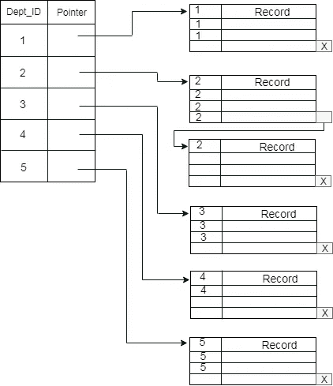
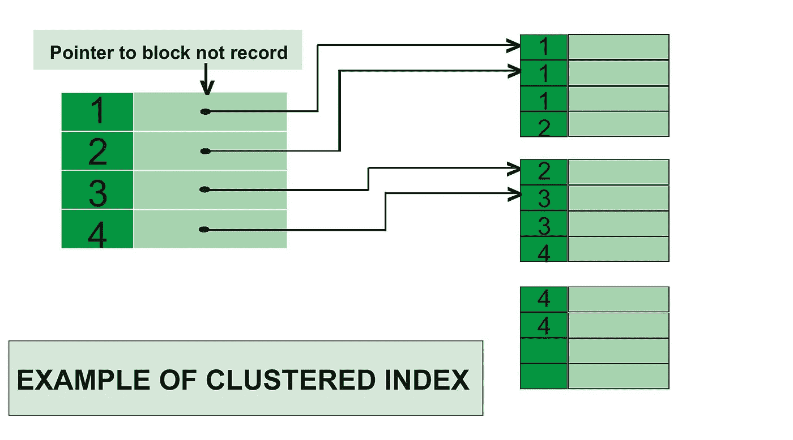
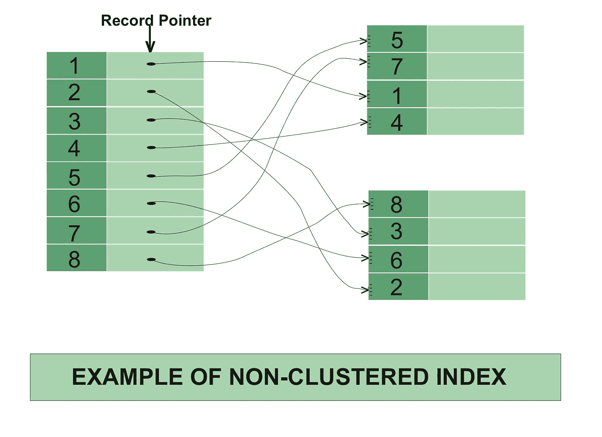
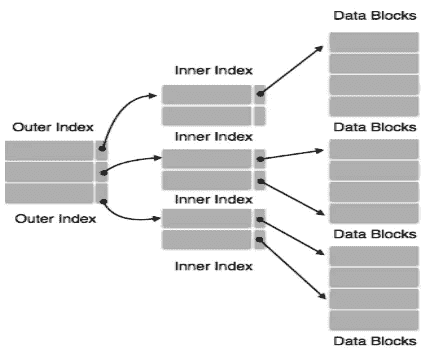
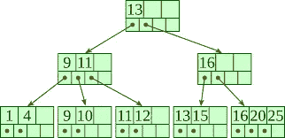
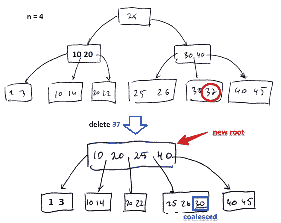

# 如何有效地使用索引

> 原文：<https://medium.com/nerd-for-tech/how-to-use-indexing-effectively-c69d97f0f983?source=collection_archive---------3----------------------->

# 什么是索引？

索引是一种优化数据库性能的方法，它可以最大限度地减少处理查询时所需的磁盘访问次数和步骤。它是一种数据结构技术，用于快速定位和访问数据库中的数据。

# 索引方法

## **聚集索引**

当两个以上的记录存储在同一个文件(页面)中时，这种类型的存储称为簇索引。通过使用聚簇索引，我们可以减少查找成本，因为与同一事物相关的多个记录存储在一个地方，它还可以频繁地连接两个以上的表(记录),并减少 io 成本。

## **非聚集或辅助索引**

非聚集索引只是告诉我们数据在哪里，也就是说，它给我们一个指向数据实际存储位置的虚拟指针或引用的列表。数据不是按照索引的顺序物理存储的。相反，数据存在于叶节点中。实际的数据是没有组织的，但是我们有一个数据点实际位置的有序引用。我们只能在非聚集索引中进行密集排序，因为稀疏排序是不可能的，因为数据在物理上没有相应地进行组织。
与聚集索引相比，它需要更多的时间，因为通过进一步跟踪指针来提取数据需要做一些额外的工作。对于聚集索引，数据直接出现在索引前面。

## **多级分度**

随着数据库规模的增长，我们将需要划分索引并使用不同的方法。由于索引存储在主内存中，单级索引可能会变得太大，无法通过多次磁盘访问来存储。多级索引将主块分成各种较小的块，以便将其存储在单个块中。外部块被分成内部块，内部块又指向数据块。这可以很容易地以较少的开销存储在主存储器中。

# 索引是如何工作的？

实际上，数据库表不会在每次查询条件改变时都自动重新排序以优化查询性能:这是不现实的。实际上，索引会导致数据库创建一个数据结构。数据结构类型很可能是一个 [B 树](https://www.cs.cornell.edu/courses/cs3110/2012sp/recitations/rec25-B-trees/rec25.html)。虽然 B 树的优点很多，但对于我们的目的来说，它的主要优点是可排序。当数据结构按顺序排序时，我们的搜索会更有效，原因显而易见，如上所述。

当索引在特定列上创建数据结构时，需要注意的是，数据结构中没有存储其他列。我们上表的数据结构将只包含 id。

一般采用 B+树。然而，用于索引的 B 树的缺点是，它将对应于特定键值的数据指针与该键值一起存储在 B 树的节点中。这种技术极大地减少了可以打包到 B 树的一个节点中的条目数量，从而增加了 B 树中的级别数量，因此增加了记录的搜索时间。

# 用 Write 语句索引？

表上的索引数量是影响`insert`性能的最主要因素。一个表的索引越多，执行速度就越慢。因为没有`where`子句，所以`write`语句是唯一不能直接从索引中受益的操作。

## 向表中添加新行包括几个步骤。

首先，数据库必须找到存储行的位置。对于没有特定行顺序的常规堆表，数据库可以使用任何具有足够空闲空间的表块。这是一个非常简单快速的过程，大部分在主存中执行。数据库随后要做的就是将新条目添加到相应的数据块中。

其次，如果表上有索引，数据库必须确保新条目也是通过这些索引找到的。因此，它必须将新条目添加到该表上的每个索引中。因此，索引的数量是一个`write`语句成本的乘数。

此外，向索引中添加一个条目比向堆结构中插入一个条目要昂贵得多，因为数据库必须保持索引顺序和树平衡。这意味着新条目不能被写入它属于特定[1](https://use-the-index-luke.com/sql/anatomy/the-leaf-nodes)EAF 节点的任何块。尽管数据库使用了[I](https://use-the-index-luke.com/sql/anatomy/the-tree)index 树本身来查找正确的叶节点，但它仍然需要读取一些索引块来遍历树。

一旦识别出正确的叶节点，数据库就确认该节点中有足够的空闲空间。如果没有，数据库将拆分叶节点，并在新旧节点之间分配条目。这个过程还会影响相应分支节点中的引用，因为它也必须被复制。不用说，分支节点也可能耗尽空间，因此它可能也必须被拆分。在最坏的情况下，数据库必须将所有节点拆分到根节点。这是树获得额外的层并且深度增长的唯一情况。

# 使用索引的最佳实践

## 避免使用过多的索引

如果你在(A，B，C，D，E)上有一个索引，并且你用 B 和 D 的值来限制你的查询，那么这个索引是完全无用的。只有当你频繁地通过**所有的**五列或者像(A，B)，(A，B，C)，(A，B，C，D)这样的组合来查询时才有用，否则就是浪费。

## 避免使用少量索引

如果没有正确创建索引，SQL Server 就必须遍历更多的记录来检索查询所请求的数据。因此，它使用更多的硬件资源(处理器、内存、磁盘和网络)，并且获取数据的时间更长。

## 避免使用带有`%`语句的索引

当您使用 where `% '时，它会强制数据库对所有记录进行顺序搜索以获得匹配的记录，因此在这种情况下不会使用索引

## 避免排序的索引(分组依据、排序依据)

除了构建索引来优化数据访问之外，索引还可以用来避免排序。GROUP BY 和 ORDER BY 子句倾向于调用排序，这会导致性能下降。通过对这些子句中指定的列进行索引，关系优化器可以使用索引来避免排序，从而有可能提高性能。

## 为外键创建索引

为每个外键创建索引可以优化访问和实施引用约束时的性能，大多数数据库系统不需要这样的索引，但它们可以提高性能。

# 结论

在这篇文章的最后，是一些阅读和获取更多知识的资源

[**数据库中的索引**](https://www.geeksforgeeks.org/indexing-in-databases-set-1/)**(**[**GeeksforGeeks**](https://www.geeksforgeeks.org/indexing-in-databases-set-1/)**)**

[**聚集索引与非聚集索引**](https://www.c-sharpcorner.com/blogs/differences-between-clustered-index-and-nonclustered-index1)

[**B 树**](https://en.wikipedia.org/wiki/B-tree)

[**什么是指数**](https://www.tutorialspoint.com/postgresql/postgresql_indexes.htm)

[**索引扫描对比位图扫描对比顺序扫描**](https://www.cybertec-postgresql.com/en/postgresql-indexing-index-scan-vs-bitmap-scan-vs-sequential-scan-basics/#builds)