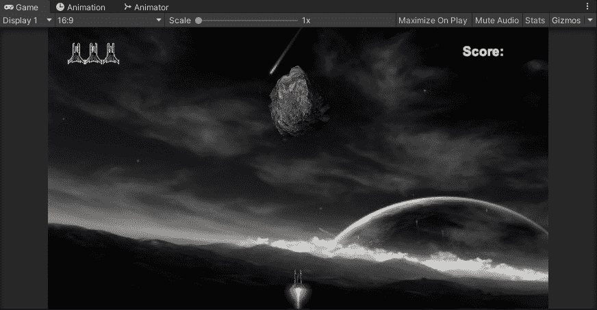
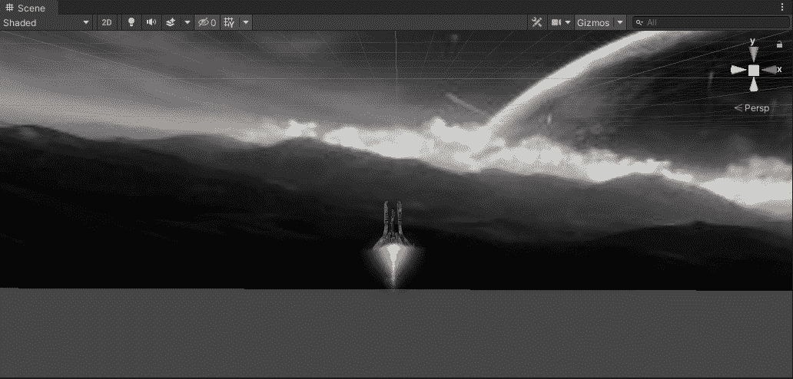
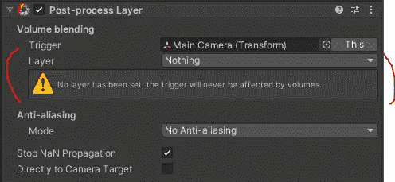
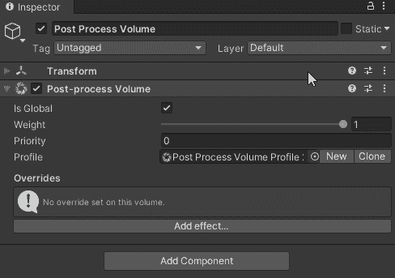
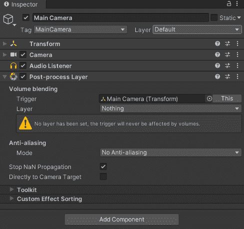
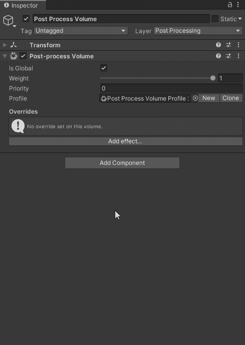

# 如何在 Unity 中使用后期处理

> 原文：<https://medium.com/nerd-for-tech/how-to-use-post-processing-in-unity-7b8c41fddff9?source=collection_archive---------10----------------------->

**目标**:在我们 **2D 银河** **射手**游戏 **Unity 中开始使用**后期处理**！**

首先，我们需要确保我们已经将包下载到我们的项目中。要找到这个，我们需要进入 **Unity** 的顶部标签，点击**窗口→软件包管理器→后处理→安装。**

编译需要一些时间，完成后，在您的**项目窗口→包**中，您现在就有了这个包。

要开始使用**后处理**，我们需要设置一个配置文件。让我们创建一个新的游戏对象，名为“**后期处理卷**”。这将控制我们视频游戏的所有效果。在这个游戏物体上添加组件→ **后期处理量**。

从这里要做两件事，首先让我们勾选“**是全局的**”按钮，这样效果就在整个场景上了，其次，点击“**新建**”按钮，这样会自动为我们创建一个轮廓。

**注意:**你可以有多个影响不同场景的体积。 ***例如*** *如果你有一个黑暗的洞穴，与你在外面的森林中相比，你可以在这个区域中使用特定的后处理量。*

现在，我们需要告诉我们的**主摄像机**给**渲染**体积效果。为此，在**层级→添加组件→后处理层中选择您的**主摄像机**。**

我们现在遇到了一个警告，告诉我们需要添加一个**层**。只需转到**检查器**的右上方，同时在**后处理体积**游戏对象上，创建**层**并将其分配给该游戏对象:

回到**主摄像机**现在，我们可以将它向我们请求的图层更改为“**后期处理**”:

现在你可以简单地在**后期处理卷**中添加你的效果，你就可以开始创造一些魔法了:

