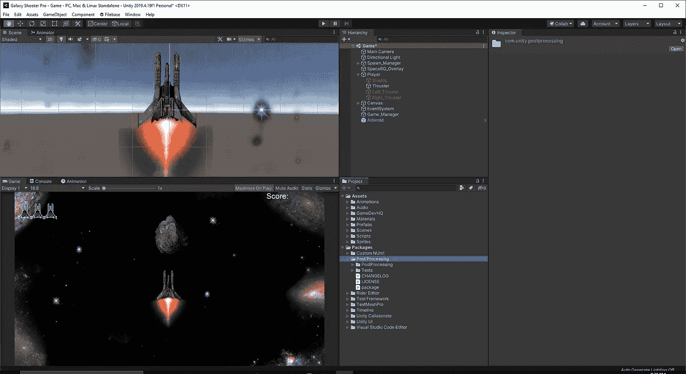
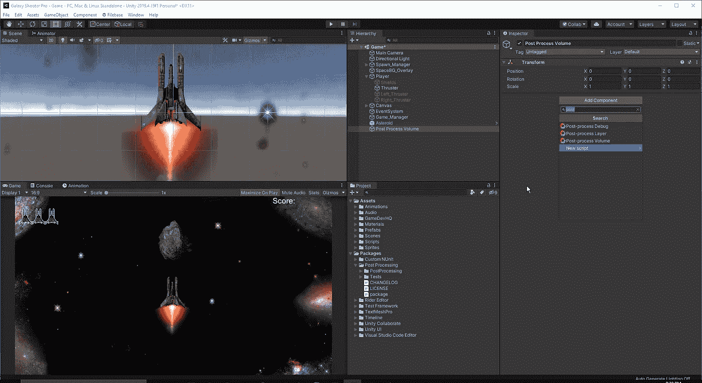
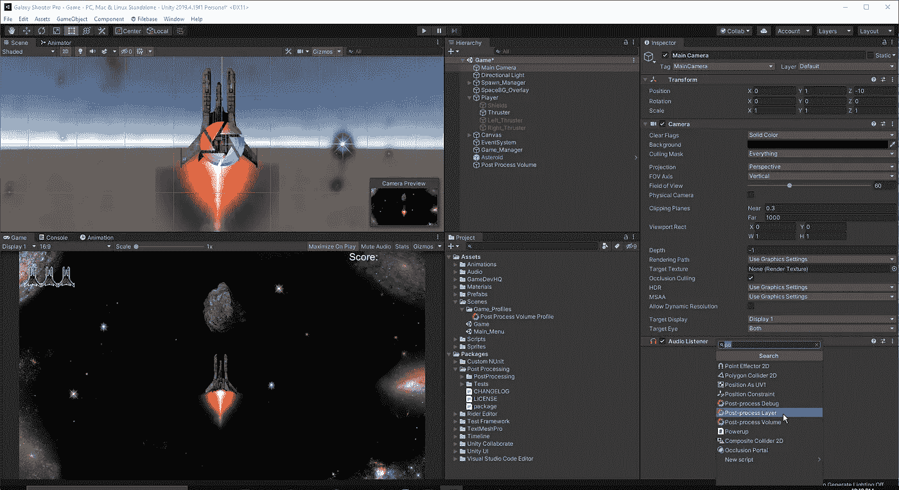
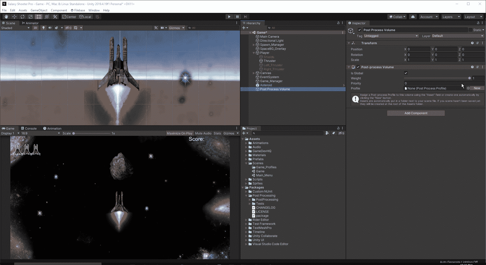
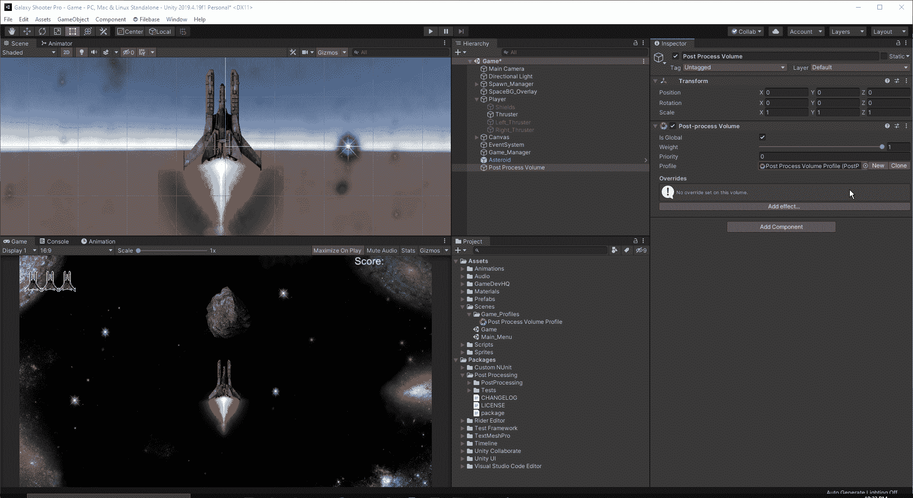
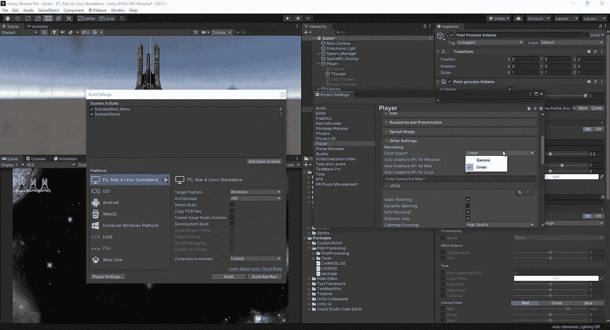
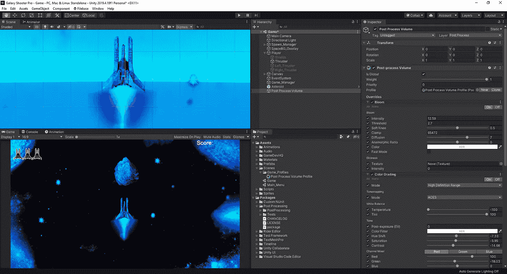
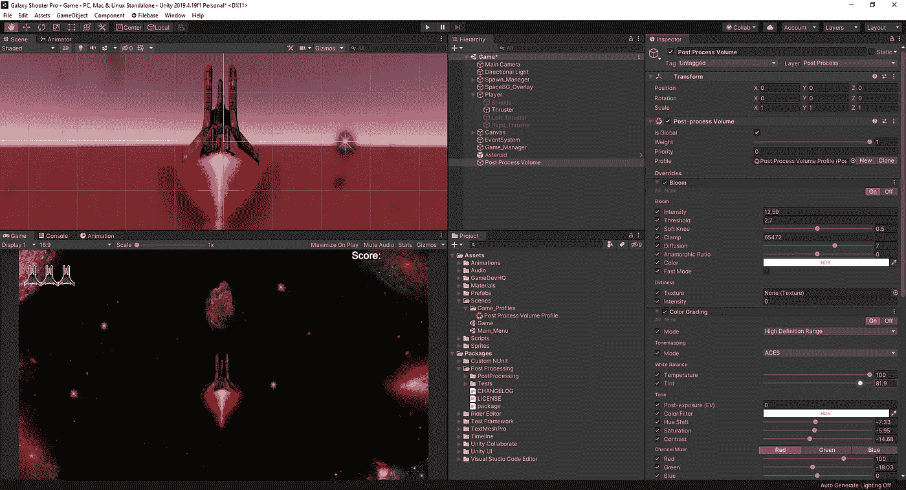
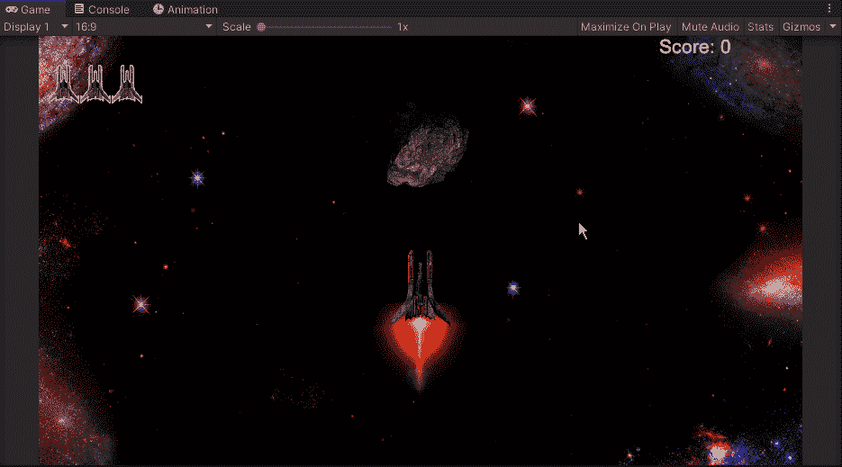

# 如何在 Unity 中使用后期处理

> 原文：<https://medium.com/nerd-for-tech/how-to-use-post-processing-in-unity-df3f946ee754?source=collection_archive---------18----------------------->

后期处理允许我们在游戏中应用图像效果和滤镜。这就像是我们游戏的 photoshop。要开始使用它，我们必须通过 Unity 软件包管理器安装它:

一旦我们点击 install，我们可以关闭窗口，等待 Unity 安装并重新编译项目。一旦关闭，在我们的“项目”选项卡中将会有一个后处理文件夹:

接下来，我们将创建一个空对象，并将其命名为后处理卷，在检查器中，我们将把后处理卷组件添加到我们的对象中:

这使我们能够创建一个配置文件并添加图像效果。我们需要单击“是全局”框。这会影响到我们周围的一切，摄像机也会受到影响。如果这是一个包含多个环境的游戏，我们可以同时拥有全局和局部的后期处理量。从这里，我们将想要创建一个新的文件，为了让我们看到我们所做的更改，我们将想要通过层将其链接到我们的主相机。首先，我们将想去我们的主要相机和应用后处理层组件:

现在，我们可以去我们的后处理卷，并为它创建一个新的层:

最后，我们可以看看一些可以使用的效果选项:

当我们打开颜色分级选项时，我们注意到一个警告。这个警告让我们知道，当游戏色彩空间被设置为 gamma 时，HDR 分级看起来不正确。要改变这一点，我们只需进入构建设置、播放器设置，并在播放器中找到颜色间距:

现在我们已经正确地设置好了，我们可以研究一些设置，直到我们喜欢它的外观。假设我们想改变温度，温度越低，感觉就越“冷”:

升得越高，感觉就越“温暖”:

至于我们将如何设置我们的游戏，我将使用一个轻微的红色色调，同时使用 ACES 色调映射模式。至于 ACES，它是学院颜色编码系统，是在电影或电视制作的整个生命周期中管理颜色的行业标准。

现在我们已经设置了后期处理，我们可以看看如何在游戏中加入音乐和音效。