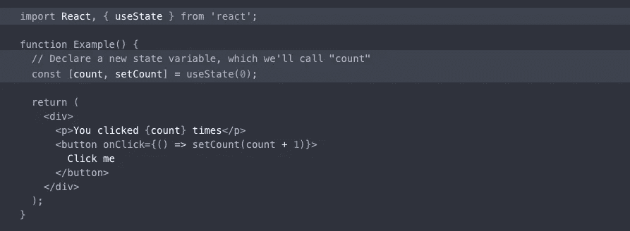

# 如何在没有类的情况下使用 React 中的状态:状态挂钩

> 原文：<https://medium.com/nerd-for-tech/how-to-use-state-in-react-without-classes-the-state-hook-73882d0dc188?source=collection_archive---------11----------------------->

## 无类组件(又名函数组件)和状态:语法和示例快速概述

州钩例子来自:https://reactjs.org/docs/hooks-overview.html

## 什么是钩子？

在 2019 年 2 月发布的 React 16.8 之前，如果你想在 React 组件中使用**状态**，你必须将现有代码从函数组件重构为类组件。然而，在这次 React 更新中，您可以选择使用**挂钩** *、*或“f [功能，让您“挂钩”React 状态](https://reactjs.org/docs/hooks-overview.html#but-what-is-a-hook)和功能组件的生命周期特性本文主要关注挂钩到状态，但是也有其他可用的挂钩，例如，如果您想访问函数组件中的生命周期方法，您可以选择[效果挂钩](https://reactjs.org/docs/hooks-overview.html#effect-hook)。您可能习惯于在您的类组件中使用生命周期方法，如`componentDidMount`和`componentDidUpdate`。状态挂钩允许您在不使用类组件的情况下挂钩到状态功能，而效果挂钩允许您以同样的方式挂钩到生命周期功能。

## 为什么要改变？

[根据 React 团队的说法](https://reactjs.org/docs/hooks-intro.html#motivation)将钩子引入框架有很多原因。这超出了本文的范围，我鼓励您阅读 React 文档，以便更好地理解钩子可以提供什么。要注意的最重要的一点是，使用钩子是完全向后兼容的，这意味着如果您选择在代码中添加或更改一个或几个组件来使用和测试它们，它不会破坏您现有的代码。此外，在撰写本文时，React 团队还没有从 React 中移除类的计划。钩子不一定要取代类组件，但是它们的目的是解决程序员在设计具有大量组件和复杂组件层次结构的项目时遇到的一些问题。

## 代码示例:旧方法和新方法

让我们回忆一下，在 React 中，我们的组件是受控制的，这意味着它们从不直接从 DOM 读取，而是使用 state 来管理用户一个字符一个字符地输入到表单中的内容。在下面的例子中，我为一个简单的联系人表单使用了一个带有 state 的类组件，用户在这个表单中输入他们的姓名、电子邮件以及他们想发送给网站管理员的消息:

在本例中，这段代码不会通过电子邮件或任何其他动作提交表单，而是只提醒用户他们输入的信息已经提交。同样，我们使用一个受控制的组件，其中表单的内容随着用户使用 state 和`changeHandler`函数输入而更新，并使用`submitHandler` 函数提交，该函数防止表单发出新的网络请求和重新呈现整个页面的默认行为，提醒用户表单已经提交，并将表单字段重置为空字符串。让我们看一下被重构为使用带有状态挂钩的函数组件的完全相同的组件:

让我们回顾一下这两个组件之间的一些基本区别:

1.  看看我们的 import 语句，除了`React`(第 1 行)之外，我们还导入了`useState`。
2.  使用 JavaScript 的**数组析构**，我们用`useState`创建一个新的状态变量，例如`name`，其中第一项是当前值，第二项是一个让我们更新该状态变量的函数。我们对`email`和`message`状态变量做了同样的处理(第 5–7 行)。
3.  注意表单输入元素中的**值**属性不再引用`{this.state.name}`、`{this.state.email}`和`{this.state.message}`，而是直接引用带有`{name}`、`{email}`和`{message}`的状态变量(第 24、26、28 行)。
4.  最后，虽然我们仍然使用一个`submitHandler`，但是我们的代码中不再有`changeHandler`，我们可以在表单输入元素的`onChange`属性中直接调用状态变量的更新函数作为回调函数(第 24、26、28 行)。

## 进一步的考虑

一段时间以来，React 没有提供一种方法来有效地在组件之间共享状态，而不需要通过每个单独的子组件手动传递属性，并且将这些属性传递给不直接相关的组件既麻烦又难以跟踪。你可能熟悉试图解决这个问题的状态管理库，比如 [Redux](https://redux.js.org/) 。使用 React 钩子和使用本地 [React 上下文 API](https://reactjs.org/docs/context.html) ，外部库不是必需的，我将在下一篇文章中介绍上下文，敬请关注！

## **参考资料和附加资源**

*   [挂钩概述](https://reactjs.org/docs/hooks-overview.html)
*   [使用状态挂钩](https://reactjs.org/docs/hooks-state.html)
*   [效果挂钩](https://reactjs.org/docs/hooks-overview.html#effect-hook)
*   [为什么要挂钩？](https://reactjs.org/docs/hooks-intro.html#motivation)
*   [Redux](https://redux.js.org/)
*   [上下文 API](https://reactjs.org/docs/context.html)