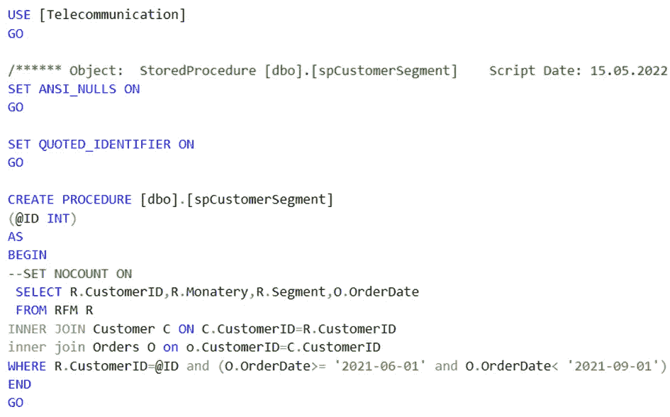
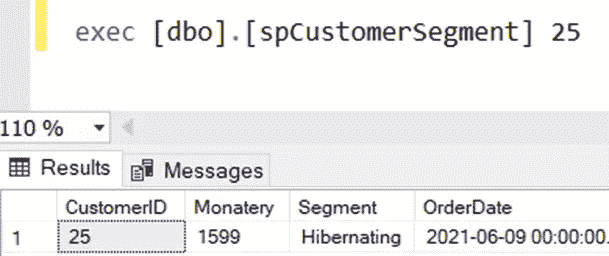
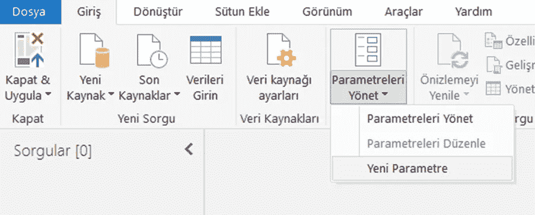
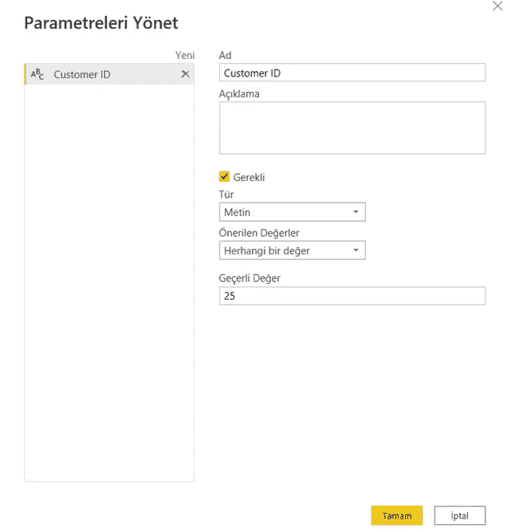
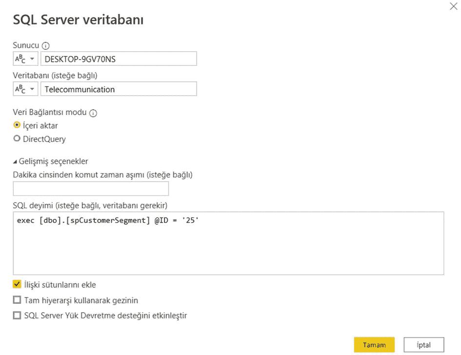
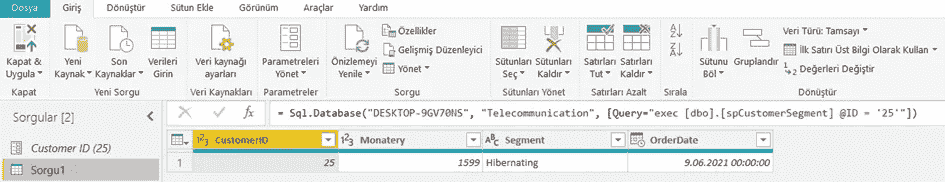
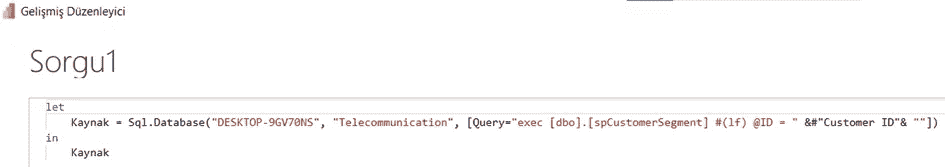
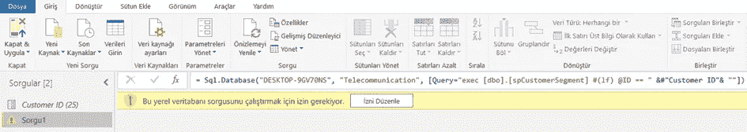
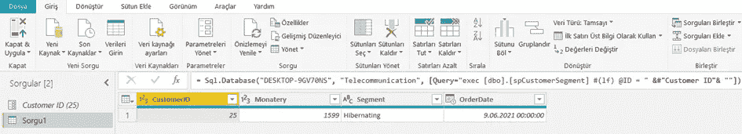
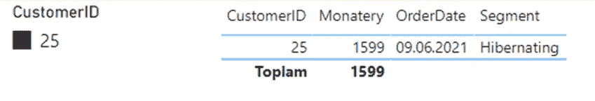

# 如何在 Power BI 中使用存储过程

> 原文：<https://medium.com/nerd-for-tech/how-to-use-stored-procedure-in-power-bi-c3ecfe5e5429?source=collection_archive---------0----------------------->

大家好，我们将讨论如何根据我们在 SQL Server 中创建的“存储过程”调用带有参数的数据来查询 PBI。

首先，我们需要在 SQL Server 中创建基本的存储过程:

存储过程根据输入的客户 ID 获取基于订单日期的客户数据

使用存储过程查询

**创建参数**

我们需要定义创建的参数来在 PBI 运行存储过程。

在这个过程中，我们的第一步将切换到 Power Query Editor 选项卡。

管理参数

在这个阶段，我们将定义在存储过程中创建的“ID”参数。

> 我们需要确定 3 个领域:
> 
> 1)参数类型
> 2)建议值
> 3)当前值

**存储过程**

现在，通过查询存储过程从 SQL Server 导入数据:

Power Query 将加载一个包含存储过程的 M 语言预览。

m 语言

**高级编辑**

我们将在高级编辑器上查看查询，并根据创建的参数编辑查询。(客户 ID)

单击“编辑权限”以允许超级查询执行存储过程。

电源查询中加载的数据

**报告输出**

我们用这个过程定义的客户 ID 为 25 的报告的输出如下表所示。

