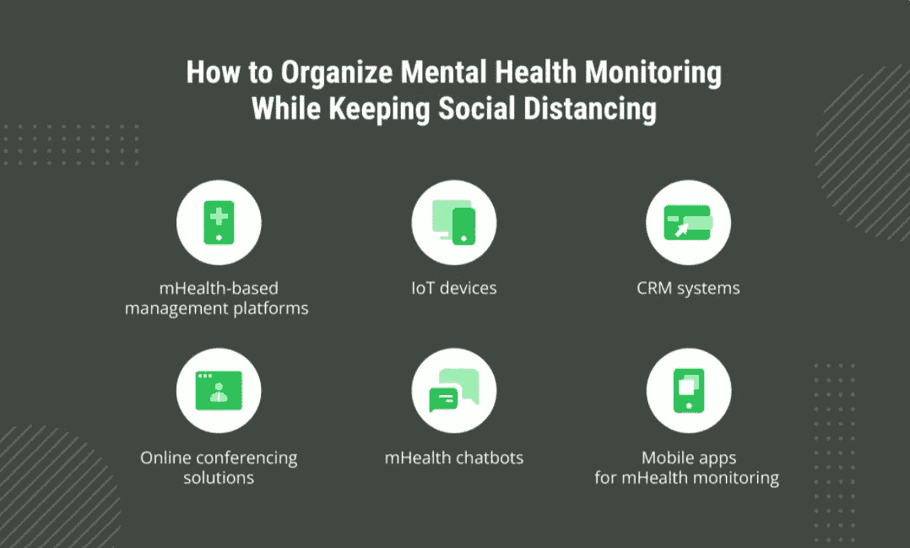
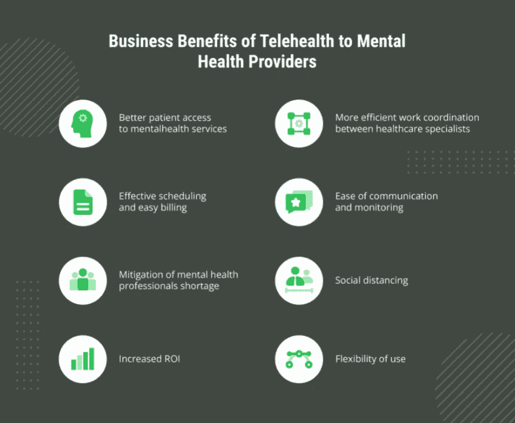

# 如何使用远程医疗进行精神健康监测

> 原文：<https://medium.com/nerd-for-tech/how-to-use-telehealth-for-mental-health-monitoring-e730f24bcf19?source=collection_archive---------4----------------------->

远程心理健康，也可以被称为远程行为健康，远程精神病学或远程心理学，在新冠肺炎疫情期间越来越受欢迎，这是有充分理由的。它不仅使病人受益，他们现在可以在自己家里隐私和安全地获得护理，而且也为精神卫生提供者释放了巨大的潜力。

因此，让我们深入到远程心理健康的现象中，了解它为什么重要，它如何在今天的环境中使用，以及为什么这种心理护理提供模式将很快成为一种新常态。

# 为什么精神远程健康很重要？

正如世界卫生组织在他们关于精神疾病的报告中指出的那样，世界上每 4 个人中就有 1 个人会在一生中的某个时候面临精神或神经疾病。美国心理健康协会提供的更有意义的数据显示，在疫情开始前， [19.86%的成年人经历过心理疾病](https://www.mhanational.org/issues/state-mental-health-america)，相当于近 5000 万美国人。冠状病毒爆发后，情况更加恶化。

事情是这样的，我们，人类，本质上是群居动物。因此，新冠肺炎疫情爆发后，世界范围内采取的隔离措施对我们的心理健康产生了负面影响。虽然人们对隔离措施的反应确实因人而异，但有一些反应对我们许多人来说是典型的。其中包括:

*   由于社会交往减少，孤独感增加；
*   不规律的作息时间导致的动机降低；
*   食欲的变化；
*   注意力不集中；
*   睡眠受损；
*   悲伤、不确定、恐惧、焦虑、愤怒、沮丧、易怒、麻木等情绪增加；
*   酒精、尼古丁和毒品消费的增长。

虽然这种反应对于这种异常情况来说是正常的，但是由于隔离和隔离措施，以前使用的监测有精神健康问题的患者的方法需要剧烈的改变。出于这个原因，技术市场对心理健康服务的需求增加了。

采用精神远程保健解决方案的另一个很好的理由是，在农村地区，获得精神保健并不容易，远程保健成为一个完美的解决方案，可以为每个人提供护理。

# 如何在社交疏远的同时组织心理健康监测？

如你所见，新冠肺炎疫情带来的关键挑战之一与出于健康安全原因实施的社交距离措施有关。虽然心理治疗意味着与患者的直接接触，使医疗服务提供者能够有效地监测行为、情绪和其他对精神状态至关重要的因素的变化，但远程心理健康解决方案应该提供与传统护理方法相同的监测机会。而且有很好的替代方案。

## 基于移动健康的管理平台

移动健康管理平台可以通过实现早期干预和治疗，以可扩展和经济高效的方式帮助解决精神疾病。这种解决方案具有友好的日程安排工具、客户端门户、进度记录、定制治疗计划、在线聊天和视频会议、定制问卷、账单和发票选项，以及移动健康系统提供的其他好东西。当用于精神卫生保健时，这种解决方案有助于减少失约，这对专家的工作和患者的进展都有积极的影响。

## 物联网设备

[物联网设备通常是可穿戴设备](https://emerline.com/solutions/iot)，如手表、衣服、腰带和身体贴片，包含测量身体活动和心率变异性的传感器。来自可穿戴设备的传感器数据可以与其他数据源相结合，用于对各种精神疾病的情绪反应、情绪状态和压力进行分类。例如，[物联网设备用于双相情感障碍识别](https://www.mdpi.com/1660-4601/18/3/1327/pdf):活动模式允许区分双相情感障碍和其他诊断，心率变异性允许预测情绪状态。

## CRM 系统

[用于心理健康从业者的 CRM 系统](https://emerline.com/solutions/crm)旨在改善整个治疗过程的管理，减少管理工作，并提供高安全标准。此外，这种系统允许合并不同部门的工作，这样有助于提高实践的效率和效力。

## 在线会议解决方案

近年来，视频会议工具已经成为医疗保健行业的新常态，心理健康服务提供商也不例外。使用高质量技术的在线咨询使提供者有可能接触到无法访问他们办公室的患者，处理有效的沟通，监测患者情绪和行为的变化。换句话说，正是视频会议工具使得从个人访问诊所转变为精神健康服务提供的在线模式成为可能。

## 移动健康聊天机器人

数字精神卫生保健行业最近开始将人工智能纳入现有平台，并创建各种人工智能指导的产品。人工智能在精神医疗保健中最受欢迎的一些用例包括用于通信的聊天机器人、虚拟现实、症状和生物标记监控以及内容个性化。通过人工智能聊天机器人，也称为对话代理或关系代理，用户可以与智能技术进行对话，以获得所需的支持、指导、预诊断等。这种解决方案对于提供 24/7 支持以及在工作超负荷的情况下变得非常有用，因此患者可以从聊天机器人那里了解一些信息，而不是联系专业人员。

## 用于移动健康监控的移动应用

当然，最受欢迎、最方便、需求最大的精神健康管理技术解决方案之一就是手机应用。这类应用程序整合了认知行为治疗(CBT)和接受承诺治疗(ACT)等成熟技术，可以解决从抑郁症到饮食障碍恢复、焦虑、PTSD、强迫症等各种问题。

其中还有症状追踪器，其工作原理与 Emerline 开发的偏头痛预防应用程序相同。它们允许患者监控自己的情绪波动，更好地了解对他们的心理健康有影响的因素，允许做出预测，并提供有用的建议。

# 远程行为健康、远程精神病学和远程心理学对精神健康组织的益处

虽然远程医疗解决方案给患者带来的好处已被广泛讨论和知晓，但心理健康服务提供者也可以通过将技术运用到他们的组织中来获得显著的优势。<

**患者更好地获得心理健康服务**

远程医疗服务意味着患者和医疗服务提供者不必在同一地点。因此，如果患者无法自行运输，住得离办公室太远，或者面临其他问题，无法去看心理健康专家，这些虚拟会议可以产生巨大的影响。对于提供者来说，从可视会议中获得的主要好处之一是减少了患者的失约。

**医疗专家之间更高效的工作协调**

随着远程医疗用于心理健康护理，专业人员之间的协调变得比以往任何时候都容易。访问包含有关患者治疗计划、进展和历史的重要信息的数据库，可以使诊断更加准确，治疗计划更加有效。

**有效的调度和简单的计费**

现代远程保健系统旨在提供与提供精神卫生保健相关的所有问题的无缝集成，无论是预约安排、医疗账单支付、处方等。一体化远程医疗体验提供了一切。

**便于沟通和监控**

远程医疗模式中的沟通和监控是通过使用技术来实现的，这使得精神卫生专业人员更容易、更方便地与他们的患者进行实时沟通、监控和随访。

心理健康专家可以为他们的病人提供各种重要的资料，包括预约提醒、应对技巧、心理健康资源等。此外，远程医疗还允许通过远程患者传感器和远程医疗应用程序进行症状监控。虚拟景观使跟踪患者和提供治疗变得更加容易。

**缓解精神卫生专业人员短缺**

不幸的是，数百万需要心理治疗的人缺乏心理健康专家。远程医疗是一个很好的选择，可以最大限度地缩小这种差距，因为它只需要稳定的互联网连接和一台笔记本电脑、电脑、平板电脑或带摄像头的智能手机。远程保健的简单性使得精神卫生专业人员可以在任何地点接触他们的病人。远程保健使精神卫生专业人员能够在无法获得他们的护理和资源的地区提供服务。

**投资回报率提高**

对于提供商来说，集成这种有利可图的技术会带来可观的投资回报。与急诊科一起使用，远程精神病学可以提供与门诊精神卫生服务更有效的连接。这有助于缩短急诊室和其他部门之间的转诊循环。

在初级保健和专科护理诊所，远程精神病学可以为医疗团体节省大量成本，同时改善患者的健康状况。[远程精神治疗也可以降低教养机构和疗养院的成本](https://www.researchgate.net/publication/259394225_Telepsychiatry_in_Correctional_Facilities_Using_Technology_to_Improve_Access_and_Decrease_Costs_of_Mental_Health_Care_in_Underserved_Populations)，包括交通、劳动力和一般护理因素。

**使用的灵活性**

远程心理健康自然具有更大的灵活性，可以应用于几乎所有的医疗部门。这将有助于为急诊室带来更高质量的护理，因为那里通常没有人员或设备来评估或治疗那些有精神健康问题的人。在疗养院，精神远程保健可以作为一种手段提供持续的精神护理和评估。

# 底线

与危机前相比，疫情采用远程保健的速度非常快。精神健康远程保健不仅为维持精神和行为健康服务提供了一个很好的途径，而且还在疫情期间大大扩展了这些服务。

因此，如果有一个合适的时间来实施精神健康的远程医疗服务，那就是现在。

如果您想为心理健康创建远程健康解决方案，或者在实施新的远程健康平台方面需要任何帮助，请随时[联系](https://emerline.com/contact-us)我们的医疗保健软件开发专家。

最初发表于 https://emerline.com 的[。](https://emerline.com/)