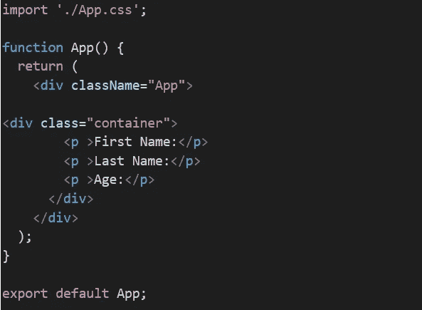
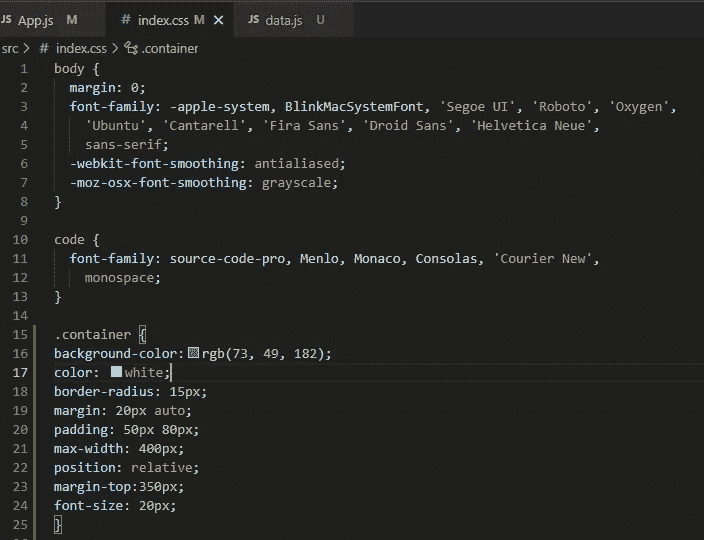
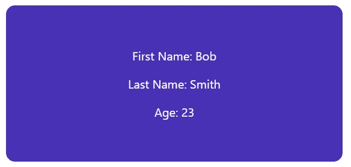
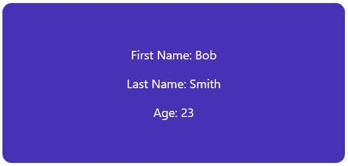
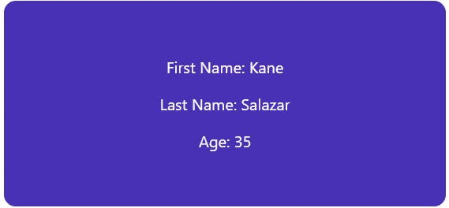
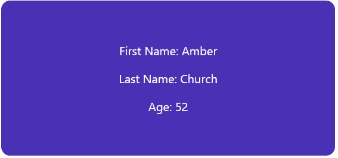

# 如何使用 useState()和 useEffect()钩子动态呈现组件？

> 原文：<https://medium.com/nerd-for-tech/how-to-use-usestate-and-useeffect-hooks-to-dynamically-render-components-ab7259d199b7?source=collection_archive---------1----------------------->

最近，我编写了一个单页面 React 应用程序，在该应用程序中，我必须在某些预定义的时间间隔内动态呈现一个组件。该组件需要每隔 N 秒出现在屏幕上，从硬编码的对象数组或 JSON 服务器/后端获取数据或内容。


[斯坦 B](https://unsplash.com/@stanislas1?utm_source=medium&utm_medium=referral) 在 [Unsplash](https://unsplash.com?utm_source=medium&utm_medium=referral) 上的照片

为了实现这个功能，我使用了 **useState()** 和 **useEffect()** React 钩子。我将演示我们如何使用这些基本的 React 挂钩来动态呈现数组或组件的内容。

如果您熟悉 React Hooks basic，请随意跳过第 3 页和第 4 页，直接进入代码实现。否则，下面将介绍一个起始代码和几个缩写步骤。

首先，让我们写一些起始代码，创建一个简单的单组件 React 应用程序，定义 CSS/HTML，然后解决问题。

1.  **做好准备！**

要创建一个 react 应用程序，我们需要运行`npx create-react-app your-app-name — use-npm`，然后通过执行`npm start`命令打开一个浏览器窗口。当你在那里时，去掉文件 *App.js* 中一些不必要的默认代码，只显示一个空白的白色页面。不要修改 *index.css* 和 *index.js* 文件中的任何内容。

然后，让我们在 App()组件中定义并呈现一个 *div* 容器/元素，并假设我们需要显示以下对象的属性:*名、*姓、*年龄*。下面是 App()组件的起始代码。



为了呈现该容器，我们需要在 *index.js* 文件中添加一些 CSS 样式。保留该文件中的默认代码，只添加下面的 CSS 来设置容器的样式:

```
.container {
background-color:rgb(73, 49, 182);
color: white;
border-radius: 15px;
margin: 20px auto;
padding: 50px 80px;
max-width: 400px;
position: relative;
margin-top:350px;
font-size: 20px;
}
```

这里有一个起始代码/样式在 *index.js* 文件中，用于样式化/定义容器。这应该显示一个彩色容器，其中有三行文本。



**2。创建 data.js 文件以获取数据。**

因为我们要从一个对象中获取数据，并将这些数据输入到我们的容器中，所以我们需要创建这个对象。为了简单起见，我们将在该应用程序的 *data.js* 文件中硬编码该对象。以下是 *data.js* 文件的代码:

```
const data = {
users: [
{
nameFirst: 'Bob',
nameLast: 'Smith',
age: "23"
},
{
nameFirst: 'Kane',
nameLast: 'Salazar',
age: "35"
},
{
nameFirst: 'Amber',
nameLast: 'Church',
age: "52"
}]}
export default data;
```

**3。准备启动—启动代码已完成！**

好了，我们快到了！现在让我们将`import data from ‘./data’;`和`import { useEffect, useState } from ‘react’;`导入到 App()组件中，因为我们将使用它们来解决问题。然后使用*析构赋值语法*访问原始对象中的 *users* 值，并用一些初始数据填充容器。因为我们可以访问对象的原始数组，所以我们现在可以在索引 0 处显示对象的每个属性，然后使用点符号来定义名字*，姓氏*和年龄*。这里有一个代码:*

```
*import './App.css';
import data from './data';
import { useEffect, useState } from 'react';function App() {const { users } = data;
let index = 0;const [user, serUser] = useState(users[index]);return (
<div className="App">
<div class="container">
<p >First Name: {user.nameFirst}</p>
<p >Last Name: {user.nameLast}</p>
<p >Age: {user.age}</p>
</div>
</div>
);
}*
```

*屏幕上会显示什么:*

**

***4。解决问题！***

*现在，让我们来解决问题吧！我想从对象的原始数组中接收数据，并每 2 秒钟在我的容器中显示该数据，然后需要用数组中的下一个对象替换当前对象，以此类推，直到数组结束。一旦到达数组的末尾，我想重新设置这个循环，并重新开始。*

*不要觉得无聊，下面是这个问题的最终代码:*

```
*import './App.css';
import data from './data';
import { useEffect, useState } from 'react';function App() {const { users } = data;let index = 0;
const [user, setUser] = useState(users[index]);useEffect(() => {
const timer = setInterval(() => {
setUser(updateUser);
}, 2000);return () => {
clearInterval(timer);
};}, []);function updateUser() {
index = index + 1;
if (index > users.length - 1) {
index = 0;
}return users[index];
}return (
<div className="App">
<div class="container">
<p >First Name: {user.nameFirst}</p>
<p >Last Name: {user.nameLast}</p>
<p >Age: {user.age}</p>
</div>
</div>
);
}export default App;*
```

*根据经验， **useEffect()** 紧接在 **useState()** 之后执行，因此一旦 **useState()** 呈现了原始数组的第一个对象，就会调用 **useEffect()** 并依次调用`setInterval function`。官方 [**MDN Web 文档** :](https://developer.mozilla.org/en-US/docs/Web/API/WindowOrWorkerGlobalScope/setInterval) 中定义的`setInterval function`*

> *重复调用函数或执行代码段，每次调用之间有固定的时间延迟。它返回一个唯一标识间隔的间隔 ID，所以您可以稍后通过调用 [clearInterval()](https://developer.mozilla.org/en-US/docs/Web/API/WindowOrWorkerGlobalScope/clearInterval) 来删除它*

*在我的例子中，`setInterval method`将时间间隔定义为 2 秒/2000 或每 2 秒改变一个*用户状态*变量/或*设置用户*状态。为了改变 *setUser* 变量的状态，我写了一个名为 *function updateUser()* 的帮助函数。该函数获取当前索引(0 作为第一个索引，因为数组是从零开始的)并在每次调用该函数时增加 1，直到数组结束。*如果使用语句*来重置这个循环，一旦索引大于数组的长度，索引被重置为 0，循环重新开始。*

**clearInterval(timer)* 功能用于停止之前设置和启动的时间间隔，我发现，如果我使用该功能，周期会运行得更好，整体同步也会更好，而不是不使用它。*

*这个容器的内容每 2 秒更新一次，直到你定义了一个逻辑来停止它。*

******

*好吧！这就是我如何解决这个问题的，但是如果你知道更好的方法，请随意评论并分享你的想法。您可能想知道这个逻辑的实际实现是什么？我想到的第一件事是，任何测验类型的应用程序，你需要在有限的时间内显示内容，然后切换屏幕等。*

***如果你觉得这些信息有用，请随时关注我。希望你喜欢这个简短的实践练习，保持坚强，敬请期待！***