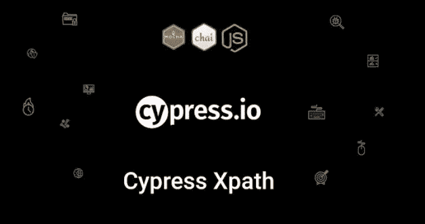
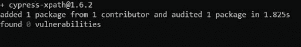
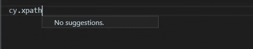
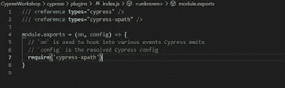
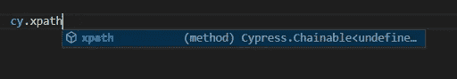

# 如何在 Cypress 中使用 X-path？

> 原文：<https://medium.com/nerd-for-tech/how-to-use-x-path-in-cypress-eca5e894cda0?source=collection_archive---------4----------------------->

作为自动化工程师，我们每个人都熟悉广泛使用的定位器。Cypress.io 只支持 **CSS** 选择器(jQuery 选择器)，但是如果不熟悉 **CSS** 选择器会怎么样呢？所以我们来看看如何在 Cypress 中使用 X-path。

**先决条件:**

在我们开始之前，你应该知道 cypress 的基本语法以及如何找到 X 路径定位器，在这里我假设你知道这些事情，所以让我们开始吧！！

**安装:**

**安装 npm**

> 安装-D cypress-xpath

**用纱线安装**

> 纱线添加 cypress-XPath-dev

然后包含在你项目的**cypress/support/index . js**

> 需要(' cypress-xpath ')

不使用 index.js 中的上述行

> **在**cypress/support/index . js**中包含** require('cypress-xpath ')后

**类型脚本和智能感知支持**

要正确加载`cy.xpath`命令的类型，请在您的规范文件中添加以下注释。

///

**干杯！！！**

**注:**如有任何疑问，欢迎在此发帖，谢谢！