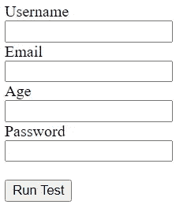
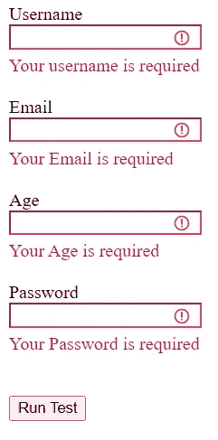
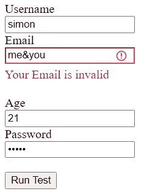
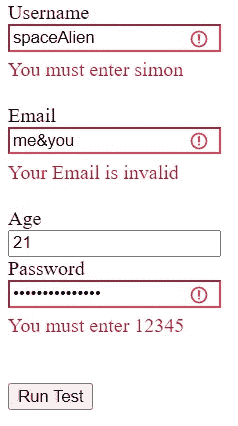
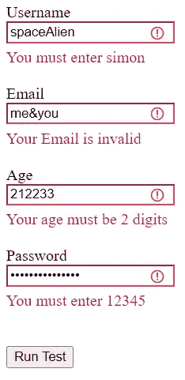
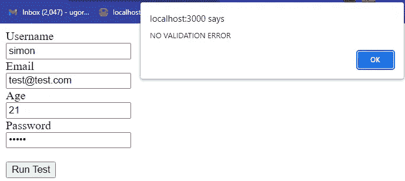

# 如何用 Octavalidate-PHP 验证表单服务器端

> 原文：<https://medium.com/nerd-for-tech/how-to-validate-your-forms-server-side-with-php-75680d04971b?source=collection_archive---------2----------------------->

本·格里菲斯在 Unsplash 上拍摄的照片

表单验证对于防止不需要的/格式错误的数据存储在数据库中非常重要。

用户的一次错误输入会影响数据库中的所有记录，因此在将所有表单输入存储到数据库中之前，有必要对其进行验证。

最近，我构建了一个库，它可以帮助用 PHP 验证表单服务器端，在本教程中，我将向您展示如何在您的项目中使用它。

# 演示文件

我将使用一个演示 PHP 文件，它向自身提交表单 post 数据。

这是我的演示文件

这是表单的外观

# 导入库

为了在表单上开始验证，我们必须下载并导入验证库到我们的项目中。

访问 GitHub 资源库并下载该库

 [## GitHub-Octagon-Simon/octaValidate-PHP:这个 PHP 库有助于使用…

### 该库有助于使用验证规则和复杂的正则表达式来验证表单服务器端。我们…

github.com](https://github.com/Octagon-simon/octaValidate-PHP) 

下载完库之后，这就是我将库导入到项目中的方式

现在，我们准备开始对表单进行验证。

# 定义验证规则

为了开始验证，我们需要:

*   定义表单的有效性规则。
*   调用`validateFields()`方法，将规则作为第一个参数传入，然后将表单字段作为第二个参数传入

[在这个页面](https://github.com/Octagon-simon/octaValidate-PHP#validation-rules)，你会看到一个内置的验证规则列表，可以用在你的表单上。

下面是定义表单验证规则的语法

所以对于上面的表单输入，我希望定义这些验证规则

*   用户名— R(必填)
*   Email-R(必需)，EMAIL(检查该值是否为有效的电子邮件地址)
*   年龄-R(必需)，数字(检查值是否为有效数字)
*   密码— R(必需)

这就是我将如何定义规则

# 调用验证方法

既然我们已经定义了规则，我们需要调用`validateFields()`方法，将规则作为第一个参数传入，然后将表单字段作为第二个参数传入。

表单字段可以是`$_POST`或`$_GET`数组。如果没有提供值，它默认为`$_POST`数组。

这样，您可以选择验证来自`$_POST`数组或`$_GET`数组，甚至来自`$_REQUEST`数组的数据。

`validateFields()`方法返回`boolean`

*   true 表示没有验证错误

如果没有验证错误，您可以自由地处理表单数据，并可能将数据存储在数据库中

*   false 表示存在验证错误

如果有验证错误，我们需要通过调用`getErrors()`方法将错误返回给用户。

在将错误返回给用户时，您需要一个 JavaScript 函数将错误附加到表单中，因为它是一个服务器端库。幸运的是，这个库附带了一个助手脚本，可以在`/frontend/helper.js`中获得。

助手脚本包含两个函数:

*   显示错误(errorObject)

将 error 对象传递给该函数，以便该函数将错误追加到表单中。

*   移除错误(formId)

向此函数传递一个表单 ID，以便该函数删除表单中出现的任何错误。

> 如果你的表单被提交给页面本身或者另一个 PHP 脚本，你不需要调用 `*removeErrors()*` *函数，因为页面会在每次提交时重新加载。但是，如果使用 Ajax 处理表单提交，就有必要调用这个函数。*

找到这个脚本，并将其中的函数包含在您的项目中。

这就是我如何处理`validateFields()`方法的结果

这是演示页面的完整代码

让我们提交表格并检查是否一切如预期的那样工作，好吗？🙂

当我点击提交按钮时，我看到的是

这是检查值是否被提交的必需规则。现在让我们为输入输入随机值，并再次点击提交按钮。

这是我看到的

这是用于检查是否提交了有效电子邮件的电子邮件规则。

现在，我们已经介绍了基础知识。让我们定义自定义规则来处理用户名和密码的验证。

# 定义自定义规则

除了内置的验证规则之外，您还可以定义自定义规则，这些规则将会像内置规则一样被处理。

要定义自定义规则，您需要:

*   规则标题
*   正则表达式
*   错误文本

如果你有这三样东西，那么你就可以为你的表单定义自定义规则了。

这是可用于定义自定义规则的两种方法；

*   `customRule()`
*   `moreCustomRules()`

第一种方法允许我们定义单个规则，第二种方法允许我们定义多个规则。

我将使用第二种方法，因为它允许我们定义多个规则。

出于本文的考虑，我将定义一些简单的规则，允许用户在用户名字段中输入“simon ”,在密码字段中输入“12345”。

现在让我们在为表单定义验证规则之前放置代码，然后只为表单输入的验证规则提供规则标题。

现在让我们用随机值再次提交表单。

从上面的图像中，您可以看到我们在规则旁边定义的错误消息按预期工作。

# 属性验证

在我的最后一次验证中，我将向您展示如何执行属性验证。

通常，所有属性验证都允许您提供一个规则标题，例如“MAXSIZE”，一个规则值，例如“5MB”，以及一个错误消息，例如“您的文件不能超过 5MB”

所有属性验证都遵循以下语法

您可以使用这种类型的验证来验证；长度，最小长度，最大长度，大小，最小大小，最大大小，等于，文件，最小文件，最大文件。

我将对年龄表单输入使用长度验证，因为我们希望用户只提供 2 位数。

因此，为了将长度验证添加到表单的年龄验证规则中，我将这样做；

以下是演示页面的验证规则

因此，让我们输入随机值并点击提交按钮

您可以看到一条错误消息，告诉我们年龄必须是 2 位数。让我们为所有表单输入提供正确的值，并再次提交表单。

没有验证错误！所以图书馆工作得很好😎

# 证明文件

文档页面上有更多验证。请访问下面的文档以了解关于该库的更多信息

 [## octavalidate-PHP:入门

### 欢迎来到这个伟大的库，它使用验证规则和复杂的…

八角形-simon.github.io](https://octagon-simon.github.io/projects/octavalidate/php/index.html) 

# 额外的

是否要将此库用于前端表单验证？请访问下面的文档，了解如何使用 octaValidate-JS 在表单上轻松设置前端验证。

 [## octaValidate:入门

### 欢迎来到这个伟大的库，它使用验证规则、复杂的常规…

八角形-simon.github.io](https://octagon-simon.github.io/projects/octavalidate/index.html) 

是否要将此库用于前端和后端表单验证？请访问下面的文档页面，看看这个库的前端和后端验证有多顺利。

 [## octaValidate:前端和后端验证

### 请确保您已经了解如何处理服务器端表单验证错误，然后再继续进行此…

八角形-simon.github.io](https://octagon-simon.github.io/projects/octavalidate/php/frontend-backend.html) 

目前就这些了，

谢谢你。