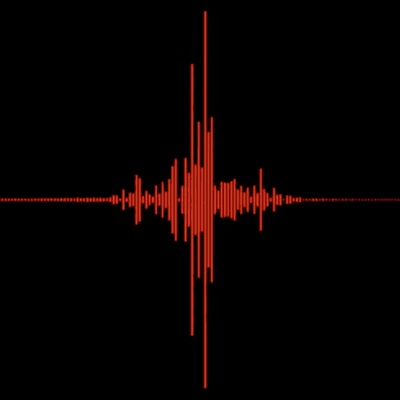

# 如何可视化音乐(使用 Python)

> 原文：<https://medium.com/nerd-for-tech/how-to-visualize-music-using-python-5db9440ab23e?source=collection_archive---------0----------------------->

## 你喜欢看一些音乐吗？

我是将科学应用于日常生活用例的忠实粉丝，我总是觉得将看似独立的领域混合在一起很有趣。特别是，我认为艺术比我们想象的更接近数学。

除了我的开发/工程项目，我也喜欢做一些音乐(翻唱或原创…