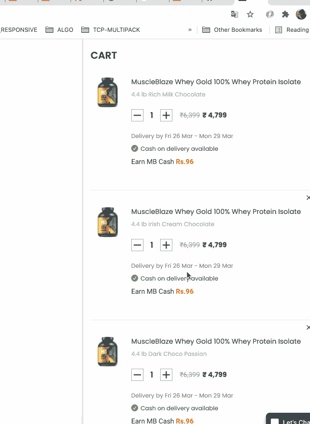
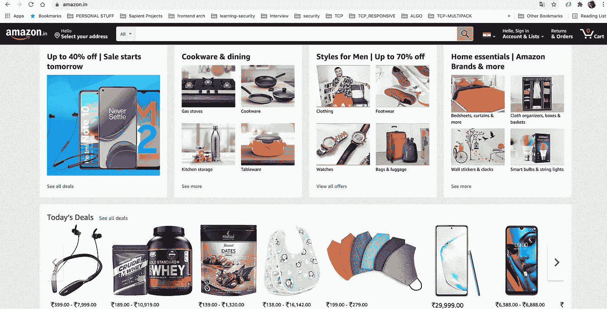

# 如何在 React Web 应用程序中编写或理解性能代码

> 原文：<https://medium.com/nerd-for-tech/how-to-write-or-understand-performant-code-react-web-application-for-beginners-bdea8157abeb?source=collection_archive---------10----------------------->

大家好，我是 Sachin Rawal，我是一名在行业中有十年经验的前沿技术专家。

我想分享我在 react 应用程序和工作方式方面的经验，以及如何提高性能。

我想强调的第一件事是，我们不应该试图在开发后提高应用程序的性能，我的意思是，我们应该总是试图实现**高性能代码，**要么你先编写更好的代码，要么以后修复它，但无论如何你必须在性能上努力。

如今，每一个寻求快速渲染和快速渲染的客户不仅仅是指 FCP(第一幅内容丰富的画)或 TTI(互动时间)

我们通常会忽略许多其他方面，例如 CLS(累积布局偏移)，这是一种没有用户交互的布局偏移，CLS 的原因是代码编写方式错误(我知道大多数人会说这是主观的，这是我们的要求，但下面的图片可以帮助您理解我所说的错误代码)

这是一只鸽子的形象，他打算飞！！

现在鸽子在飞，但这是正确的方式吗？

**这就是我对错误代码的理解。**

现在，我将为您提供一些提示/建议或信息，帮助您在发展前后提高绩效。

## ***第三方工具/插件或模块***

> 在添加任何插件之前，一定要考虑它是否真的需要，如果需要，一定要比较插件和它们的大小。
> 
> *例如:你想实现数据格式化器，你唯一的需求是实现格式化的数据(明显考虑到项目的整体情况)*
> 
> *您已经实现了 react-datetime(假设是下载量最大的)，现在运行良好，但是您是否比较或探索了其他选项？比如反应时刻，哪个比这个轻？*

## ***功能实现***

> *总是调用函数，而不是内联编写，例如:*
> 
> *避免这种:* ***<按钮 onClick = {()=>setShow(true)}>点击我</按钮>***
> 
> 用这个:
> ***<按钮 onClick={this.handleClick} >点击我</按钮>***
> 
> ***原因*** *:函数是一类具有特殊属性的对象，因此 react 无法对其进行比较。*

## 使用数组属性，如映射、过滤器等

> *在使用****map****的时候，我们不应该把 index 作为一个 key 来传递，让我们用例子来试着理解一下。*

> *在上面的 gif 中，我在购物车中添加了 3 件带有地图的产品，它们的索引像是 1-2-3，现在我删除了第二件产品* ***索引*** *应该是 1-2，对吗？*
> 
> *但这是不对的，因为我们删除了第二个产品，它不应该更新第三个产品的索引，因为现在第三个产品的索引是****【2】***
> 
> *理想情况下应该是 1–3，因为我移除了第二个产品(我希望我的解释清楚)*

## 重新渲染问题

> *不必要的渲染是任何开发人员或客户的眼中钉，为了避免这种情况，我们应该使用。*

## 避免在 props 中使用 spread 运算符

> *避免使用导致重新渲染的不必要的道具例如:****<Component {…props }/>*** Use this:
> **<Component propval = { value } newpropval = { newpropval }/>*Reason****:通过这种方式发送道具，我们会发送不必要的未使用的道具，这些道具可能会导致重新渲染*

## **避免直列造型**

> *渲染时避免对象文字或渲染时的内联样式导致重新渲染，例如<组件样式={{margin:0}} / >*

## *服务器端渲染(NextJS )*

> *在 SSR 的帮助下，你可以在服务器上生成你的网页，这样你的网页就会加载得很快，要了解 Nextjs 或 SSR，请查看这个:*[https://nextjs.org/](https://nextjs.org/)

## **使用动态导入(NextJS )**

> *正如我们所知，健壮应用程序的内容高度有点大，例如，您可以看到亚马逊列表页面的页面高度*这是亚马逊的主页(可见屏幕)

在卷轴之后，有相当多的部分

我们不应该加载这些或在我们的可见页面中添加这些模块，无论是应该延迟加载还是作为动态导入加载，它也可以将代码分割成不同的块，并减少初始负载

## **检测不必要的重新渲染**

> 还有一个更重要的插件 WHY-do-YOU-UPDATE——库检测不必要的组件渲染。具体来说，它指出了组件的 render 方法被调用的情况，即使没有发生变化

不是这样的:)我们有 100 多种方法可以改进我们的 web 应用程序，但是通过这些，我们可以给它一个开始，并探索另一种改进的方法。

**感谢你阅读这篇文章。
也许我错过了应该在列表中的，或者也许你的想法不同，因为所有的五个手指并不相等，对吗？我将非常感谢任何反馈**