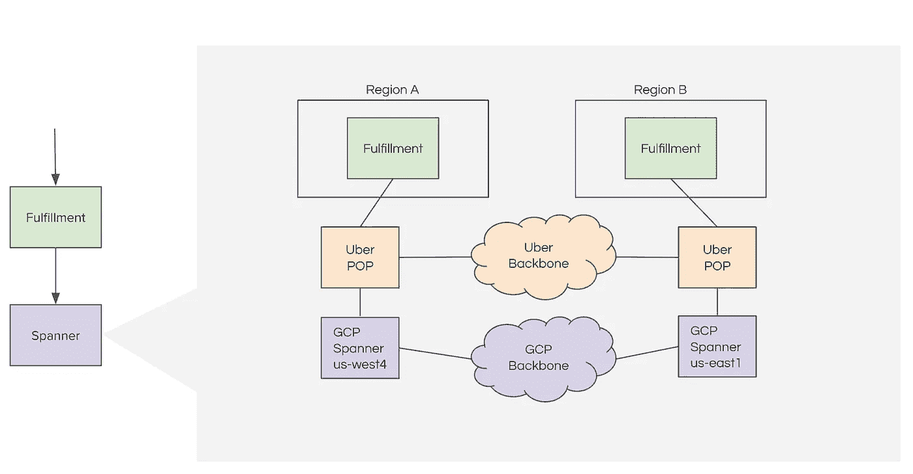
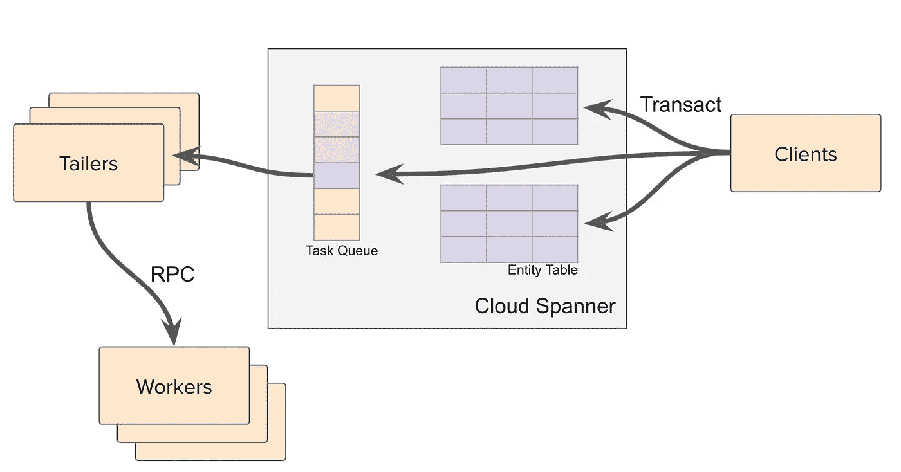

# 优步如何高效处理数百万次乘车/食物请求第二部分

> 原文：<https://medium.com/nerd-for-tech/how-uber-handles-millions-of-ride-food-requests-efficiently-part-2-270f84d2c3c0?source=collection_archive---------1----------------------->

基于谷歌云扳手的优步履行架构的详细介绍

普里西拉·杜·普里兹在 [Unsplash](https://unsplash.com?utm_source=medium&utm_medium=referral) 上的照片

在上一篇文章中，我们介绍了上一代优步的履行服务。该服务无法扩展以服务于快速增长的用户数量，这导致优步的履约团队重写了该服务。在这篇博客中，我们将探讨上一代履行服务的问题，以及优步是如何解决这些问题的。

> 如果你还没有读过博客的第一部分，我建议你看一看。博客中介绍的关键概念和高级架构概述对于理解这篇文章是必要的。第一篇博客链接:[https://megtechcorner . medium . com/how-Uber-handles-million-ride-food-requests-efficient-part-1-2a aa8 db 436204](https://megtechcorner.medium.com/how-uber-handles-millions-of-ride-food-requests-efficiently-part-1-2aa8db436204)

# 问题

简单回顾一下，履行服务的主要目标之一是高效地为用户找到附近可用的司机。使用 H3 库[3]将驾驶员和用户的位置转换成字符串。数据库索引用于索引编码的地理位置字符串，以便快速检索。

数据存储采用 NoSQL 数据库。由于 NoSQL 数据库不支持索引(因为 NoSQL 没有分布式交易)，优步的履约团队使用一个单独的表来存储索引。为了保持数据表和索引表中的数据一致，团队遵循一个名为 Saga[4]的设计模式来实现分布式事务。

Saga 的关键思想是将一个大交易分解成一系列小交易。例如，如果我们想在一个事务中更新数据表和索引表，我们可以使用两个较小的事务，T1 和 T2。在 T1 内部，我们更新数据表，在 T2 内部，我们更新索引表。如果提交 T1 后 T2 失败，则数据库处于不一致状态。为了使数据库回到一致的状态，我们需要提交一个补偿事务 C1，这将恢复我们在 T1 中所做的更改。显而易见，这种方法会给系统带来许多复杂性，同时也不能保证一致性。

## 数据一致性

使用 Saga，很难实现数据一致性。想象一下这样一种情况，协调事务的应用服务器在提交补偿事务 C1 之前崩溃，很难弄清楚我们需要做什么来恢复数据库的一致性。优步所做的是不断比较数据库的预期状态和当前状态，以修复任何不匹配。然而，“*随着我们(优步履约团队)使用 Saga 模式构建更复杂的写流程，跨多个实体(表/行)和服务的调试问题变得更加困难。*【②】

## 应用程序复杂性

将数据库事务逻辑泄露到应用程序层会使应用程序逻辑变得非常复杂。考虑一下 Saga 设计模式，应用层需要为每个更改生成一个补偿事务，并协调事务提交和中止过程。因此"*在应用程序层处理所有的基础设施问题使得应用程序效率极低* "[1]。

# 解决方案:NewSQL

如果我们考虑一下优步的履约服务所面临的问题，他们真正需要的是一个能够提供 NoSQL 系统的可扩展性，同时提供索引和分布式交易支持的系统。这正是 [NewSQL](https://en.wikipedia.org/wiki/NewSQL) 的用途。在比较了许多 NewSQL 解决方案后，优步的履约团队决定将数据存储迁移到 Google 的 cloud Spanner。Google 的 cloud Spanner 是一个 NoSQL 数据库，将数据存储在 mapping 中:(key:string，timestamp:int64) → value:string。在 NoSQL 堆栈之上，它使用[两阶段提交](https://en.wikipedia.org/wiki/Two-phase_commit_protocol)构建分布式事务支持。后来，SQL 支持也被添加到数据库中[6]。

## 云扳手的说明书

*   支持分布式事务
*   对二级索引的本机支持
*   高可扩展性和低延迟

## 基于云扳手的履约服务架构

有了云扳手，架构大大简化。云扳手数据库在多个区域复制，以实现高可用性和可靠性。履行服务在很大程度上可以是无状态的。要更新驱动程序的位置，只需要更新供应实体表中的位置(参考第 1 部分中关于表和示例数据库模式的定义)。)索引由扳手自动更新。要为用户找到附近的驱动程序，应用层可以直接将 SQL 查询发送给 Spanner，如博客的第 1 部分所述。

优步履行服务架构。来源:[2]

# 故事结束了？

有了云扳手，优步的履行架构大大简化，同时一致性和可扩展性问题得到解决。然而，这就是故事的结局吗？嗯，不。软件工程可能要复杂得多，为了交付一个好的服务，需要处理许多不必要的情况。

## 扳手客户端

开箱即用的 Spanner 客户端不提供异步支持，而异步支持对于履行服务是必不可少的。此外，对 DML(数据操作语言)的支持还不成熟。因此，该团队构建了一个定制的扳手客户端。此外，定制客户端拦截 gRPC 以提高可观察性，并合并事务以提高吞吐量。

## 提交后事件

实施需要运行提交后活动。一个例子是要约到期。然而，云扳手没有变化数据捕获解决方案。该团队使用一张桌子构建了自己的解决方案。

来源:[1]

异步任务存储在一个特殊的数据库表中，称为任务队列。实体表更新和任务队列任务插入在单个扳手事务中执行。Tailer 定期扫描任务队列表以发现新任务。它将 RPC 发送给工作人员，以便将任务分派给他们。虽然博客中没有提到，但我们可以想象这个子系统的复杂性。如果工作人员失败，拖车如何知道要重试哪些任务？如何高效扫描任务队列而不使数据库过载？如何将扫描工作分割给不同的 tailer 副本？

# 关闭

借助 cloud Spanner，履约团队能够简化系统，同时解决一致性和可扩展性问题。然而，每个系统都有其自身的局限性。迁移到 Spanner 也带来了新的复杂性，比如定制的 Spanner 客户端和任务队列子系统。

# 更多阅读

> 如果你对谷歌如何对搜索结果进行排序以及如何高效处理数 Pb 的网络图数据感兴趣，你可以在我的另一篇文章中找到详细信息:[https://megtechcorner . medium . com/how-Google-computes-the-page rank-for-the-whole-internet-efficient-part-1-135 ca 6 ef 3247](https://megtechcorner.medium.com/how-google-computes-the-pagerank-for-the-whole-internet-efficiently-part-1-135ca6ef3247)

# 参考

[1]https://eng.uber.com/building-ubers-fulfillment-platform/

[2]https://eng.uber.com/fulfillment-platform-rearchitecture/

[3][https://eng.uber.com/h3/](https://eng.uber.com/h3/)

[4][https://www . cs . Cornell . edu/andru/cs 711/2002 fa/reading/sagas . pdf](https://www.cs.cornell.edu/andru/cs711/2002fa/reading/sagas.pdf)

[5] Corbett，James C .等人，“扳手:谷歌的全球分布式数据库。”美国计算机学会计算机系统汇刊(TOCS)31.3(2013):1–22。

[6] Bacon，David F .等人，“扳手:成为一个 SQL 系统”*2017 年 ACM 数据管理国际会议论文集*。2017.