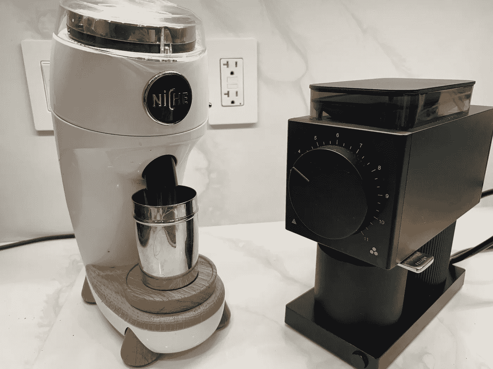
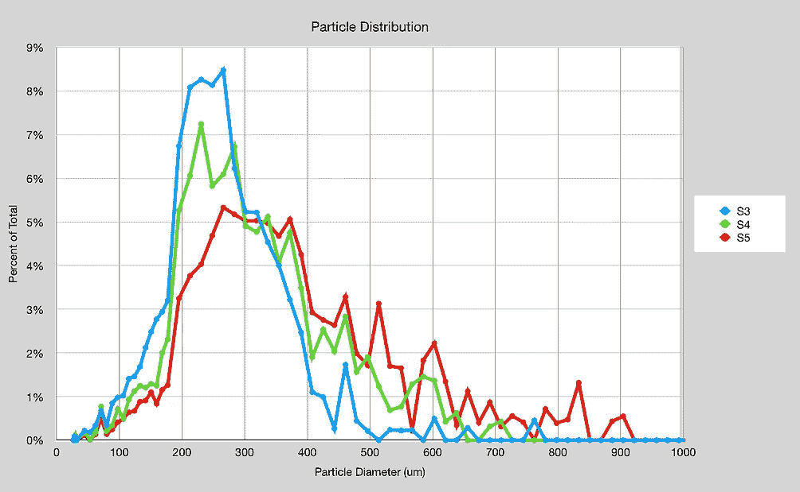
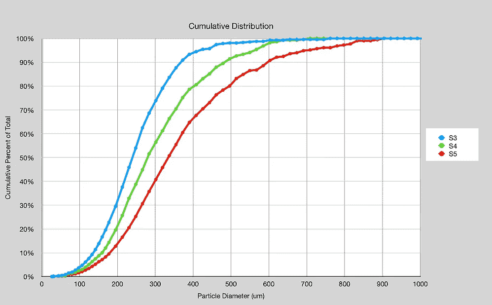

# 平毛刺咖啡研磨机有多单峰？

> 原文：<https://medium.com/nerd-for-tech/how-unimodal-is-a-flat-grinder-31509780668a?source=collection_archive---------1----------------------->

## 咖啡数据科学

## 词语很重要

当谈到咖啡研磨，有一个锥形和平面毛刺之间的比较。据称，一些扁平毛刺(如 SSP 多功能毛刺)具有单峰分布，这意味着颗粒尺寸范围非常窄。

左边是小生零(锥形毛刺)，右边是 Fellow Ode。所有图片由作者提供。

在[对齐](https://towardsdatascience.com/aligning-flat-burrs-on-fellow-ode-2ab39a5264ea)之后，我查看了一些带有 SSP 多功能毛刺的 Ode 上的研磨设置。这三种设置都在浓缩咖啡的范围内，但在我看来，它们并不像我想象的那样单峰。我用图像处理测量了它们的[粒子分布](/nerd-for-tech/measuring-coffee-grind-distribution-d37a39ffc215)，我在这里展示了它们。

设置 3 (S3)比其他更单峰，但单峰毛刺的要点是，你可以使研磨更粗糙，峰值会移动。S4 的峰值只是延长了，S5 的峰值确实移动了，但扩展得更多。

我不得不把研磨机还回去，但我希望看到更多的测试和发行版来描述单峰是如何单峰的。我见过一些苏格拉底式咖啡的浓缩咖啡，但我还没见过跨研磨设置的分布。

如果你愿意，可以在[推特](https://mobile.twitter.com/espressofun?source=post_page---------------------------)、 [YouTube](https://m.youtube.com/channel/UClgcmAtBMTmVVGANjtntXTw?source=post_page---------------------------) 和 [Instagram](https://www.instagram.com/espressofun/) 上关注我，我会在那里发布不同机器上的浓缩咖啡照片和浓缩咖啡相关的视频。你也可以在 [LinkedIn](https://www.linkedin.com/in/dr-robert-mckeon-aloe-01581595) 上找到我。也可以在[中](https://towardsdatascience.com/@rmckeon/follow)关注我，在[订阅](https://rmckeon.medium.com/subscribe)。

# [我的进一步阅读](https://rmckeon.medium.com/story-collection-splash-page-e15025710347):

[我未来的书](https://www.kickstarter.com/projects/espressofun/engineering-better-espresso-data-driven-coffee)

[我的链接](https://rmckeon.medium.com/my-links-5de9eb69c26b?source=your_stories_page----------------------------------------)

[浓缩咖啡系列文章](https://rmckeon.medium.com/a-collection-of-espresso-articles-de8a3abf9917?postPublishedType=repub)

[工作和学校故事集](https://rmckeon.medium.com/a-collection-of-work-and-school-stories-6b7ca5a58318?source=your_stories_page-------------------------------------)