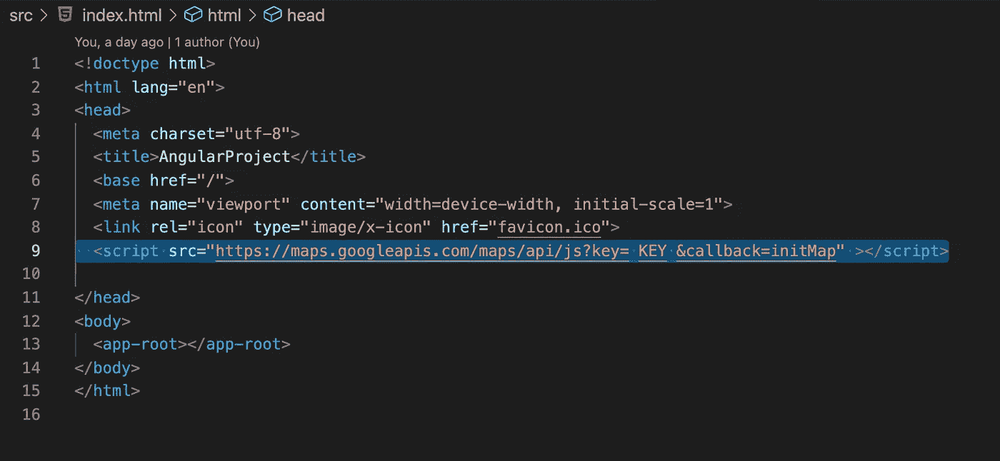
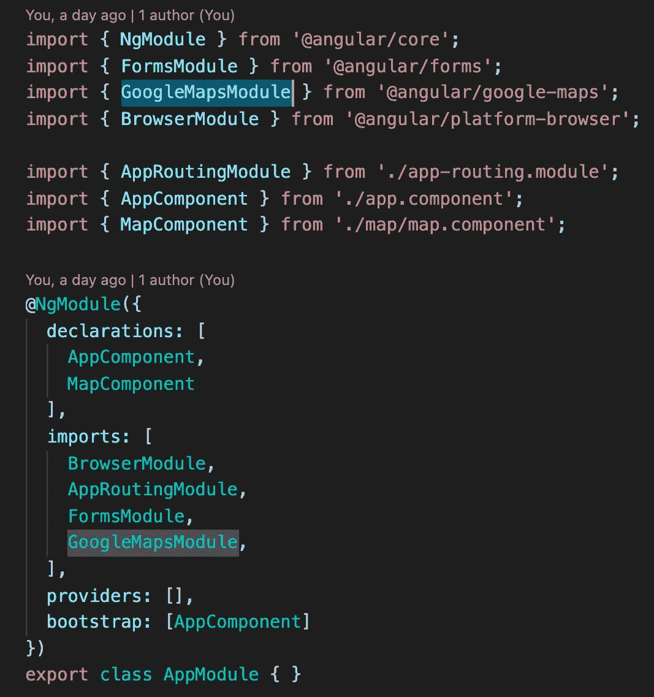
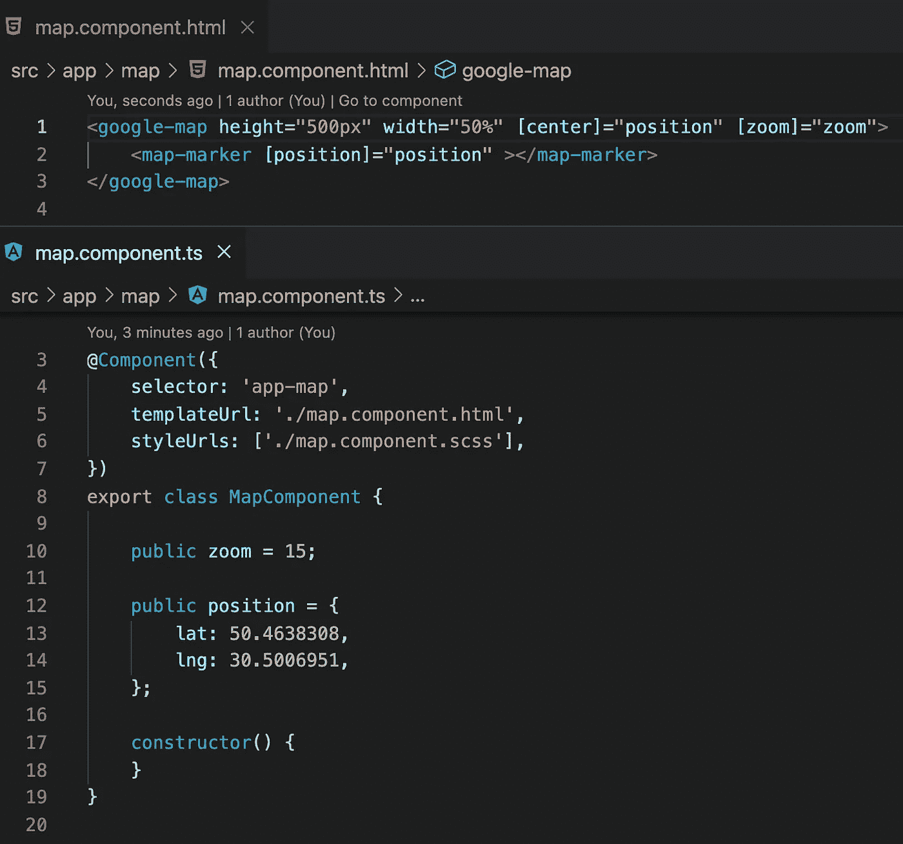
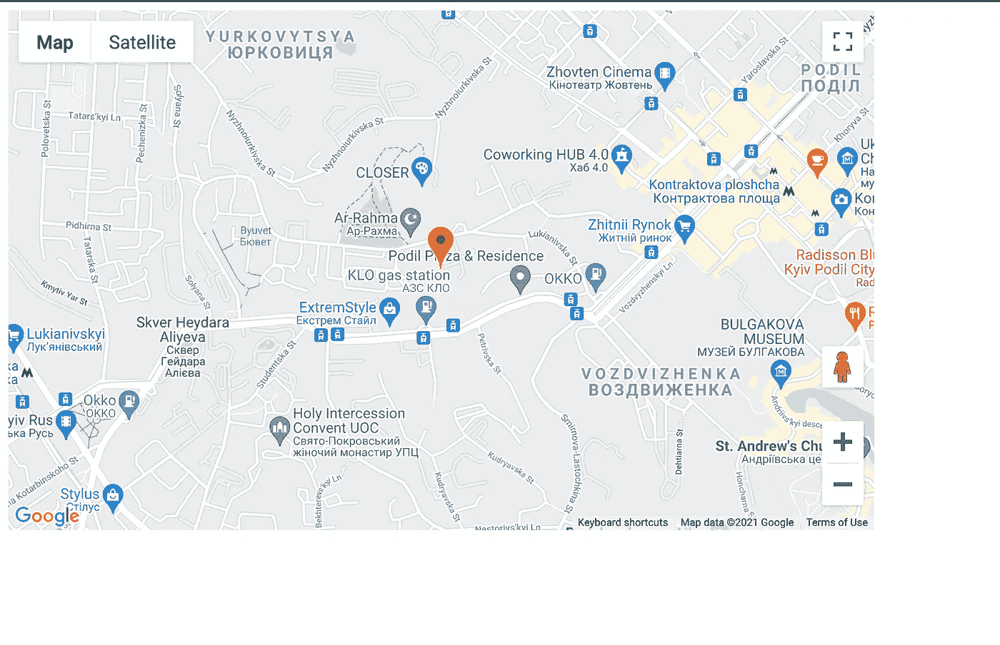

# 如何使用 angular/google-maps 初看

> 原文：<https://medium.com/nerd-for-tech/how-use-angular-google-maps-first-look-5ae7278e1302?source=collection_archive---------2----------------------->

要使用谷歌地图，我们需要导入地图 API。为此，我们必须在 index.html 添加一个带有 API 键的脚本[。](http://How%20use%20angular/google-map%20first%20look)

下一步是在你的项目中安装谷歌地图。

npm 安装@ angular/谷歌地图

之后，我们需要在我们的模块中添加 GoogleMapsModule

所有准备工作都完成了。现在我们可以编写地图组件了。要使用谷歌地图，我们只需要在 HTML 文件中使用选择器<google-map>。要设置位置，我们需要使用带有经纬度坐标的 center 属性。对于标记，我们需要添加一个选择器<map-marker>。</map-marker></google-map>

因此，我们有了一个带标记的谷歌地图。

如果你需要仔细看看这个项目[，这里是链接](https://github.com/8Tesla8/angular-google-map)。

*原载于 2021 年 12 月 17 日*[*http://tomorrowmeannever.wordpress.com*](https://tomorrowmeannever.wordpress.com/2021/12/17/how-use-angular-google-maps-first-look/)*。*