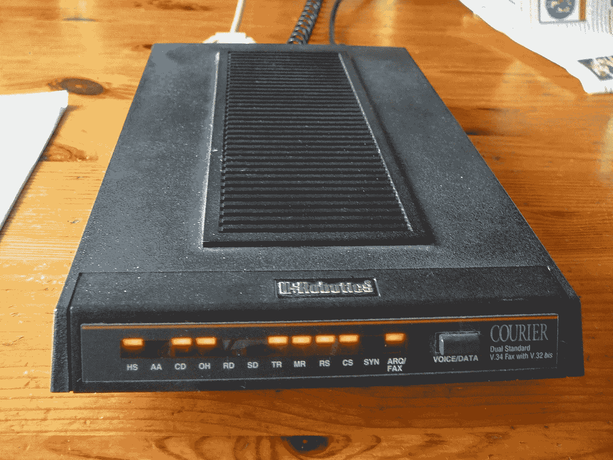

# 我们是如何进入我们生活的社交网络地狱的？

> 原文：<https://medium.com/nerd-for-tech/how-we-got-to-the-social-network-hell-we-live-in-7f442fea8e59?source=collection_archive---------11----------------------->

# BBS 和 USENET 新闻时代论坛

# 1983–1993

USRobotics 调制解调器

在 20 世纪 80 年代，调制解调器(调制解调器设备的缩写)越来越受欢迎。第一次在…