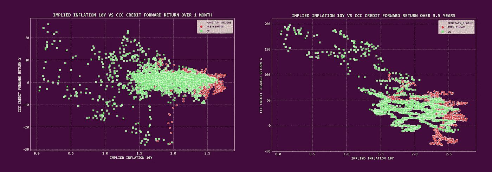
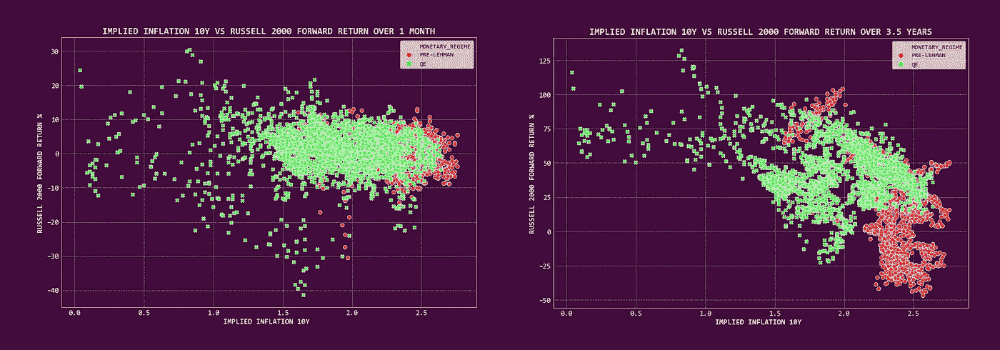
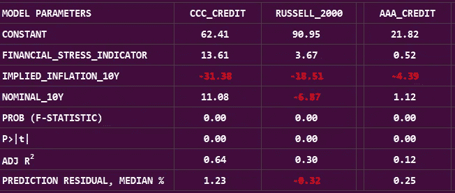
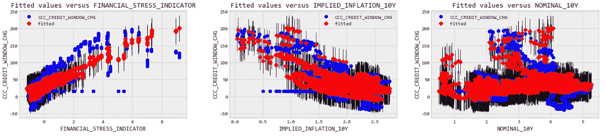
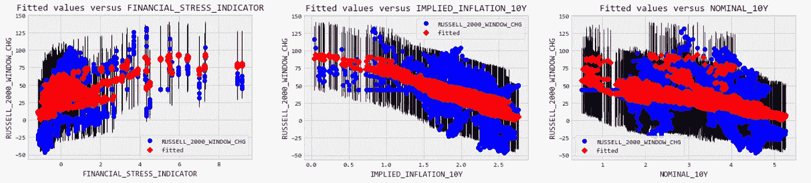
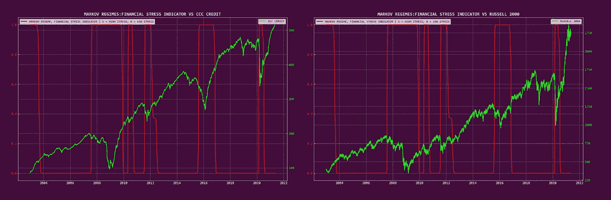

# 我们如何使用算法来辨别市场偏见

> 原文：<https://medium.com/nerd-for-tech/how-we-use-algorithms-to-discern-market-bias-e17a5c434045?source=collection_archive---------12----------------------->

## 通货膨胀真的是风险吗？

**这个版本说明了我们如何测试市场偏差，通过我们的自我学习框架(** [**这里覆盖的例子有**](https://haphazardlinkages.medium.com/how-we-use-self-learning-algorithms-e230242c12af) **)** )。为了强调和对比跨资产类别的行为，我们用来自**股票和信贷市场**的例子来说明。该版本以对算法模型及其在思考现实世界现象中的效用的一些想法结束。

随着各经济体摆脱 COVID 锁定，市场注意力已经落在 ***通胀起飞*** 上。一部分市场参与者和主流媒体认为，这是市场抛售/顶部触发因素。

**通货膨胀真的是风险吗？**

[本版使用的数据来源](https://fred.stlouisfed.org/)。

# 通货膨胀效应？

与自然科学不同，在自然科学中，自变量和因变量以整齐的关系结合在一起，金融市场是一个社会科学实验室。价格很少对孤立的单一事件刺激做出反应。在现实世界中，其他条件相同的情况很少成立。通常，多重事件刺激会影响价格行为。

我们的自学算法框架是沿着这些路线构建的:

1.  **每个市场隐含的事件刺激都被孤立地进行三角测量**；测试个体对*受影响变量* ( **股权/信贷市场表现** ) **的影响。**
2.  通过逐渐**结合额外的事件刺激**来重复该过程。
3.  通货膨胀倾向于在更长的时间内对市场施加影响([本](https://research.library.fordham.edu/cgi/viewcontent.cgi?article=1015&context=crif_working_papers)及以下)。该框架在多个提前/滞后时间范围内重复该练习。这抓住了时间效应(我们通常对长期最感兴趣)。

## **隐含通货膨胀&信用**

隐含通胀与**信用** ( **代理:CCC &美国高收益指数走低的后续价格表现负相关；信贷市场风险最高部分的代表)。这种关系在更长的时间范围内表现出来。重点介绍了这一时期的主要货币制度。**

## 隐含通货膨胀和公平

与**股权的类似关系(代理:罗素 2000 指数)。**

## 将它整合在一起

最后，我们通过添加两个额外的市场隐含变量来测试**通货膨胀对未来资产价格的影响。**附加变量*改进*模型。

我们更喜欢**市场隐含的刺激**，因为它代表了市场的集体预期，而不是易受博弈影响的事件刺激(如印刷通胀、GDP)。

**模型变量**

1.  ***金融压力指标*** : **衡量市场金融压力程度的指标。**零=正常的金融市场条件。低于零的值=低于平均水平的金融市场压力。高于零的值=高于平均水平的金融市场压力。
2.  ***隐含通货膨胀***10 年的预期。这些是从同等期限的名义和通胀指数债券收益率中得出的。
3.  ***10 年期名义收益率*。**
4.  ***窗口*** :为模型三角测量*最佳时间框架*的时间开关。

模型结果在**股票和信贷市场中有说明。**作为对比，AAA 信用(最低风险信用)的模型行为也如下所示。时期:2003 年至今。

**假设:影响者变量对资产价格没有影响。**

这个三变量模型在信贷和股票市场上都具有统计学意义。该模型强调了一些有趣的要点。

1.  信贷和股票远期价格表现与财务压力指标正相关**。今天的高价值(“高压力”市场机制)与随后指定时间窗口的正回报相关。**
2.  信贷和股本都与隐含通胀负相关。然而， ***最低评级信用(CCC)对隐含通胀*** **比股票市场更敏感。**
3.  名义收益率具有对比效应。它们与信用正相关，但与权益负相关。
4.  与股权相比，信贷的整体模型拟合度**更好。**

模型输出快照，窗口= 875 天。

直觉上；金融压力、通胀预期和债券收益率可能会对评级最低的信贷领域产生最大影响。该模型证实了这种直觉。这是我们专注于评级最低的信贷领域的原因之一。AAA 级信用领域中最薄弱的是模型行为:一种无风险资产类别；股票介于两者之间。

## **CCC 级信用的模型行为**

我们看看模型预测值如何与现实相比较。

**CCC 信贷的模范行为。黑线=预测值周围的不确定带。**

## **股权行为榜样**

**Russell 2000 上的模型行为。黑线=预测值周围的不确定带。**

增强的 3 变量模型在预测长期结果方面做得很好；与单个变量模型相比。它倾向于更好地模拟信用而不是股权。

## 点预测 v/s 机制认为

许多投资者建立数学模型，并期望对现实世界的动态做出精确预测。将自然科学的解决方案应用于社会科学现象是一件棘手的事情。由于市场是由思考的(通常是不思考的)参与者组成的，不确定性是规则。我们不期待精确(和准确)的预测，而是更喜欢透过政权行为的镜头来看待当前的现实。

> **我们使用自我学习框架的方式之一是使用模型作为指导，并从绘制广泛的*制度*** 的主要市场条件中获取价值。

我们在下面举例说明这种情况。我们描绘了一个关于金融压力指标的**马尔可夫转换模型，覆盖在信贷和股票价格上。**

1 = **高压力**市场机制。0 = **低压力**市场机制。

高压力体制通常伴随着信贷和股票的大幅抛售。该框架根据不断变化的市场现实动态地切换制度。充当不断变化的市场条件的标志，并随时反馈到定位中。

> 当前的体制发出了长期股权、短期 CCC 信用定位的信号；超过 3 年的时间。