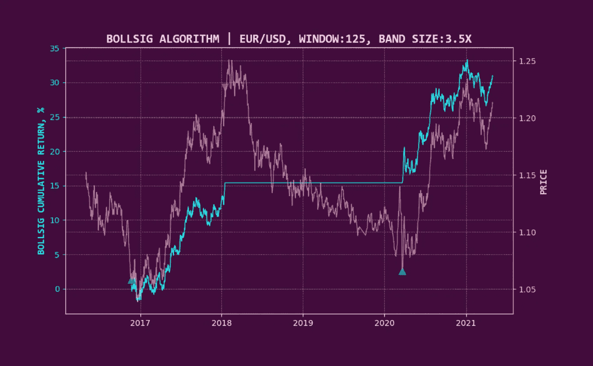
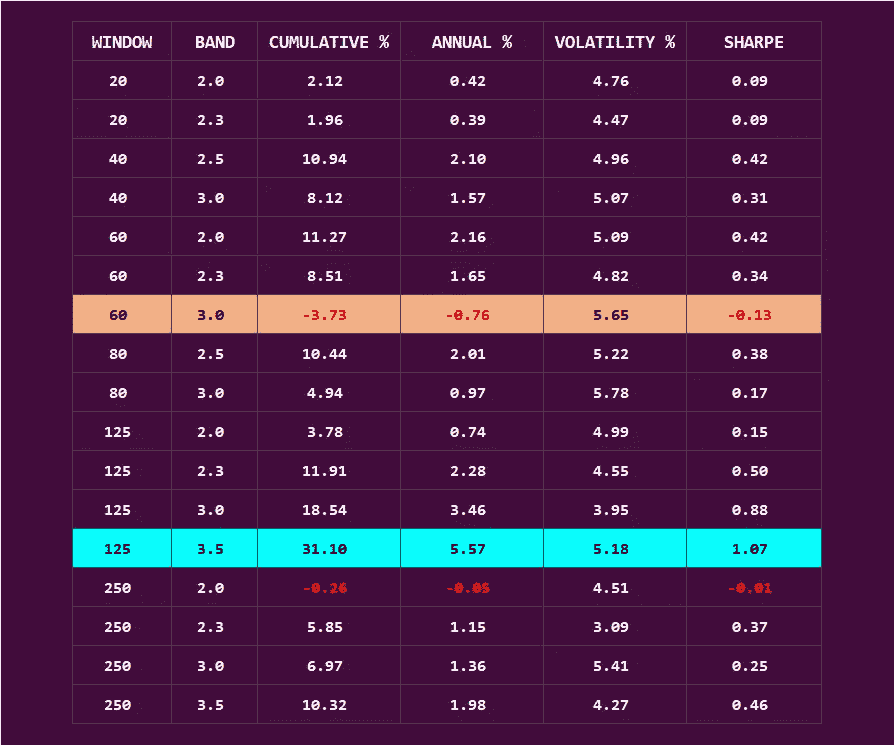
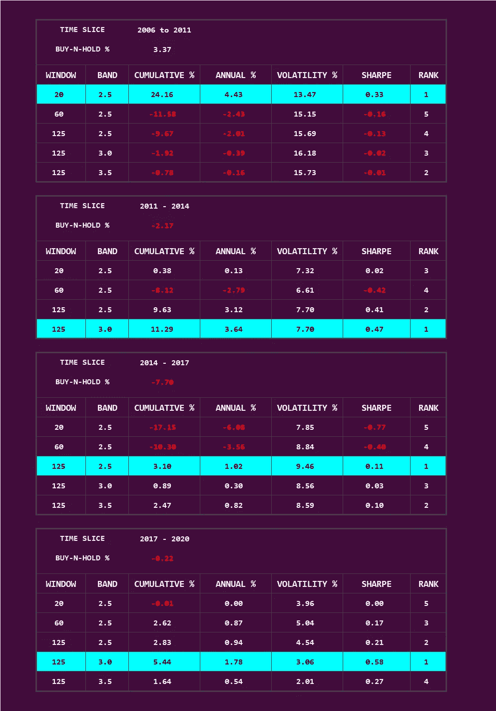
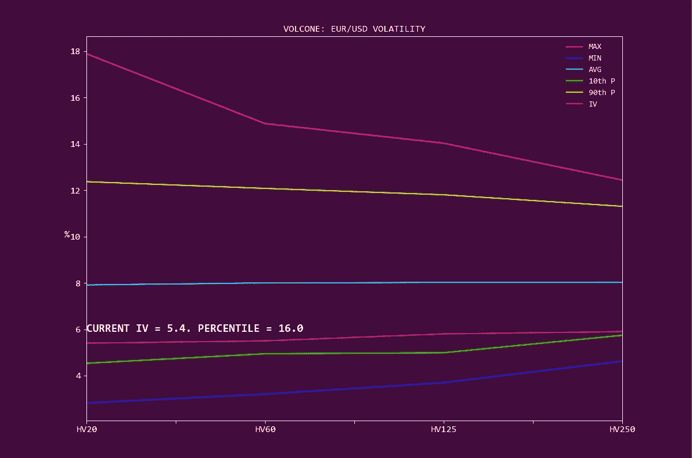

# 我们如何使用自我学习算法

> 原文：<https://medium.com/nerd-for-tech/how-we-use-self-learning-algorithms-e230242c12af?source=collection_archive---------6----------------------->

## 这位赔率奇才是概率大师。

与我们通常报道商业和估值的长篇文章不同，这一版重点关注我们如何在我们的内部框架*中使用**自学习算法**。*

我们的基本哲学 ***倾向于预测未来的结果*** 。

通过三角测量嵌入的市场预期，然后用嵌入的预期证实/偏离，我们可以更好地服务于 ***。我们的自学习算法框架建立在类似的博弈论哲学之上。***

具体来说，我们的**自学习算法框架**建立在以下基础之上。

1.  不是强加一个 ***用户提供的、硬编码版本的 reality*** (例如，“超过 40 倍的市盈率是昂贵的”，或者“我们将只使用 50/200 天移动平均线”)， ***框架需要学习每个金融工具*** 所说的语言。由于两个仪器很少以完全相同的方式运行，一个简陋的自学系统应该从单个仪器中学习。更重要的是， ***它必须学会动态地改变它的学习模型*** ，因为底层仪器的行为会随着时间而演变。
2.  它必须 ***在风险调整的基础上最大化总体结果概率*** 。大多数系统都希望性能最大化。从概率生存的角度来看，更谨慎的方法是采用风险优化的理念。系统应该有 ***正的生存概率*** 随时间变化。
3.  它必须有 ***飞轮效应*** 。一旦建立了学习系统，它必须在投资价值链的其他部分充当驱动变量。
4.  必须在 刻度下操作 ***，并且 ***仪表和地理独立*** 。这使我们能够在全球金融市场和工具中无缝应用该框架。***
5.  它必须针对 ***相对边缘*** 进行优化。大多数投资策略都有阿尔法衰减的问题:当一个策略吸引了更多的参与者时，阿尔法生成往往会随着时间而减少。默认情况下，自学系统需要处于只听模式。它应该吸收市场信息，学会避免人口过多的市场/战略，并寻找人口不足的市场/战略，以最大限度地相对于市场参与者的优势。

这个框架最好通过我们的**自学习波动策略**(***【博尔西格算法】*** )的例子来描述。

## **BollSig 算法信号触发**

1.  **回望期。**
2.  **波动性。**
3.  **优化器层。**

**BollSig 算法**基于优化的**信号触发对仪器进行三角测量。** (1)和(2)针对历史和价格波动进行优化，(3)进行动态吸收和风险优化**机制转换**(工具行为随时间的变化)的艰苦工作。该策略假设没有空头头寸。

## **例如:欧元/美元**

该算法使用**欧元/美元**外汇对进行说明。

该算法在价格图表的绿色标记处发出买入信号；并在随后的**红色**标记处展开。粉色线(图表上的 RHS)是工具价格。青色线(LHS)描绘了这一策略的累积回报。

定量算法往往有**硬编码触发器**。这抑制了策略的运行，因为用户提供的硬编码触发器对于所考虑的仪器可能不是最佳的。更动态的 ***自学习机制*** 是一个台阶式的提升。

这种 ***自学习元素已经通过一个过程嵌入到 BollSig 算法中，该过程为所考虑的每个仪器识别最佳信号触发组合。***

这种增强确保了:

> 每个仪器在任何时间点都能捕捉到最佳的信号触发。
> 
> 随着仪器行为的发展，系统会动态改变信号触发，以选择最佳组合。

显示了针对**欧元/美元**的各种 BollSig 优化运行的选定描述。**青色=最佳组合。橙色=最差组合。**

涵盖整个时期的买入并持有策略将产生+1.13%的年回报率。

正如各种运行所描述的，一些组合也会导致负回报。一种**自学方法**——与**用户提供的硬编码信号触发方法**——相反——防止了昂贵的实验。

下图显示了不同随机时段欧元/美元对的自学方法随时间的演变。

每个子周期的最佳组合都会突出显示。作为比较，各种信号触发组合的表现与简单的买入并持有策略进行了对比。

随着参考仪器的行为随时间演变，BollSig 会动态演变为最佳组合。

在许多情况下，BollSig 会生成一个排除信号— ***有问题的仪器不是该策略的最佳选择*** 。这个 ***排除信号*** 是有价值的，因为它绕过了具有次优、长期风险优化性能的工具。

## 飞轮效应

> *一旦建立了学习系统，它必须在投资价值链的其他部分充当驱动变量。*

BollSig 用于:

1.  **以独立为基础。**
2.  **作为现有长期投资持股的叠加。**
3.  **对于隐含波动机会。**

我们如何利用飞轮效应的一个例子通过(3)来说明。

***volcon*描绘了当前隐含波动率(IV)叠加在多个交易日的历史波动率(HV)上。第 10th P =第 10 百分位。第 90 个 P =第 90 个百分位数。红色=当前 IV 期限结构。**

BollSig 还帮助三角测量主要的**隐含波动率期限结构**(不同时间段的波动率预期分布)。目前，就隐含波动率而言，欧元/美元相对于其历史来说是相当便宜的。这是波动捕捉投资机会的基础。

静态定量系统受到各种限制。最难处理的细微差别之一是 ***行为漂移:基础工具行为的改变。***

正如我们在这里展示的，**自学习算法框架**提供了比静态/硬编码方法多几倍的改进。

该系统的多功能性在于它能够做到:

1.  在规模上。
2.  为每个感兴趣的仪器定制。
3.  跨越市场和地域。
4.  通过*飞轮作用；*通过馈入投资价值链的其他部分。