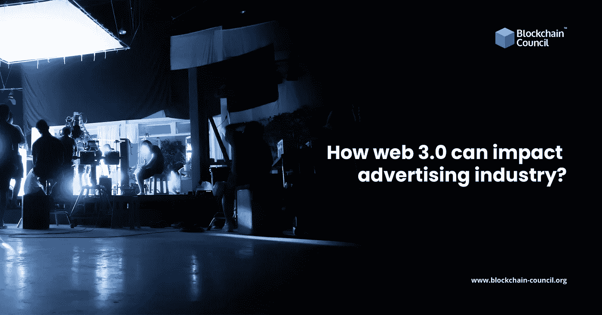

# web 3.0 如何影响广告业？

> 原文：<https://medium.com/nerd-for-tech/how-web-3-0-can-impact-the-advertising-industry-f61460c4c169?source=collection_archive---------1----------------------->

在当今的技术、A&M 和商业世界中，元宇宙和 NFT 是为品牌、知识产权，当然还有消费者参与带来前所未有的前景的流行语。与这些不断发展的技术保持一致，Web 3.0 是最近的突破，激起了各地企业的好奇心。随着最近[区块链开发者培训](https://www.blockchain-council.org/certifications/certified-blockchain-developer/)的增加，世界各地对区块链专家的需求很大。

Web 3.0 是互联网的最新版本，它承诺通过赋予消费者对其数据的更多控制权来进一步民主化互联网。据说，它与它的前辈 Web 1.0 和 Web 2.0 的不同之处在于，它提供了一种新的创造力和参与度，允许用户有效地创建和拥有互联网的各个部分。

更多阅读- [如何成为区块链开发者](https://www.blockchain-council.org/blockchain/5-skill-sets-a-blockchain-developer-must-have/)

# Web 3.0 对 SEO 有什么影响？

在最基本的层面上，SEO 是基于搜索引擎算法的。Web 3.0 有可能完全消除这些组织，从而产生一个更加个性化、分散化和集中的互联网，在这个互联网中，用户是决定他们去哪里和如何搜索的驱动力。

2021 年，谷歌占据了全球搜索引擎市场份额的 92%多一点。这意味着，就目前而言，SEO 将继续在数字营销中发挥重要作用。

阅读更多- [区块链认证印度](https://www.blockchain-council.org/info/blockchain-certification-india/)

# 保持技术搜索引擎优化的重点。

你页面上的用户体验会不断向搜索引擎传递信号，对你的搜索排名产生影响。用户在你的网站上停留的最初几秒钟将决定他们是留下还是离开，以及他们在网站上停留的时间。

你的网站加载的速度是一个能立刻影响用户的重要特性。根据谷歌的说法，如果你的网站加载时间超过 7 秒，用户更倾向于放弃它，从而导致高跳出率。

影响网站加载速度的因素有很多，但巨大的图片文件是最主要的原因。仔细检查照片的文件大小(目标是每张照片不超过 200KB)和格式，确保它们不会损害你的网站或它的排名。

除了网站加载速度，还要关注其他三个重要的在线指标:网站交互性和移动兼容性。

# 给用户提供与他们相关的内容

你网站的内容和结构、编程同样重要，Web 3.0 会继续这个方向。内容与你的观众建立信任，并向搜索引擎证明你是这方面的专家。如果你不确定从哪里开始，集中精力开发围绕语义搜索的内容。

当你在你的网站上使用语义内容时，你提供给他们的回答覆盖了他们正在寻找的整个主题，而不仅仅是几个关键词。它将用户的搜索意图与网站内容的上下文联系起来。

# 包扎

如今的营销方式可以包括通过社交媒体平台进行现场购物、3D 虚拟商店之旅等等。改善和构建这些体验可以让用户参与到当前的网站中，同时也让他们为即将到来的 Web 3.0 时代做好准备。

在线报名参加[区块链课程](https://www.blockchain-council.org/online-training/)并立即获得您的区块链认证。