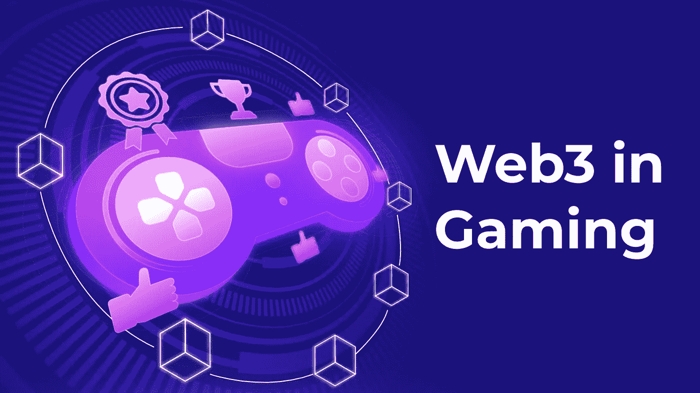

# 游戏中的 web3 如何改变游戏行业

> 原文：<https://medium.com/nerd-for-tech/how-web3-in-gaming-transforming-the-gaming-industry-66d444b65e52?source=collection_archive---------0----------------------->

Web3 通过使用区块链、加密货币和不可替代代币(NFT)的创新游戏功能，正在彻底改变游戏行业。它在许多方面使游戏民主化，给了游戏玩家新的成功机会。我们从来没有见过一种模式可以让玩家对一款游戏进行这样的控制。他们可以将控制权分散到整个生态系统，而不是集中在一个游戏上。游戏中的 Web3 不仅创造了一种新的游戏类型，还允许我们整合过去。

Web3 增加了创造你的世界并拥有它的吸引力。这个想法已经出现在几个利用区块链提供建筑机会的元宇宙游戏中。然后，他们的玩家可以创建独特的数字 3D 场馆。这种模式在元宇宙顶级游戏中运行良好，比如《分散的土地》和《沙盒》。

# 什么是 web3？

Web3 游戏是为玩家创造获胜环境的一种方式。但是在我们进入细节之前，web3 到底是什么意思？

Web3 是互联网的一个新概念，它使用分散的、准匿名的资源。它不是掌握在科技巨头手中，而是在用户中传播。这是继 web1 和 web2 之后的下一个发展阶段。让我们看看每个进化阶段的主要特征:

*   **Web1** —最初的万维网依赖于开源和开放标准。这导致了一些最重要的互联网公司的崛起和成功，包括亚马逊和谷歌。
*   **web 2**——web 2 更加关注用户生成的材料，带来了博客、社交网络和维基的时代。它使用了一些相同的 Web1 技术，并允许社交联系和内容创作。
*   **Web3** —新的 Web3 以价值交换而非信息交换为特征。还包括互联网的自我主权和重大去中心化。

**我们现在准备好继续玩游戏了。**

# 游戏中的 web3 如何改变游戏行业？

## 所有权和互操作性

web3 元宇宙为玩家提供了最大的机会，因为它允许游戏中真正的所有权和互操作性。这可以通过区块链或 NFTs 实现。NFT 已经成为了 web3 游戏的新面孔，在市场上受到了指数级的欢迎。它们提供了其他游戏模式所没有的东西:拥有几乎任何游戏内资产的机会。

传统游戏会让玩家购买特定游戏的游戏内物品。如果玩家转到另一个游戏会怎么样？你花在获得一个或几个物品上的金钱和物品都被浪费了。想象一下目前在虚拟现实中被浪费的无数游戏产品！

互操作性是 web3 游戏的关键。提到的物品可以跨多个游戏转移，所以游戏玩家不用担心丢钱。这给了玩家更多的控制，并允许他们在标题之间自由切换。如果你不想用它，你可以不把它放在身边。你可以把它们变成游戏中的 NFT 并在二级市场出售，使它们成为一种投资，而不是一次性购买。

## 可达性和开放性

[Web3 gaming](https://www.leewayhertz.com/what-is-web3-gaming/) 有一个与众不同的特点:它强调系统的分布式本质。你不依赖于一个服务器，不像集中式游戏。我们还可以利用投票协议为区块链的游戏增加新的功能。这开启了更多开放的 web3 游戏的可能性。web3 游戏环境也是独立的，在没有任何中央权威机构干预的情况下运行，这确保了卓越的可用性。

## 个性化体验

顶级 web3 游戏开发商展示了个性化体验如何成为新游戏行业成功的关键。Web3 游戏有很多值得注意的例子，优先为玩家提供最好的激励。例如，play-to-earn 是一款展示玩家如何通过玩游戏赚钱的游戏。Axie Infinity 是一款先玩后赚的 web3 游戏。这是一个众所周知的 NFT 玩赚区块链游戏，允许玩家通过他们的游戏技能获利，并帮助改善生态系统。

## 赚钱机会

下一代游戏平台将允许玩家在任何地方玩他们喜欢的游戏赚钱。玩家还可以拥有游戏内的代币，他们可以在区块链上交易和出售。从玩到赚的游戏平台将让玩家成为产品，而不仅仅是经济。这是一个颠覆游戏产业的巨大机会。“游戏赚钱”可能会提供一种新的收入来源，以帮助玩家在财政困难的国家克服财政困难。

## 博彩业的民主化

通过引入元宇宙和区块链的技术，游戏行业发生了巨大的变化。它通过消除集中的游戏管理者和平台所有者，分散了游戏部门。Web3 gaming 通过使用、DAO、等尖端技术以及 AR 和 VR 等其他先进技术，为[的财务实力和游戏行业的生存能力](https://www.leewayhertz.com/web3-in-gaming/)做出了贡献。

然而，我们仍处于这个市场的初级阶段，但有许多东西需要学习。育碧和 Zynga 等大型游戏公司开始探索这一市场。一旦 AAA 级的 web3 游戏发布，你可以期待需求的快速增长。

## 什么是 web3 游戏？一些例子

Web3 游戏，有时被称为 GameFi 或 play-to-earn，与所有基于区块链技术的数字游戏(web3 dApps)密切相关。每个 web3 游戏都应该向 fo 密码中的玩家提供数字资产，允许他们将这些资产作为实物商品进行交易。此外，这些资产可以跨多个平台和链进行交易。

所有的 web3 游戏可以分为两大类:即玩即赚和步行即赚。

## 玩赢游戏

玩赚游戏不同于传统游戏，因为它注重去中心化。这意味着游戏开发者无法控制结果。玩家参与游戏的游戏内经济，可以为开发者和玩家创造价值。

***这些是最知名的玩赚游戏代表:***

*   无限轴
*   夹板岛
*   外星世界
*   皇室律师

# 步行挣钱

另一种类型的 [GameFi](https://www.leewayhertz.com/all-about-gamefi/) 是步行赚取游戏。这些游戏都是基于一个简单的原则:你走路，赚数字资产，而不是玩游戏。这种奖励玩家简单动作的新方法，比如走路。许多公司向他们的玩家提供基于这一原则的游戏，但值得一提的是 Walken 和 STEPN 这两家最著名的公司。

# 结论

转向 web3 游戏是一个自然的过程。游戏是一个快速增长的行业，有潜力引领技术进步。由于向 web3 过渡过程中出现的新技术，游戏将处于技术进步的前沿。

此外，玩家和最终用户的呼声很高，也很明显。与此同时，工作室和开发人员需要了解他们的可交付成果，以跟上不断变化的场景。这是进入 web3 或区块链游戏的绝佳时机。机会是巨大的，随着未来向 web3 的转变变得更加主流，这种机会还将继续增长。