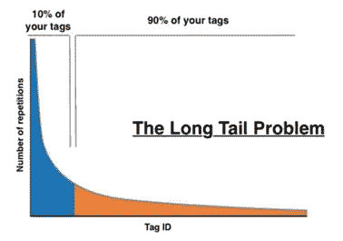
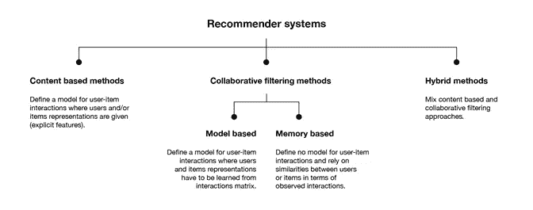
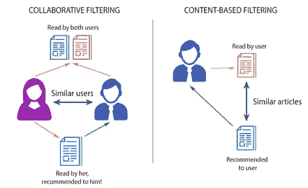

# 基于强化学习的推荐系统未来会怎样——第一部分:推荐系统

> 原文：<https://medium.com/nerd-for-tech/how-will-reinforcement-learning-based-recommendation-system-be-in-the-future-part-1-recommender-34ab562ab257?source=collection_archive---------4----------------------->

## 每天，我们都要面对来自各种途径的海量信息，这导致了信息超载问题，使人们很难做出正确的决定。

当我们在购物网站上冲浪时，我们必须在主页中浏览更多的商品。列表中的项目越多，就越难从中选择。了解需求，随着许多信息平台如 YouTube、亚马逊、网飞或电子商务的发展，推荐系统随着机器学习和人工智能的发展而建立和完善。

您也可以连续查看帖子:

*   [第二部分:推荐系统中的强化学习](https://neurondai.medium.com/how-will-reinforcement-learning-based-recommendation-system-be-in-the-future-part-2-92d153ae71c4)
*   [第三部分:基于强化学习的推荐系统](https://neurondai.medium.com/how-will-reinforcement-learning-based-recommendation-system-be-in-the-future-part-3-288c8c5df380)

***想看电影，但是看那个……如何才能选择…***

# **推荐系统**

## **定义**

推荐系统(RS)是一种软件工具和算法，它可以帮助用户基于对项目偏好的预测或对项目的评分来找到他们感兴趣的项目。RS 的建立是为了处理**长尾问题，即当用户只关注某个特定领域中突出显示的项目时，他们会留下许多可能对他们有用的项目，而且这些项目的数量非常巨大。这种情况在超市或者电商网站经常发生。**

****

*****就像你去超级市场，你看到的只是一小部分，其他的还在冷库里。*****

## ****方法****

**推荐系统的方法按照分类方法分为三类:基于内容的方法、协同过滤方法和两者结合的混合方法。**

****

*****推荐系统的分类*****

*****基于内容的方法:*** 这些方法基于项目的描述、用户偏好的简档以及它们之间的关系来做出推荐。这种方法可以用于大量的用户，因为它不需要来自其他用户的任何数据，并且每个推荐都是特定用户的。然而，这种方法需要大量的领域知识(例如，用户对某个项目的评分信息)，这意味着我们需要手工处理知识抓取。**

*****协同过滤方法:*** 这种方法有两种:基于记忆的和基于模型的。基于记忆的方法基于交互观察中用户或项目(用户-用户或项目-项目)之间的相似性，而基于模型的方法使用一些算法，例如聚类算法、基于矩阵分解的算法和深度学习方法，来从交互矩阵中学习用户/项目行为。与上述方法不同的是，该模型不需要大量的领域知识，通过向感兴趣的相似用户推荐一个项目来帮助用户发现更多的兴趣。然而，这种模型不能处理新的项目，或冷启动问题，但有一些方法来解决这个问题或使用基于内容的方法。另一个问题是，这个系统很难包括一些可以帮助推荐系统更值得信赖的项目的辅助特征。**

****

****协同过滤 vs 基于内容的过滤****

*****混合方法:*** 基于内容的方法和协同过滤方法之间的结合，它利用了每种方法的优点，使它们的缺点最小化。**

****

*****网飞推荐系统利用了混合推荐系统*****

***有用资源:***

**1)推荐系统介绍**

**[推荐系统介绍|作者:Baptiste Rocca](https://towardsdatascience.com/introduction-to-recommender-systems-6c66cf15ada)**

**2)基于 Python 的推荐系统**

**[Python 系列推荐系统|作者 Nikita Sharma](https://heartbeat.fritz.ai/recommender-systems-with-python-part-i-content-based-filtering-5df4940bd831)**

**阅读原文和最新文章，网址:**

**[https://www . neuro nd . com/blog/reinforcement-learning-based-recommendation-system-part-1](https://www.neurond.com/blog/reinforcement-learning-based-recommendation-system-part-1)**

**NeurondAI 是转型业务。请联系我们:**

***网站*:[https://www.neurond.com/](https://www.neurond.com/)**