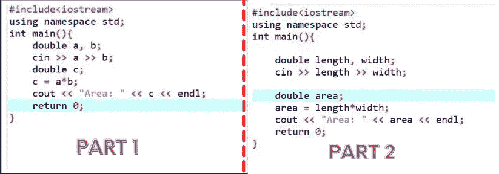
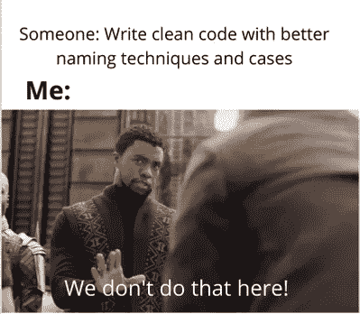
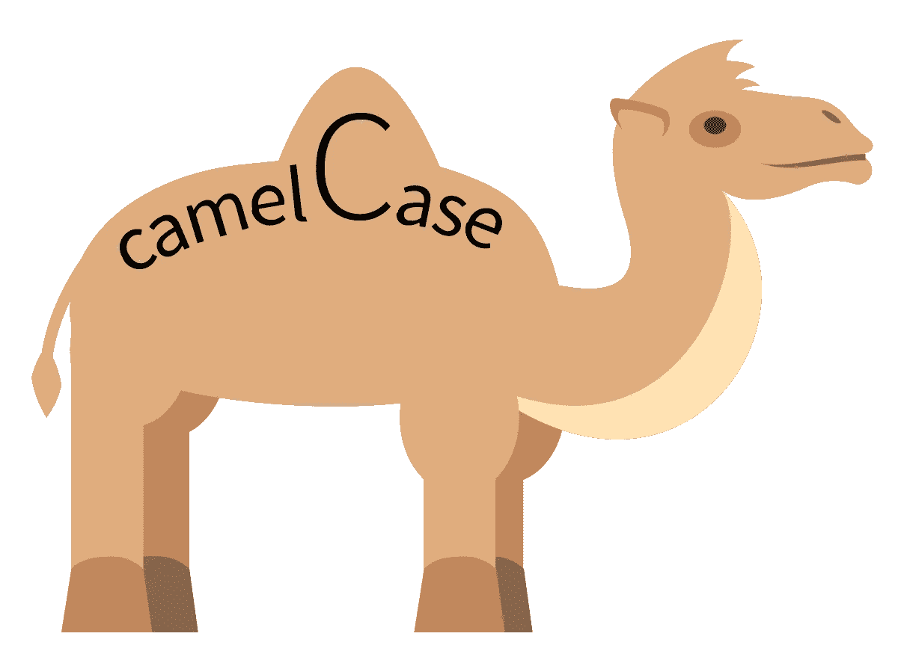

# 命名技术如何帮助你编写可读的代码？

> 原文：<https://medium.com/nerd-for-tech/hows-the-better-naming-can-help-you-in-programming-d19e1ad7246d?source=collection_archive---------11----------------------->

注意编写函数、类和变量的名称如何帮助你编写一个高效、干净和可读的代码？

无论你是编程新手还是专业人士，你都必须知道如何记录和编写干净的代码。

> ***写代码是另外一回事，但是写出干净可读的代码也是另外一回事。***

现在，什么是可读代码？

假设你正在阅读一本书，它的段落没有标题，也没有良好的格式，段落之间没有分隔，而且顺序混乱。*你会有什么感觉？？阅读它的时候会很沮丧。同样的情况也可能发生在您的代码中。你必须像一篇好文章一样写出可读性很高的代码。*

每个人都想写一个干净的代码，但同时我们内心👇😃：

现在让我们来看看编写干净代码的术语。

> **→命名(变量、函数和类等)**
> 
> **→缩进**
> 
> **→注释**

但是在本文中，我们将详细讨论变量、类和函数的命名，因为这本身就是一个巨大的主题。

首先，让我们看一个例子，然后我们将转向命名中的案例。

> 任务:编写一个程序，要求用户输入矩形的宽度和高度，然后将矩形的面积和周长输出到屏幕上。

为了阅读的目的，哪个看起来更清楚？？

另外，这是一个只有 9 行代码的简单程序。如果您的代码有数千行，包含多个函数、类、循环，并且所有这些都有一些命名约定，如 **a** 、 **b** 、 **c** 或其他什么，该怎么办？看起来并不可怕。这些就是思考命名的好处。

现在，在程序中命名时，应该记住以下几点。

> → ***明确*** :

变量名是指一个还是多个 ***披萨*** ？

> → ***具体一点*** :

一个 ***的员工*** 比一个 ***的人*** 强吗？

> **→ *有意义* :**

对于阅读你的代码的其他人来说， ***c*** 有意义吗？还是 ***客户*** 更好？

希望到目前为止你已经做好了一切，在阅读的时候，如何写一个更好的名字可以帮助我们以及其他人。

# **不要害怕:**

> 不要害怕使用更长的名字来提高可读性。好的**文本编辑器**和**ide**都有补全功能，所以较长的名字不会让你变慢，而且现代编程语言和数据库也支持 50 个字符或更多的名字。

现在让我们来看看命名此类事物的案例，开发人员每天使用的最常见的案例如下:

> ***1)骆驼案***
> 
> ***2)蛇案***
> 
> ***3)帕斯卡案***

在开始解释之前，让我们找点乐子提神😃👇

好吧！现在让我们进入最后一项(案例说明):

# ***→骆驼案***

Camel case 通过大写第一个单词后面的所有单词并删除空格来组合单词，如下所示:

**Raw:**

**骆驼案:**

**用途:**这种情况用于命名特定范围内的局部变量和对象，以及用户定义的函数。

# ***→蛇案***

这是一种流行的方式，在许多语言的变量声明中被用作一种约定。Pascal case 通过大写所有单词(甚至是第一个单词)并删除空格来组合单词，如下所示:

**生:** `user login count`

**蛇案:** `user_login_count`

**蛇案(全大写):** `USER_LOGIN_COUNT`

这种风格，当大写时，经常被用作许多语言中声明常量和全局变量的约定。小写时，它通常用于声明字段名(文件处理)。

# →帕斯卡案例

这是一种流行的方式，在许多语言的变量声明中被用作一种约定。Pascal case 通过大写所有单词(甚至是第一个单词)并删除空格来组合单词，如下所示:

**Raw:**

**帕斯卡格:**

**用途:**这个案例用在我们必须声明和使用类的时候。

这就是编程语言中的命名。希望你能得到这一切。当你写代码的时候，尽你最大的努力做这样的练习。

感谢阅读！