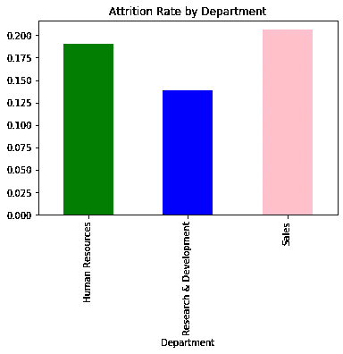
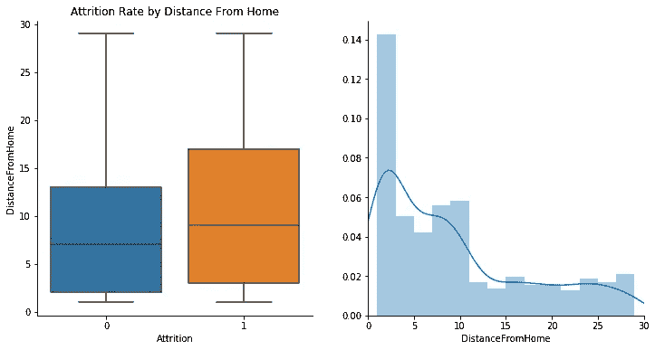
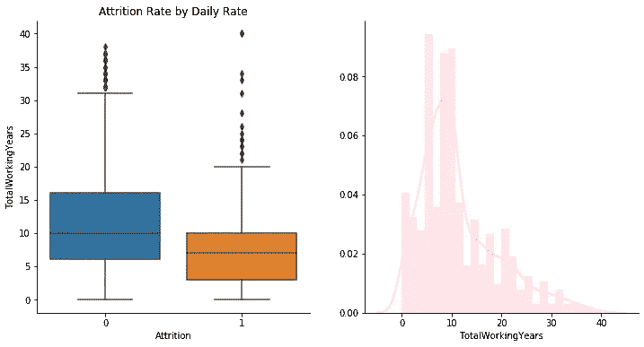
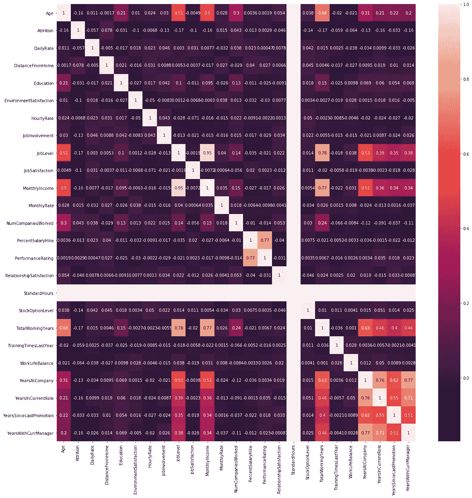
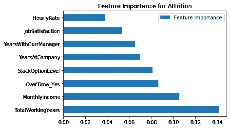

# Python 中的人力资源分析

> 原文：<https://medium.com/nerd-for-tech/hr-analytics-in-python-2a29a4eb3625?source=collection_archive---------5----------------------->

Python 中的损耗分析和预测

# 介绍

在本文中，我们将使用 Python 进行人力资源流失分析。我们将要使用的数据集是一个非常受欢迎的数据集，可以在以下链接中找到:[https://www . ka ggle . com/pavansubhasht/IBM-HR-analytics-attraction-dataset](https://www.kaggle.com/pavansubhasht/ibm-hr-analytics-attrition-dataset)

本练习的目的是识别导致流失的因素，然后使用多种机器学习算法预测员工流失。该数据集有 32 个自变量，范围从任期到离工作场所的距离。像这样的综合数据集需要大量的 EDA 过程，然后才能建立机器学习算法。

任何 EDA 过程中最重要的部分是通过不同的数据可视化程序来识别模式。我们将从计算每个部门的流失率开始。

```
df.groupby('Department').mean()['Attrition'].plot(kind='bar',color=['Green','Blue','Pink'])
plt.title("Attrition Rate by Department")
```



按部门分列的自然减员率

从上面的条形图可以看出，销售部门是公司人员流失率最高的部门。现在让我们来看看影响损耗率的因素。



损耗率/离家的距离

上图表明，与离家较近的员工相比，距离较远的员工流失率更高。



自然减员/工作年限

上图表明，与老员工相比，新员工更有可能离开公司。有很多因素需要考虑，所以让我们向前看，通过创建所有变量之间的关联矩阵来获得一个整体视图。



相关矩阵

相关矩阵并不表明与因变量有任何高度的相关性。然而，它确实为我们提供了所有因素的整体视图。让我们继续构建一个算法

# 特征工程

该算法的第一部分是分离分类和数字特征。下面的代码可用于分离分类特征，并使用虚拟变量。

```
cat_var=['BusinessTravel','Department','EducationField','Gender','JobRole', 'MaritalStatus', 'Over18','OverTime']
X=pd.get_dummies(df,columns=cat_var,drop_first=**True**)num_var=[]
**for** i **in** X.columns:
    **if** X[i].nunique()>3:
        num_var.append(i)
```

# 逻辑回归

逻辑回归是一种非常流行的分类算法，它使用 sigmoid 函数构建 S 曲线来预测结果的概率。它有几个特点，使它适合于大量的分类问题

1.  与其他机器学习算法相比，它更容易训练、实现和高效
2.  与过去的机器学习算法相比，它对变量的假设少得多
3.  它具有相当高的精确度，尤其是在特征数量低于观测数量的情况下

```
lr=LogisticRegression(C=100,max_iter=10000)
lr.fit(X_train,y_train)
y_pred=lr.predict(X_test)
print(accuracy_score(y_test,y_pred))
print(classification_report(y_test,y_pred)
```

根据分类报告，该模型的准确率为 87%,然而其召回率较低，为阳性病例的 43%。逻辑回归模型提供了极好的结果，然而问题的目的是识别可能离开的雇员。这就是召回成为一项非常重要的措施的原因。回忆衡量被正确识别的值的百分比。它通过以下公式计算

**真阳性/(真阳性+假阴性)**

在本例中，我们希望限制误报，因为我们希望识别所有可能离职的员工。在这个例子中，假阴性的成本远远高于假阳性的成本，这就是为什么建立一个可以提高回忆的模型是重要的。

我们现在将构建一个决策树分类器，看看我们是否可以提高模型性能。决策树分类器的优点在于它易于解释，并且不需要其特征的任何特定分布。让我们看看决策树分类器告诉我们什么问题。

```
**from** **sklearn.tree** **import** DecisionTreeClassifier
dc=DecisionTreeClassifier()
dc.fit(X_train,y_train)
dc.predict(X_test)
print(classification_report(y_test,y_pred)
```

在这种情况下，准确率从 87%下降到了 66%,但积极的一面是阳性结果的总召回率提高到了 0.66。这是一个非常好的结果，因为我们的模型现在比以前的模型更有用。使用功能重要性功能，我们可以看到每个功能与流失的关系。



特征对损耗的重要性

从上图可以看出，员工的工作经验和月收入是与流失相关的最大因素。从学习的角度来看，这是很重要的，因为它可以被人力资源部门用来指导未来的政策和决策。

# 助推

现在，我们将应用 boosting 算法，看看我们是否可以进一步改进模型。我们将使用梯度推进分类器来建立一个机器学习算法，以查看模型的性能可以提高到什么程度。

**from****sk learn . ensemble****import**GradientBoostingClassifier gbc = AdaBoostClassifier(n _ estimators = 100)gbc . fit(X _ test，y _ test)y_pred = gbc . predict(X _ test)print(classification _ report(y _ test，y _ pred))

结果有了很大的改善。准确率现在是 98%，阳性结果的召回率是 88%。该示例展示了使用 boosting 算法的强大功能，以及它们如何提高整体模型性能。

在本文中，我们看到了如何使用数据科学来识别模式和预测未来。数据驱动的组织可以利用这些数据来改善决策和组织绩效