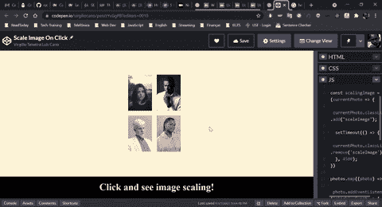

# HTML、CSS、JavaScript:缩放图像 onclick/addEventListener

> 原文：<https://medium.com/nerd-for-tech/html-css-javascript-scale-images-onclick-addeventlistener-a9c091b7cfee?source=collection_archive---------3----------------------->

## 一步一步地轻松“transform:scale()；”带有 JavaScript 的图片。

作者拍摄的 GIF 图片

HTML、CSS 和 JavaScript 的结合让我们可以做很酷的东西，比如网站和应用程序上的动画和效果，并让它更具交互性，导航起来更舒适。下面，我分享缩放图像的步骤。希望这种方法能帮助到每一个努力掌握它的人。

## 1.编写 HTML 代码标签

是的，很明显…这里你将从标签中获取图像，最好放在

标签中。

注意:图像源可以是本地的。/img/your-image.png ")或 out there(" https://your-address/your-image . png ")。

## 2.将 CSS 付诸实践

一个小风格，让图像对齐，很好的形象化。

注意:如果你在本地计算机上做，不要忘记调用“*”。HTML 文件中的 css* 文件。

## 3.用 JavaScript 实现点击魔术

正如你在中注意到的，标签有一个 id 属性，我们通过它获取 JavaScript 文件中的所有图像。接收这些图像的变量被转换为一个数组，并使用 [* map *](https://developer.mozilla.org/en-US/docs/Web/JavaScript/Reference/Global_Objects/Array/map) 方法捕获每个图像，这允许我们获取特定图像中的事件(点击)。

注意-1:注意 setTimeout，在缩放图像的函数中使用它是很重要的，因为你必须删除从 CSS 文件中添加的类，这种删除使得你可以多次点击图像，最后定义一个时间来删除它。提示:如果你的动画长度是 5 秒，用 4.5(4500 毫秒)定义移除。

注意-2:如果你在本地计算机上做，不要忘记调用“*”。HTML 文件中的 js* 文件。

## 查看我的[代码盘](https://codepen.io/virgiliocano)

感谢阅读。希望对你有帮助。干杯！

> 决定永远不要闲着。从不浪费时间的人没有理由抱怨时间不够用。如果我们一直在做，那么能做多少事情是很棒的。——托马斯·杰斐逊