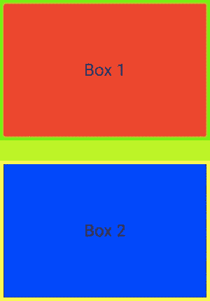
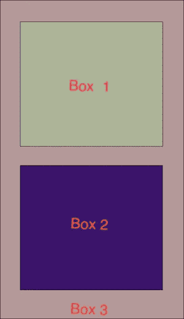
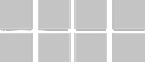
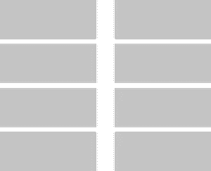
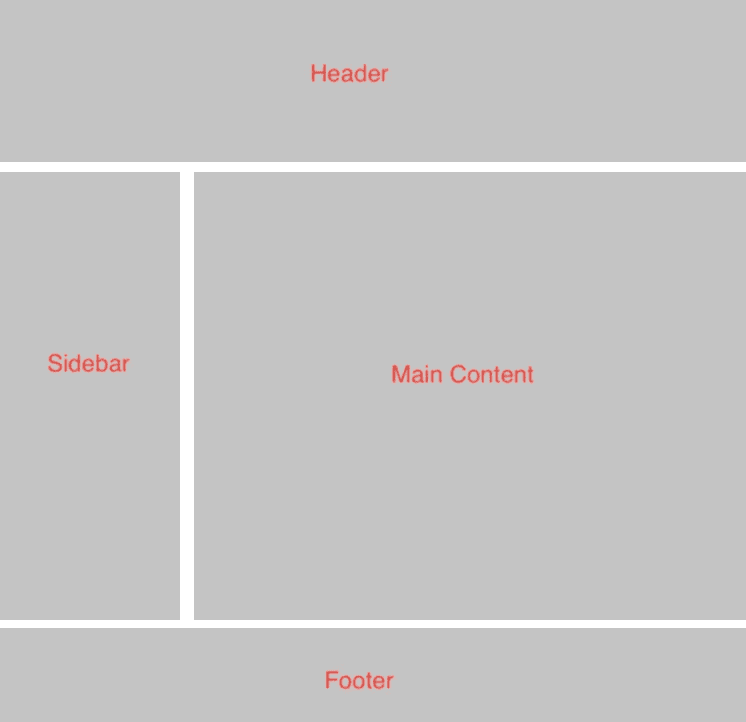
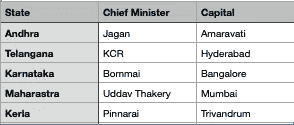
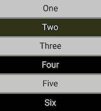
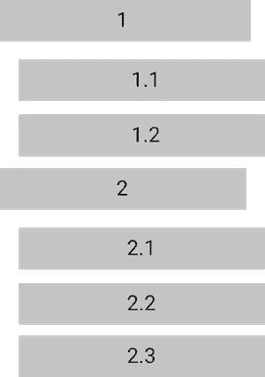

# HTML 练习 1

> 原文：<https://medium.com/nerd-for-tech/html-exercises-ac734853cf5f?source=collection_archive---------0----------------------->

这些是从编码开始的基本 HTML 练习。可以用 [https://codepen.io](https://codepen.io) 网站来练习这些例子。如果你被打动了，就用谷歌搜索一下。

# 1.创建盒子

*   如下图所示，依次创建两个盒子
*   在 html 中创建两个 div 元素
*   向每个 div 元素添加一个类
*   这些类可以用来设计 div 元素的样式

盒子的视觉表现

框 1 具有以下样式属性。

1.  *200 px 的高度*
2.  *300 像素的宽度*
3.  *背景色红色*
4.  *边框宽度为 5px*
5.  *边框颜色绿色*
6.  *在框内添加文本，并将其放在两边的中央*

框 2 具有与框 1 相似的属性，但有一些变化

1.  *背景色蓝色*
2.  *边框颜色黄色*

# 2.创建嵌套框

创建两个 div 并将其放在另一个 div 中。嵌套 div 有助于组织元素并对它们进行分组。

嵌套框

## 方框 3

1.  宽度:358px
2.  高度:620px
3.  背景:# B49999
4.  边框:1px solid # 000000

## 方框 1

1.  宽度:278px
2.  身高:243px
3.  背景:# ADB499
4.  边框:1px solid # 000000

## 方框 2

1.  宽度:278px
2.  身高:243px
3.  背景:# ADB499
4.  边框:1px solid # 000000

# 3.响应式盒子

根据以下规则创建响应式 8 框。你可以考虑使用 CSS flex 和 grid 来实现这一点。响应框根据屏幕的宽度和高度自动排列其宽度和高度。

## 桌面

1.  *设备宽度大于 1024 px*
2.  *每行 4 个盒子*
3.  *每个框之间的边距*
4.  *共 8 箱*

桌面大小

## *平板电脑*

*   *连续两盒*
*   *设备宽度 768px — 1024px*
*   *方框之间的边距*

药片

## *移动*

*   *每行 1 个盒子*
*   *器件宽度范围 360px — 640px*
*   *框间边距*

移动的

> *使用浏览器中的移动模拟器在不同设备中进行测试*

# 在布局下方实现，

布局必须填写页面的高度。有页眉、侧边栏、主要内容和页脚。

这是本练习的概念模板。

[https://quill-walk-152 . opinion . site/HTML-Exercises-53 BF 3a 8 f 242 a 46919 b 59 BDC 530601103](https://quill-walk-152.notion.site/HTML-Exercises-53bf3a8f242a46919b59bdc530601103)。

这将有助于创建任务列表。

# HTML 练习 2

## 1.表格创建

创建具有以下样式的表格。使用表格标签。

样本表

## 2.创建链接

创建到[google.com](https://www.google.com/)和
1 的链接。*点击同一页面中的链接
2。点击链接，它应该在一个新的页面打开它*

## 3.创建列表

*   使用 ul 和 li 标签创建项目列表。
*   背景的可选颜色。
*   每个项目之间有空间。

可选颜色列表

## 4.嵌套列表

*   *创建了嵌套列表*
*   *使用 ul 和 li 标签*
*   *将 ul 放入 li 标签中得到嵌套列表*

嵌套列表