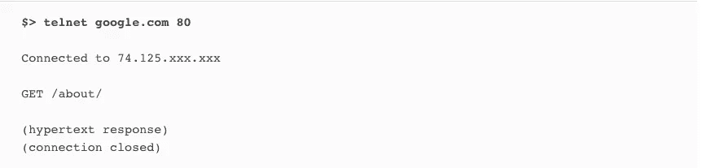
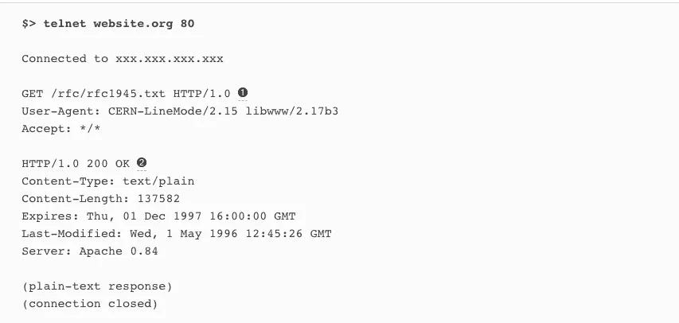
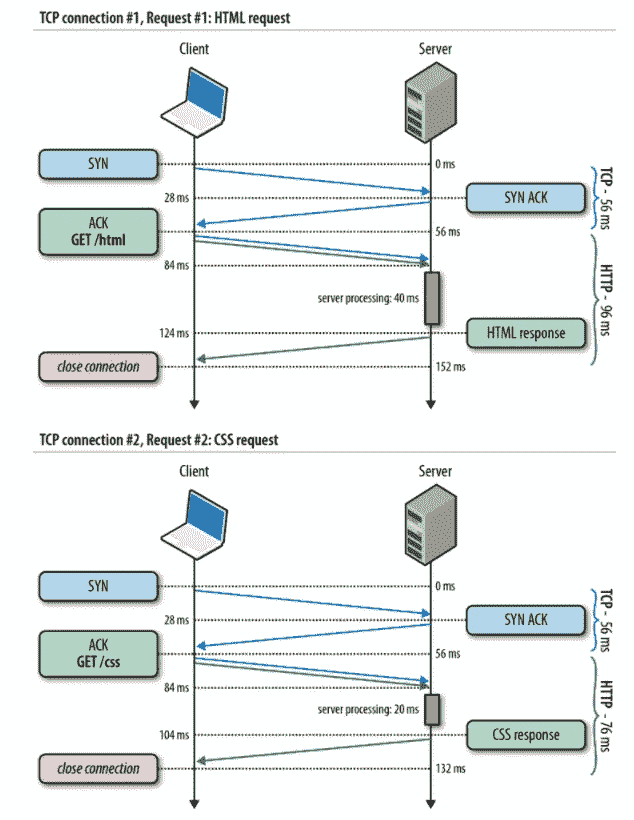
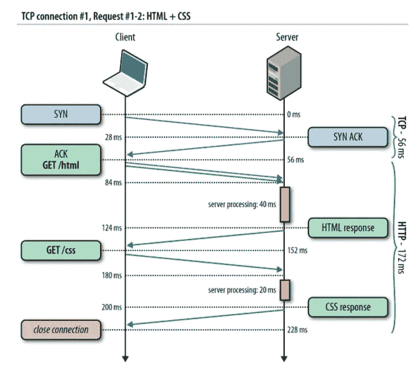
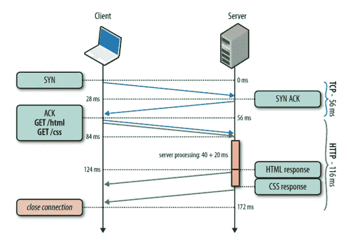
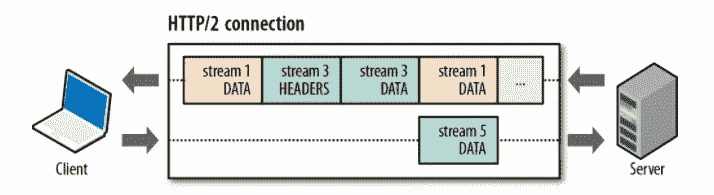
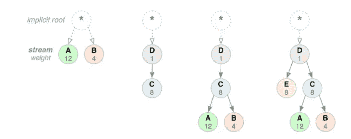
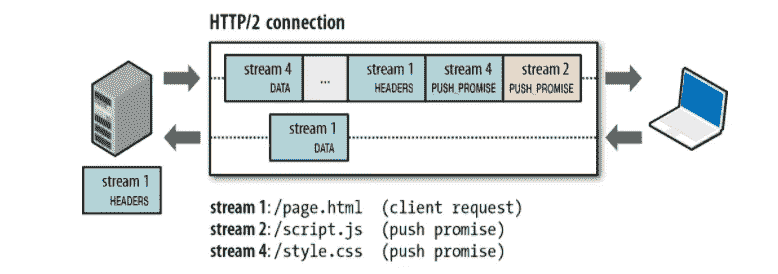

# HTTP 1 vs HTTP 2

> 原文：<https://medium.com/nerd-for-tech/http-1-vs-http-2-e40e0aa48cf1?source=collection_archive---------9----------------------->

如何提高 web 服务的性能？

**在我开始之前……**

最近，我和我的团队一直在以超级 scrum 模式工作，创建一个内部服务，基本上收集安全工程师提供的数据或分析。因为速度是这个项目中的一个关键因素，我们选择了速度更高的技术堆栈，这导致团队中的开发人员更熟悉技术堆栈，同时牺牲了工程观点。幸好(？)，我很快就能看到一些关键问题，其中之一就是性能。本地和开发服务器的速度差异很大，我们采取了几种方法。其中之一是将请求协议 HTTP1 改为 HTTP2，我想深入探讨一下为什么 HTTP2 是我们更好的选择？

**历史……**

蒂姆·伯纳斯·李最初提出的 HTTP 提案在设计时就考虑到了简单性，以便有助于万维网的采用。该请求包含一行:GET 方法和所请求文档的路径。响应是一个单一的超文本文档——没有标题或任何其他元数据，只有 HTML。

HTTP 0.9 图

很快，新生的 Web 和公共 Web 上的用例所期望的功能越来越多，这很快暴露了 HTTP 0.9 的基本局限性。我们只是需要一种协议，它不仅仅服务于超文本文档，还能提供关于请求和响应的更丰富的元数据，支持内容协商等等。HTTP/1.0 就是由于这样的原因而诞生的。

HTTP 1.0 图

如上所述，请求由多个换行符分隔的头字段组成，响应对象以响应状态行为前缀。响应对象不限于超文本，最后，服务器和客户端之间的连接在每次请求后关闭。然而，6 个月后，HTTP/1.1 解决了 HTTP/1.0 中发现的许多歧义，导致了关键的性能优化:保持活动连接、分块编码传输、字节范围请求、附加缓存机制、传输编码和请求流水线。因此，让我们回顾一下 HTTP 1.1 在性能方面的重要改进。

**HTTP 1.1…**

*   保持活动连接

每个 TCP 连接都以 TCP 三次握手开始，这需要客户端和服务器之间一次完整的往返延迟。接下来，由于 HTTP 请求和响应的双向传播延迟，我们将产生另一个最小的往返延迟。最后，我们必须加上服务器处理时间，以获得每个请求的总时间。

2 个 TCP 连接

在这种情况下，简单的优化就是重用底层连接！接下来是 HTTP keepalive，它允许我们消除第二次 TCP 三次握手，避免另一轮 TCP 慢启动，并节省整个往返网络延迟。

Keepalive HTTP1.1 请求的 TCP 连接

简单？事实上，我们能够通过 TCP 的一次握手来减少延迟，并想象一下多个请求的逻辑？这就是 keepalive 连接的力量。

*   HTTP 管道

在前面的图中，我们看到了 keepalive 连接如何为我们带来好处，因为它没有 TCP 连接的三次握手。如果服务器端不等待下一个请求进来怎么办？而是马上处理下一个请求？通过尽早调度我们的请求，而不阻塞每个单独的响应，我们可以消除另一个完整的网络往返延迟，使我们从没有连接保持活动的每个请求的两个往返，减少到整个请求队列的两个网络往返延迟开销。

HTTP 管道

*   多个 TCP 连接

在 HTTP/1.1 缺乏多路复用的情况下，浏览器可以天真地将所有 HTTP 请求在客户机上排队，通过一个单一的持久连接一个接一个地发送。这太慢了，因此，浏览器供应商别无选择，只能并行打开多个 TCP 会话。实际上，大多数现代浏览器，包括桌面和移动浏览器，每台主机最多可以打开六个连接。因此，拥有六个 tcp 连接可以让我们的请求速度比以前利用多个 TCP 连接快几倍。

*   域分片

虽然浏览器处理最多提供六个连接的连接管理，但是这些流对于应用程序来说仍然不够。根据 HTTP archive，现在平均一个页面由 90 多个单独的资源组成，如果全部由同一台主机交付，仍然会导致显著的排队延迟。因此，为什么要把我们自己局限于同一个宿主呢？我们可以跨多个子域手动共享资源，而不是从同一个源提供所有资源。

当然是有平衡的。每一个新的主机名都需要额外的 DNS 查找，为每个额外的套接字消耗两端的额外资源，并且需要站点作者手动管理在哪里以及如何分割资源。

**HTTP2…**

HTTP/2 的主要目标是通过启用完整的请求和响应多路复用来减少延迟，通过有效压缩 HTTP 头字段来最小化协议开销，以及添加对请求优先级和服务器推送的支持。HTTP/2 不以任何方式修改 HTTP 的应用程序语义。相反，它修改了数据在客户机和服务器之间的格式化和传输方式，客户机和服务器都管理整个过程，并在新的帧层中隐藏了应用程序的所有复杂性。因此，所有现有的应用程序无需修改即可交付。因此，没有进一步的讨论，让我们更深入地研究 HTTP 2…

*   多路技术

HTTP/2 中新的二进制成帧层通过允许客户机和服务器将 HTTP 消息分解成独立的帧，交错它们，然后在另一端重新组合它们，实现了完全的请求和响应多路复用。

多路技术

将 HTTP 消息分解成独立的帧，然后在另一端重新组合的能力是 HTTP/2 最重要的增强。事实上，它在所有 web 技术的整个堆栈中引入了众多性能优势的连锁反应。

*   流优先级

一旦 HTTP 消息可以被分割成许多单独的帧，并且我们允许来自多个流的帧被多路复用，则客户端和服务器交错和传送帧的顺序就成为关键的性能考虑因素。为了促进这一点，HTTP/2 标准允许每个流具有相关的权重和依赖性。

流优先级

流依赖性和权重的组合允许客户端构建和传送优先级排序树，该树表达了它将如何偏好接收响应。反过来，服务器可以使用此信息通过控制 CPU、内存和其他资源的分配来确定流处理的优先级，并且一旦响应数据可用，就分配带宽以确保向客户端最佳地传送高优先级响应。

*   每个原点一个连接

现在新的二进制成帧机制已经到位，HTTP/2 不再需要多个 TCP 连接来并行复用流。因此，HTTP/2 连接是持久的，每个源只需要一个连接，这减少了大量 dns 查找和多个 TCP 连接失败的缺点。

*   发球推球

除了对原始请求的响应之外，服务器还可以将额外的资源推送到客户端，而客户端不必显式地请求每一个资源。

服务器推送

**结论……**

提高 web 服务性能的第一步可能是检查 network 选项卡。尤其是当该服务正在传输大量文件(如图像，甚至视频)时。幸运的是，这一次，我没有实现 kafka 或任何其他服务器，而是通过切换到 HTTP2 减少了大量的网络延迟，因为以前，每个请求都要创建一个连接，但现在有了 HTTP2 特性的所有性能优势，项目在 dev server 上的运行比以前流畅得多，我对此很满意。我会贴出更多为了提供更好的服务所做的事情！