# HTTP 请求走私:第 1 部分(概念)

> 原文：<https://medium.com/nerd-for-tech/http-request-smuggling-part-1-concepts-b89bfe17b210?source=collection_archive---------1----------------------->

简而言之:对于笔测试者

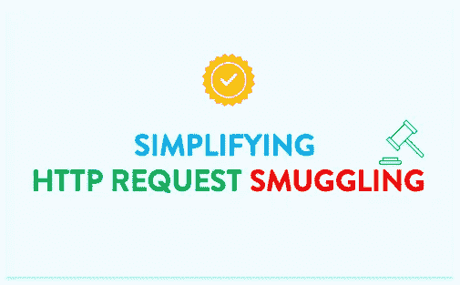

这是一个关于 HTTP 请求走私的两部分博客。第 1 部分侧重于理解基本概念，第 2 部分侧重于识别和利用 HTTP 请求走私。我们开始吧。

# 语境

当安全研究员詹姆斯·凯特尔(James Kettle)在 2019 年发现利用该漏洞的有趣方法时，HTTP 请求走私漏洞这个老计时器重新浮出水面。当我最初读他的论文时，我个人觉得很难，我决定一步一步来。经过一些研究后，我意识到，这需要的只是对一些 HTTP 概念的理解。这个博客尽可能简化 HTTP 请求走私及其概念。我们走吧。

# 客户端服务器架构

在我们深入研究请求走私及其概念之前，让我们看看我们一直以来是如何想象客户机-服务器架构的:

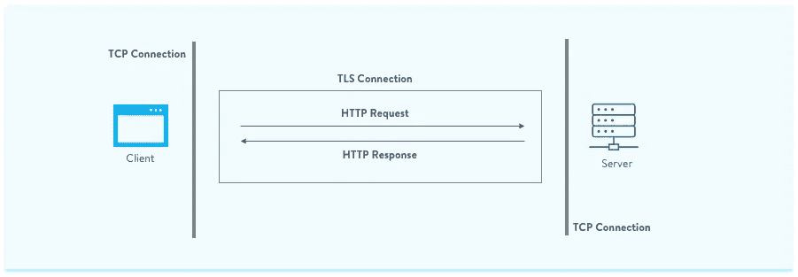

客户端服务器架构

有一个客户端和一个服务器，首先建立一个 TCP 连接，然后是一个 TLS，然后你发送一个 HTTP 请求，你从服务器得到一个 HTTP 响应。这有问题吗，有什么变化吗？嗯，没什么太大的不同，除了架构是实时多层的。

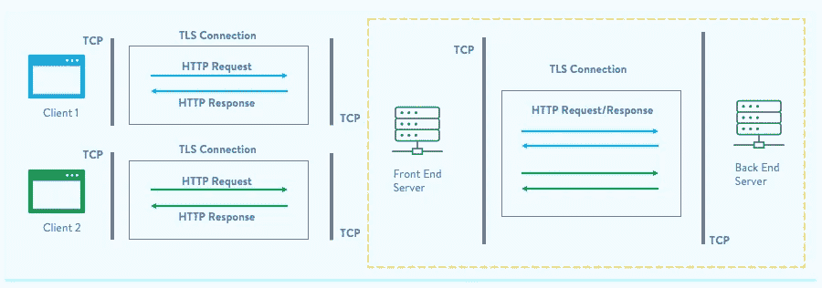

客户端服务器架构(多层)

有两个服务器，前端和后端。前端服务器通常是反向代理或负载平衡器。还在前端服务器和后端服务器之间建立了新的 TCP、TLS 连接，以交换 HTTP 请求。

现在，您是否发现后端服务器交换 HTTP 请求有什么可疑之处？好吧，在我们继续理解一些 HTTP 概念的时候，请继续思考。

# HTTP 和 TCP(持续连接)

OSI 层，TCP/IP，已经有一段时间了，不是吗？现在，让我们后退一步，接触一下我们的网络基础知识。HTTP 是应用层协议，TCP 是传输层协议。HTTP 不可靠，这意味着它不能处理数据丢失，而 TCP 是可靠的。因此，每当必须建立可靠的 HTTP 连接时，HTTP 将依赖于 TCP。现在，这是否意味着您需要为每个 HTTP 请求建立一个单独的 TCP 连接？嗯，事情就是这样开始的。

**默认情况下，HTTP/1.0** 会为每个 HTTP 请求打开一个 TCP 连接。

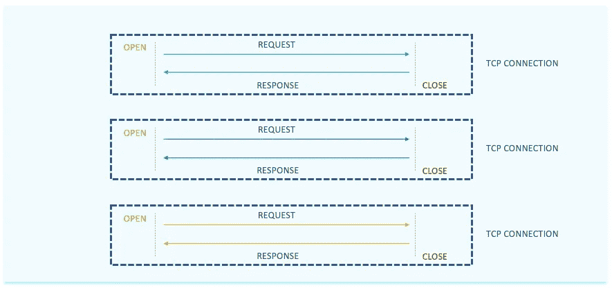

HTTP/1.0(默认)

如果您在请求中添加了**连接:keep-alive** ，可以手动更改这种行为，TCP 连接将保持打开，或者您所说的持久化，HTTP 请求可以一个接一个地发送。

在 **HTTP/1.1 中，**默认情况下，一个 TCP 连接是持久的，在同一个连接下可以发送多个 HTTP 请求。

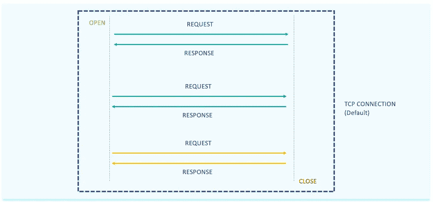

HTTP/1.1(默认保持活动状态)

或者， **Connection: close** header 可用于在收到完整响应或超时后关闭连接。

# 内容长度和传输编码(找到请求的结尾)

好了，现在我们知道 HTTP/1.1 允许在一个 TCP 连接下有多个 HTTP 请求。让我们暂停一下，再次看看我们的多层客户机服务器架构，尤其是后端。


又是大局

好像是在 HTTP 1.1 上，为什么？在同一个 TCP 连接上发送多个 HTTP 请求，答对了！转到下一个奇怪的问题，后端服务器如何区分这些 HTTP 请求？如果每个请求都有一个单独的 TCP 连接，那肯定会容易得多，对吗？

让我们从 GET 请求开始。

```
GET https://abcdefsecurity.com/api/search **HTTP/1.1**
**Host**: abcdefsecurity.com
**Accept-Encoding**: gzip, deflate
**Accept-Language**: en-GB,en-US;q=0.9,en;q=0.8
```

GET 有 URL 和头。URL 有一个表示结束的 HTTP/version-number，标准的头和值被服务器理解，而那些服务器不理解的，它简单地拒绝，所以头的结束标志着 GET 请求的结束。得到请求似乎不是什么大问题，不是吗。

帖子请求怎么样？POST 主体可能因应用程序和框架的不同而不同。这就是下面的 HTTP 头派上用场的地方。

*   内容长度
*   传输编码:分块

> 注意-上述头适用于 HTTP/1.1，部分适用于 HTTP/1.0，但不适用于 HTTP/2。

# 内容长度

此头计算文章正文的内容长度，包括 CRLF (\r\n)字符。在下面的例子中，文章主体“search=http”的总字符数是 Content-Length 的值，即 11。

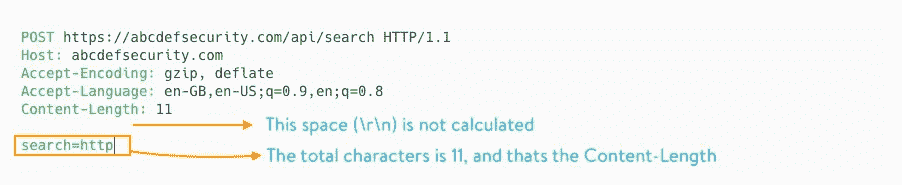

内容长度格式—示例 1

考虑下面的例子，文章正文下面有一个额外的空行，在这种情况下，新行字符' \r\n '被计算为两个额外的字符，因此内容长度是 13。

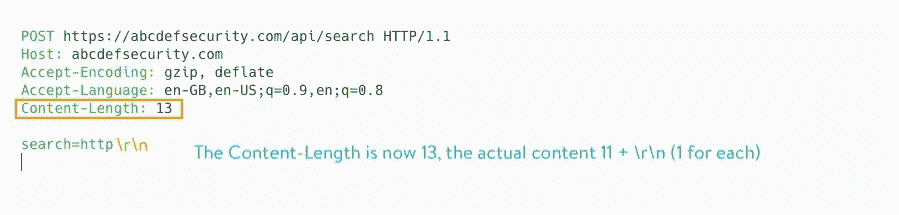

内容长度格式—示例 2

# 传输编码:分块(TE)

或者，在您想要上传数据块的文件上传期间使用 Transfer-Encoding 头。除了头部之外，它还希望主体采用特定的格式。

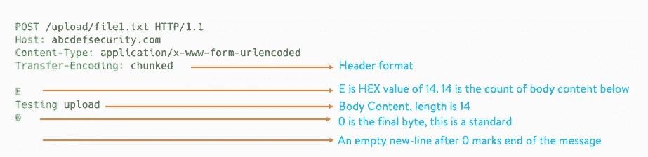

传输编码:分块格式

“测试上传”是块内容，其长度为 14。e 是 14 的十六进制值，在“0”之后有一行标记消息的结束。可以有多个这样的块。

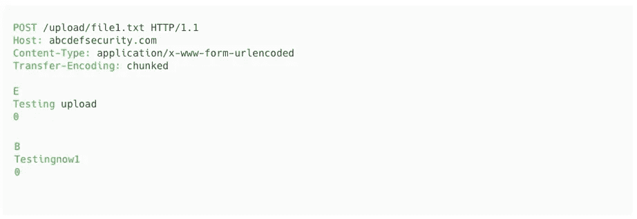

传输编码:分块格式

> 注意——HTTP 1.1 允许您在同一个请求中发送 Content-Length 和 Transfer-Encoding 头，但是当两者都发送时，Transfer-Encoding 优先。

# 什么是 HTTP 请求走私？

让我们把这一切放在一张图片中——我们在 HTTP/1.1 中已经了解到，单个 TCP 连接是持久的，多个 HTTP 请求可以在同一连接下发送，后端服务器可以根据内容长度(CL)和传输编码(te)头来区分这些请求。现在你可以看到每个服务器都有一种方法来识别请求的结束。

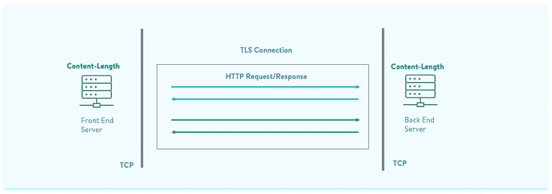

两台服务器都使用内容长度

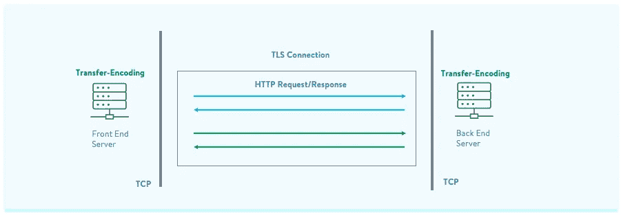

两台服务器都使用传输编码

它的画面很完美，两个服务器要么使用内容长度，要么使用传输编码来标记请求的结束。等等，我们是笔测试者，我们想要不完美的东西，我们很好奇，那么如果出现混淆，一个服务器接受 CL，另一个接受 TE，或者相反，会发生什么呢？


混合标题

这正是 HTTP 请求走私的攻击场景，现在暂停一下，想想如果有这样的场景，你会怎么做。

美国东南部。

现在，作为一名 pen-tester，希望在请求中一起发送两个报头，并查看服务器如何处理它们，检查所有可能的组合:

*   当两个报头都被发送时，前端服务器拒绝该请求(预期行为和安全)
*   当两个报头都被发送时，TE 在它必须优先的地方优先，而另一个服务器拒绝它(安全)

我们能想到哪些不安全的选择？

*   **(CL，TE)** -前端服务器忽略 TE，将其作为 CL 处理，请求发送到后端，将其作为 TE 处理
*   **(TE，CL) -** 前端服务器忽略 CL 并将其作为 TE 处理，请求到达后端并作为 CL 处理
*   **(TE，TE) -** 前端服务器和后端服务器都接受 TE，但其中一个服务器无法处理

但是对于上面的场景，发送两个报头的标准方式不起作用，因为如果我们发送两个报头，要么 TE 优先，要么请求会被拒绝，因为大多数系统都是这样设计的。我们将需要发送两个标头，但是在某种程度上，前端服务器会错过其中一个标头，这听起来很有趣，对吗？这就是 James Kettle 进行研究的地方，他提出了传输编码报头上的多个有效载荷，当发送时，会使前端服务器无法处理报头。

```
**PAYLOADS** Transfer-Encoding : chunkedTransfer-Encoding: xchunkedTransfer-Encoding : chunkedTransfer-Encoding: chunked
Transfer-Encoding: xand many more
```

这些有效载荷之间的差异是微小而微妙的，让我们以第一个为例，在标题前面只有一个空格，真棒吧:)

现在，百万美元的问题，我们该怎么办，什么是 HTTP 请求走私？

为了更好地理解，让我们选择更简单的方法，记住在传输编码中，我们如何在同一个请求中发送多个数据块，如果我们实际上将另一个 HTTP 请求作为一个数据块发送，如下所示，但没有按预期关闭数据块，会怎么样呢:

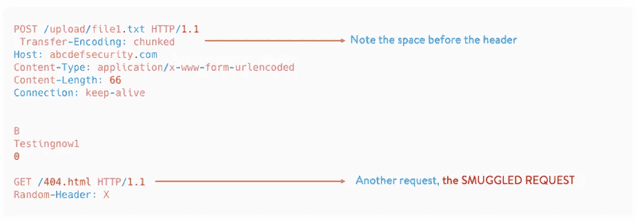

使用 CE 走私请求。元素铊的符号

现在，当我们发送这个请求时，队列会发生什么情况。

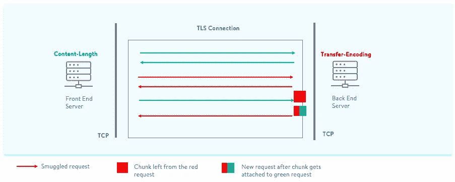

创建了未处理的区块数据并附加到用户绿色请求

*   在用户蓝色和绿色的请求中，用户红色发送了一个恶意的请求请求，如上图-'请求走私有效载荷'。该请求的末尾还有一个额外的/404.html 请求。但是请注意，这个块没有用 0 和新的一行正确地结束。
*   前端服务器计算内容长度，由于“空格”的原因，它忽略了传输编码头。所以，根据前端服务器它的一个请求，但它的实际上两个 ***/404.html 请求被偷运到这里的队列中:)***
*   后端服务器现在拾取传输编码报头，处理第一个块，并且当它移动到下一个块时，它读取该块，但是因为它没有“0”并且在 wards 之后没有新的行，所以该块未被处理并且被附加到下一个传入的请求。

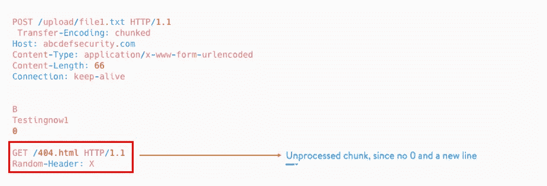

走私请求(红色)

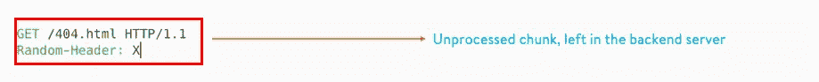

后端服务器中剩余的未处理块

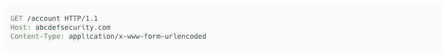

下一个即将到来的绿色请求(红色之后的下一个请求)

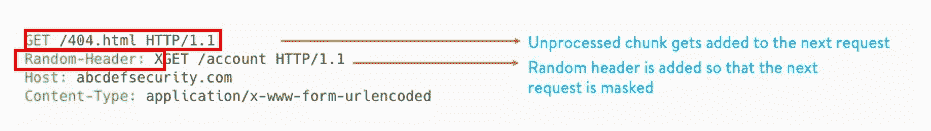

未处理的块被添加到绿色请求

Random-Header 屏蔽了新请求的路径。现在，当用户实际请求/account 时，用户 green 将收到/404.html。

> 由于它还对队列进行了去同步，而在理想情况下，响应是按照接收顺序提供的，但现在却没有，所以它也被称为 HTTP 去同步攻击。

你现在可以阅读我的博客[第二部分](/nerd-for-tech/http-request-smuggling-part-2-tl-ce-exploit-ec1171a88459)来识别和利用 HTTP 请求走私！

我希望你喜欢看这个博客:)如果你喜欢的话，请发来。日安！

参考资料:

*   [https://ports wigger . net/research/http-desync-attacks-request-走私-重生](https://portswigger.net/research/http-desync-attacks-request-smuggling-reborn)
*   [https://portswigger.net/web-security/request-smuggling](https://portswigger.net/web-security/request-smuggling)