# HTTP 请求走私:第 2 部分(识别和利用)

> 原文：<https://medium.com/nerd-for-tech/http-request-smuggling-part-2-tl-ce-exploit-ec1171a88459?source=collection_archive---------0----------------------->

简而言之:对于笔测试者

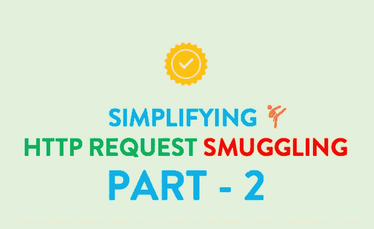

如果你是那些免费去太空旅行并直接回到这里的成员之一，建议你先看看 [Part-1 【T1:)](/nerd-for-tech/http-request-smuggling-part-1-concepts-b89bfe17b210)

当安全研究员詹姆斯·凯特尔(James Kettle)在 2019 年发现利用该漏洞的有趣方法时，HTTP 请求走私漏洞这个老计时器重新浮出水面。这是为了简化白皮书第 2 部分。

# 语境

假设您已经阅读了[第 1 部分](/nerd-for-tech/http-request-smuggling-part-1-concepts-b89bfe17b210)，现在我们已经清楚了基本概念，让我们来看看如何识别和利用 HTTP 请求走私的不同组合。但在此之前，让我们先解决房间里的大象。

# 向房间里的大象致辞

> "根据 HTTP/1.1 标准，如果同时传递了内容长度和传输编码头，则传输编码优先."

当然，显而易见的意思是，如果传递了两个头，传输编码优先，但是服务器必须能够在任何给定的时间处理这两个头。让我们看一个例子:


理想场景

*   用户 blue 发送了一个只有内容长度头的理想请求，前端处理 CL，后端也处理 CL，响应得到了满意的服务
*   类似地，用户 green 发送一个只有 Transfer-Encoding 报头的理想请求，前端处理 TE，后端也处理 TE，响应被愉快地服务

相反，让我们把我们的请求分成两部分:

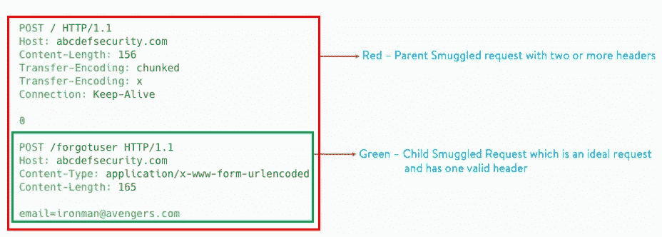

父母和孩子走私请求

*   **父走私请求**——这个请求有两个报头来欺骗服务器
*   **子走私请求** -隐藏在父走私请求中的理想请求，为什么理想？因为它只有一个头

那么，我们正在讨论的这个房间里的大象到底是什么呢？前端服务器处理 C1 并将整个请求转发给后端服务器。

> 当上述请求到达后端服务器时，父走私请求用传输编码头进行处理，当未处理的块(也称为我们的子走私请求)被忽略时，当下一个用户的请求被添加到其中时，子走私请求现在用内容长度头进行处理，这意味着服务器(具体地说，在这种情况下是后端服务器)能够在任何给定时间处理 CL 和 TE，这是房间中的大象:)


后端处理 TE 和 CL

很棒吧？是的，如果你很好地理解了这一点，HTTP 请求走私就像小菜一碟。

# 识别组合 CL。TE 还是 TE。化学发光

在 [Part-1](/nerd-for-tech/http-request-smuggling-part-1-concepts-b89bfe17b210) 之后，我得到了几个问题，主要是，我如何识别前端是 CE，后端是 TL，或者相反。好问题。这就是为什么我想先解决房间里的大象，也就是说，如果一次发送一个头，服务器能够处理两个头。

那么 CL 是什么呢？TE 还是 TE。那 CL 呢？它是我们的有效负载，或者更具体地说是我们有效负载的结果，有效负载欺骗一个服务器处理内容长度，另一个服务器处理传输编码，反之亦然。让我们以这样一个有效载荷为例进行分析，注意，在 Transfer-Encoding 前面有一个空格:

```
Content-Length: 10
 Transfer-Encoding : chunked
```

> 理解这一点也很重要，HTTP/1.1 只是一个标准，服务器实现它，这也意味着每个服务器都有自己的相同标准的实现。

上述有效载荷导致 CL。TE:

*   即使传递了两个头，前端服务器也只处理内容长度，为什么？服务器有一个不处理前面有空格的头的验证，所以它认为传输编码头是无效的，很容易选择内容长度
*   后端服务器在逆向处理传输编码，为什么？可能服务器没有对头前面的空格进行验证，这意味着它接受空格和传输编码头，所以它找到了这两个头，并且根据 HTTP/1.1 标准，传输编码优先

坦率地说，这只是一个有效载荷，还有许多这样的有效载荷来混淆服务器并得到一个组合。

综上所述，为了识别请求走私及其组合，我们需要尝试所有可用的有效负载，看看哪一个有效。但是请记住，这需要在不中断应用程序的情况下安全地完成。

> [HTTP Request smugger](https://portswigger.net/bappstore/aaaa60ef945341e8a450217a54a11646)burp 扩展在尝试所有可能的有效负载方面做得非常好，如果发现了组合，它会提醒您。它还使用基于超时的机制安全地识别漏洞。

# 知道何时捕获队列

此漏洞不同于传统的漏洞，在传统的漏洞中，您发送一个带有有效负载的 HTTP 请求，并根据即时响应来确认漏洞的存在。请记住，您正在一个 TCP 连接中处理多个 HTTP 请求。

当您试图识别/利用 HTTP 请求走私时，有两种可能的情况:

*   ***其他人得到响应*** -您希望其他人得到我们发送的走私请求的响应。例如，当我们试图取消队列同步时。我们该怎么做？很简单，只需发送 parent-straighted(红色)请求，等待队列去同步，其他人(绿色)得到意外的响应

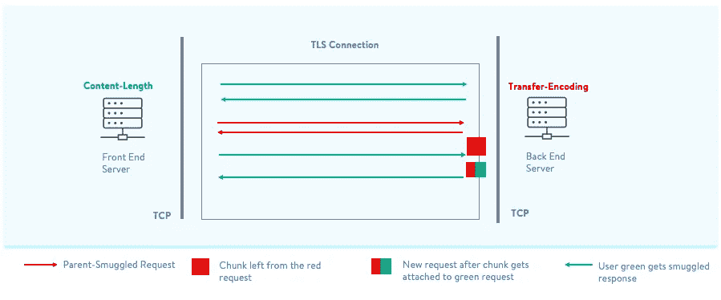

其他人得到了回应

*   ***你想要回复***——大多数时候，别人得到回复并不会帮助我们。这是因为当我们试图识别/利用漏洞时，作为一种证明，我们将需要反馈给我们自己的响应。那么，我们该怎么做呢？嗯，我们自己也变成了用户绿色，这意味着我们需要连续/并发地发送多个 HTTP 请求，并且**捕获队列**，以便增加获得响应的机会。红色也是我们的要求，深红色也是我们的要求。

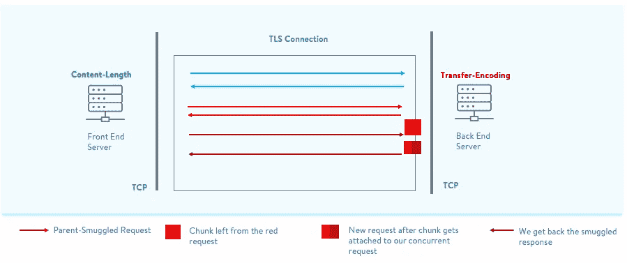

我们得到回应

> 在 Burp 中，您可以使用中继器发送多个请求并观察响应的差异，也可以使用[Turbo intrusor](https://portswigger.net/bappstore/9abaa233088242e8be252cd4ff534988)发送并发请求。在 ZAP 中，您可以使用 Fuzz 并在选项中配置并发扫描线程。

# 利用 CL。特- (SSRF)

好了，让我们进入实际的故事，在[第 1 部分](/nerd-for-tech/http-request-smuggling-part-1-concepts-b89bfe17b210)中，我们看到了如何使用 CL 去同步一个队列。TE 组合，并使用户收到用户不想收到的响应。让我们更进一步，看看我们如何利用 CL。发动对 SSRF 的攻击。

网络、应用程序的配置总是以易用性为优先，而不是安全性。您会发现某些应用程序的设计方式是这样的，一旦您通过前端服务器，您就可以访问有限的一组内部应用程序或几乎所有的应用程序，请记住，只有当您在组织的网络内部时，才能访问这些应用程序。

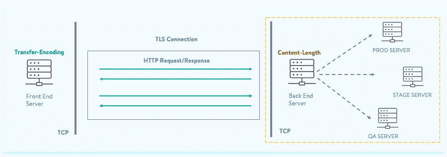

后端服务器作为代理

在上面的例子中，后端服务器是一个代理。它根据主机标头等标头将从前端收到的请求转发到不同的服务器。那么，如果我们发送下面的请求，在主机头中带有“stg”环境值，会发生什么呢？

```
POST https://abcdefsecurity.com/ HTTP/1.1
Host: **stg.abcdefsecurity.com**
```

前端服务器将拒绝该请求，因为主机头值是一个临时环境，它不允许您访问其内部网络。

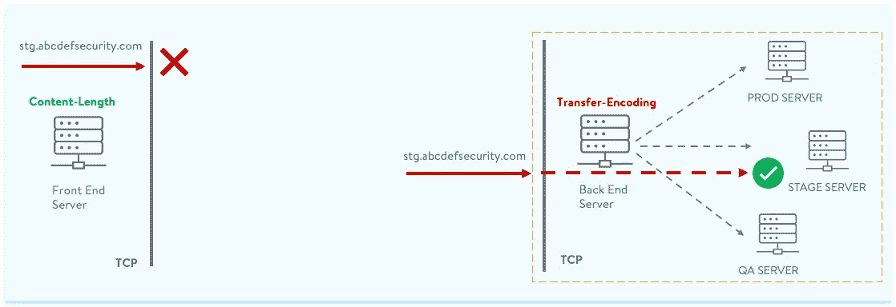

但是请记住，在某些应用中，一旦越过前端服务器，您就可以访问有限或完整的内部堆栈，如果我们以某种方式将此请求直接发送到后端服务器，会发生什么情况呢？那么这个请求肯定有可能被“stg”服务器处理。现在，想起来了吗？什么事？没有吗？好吧，这样吧，我们用 CL。TE，发出一个访问“stg”服务器的走私请求，并让它只由后端服务器处理。酷吗？

实际上，我们想通过 SSRF 访问的是特定于应用程序或组件的，就像试图访问 tomcat 管理页面一样。对于这种情况，让我们假设在“stg.abcdefsecurity.com”中有一个“/admin”页面，它具有默认凭据“admin:admin ”,这就是将尝试对其进行 SSRF 的内容。

修正我们是否需要回复的概念，这里是 SSRF，所以我们肯定需要回复。如果我们需要我们的响应，我们需要捕获队列，这意味着我们发送多个请求以及父请求，以增加获得响应的机会。接下来，我们的父-走私的请求，如果发送这个请求到前端服务器会发生什么？

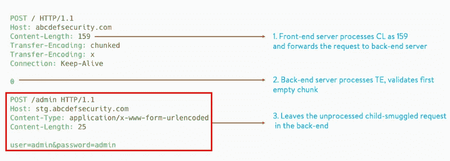

父级走私请求

*   前端服务器接收请求，忽略传输编码，可能是因为它的验证引擎不允许重复的头，处理内容长度。它的值是 159，这是包括孩子走私请求在内的整个主体的大小。它是完美的，它将请求转发到后端。
*   后端服务器接收请求，忽略 Content-Length，这可能是因为它的验证引擎没有任何重复报头的规则，所以它看到 CL 和 TE 报头，并且根据 HTTP/1.1 标准，传输编码优先，它处理第一个有效但为空的块。它不能处理下一个块，因为它是无效的，块仍然存在。
*   现在，用户 green 的请求来了。注意，由于我们发送多个请求，我们也是绿色用户，所以我们的下一个请求是:

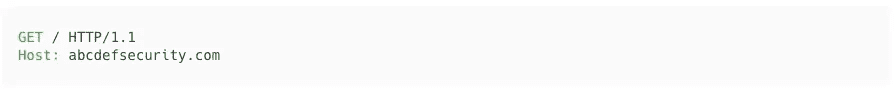

我们队列中的下一个请求

这被添加到我们未处理的块中

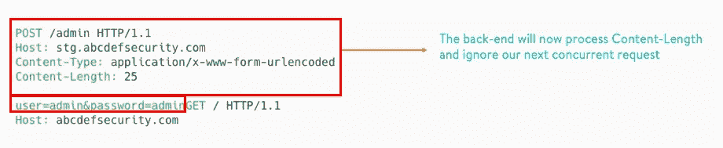

下一个请求被追加到未处理的块中

*   现在是有趣的部分，记住房间里的大象，用 TE 处理父走私请求的同一个后端服务器现在将使用 CL 处理子走私请求。我们指定的 CL 是什么？25，这正好是我们 POST 主体的长度，这样下一个请求就会被忽略。
*   如果/admin 页面确实有默认凭据，响应将被发送回用户 green，在本例中也是 us，然后 SSRF 攻击成功。

```
HTTP/1.1 200 OKYou login is successful !
```

# 使用请求反射来识别标头

我们可以认为以上是一个简单的例子。我们所要做的就是改变孩子走私请求中的主机头，对吗？现在，如果我们收到的是这个回复而不是 200 OK，会怎么样呢？

```
HTTP/1.1 400 Bad RequestMissing Internal Header 1 and Internal Header 2
```

注意，实时内部报头的一个例子是“X-Forwarded-For”报头。等等，但是谁添加了这些头？前端处理请求并添加这些额外的内部标头。好了，现在我们如何找到这些内部头，让我们看看一种方法，通过使用一个叫做请求反射的概念。

> 注意-请求反射将是你必须做的一个额外的预备步骤，在你做实际的 SSRF 步骤之前。

为了解释请求反射，让我们考虑下面的 HTTP 请求/响应:

```
**REQUEST
** 
POST /forgotuser HTTP/1.1
Host: abcdefsecurity.com
Content-Type: application/x-www-form-urlencoded
Content-Length: 26
Connection: Keep-Alive[email=ironman@avengers.com](mailto:email=ironman@avengers.com)**RESPONSE**HTTP/1.1 200 OKEmail "ironman@avengers.com" does not exist
```

这难道不是用户输入或 email 参数值完全反映在响应中的典型场景吗？在我们的笔试中，我们确实看到了很多这样的例子，不是吗？好了，这和获取内部头有什么关系呢？现在假设您试图利用 SSRF 的应用程序有一个类似的请求，我们将选择它并创建一个父级走私请求。是的，前一步也是另一个请求走私攻击。如果我们将下面的父走私请求发送到前端服务器，会发生什么？

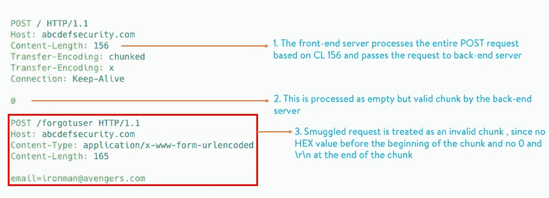

前端服务器处理之前的父级走私请求

*   同样的故事，前端处理 CL，CL 是 156，发送整个请求到后端。但在此之前，它会向请求添加几个内部标头，如下所示。

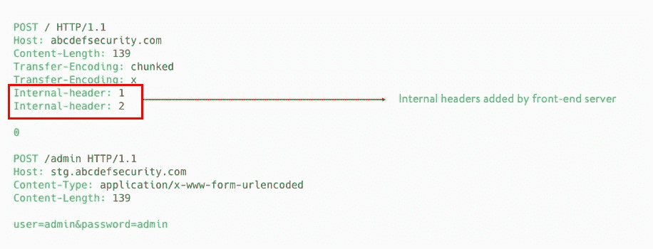

前端服务器处理后的父级走私请求

*   但可悲的是，我们将无法看到这些头，只有后端服务器可以。我们需要找到一种方法来查看这些标题。别担心，如果我们 ***捕获了队列，它会自动发生；)***
*   后端接收请求，处理 TE，识别第一个块，它是空的有效块，移动到下一个。它将无法处理我们的孩子走私的请求，这将作为一个未处理的块。
*   现在，队列中的下一个请求来了，因为我们正在捕获队列，所以下一个请求也是我们的。

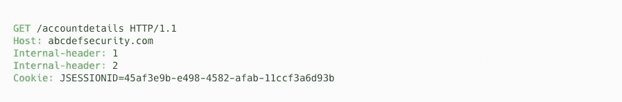

我们的下一个要求

*   内部头也在这里，当然，前端会将内部头添加到它转发给后端的所有请求中。这个请求被附加到未处理的块上。

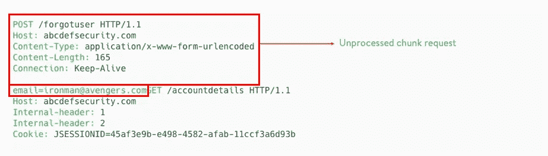

我们的下一个请求被追加到未处理的儿童走私请求中

*   现在，后端将处理这个请求，但是作为 CL，是的，房间概念中的相同大象。
*   但是你有没有注意到这个请求中的 CL 实际上比 POST 主体内容要大？帖体'**'的实际 CL 只有 26，而我们提到的是 165。这是它从下一个请求开始拉取的地方，这也是我们的请求。因此，下一个请求会被附加到 email 参数上。**
*   **我们知道这是一种请求，其中“电子邮件”参数的值反映在响应中，对于错误的电子邮件，您将得到:**

```
HTTP/1.1 200 OKEmail "ironman@avengers.comGET /accountdetails HTTP/1.1
Host: abcdefsecurity.com
Internal-header: 1
Internal-header: 2
Cookie: JSESSIONID=45af3e9b-e498-4582-afab-" does not exist
```

**瞧，我们已经得到了我们的内部头和它的值。将这些头附加到子走私请求中，更改父走私请求的内容长度以适应内部头，发送它，SSRF 应该会再次成功。**

```
**SSRF REQUEST:**POST / HTTP/1.1
Host: abcdefsecurity.com
**Content-Length: 188**
Transfer-Encoding: chunked
Transfer-Encoding: x
Connection: Keep-Alive0POST /admin HTTP/1.1
Host: stg.abcdefsecurity.com
Content-Type: application/x-www-form-urlencoded
**Internal-Header: 1
Internal-Header: 2**
Content-Length: 25user=admin&password=admin**SSRF RESPONSE:**HTTP/1.1 200 OKYou login is successful !
```

> **请记住，要使这一预备步骤成功，关键是在孩子走私请求中玩弄内容长度，比如它是 165，不断增加它们，直到您得到您想要的，或者直到它在您超出请求后超时。**

**休息一下，回忆一下:)**

# **开发 TE。CL(请求存储)**

**最后一部分，我保证:)让我们，看看剥削 TE。使用请求存储。请求存储与请求反射非常相似，只是它将存储在某个地方，与反射和存储的 XSS 不一样，但有些相似。让我们考虑一个请求，你试图从摄影师到博客更新你的简历:**

****

**用户界面中的生物**

```
PUT /updateprofile HTTP/1.1
Host: abcdefsecurity.com
Content-Type: application/x-www-form-urlencoded
Content-Length: 21name=user&bio=blogger
```

**现在，让我们构造我们的父走私请求，看看如果我们把它转发到前端服务器会发生什么？**

**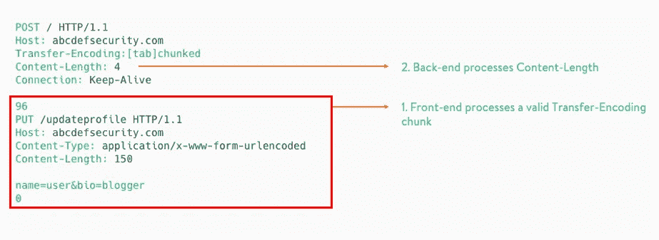**

**TE。化学发光**

*   **前端服务器可以看到这两个头，在传输编码头中分块之前，验证引擎不会验证“tab”。所以它看到了头，传输编码优先。它处理块，它是一个有效的块，它将整个请求发送到后端服务器。**
*   **后端服务器忽略传输编码可能是因为它的验证引擎不允许任何头值有“制表符”，所以它处理有效的内容长度头。Content-Length 是 4，因此在上面的请求中只处理“96”和“\r\n”。剩余的未处理数据，也就是我们的子节点走私的请求，保留在后端服务器中。**
*   **注意，对于这种攻击，我们不必捕获队列，我们只需发送第一个父级走私请求并离开它。所以前端服务器转发给后端服务器的下一个请求实际上是另一个用户的请求。**

**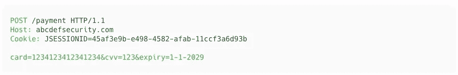**

**另一个用户的实际请求**

> **警告——在测试时，不要真的期待这样的大奖请求:)但是你可以期待一个 cookie！**

**现在，下一个用户的请求被附加到我们未处理的儿童走私请求中**

****

**未处理的请求被附加到另一个用户的请求上**

*   **后端服务器处理请求，它读取唯一有效的头内容长度。它的值是 150，大于 child-straighted 请求的 POST 主体，因此它从另一个用户的请求中读取值。同样，它只会读取 Content-Length 中指定的字符数。但是这里最重要的一点是这些额外的字符被添加到“bio”参数中。**
*   **因为我们没有捕获队列，只发送了一个请求，所以响应实际上会发送给另一个用户，对吗？我们不在乎，为什么？这里真正的问题是，当应用程序代码在发送响应之前处理请求时，它会在我们的“bio”参数中附加来自另一个用户请求的额外字符。**
*   **因此，如果我们转到我们的个人资料页面，现在我们将能够看到另一个用户的 cookies 参数请求。**

**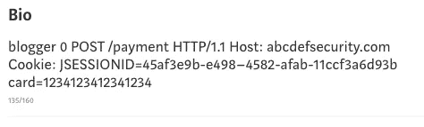**

**存储在我们简历中的另一个用户的请求**

**请求存储的唯一缺点是，由于应用程序代码处理请求，它会区分以' & '开头的参数，因此可能会删除请求中第一个' & '后面的任何值。但除此之外我们都很好。**

**就是这样！！！我建议你在此之后阅读詹姆斯·凯特尔的白皮书。**

**坦白地说，第二部分对我来说就像一个糟糕的蛇和梯子游戏:)每次我假设一个概念是正确的，我都在想我在游戏中接近 100，但 95 年的蛇会把我放下，我会回到起点。我希望你喜欢阅读博客:)**

**鼓掌，如果你喜欢的话。你知道你可以添加任意数量的掌声，对吗？日安！**

**特别感谢我的朋友斯坦科·扬科维奇和普拉特克·库马尔·尼斯查尔帮助我理清了一些概念:)**

**参考资料:**

*   **[https://ports wigger . net/research/http-desync-attacks-request-走私-重生](https://portswigger.net/research/http-desync-attacks-request-smuggling-reborn)**
*   **【https://portswigger.net/web-security/request-smuggling **