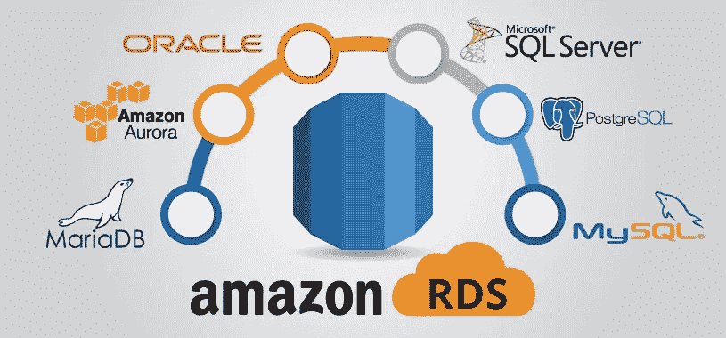
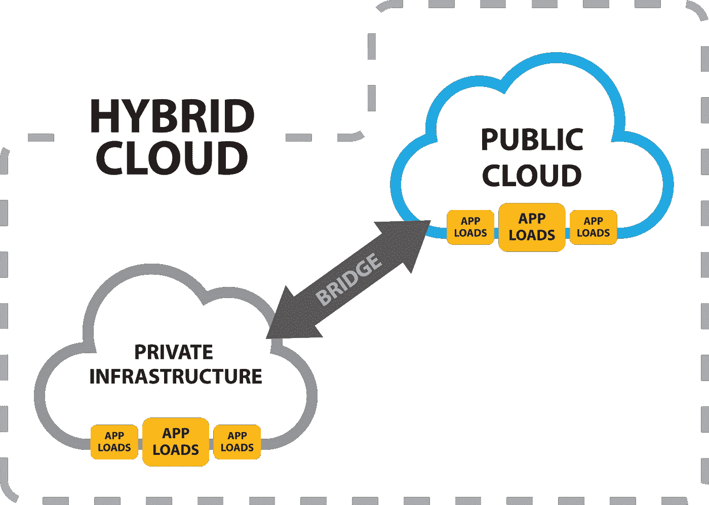
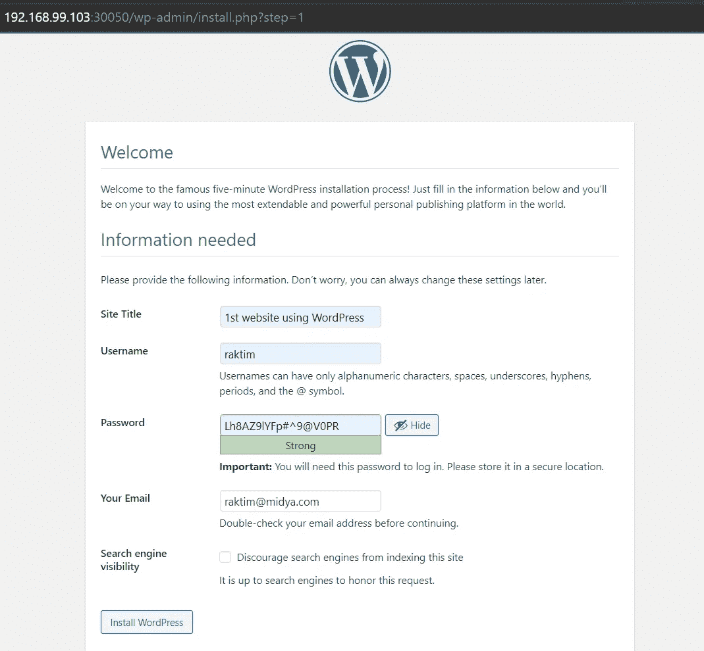
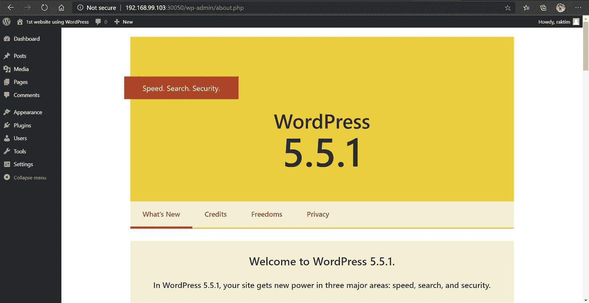

# 混合云架构(AWS RDS 上的数据库，Kubernetes 上的 WordPress)

> 原文：<https://medium.com/nerd-for-tech/hybrid-cloud-architecture-database-on-aws-rds-wordpress-on-kubernetes-a9873b483209?source=collection_archive---------0----------------------->


由 Raktim 创建

## 让我们一起了解什么是混合云计算和一个奇妙的实用工具！！！

在这篇文章中，我将演示如何**将 Amazon RDS 设置为后端服务器**并将 Kubernetes 上的 **WordPress 设置为前端服务器**以理解混合云计算。
我已经使用 **Terraform 脚本自动化**创建了 **EC2 安全组、AWS RDS 实例、Kubernetes 部署&服务**等等。但是在进入实践之前，让我们先学习一些概念…

# AWS RDS:



来源:谷歌

*   **亚马逊关系数据库服务(Amazon RDS)是一种 web 服务，它使在 AWS 云中建立、操作和扩展关系数据库变得更加容易。**它为行业标准关系数据库提供经济高效、可调整大小的容量，并管理常见的数据库管理任务。
*   当我们购买服务器时，我们获得了 CPU、内存、存储和 IOPS，所有这些都捆绑在一起。**在亚马逊 RDS 中，这些都是分开的，因此我们可以独立扩展它们。**如果您需要更多的 CPU、更少的 IOPS 或更多的存储，您可以轻松分配它们。Amazon RDS 管理备份、软件修补、自动故障检测和恢复。
*   我们可以使用数据库产品，如 **MySQL、MariaDB、PostgreSQL、Oracle、Microsoft SQL Server 等。在亚马逊 RDS 上。**
*   ***了解更多 AWS RDS:***[***https://docs . AWS . Amazon . com/Amazon RDS/latest/user guide/welcome . html***](https://docs.aws.amazon.com/AmazonRDS/latest/UserGuide/Welcome.html)

# Kubernetes:


Kubernetes 标志

*   Kubernetes 是一个开源的容器编排系统，用于自动化计算机应用程序的部署、扩展和管理。最初由谷歌设计，现在由云原生计算基金会维护。
*   它旨在提供一个“跨主机集群自动部署、扩展和操作应用程序容器的平台”。**它可以和一系列容器工具一起工作，包括 Docker。**
*   ***了解更多 Kubernetes:***[***https://Kubernetes . io/docs/concepts/overview/what-is-Kubernetes***](https://kubernetes.io/docs/concepts/overview/what-is-kubernetes)

# 混合云计算:



*   **混合云的最基本含义是公共云和私有云的结合。**通常，当我们托管任何应用程序时，我们都需要启动不同的服务或组件，并最终需要将它们组合在一起。
*   现在，公共云可以轻松满足我们的大部分需求，但在一些关键情况下，我们希望获得更多的安全性，这就是为什么我们在自己的数据中心上推出我们的**数据库，而我们**在公共云上推出我们的前端服务**，因为它更快，而且它的全球基础设施令人身临其境。**
*   接下来**我们通过网络连接运行在两个不同云上的前端服务器和后端服务器，并构建混合云设置。**
*   ***了解 AWS 如何提供混合云请关注:***[***https://aws.amazon.com/hybrid/***](https://aws.amazon.com/hybrid/)

# 但是，我在做相反的事情:


来源:谷歌

*   **在这个实践中，我们将执行完全相反的设置，这意味着我们将在公共云上推出一个受欢迎的数据库托管服务，名为 Amazon RDS。接下来，在我们自己的本地主机中，我们将在 Kubernetes 上推出我们的前端服务(WordPress ),并将两者连接起来以实现混合云架构。**
*   很明显，你可能会想为什么我们要这样做。第一个原因是**亚马逊 RDS 非常安全，它是一项托管服务，这意味着我们不需要建立自己的基础设施。**
*   第二，你可以认为我正在实现我的前端应用程序，因为它是我们产品的外观，作为**我们需要在前端上执行大量测试**，所以与其在云上投资，不如让我们在本地主机上构建它，一旦它准备好了，我们就可以把它放在云上。

# 让我们看看问题陈述:

使用 terraform 在 Kubernetes 和 AWS 上部署 WordPress 应用程序，包括以下步骤:

1.使用 terraform 编写一个基础架构代码，它会自动部署 WordPress 应用程序
2。在 AWS 上，对 WordPress 应用程序的关系数据库使用 RDS 服务。
3。将 WordPress 作为一个容器部署在 Minikube 或者 EKS 或者 AWS 上的 Fargate 服务之上。如果部署在 AWS 上，WordPress 应用程序应该可以从公共世界访问，如果部署在 Minikube 上，应该可以通过 workstation 访问。

# 先决条件:

在开始实现之前，我想提出一些理解这一特定实践所需的先决条件。让我们看看那些是什么…

*   您应该至少需要一个有效的 AWS 帐户。接下来在您的本地系统中，您需要安装 **Terraform 程序**。**需要 AWS 和 Terraform 的基础知识**才能理解本文。
*   但是不要担心，如果你不知道这些事情，因为几天前我写了一篇文章，我谈到了这些基本的事情。下面提到的链接供参考…

[](/faun/getting-started-with-aws-terraform-293e9125dff) [## AWS & Terraform 入门。

### 如何入门使用 Terraform 在 AWS 中构建基础设施？

medium.com](/faun/getting-started-with-aws-terraform-293e9125dff) 

*   **在问题中，它被要求使用 Minikube 或亚马逊 EKS 或 AWS Fargate 服务。我之前说过我们将在本地主机上托管我们的 WordPress，这就是我使用 Minikube 的原因。**
*   **Minikube 在我们的本地机器上为我们提供了单节点 Kubernetes 集群。Minikube 的安装非常简单。我建议观看任何 YouTube 视频来安装和设置 Minikube。另外，一旦你安装了 Minikube，不要忘记安装" **Kubectl 程序** ( Kubernetes 客户端)"。这里是这两个项目的官方链接，供参考…**
*   ***Minikube:***[***https://kubernetes.io/docs/tasks/tools/install-minikube/***](https://kubernetes.io/docs/tasks/tools/install-minikube/)
*   ***ku bectl:***[***https://kubernetes.io/docs/tasks/tools/install-kubectl/***](https://kubernetes.io/docs/tasks/tools/install-kubectl/)

> 注:虽然我用的是 Minikube，但如果你想用 AWS EKS，你可以很容易做到。最近我在 AWS EKS 完成了一个有趣的实践。在那里，我谈到了从非常基础的东西，直到使用 AWS EKS 托管自己的 Web 应用程序。请随意查看…

[](/@raktim00/deploying-joomla-prometheus-grafana-on-aws-eks-37177a116acb) [## 在 AWS EKS 上部署 Joomla、Prometheus 和 Grafana

### 在本文中，您将了解如何在 AWS EKS 上部署 Joomla、Prometheus 和 Grafana

medium.com](/@raktim00/deploying-joomla-prometheus-grafana-on-aws-eks-37177a116acb) 

# 让我们开始:

像往常一样，我们会看到整个地形代码的不同部分，并试图理解每一位。最后，我们将组合这些小代码，并部署我们的基础设施。

## 提供商设置和数据收集:

*   你可以注意到我们选择了两个提供商，**一个是 Kubernetes，另一个是 AWS。**我还在 AWS 提供商内部设置了我的个人资料和地区。
*   接下来使用“**数据**”我正在收集一些信息，如默认 VPC 和默认子网，因为我们将来会用到它们。

## 安全组和子网组:

*   这里我们为 RDS 的实例创建一个**安全组。在这里，您可以注意到我们正在默认的 VPC 中创建这个 SG。**
*   接下来在入口中，我们只允许 3306 号端口的**，因为 MySQL** 工作在这个端口上。另外**我们已经允许来自任何地方的流量**，因为当我的本地主机 WordPress 将联系 RDS 时，那么对于 RDS，我们的流量将是外部流量。
*   在出口，我们允许任何 IP，因为 RDS 可能需要从互联网上下载一些东西。
*   接下来，我们将为 Amazon RDS 创建一个**子网组，因为我希望 RDS 可以在我的默认 VPC 下的任何可用子网中启动。**

## RDS 实例:

*   在这里，如果你注意到我使用了**依赖于**。这是因为我希望在创建这两个资源后，开始创建 RDS 实例，因为在创建 RDS 时，我们需要提供这两个资源。
*   接下来我们提到了我们想要使用的数据库和版本。这里**我选择 MySQL 版本 5.7** 是因为 **WordPress 可以与 MySQL 或 MariaDB 一起工作。**
*   标识符只是 AWS 资源的名称。**那么用户名和密码就是数据库的用户名和密码。**请注意，用户名和密码区分大小写。
*   然后，我们简单地告诉数据库实例需要哪种风格。另外**在 RDS 中，我们可以提供的最小存储容量是 20GB。**我选择 gp2 存储，但如果您有其他需求，您也可以相应选择。
*   接下来，我们选择了 VPC 和子网，我们希望在其中调配实例。此外，由于**我们从 AWS 外部连接到数据库，因此打开公共访问**。
*   Finally name 代表您想要创建的数据库名称，那么“**跳过最终快照**”为真，因为当我们删除数据库时，我们不想创建快照。但是在实际工业中，这个选项总是被禁用。

## Kubernetes 部署:

*   这个脚本正在 Kubernetes 上部署 WordPress Pod。正如我们可以看到的，这个脚本依赖于 RDS 实例，因为我希望我的 WordPress 一启动，它就获取数据库来存储数据。
*   下一个元数据是选择需要部署的配置。它正在从“spec”获取配置。现在，由于“规范”下的“模板”和“元数据”具有相同的标签，这就是元数据能够定位规范的原因。
*   然后**“spec”从“spec”获取配置，该配置包含所有信息，如映像名称、pod 名称、环境变量、容器端口等。**这里只需注意一件事，我们正在从 RDS 资源中动态选择环境变量的值。这就是为什么这段代码依赖于前面的资源。
*   最后，“选择器”也是一个重要的选项。我们这样做是为了将来如果任何一个吊舱出现故障，那么**这个选择器会帮助部署启动一个新的。**

## Kubernetes 服务:

*   该代码依赖于 Kubernetes 部署，因为在部署完成后**我们通常会公开我们的部署，以便客户可以访问该网站。**
*   在这里，元数据创建服务的名称，**选择器帮助选择那些标签为“app”=“WordPress”**的容器，并在这些容器上应用服务。
*   最后，我使用了 80 号端口**来暴露**，因为 **WordPress 工作在 Httpd WebServer 之上，而 Httpd web server 工作在 80 号端口**。我还提到了 30050 的**外部端口。在这里你可以选择任何外部端口，但是记住有一定的限制。最后，我选择 NodePort，因为我没有任何外部负载平衡器。**

## 镀铬开口:

*   最后，这段代码运行到最后，他打开我们的本地主机浏览器，直接把我们带到 WordPress 工作的 IP 地址。

# 让我们部署:

最后，我们完成了代码。现在是部署代码的时候了。像往常一样，我们将在您有完整代码的文件夹中运行下面提到的两个命令，Terraform 将创建整个设置。

> **注意:确保 Minikube 正在您的本地主机上运行，或者您的 AWS EKS 已连接到您的本地主机。**

```
terraform initterraform apply --auto-approve
```

**这里还有 GitHub 链接供参考，你可以在那里找到完整的代码……**

[](https://github.com/raktim00/AWS-RDS-WordPress) [## raktim00/AWS-RDS-WordPress

### 在 GitHub 上创建一个帐户，为 raktim00/AWS-RDS-WordPress 开发做贡献。

github.com](https://github.com/raktim00/AWS-RDS-WordPress) 

*   只需等待 5 分钟，您就会看到笔记本电脑浏览器自动打开，带您进入 IP 地址。你会注意到 WordPress 运行完全正常。
*   **选择语言然后点击**继续。接下来给出这些基本的细节，如**网站名称、用户名、密码、电子邮件等**。作为参考，请查看下面提到的截图…



> *接下来点击* ***安装 WordPress*** *，然后登录，你将拥有自己的 WordPress Web 应用程序。*



**快点…我们已经成功完成了一个基本但有趣的混合云设置。😎**

# 最后的话:

*   这种实践在未来有很多可能性，例如**我们可以使用 OpenStack 等私有云来构建适当的混合云设置。**我们还可以使用 AWS EKS，这是一项出色的托管服务。除了使用 WordPress，我们还可以使用 Joomla、Drupal 等。
*   就在最近，我在 AWS cloud 上做了同样的实践，但采用了更高级的方式。我提供下面的链接。请随意查看…

[](/faun/webapp-on-aws-ec2-instance-with-best-possible-security-9184d5d44981) [## AWS EC2 实例上的 WebApp 具有最佳的安全性！！！

### 这篇文章将帮助您建立 AWS AMI，并实现 VPC，子网，互联网网关，路由表，安全…

medium.com](/faun/webapp-on-aws-ec2-instance-with-best-possible-security-9184d5d44981) 

*   我试图让它尽可能简单。希望你从这里学到了一些东西。请随意查看我的 LinkedIn 个人资料，当然也可以随意发表评论。

[](https://www.linkedin.com/in/raktim00/) [## 微软学习学生大使(Alpha) -微软学习学生大使 CEE |…

### ★我是一名技术爱好者，致力于更好地理解不同热门技术领域背后的核心概念…

www.linkedin.com](https://www.linkedin.com/in/raktim00/) 

*   我写 DevOps，云计算，机器学习等等。博客，所以请随时关注我的媒体。最后但同样重要的是，如果您有任何疑问，请在 LinkedIn 上联系我。

**感谢大家的阅读。就这样…结束…😊**

