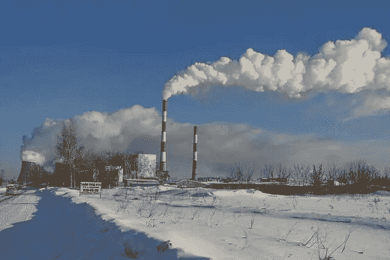
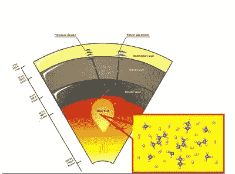

# 从天然气中去除碳氢化合物

> 原文：<https://medium.com/nerd-for-tech/hydrocarbon-removal-from-natural-gas-ea981f176cae?source=collection_archive---------4----------------------->

# 介绍

天然气明显产于地下储层或与原油伴生。从天然气中生产的主要碳氢化合物类型。它们是甲烷和不同数量的高分子量碳氢化合物。这些包括从乙烷(CH3CH3)到辛烷[CH3(CH2)6CH3]。

天然气主要是可燃碳氢化合物的混合物。许多天然气同样含有氮气(N2)以及二氧化碳(CO2)和硫化氢(H2S)。天然气通常是石油生产的副产品。在本文中，我们将了解从天然气生产碳氢化合物的过程。

# 描述

*   目前，从油井、气井和凝析井三种类型的井中回收原料天然气。
*   来自油井的天然气通常被称为伴生气。
*   这种气体可能不同于地层中的石油。
*   它也溶解在原油中。
*   来自气井和凝析气井的天然气被称为非伴生气。
*   气井通常自己生产原始天然气。
*   凝析气井生产游离天然气。这也伴随着半液态烃冷凝物。
*   天然气的来源通常出现在与其他[碳氢化合物](https://www.technologiesinindustry4.com/2021/09/hydrocarbons-and-their-uses-in-industrial-manufacturing.html)的混合物中，如乙烷、丙烷、丁烷和戊烷。
*   此外，原料天然气包含水蒸气、硫化氢(H2S)、二氧化碳、氦气、氮气和其他化合物。
*   实际上，与[碳氢化合物](https://www.technologiesinindustry4.com/2021/09/hydrocarbons-and-their-uses-in-industrial-manufacturing.html)伴生的天然气液体(NGLs)可能是天然气加工过程中非常有价值的副产品。
*   天然气液体包括乙烷、丙烷、丁烷、异丁烷和天然汽油。

# 液态天然气的使用

*   提高油井的采收率
*   只要是炼油厂或石油化工厂的原料
*   作为能源

# 气体精炼

在加工或提炼过程中，除了甲烷以外的所有物质都被除去了。

**气体加工的副产品**

*   乙烷
*   丙烷
*   丁烷类
*   戊烷类
*   高分子量[碳氢化合物](https://www.technologiesinindustry4.com/2021/09/hydrocarbons-and-their-uses-in-industrial-manufacturing.html)
*   硫化氢
*   硫醇
*   二氧化碳
*   水蒸气，
*   有时氦和氮

天然气是世界碳氢化合物来源的重要组成部分。它仍然主要由甲烷组成，因此它绝不是纯的。这种气体必须经过一些提纯步骤才能产生纯甲烷和高分子量的碳氢化合物。这将用于其他驱动器。气体处理包括从清洁的天然气中分离出所有的几种碳氢化合物和液体。

主要的运输管道通常在天然气的表面进行限制。允许进入管道。在输送天然气之前，必须对其进行净化。尽管乙烷、丙烷、丁烷和戊烷必须从天然气中分离出来。这并不意味着它们都是遗留产品。气体处理对于确保计划使用的天然气尽可能清洁和不含杂质至关重要。这将使它成为清洁燃烧和全球无害的能源选择。

消费者使用天然气。这与从地下运输到井口的天然气有很大不同。尽管天然气的加工在各方面没有原油加工复杂。这类似于最终用户在使用之前所需要的。

# 吸收过程

*   萃取的吸收方法与利用吸收进行脱水非常相似。
*   关键区别在于，在吸收天然气液体时，使用的是吸收油，而不是乙二醇。
*   这种吸收油与天然气液体有相似之处。
*   就像乙二醇对水有相似性一样。
*   在油吸收任何天然气液体之前，它被称为贫吸收油。
*   吸油过程包括贫油的逆流接触。
*   也就是具有输入湿气的油，该湿气具有编程的温度和压力条件，以最大程度地溶解油中的可液化组分。
*   覆盖天然气液体的富吸收油从底部离开吸收塔。
*   富油被加工成贫油。
*   混合物在那里被加热到超过天然气液体沸点的温度。
*   该温度将低于油的温度。
*   这一过程允许回收约 100 万吨；
*   75%体积的丁烷
*   85–90%体积的戊烷
*   天然气流中的高沸点成分。
*   上述简单的吸收过程可以改变，以恢复其成功。
*   它可以被修改以针对特定天然气液体的提取。
*   例如，在冷冻油吸收法中，贫油通过冷冻被冷却。
*   在这一过程中，丙烷的回收率可能高达 90 %(按体积计)。
*   几乎 40 体积%的乙烷可以从天然气流中除去。
*   使用该方法，较高沸点的天然气液体可以接近 100%体积。

# 非低温吸收

*   液化石油气的回收采用非低温吸收法。
*   其用于从天然气流中回收乙烷、丙烷和高沸点组分。
*   在溶剂再生塔中分馏来自吸收塔最底部的离子溶剂中的吸收气体。
*   将气体分离为塔顶馏分，将贫溶剂分离为塔底馏分。
*   热量回收后，贫溶剂被吸收塔顶部气体预饱和。
*   冷却的溶剂在吸收塔的顶部流动。
*   分离出的气体被直接储存。
*   工厂的操作可以在线从乙烷+回收切换到丙烷+回收，而不触及丙烷回收水平。
*   AET 液化石油气厂使用低沸点贫油。
*   最大应用没有溶剂面要求。

欲了解更多详情，请访问:[https://www . technologiesinindustry 4 . com/2021/09/hydrocarbon-removal-from-natural-gas . html](https://www.technologiesinindustry4.com/2021/09/hydrocarbon-removal-from-natural-gas.html)