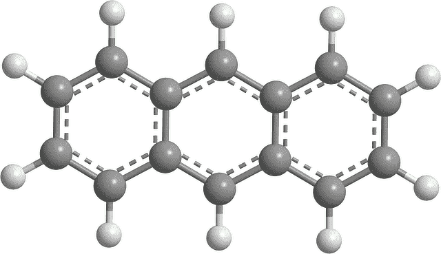
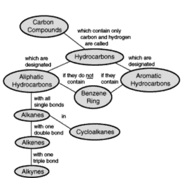

# 碳氢化合物及其在工业生产中的应用

> 原文：<https://medium.com/nerd-for-tech/hydrocarbons-and-their-uses-in-industrial-manufacturing-d70bb336f44?source=collection_archive---------8----------------------->

# 介绍

碳氢化合物是一种有机化合物。它只由碳和氢组成。除了碳和氢以外，任何原子的存在都不能将这种化合物作为碳氢化合物来测量。

大部分碳氢化合物天然存在于石油原油中。它们也存在于天然气中。在那里，分解的有机物释放出大量各种不同的碳氢化合物。

在本帖中，我们将详细了解[碳氢化合物及其在工业制造中的用途](https://www.technologiesinindustry4.com/)。

# 描述

碳氢化合物可以是:

*   气体(甲烷和丙烷)，
*   液体(己烷和苯)，
*   低熔点固体(石蜡和萘)
*   聚合物(聚乙烯、聚丙烯和聚苯乙烯)。

碳氢化合物的主要用途是作为易燃燃料来源。甲烷是天然气中最重要的成分。C6 至 C10 烷烃和烯烃是汽车、火车、发电厂等用的汽油、石脑油、柴油和其他辛烷燃料的主要成分。碳氢化合物几乎大规模的非燃料应用始于天然气中的乙烷和丙烷。

这两种气体转化为乙烯和丙烯。这两种烯烃是聚乙烯、聚苯乙烯、丙烯酸、聚丙烯、PET、HDPE 和 LDPE 等聚合物的原料。

# 性能

*   碳氢化合物的[经验公式因分子结构不同而互不相同](https://www.technologiesinindustry4.com/)。
*   例如烷烃、炔烃或烯烃，烯烃和炔烃中键合氢的量下降。
*   这主要是由于碳的自结合通过形成双键或三键阻止了烃的完全饱和。
*   碳氢化合物自我结合的能力被认为是链状的。
*   它们可以形成更复杂的分子，如具有这种能力的环己烷。
*   在极少数情况下，芳香烃如苯。
*   同时，碳氢化合物的裂解是一个过程，其中重的有机分子被裂解成较轻的分子。
*   这是通过提供适当的热量和压力来实现的。
*   偶尔使用催化剂来加速反应。
*   这一过程在柴油和汽油的可行生产中显示出非常重要的作用。

**物理特性**

*   含 10 个碳原子或更少碳原子的烷烃在室温下通常是含 10 个碳原子以上的气体。
*   分子是气体或液体。
*   烷烃通常沸点和熔点都很低。
*   沸点取决于因素、分子量和分支
*   具有高分子量和高沸点的烷烃如 [C2H6 比 CH4](https://www.technologiesinindustry4.com/) 具有更高的沸点。
*   具有相同分子量但具有不同分支数量的烷烃。
*   分支少的那个有更多的沸点，这是因为范德华力随着面积的增加而减弱。
*   例如，CH3-CH2-CH2-CH3 具有更高的沸点。
*   烷烃微溶于水。
*   它们可溶于非极性溶剂，例如苯、CCl4 等。

# 碳氢化合物的类型

*   碳氢化合物可以是；
*   直链，
*   支链
*   环状分子

碳氢化合物有五个特殊的家族:

1.  烷类
2.  烯属烃
3.  炔烃
4.  环烷
5.  芳香烃

**烷烃(石蜡)**

*   这些是饱和烃。
*   其中碳的所有四个价键都由氢或另一个碳完成。
*   烷烃可以有常规链和支链。
*   然而没有任何环结构。

**烯烃**

*   这些是不饱和烃。
*   因为不是所有的碳原子价都由另一个原子来完成。
*   它们在碳原子之间有一个双键。
*   假设分子中没有环状结构，烯烃的通式为 CnH2n。
*   烯烃在碳原子之间可以有一个以上的双键。
*   在这种情况下，每增加一个双键，分子式就减少两个氢原子。

**炔烃**

*   这些是包含三键(ChC)的碳氢化合物
*   它们的总分子式是 CnH2n — 2。
*   乙炔碳氢化合物非常活泼。
*   它们在原油中非常罕见。

**环烷烃(环烷烃)**

*   这些是包含一个或多个环的饱和烃。
*   每个链可以具有一个或多个链烷烃侧链。
*   覆盖一个环的饱和烃的通式是 CnH2n。

**芳香烃(芳烃)**

*   这些是包含一个或多个芳核的烃。
*   例如[苯、萘和菲](https://www.technologiesinindustry4.com/)环系。
*   它可能与取代的环烷环和石蜡族侧链有关。

# 碳氢化合物的用途

*   碳氢化合物被广泛用作燃料。
*   例如 LPG(液化石油气)和 CNG(液化天然气)。
*   它们用于聚乙烯、聚苯乙烯等聚合物工业。
*   这些有机化合物在医药和染料行业中作为原材料得到了应用。
*   它们可以作为润滑油和油脂。

欲了解更多详情，请访问:[https://www . technologiesinindustry 4 . com/2021/09/碳氢化合物及其在工业制造中的用途. html](https://www.technologiesinindustry4.com/2021/09/hydrocarbons-and-their-uses-in-industrial-manufacturing.html)