# 帮助人们记忆主题和公式的水文地质学概念——第一部分

> 原文：<https://medium.com/nerd-for-tech/hydrogeology-concepts-that-help-people-memorize-topics-and-formulae-part-i-da67bb7db779?source=collection_archive---------15----------------------->


***水文地质题目及公式***

# 提取率

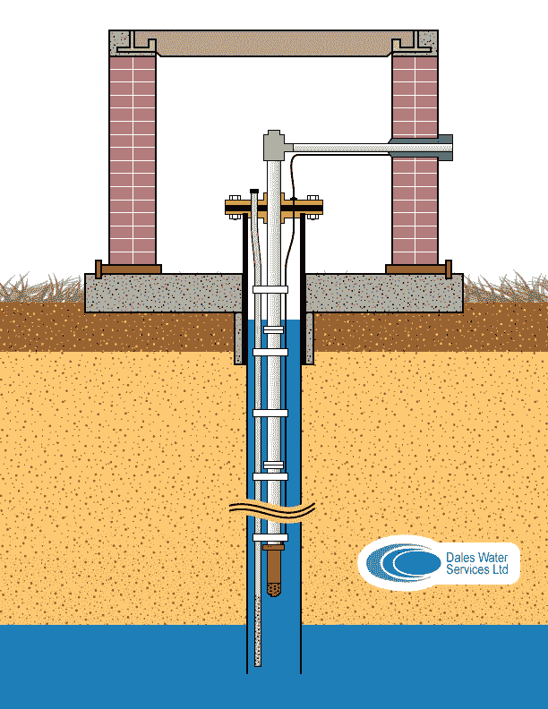

**—钻孔示意图—**

*水流上方的含水层被认为完全穿透了长钻孔。*

***流出钻孔的流量或抽取率取为 Q，地下水流量或水流衰竭率取为 Q***

*请观看* [***深水钻井***](https://www.youtube.com/watch?v=Do9dz6ypD7w) *上的视频。*

*通过从下方抽干水对钻孔进行抽水。河流枯竭率为:*

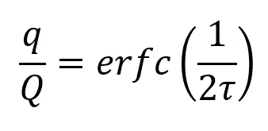

**—抽取率—误差函数—**

## *其中τ是*的乘积的平方根

> tau = (t，T，L，S)
> 
> 系数= (1/2，1/2，-1，-1/2)
> 
> 术语， **erfc =误差函数**

*t =时间，t =透射率，*

*L =钻孔到河流直线的垂直距离，*

*S =含水层储存系数*

# 多孔性

*考虑将金属球放入体积为 V 的烧杯中，那么体积 V 可以写成:*


**—烧杯中的金属球—**

> V = Vs(固体材料体积)+ Vv(空隙体积)

*孔隙率和空隙率的关系如下:*

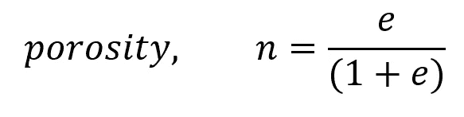

**—孔隙率和孔隙比关系—**

***孔隙率是给定体积的材料被空隙或空隙占据的分数。***

基于 1979 年 Freeze 和 Cherry 以及 Back et 中的数据。艾尔。1988 年，一系列物质的渗透系数在岩溶石灰岩中达到最大值 1，在湖泊淤泥和粘土的冰川沉积物中达到最小值 10^-13。

# 水力传导率和固有渗透率

渗透系数是指水在含水层和多孔材料中运动的难易程度。它取决于多孔材料的物理性质和迁移流体的性质。

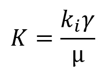

**—水力传导率—**

*固有渗透率，*

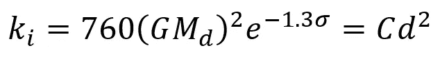

**—固有渗透率—**

***在这里，渗透系数是粘度和比重的函数；固有渗透率取决于粒径(mm)***

> **这里的孔隙度是一个体积参数，渗透率是一个流动参数**

> 水力传导率影响均匀性和各向同性。同质性是指位置独立性，各向同性是指方向独立性。

# 达西定律和达西-维斯巴赫

*达西定律:流量取决于水流的横截面积，多孔材料的水力传导系数，与水位落差成正比，与水柱长度成反比。这个比率称为水力梯度。*

*使用流网分析和地下水建模，实现了地下水流量和速度的精确计算。*

> **裂隙岩石遵循三次方程:对于离散裂隙和双重孔隙模型，地下水运动取决于面积，而面积又取决于裂隙的孔径。也正是孔隙的平方决定了水力传导系数，这导致了地下水流量的立方定律:**

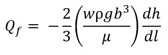

**—流量和水力梯度的立方定律—**

岩溶含水层有两种或三种类型的孔隙:

> —岩石基质中的粒间孔隙
> 
> —常见的岩石不连续性，如裂缝和层面
> 
> —溶液扩大的空隙，如通道和导管

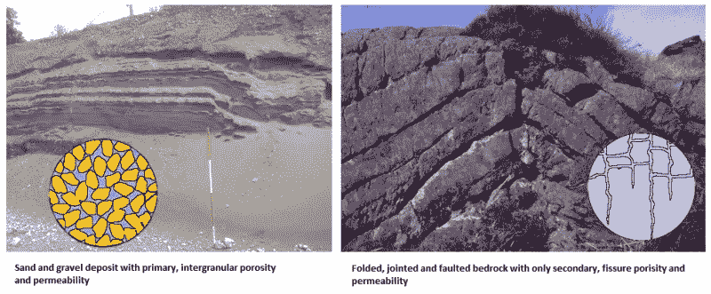

**—岩石中的粒间孔隙与裂缝/裂隙—**

***—达西定律变体:***

在具有粒间孔隙的材料和断裂多孔材料中，达西定律可以成功地应用于连续介质范围内。在亚连续尺度中，裂缝尺寸会发生变化，我们需要考虑立方定律。在通道和导管中，我们模拟环境以再现输入和输出响应。经验函数是基于流量的现场观察而开发的。

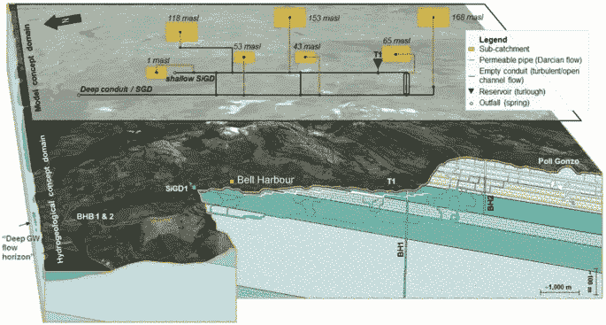

**—深通道和导管—**

> Darcy-Weisbach:估算峰值流量的平均速度，

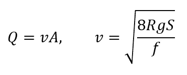

**达西-维斯巴赫**

***—喀斯特变异:***

在具有岩溶变异的材料中:如 ***野外系统*** 、 ***单裂隙*** 、 ***等效连续体*** 和 ***双重孔隙*** ，系统水力特性的表征因其水力特性难以表征而变得复杂。人们必须使用达西定律，并使用*现场观察*和*现场验证*来模拟环境。

> 平均速度也由单位面积的流量除以孔隙率来定义

***—位于岩溶表层的饱和带内，向饱和带排泄，并接受渗透补给。***

# ***地下水势和水压头***

****流体势相当于高程水头和压力水头之和。压头写成 P 和* ρg 的比值*公式写成:****

***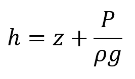***

******—液压压头=高程压头+压力压头—******

> *****注意:**非饱和区的压头项为负。在水位处，水压等于零(大气压力)。***

# ***透射率、储存率、压缩率和单位产量***

******透射比*** *:单位水头下，水含量从一端传递到相隔深度 b 的另一端的速率。****

*****:在深度 b 内，含水层单位表面积所含的水量(以体积计)，沿水头分量递减。*****

*******水力扩散系数*** *:水力传导系数与比贮水量之比，也可称为透过率与贮水量之比。*****

*******【水的压缩性】和*** *含水层的压缩性:被称为每一次诱发孔隙水压力变化的体积应变和每一次有效应力变化的体积应变。*****

********

****加州中央山谷****

****加利福尼亚中央谷多年来观察含水层的沉降，同时也注意到，当抽水时，由于抽取地下水，含水层沉降了一定量。通过引入地表水，沉降较大的地区得到了控制。****

# ****地下水流方程****

*****在稳态饱和流中，流入和流出控制容积的流体质量流量的偏导数之和(即流体密度乘以单位横截面积的特定流量的乘积)为零。*****

****利用达西定律，可以证明比流量是水力传导率和水力梯度的乘积。****

****因此，对于各向同性且均匀的多孔材料如 [**土工合成材料**](https://civilwale.com/geosynthetics/)****

> ****K(x，y，z) =常数****

*******方程式变成:*******

****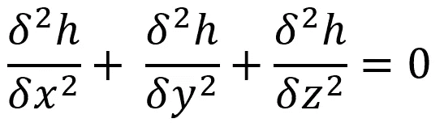****

******—水力压头的拉普拉斯方程—******

****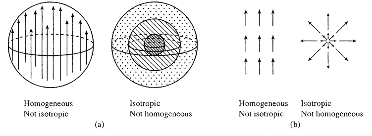****

******均质和各向同性******

*******瞬态饱和*** :在瞬态流动中，时间维度等于空间维度，由水的密度变化引起的水的膨胀产生的水的质量速率，由多孔材料的压缩性和压实产生的水的质量速率(ρn)控制，等于控制体积 *pq* 的排放速率。****

*****:在瞬态非饱和流中，孔隙度用含水量 **θ** 代替。*****

> *****使用 **h** = **z** + **ψ，*******

********理查兹方程变成了:********

****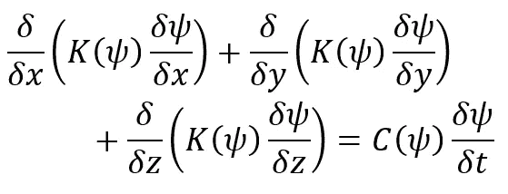****

******—非饱和流理查兹方程—******

****在压实驱动的流体流动中，孔隙流体压力随着覆盖层重量的增加而增加，并驱动流体流动。使用 Terzaghi，孔隙网络的机械压实需要增加有效应力。Bethke 和 Corbet 1988 年还发现，孔隙度与压缩系数和有效应力呈指数关系。****

## ****MODFLOW****

*******示例项目:*******

*******这是一个 docker 盒子，由 Linux 中的 Fortran 和 MODFLOW6 实现组成。这是根据***[***USGS***](https://www.usgs.gov/software/modflow-6-usgs-modular-hydrologic-model)***网站实现编译的。*******

****[](https://github.com/aswinvk28/modflow_fortran) [## aswinvk28/modflow_fortran

### docker-compose up-d-build docker exec-it modflow _ fortran/bin/bash nonprivuser @ d6ba ECA 63141:/home/project $ gfortran…

github.com](https://github.com/aswinvk28/modflow_fortran) 

***编译示例 Fortran 代码:***

这是一个 Fortran 上的 hello world 示例代码。下面给出的 shell 代码编译 Fortran。

> gfortran-o hello _ world hello _ world . f90

***ModFlow 等高线:***

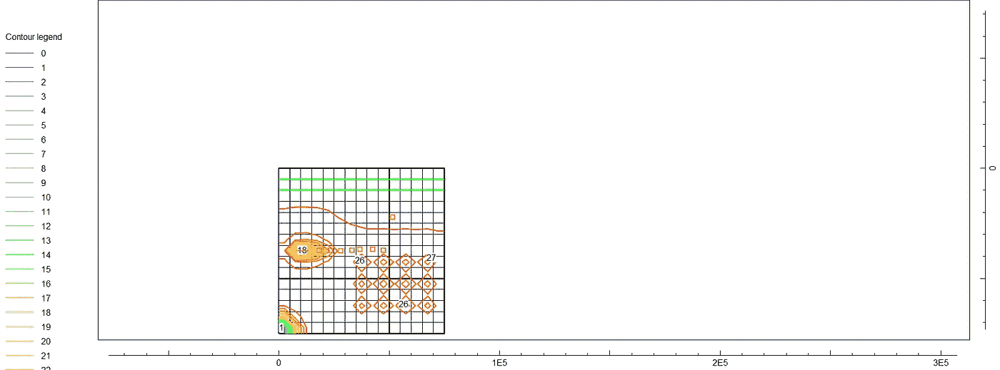

**MODFLOW 模型等高线网格**

***本文更多详情:***

[](https://aswinkvj.medium.com/integrating-modflow-modelmuse-and-fortran-81c961975b5d) [## 集成 MODFLOW、ModelMuse 和 Fortran

### https://github.com/aswinvk28/modflow_fortran

aswinkvj.medium.com](https://aswinkvj.medium.com/integrating-modflow-modelmuse-and-fortran-81c961975b5d) 

# 地下水流动模式

***流网分析*** *用于模拟含水层、弱透水层和隔水层中的地下水流线。Freeze 和 Witherspoon 开发了数学方法来模拟地形和地质对区域地下水流动模式的影响。*

***三种类型的地下水流系统为*** :局部、中间和区域。它们是由整个含水层系统的深度与横向范围之比的变化引起的。随着含水层深度的增加，水质逐层改善。由于钠浓度高，一般不适合灌溉。

# 变密度驱动流体流动

*流体静力和静力流:取决于地下土壤的渗透性和压缩性。*

****地形和压实驱动的水流*** :取决于地下水循环模式。*

*墨西哥湾的地层有:第四纪、上新世、中新世、弗里奥、维克斯堡、上克莱本、下克莱本、下威尔科克斯、古新世、上白垩纪、侏罗纪下白垩纪*

> *墨西哥湾盆地是主动沉降沉积盆地的一个例子。当含水层的渗透性、含水层中海水和地下水之间的密度差以及含水层的厚度足够大时，就会发生自由对流。*

****瑞利数*** *，Ra 给定为:**

*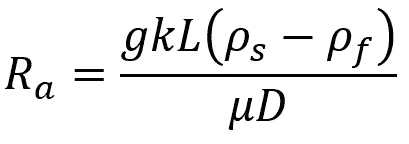*

***—瑞利数，Ra —***

*在分析 ***硼砂湖*** 上方的温泉时，热成像导致了重大发现。断层线是连接的，指示一个断层链在哪里结束，断层位移被转移到第二个断层轨迹。此外，沿着断层轨迹，泉水和地面温度变化很大。*

****表面温度越高表示流速越高。接近沸腾温度的泉水有充足的氧同位素数据，表明对泉水的补给是大气降水。****

> *热对流可能是地下水在地表来回循环的主要机制，同时伴随着更浅的地形驱动流。*

****利用一维热流模型的野外观测给出了断层渗透率分布的信息。一个更详细的模型描述了热对流驱动的水流以及地下水排放率和表面温度的可变性，该模型在统计上也与现场观测结果相当。****

*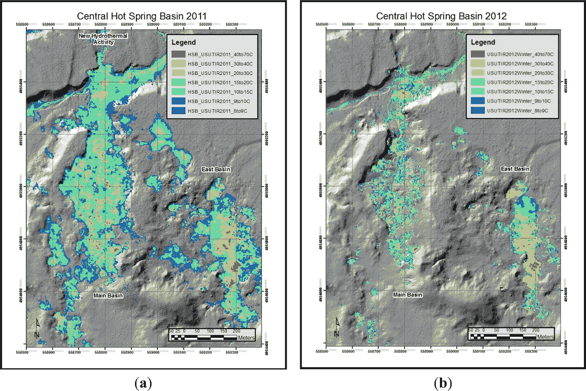*

***2011 年至 2012 年中央温泉盆地变化***

*水的盐度决定了它在沿海地区和含水层的发展阶段。因此，年龄可以通过同位素的存在来确定。地下蓄水层、海水和地下水盐化的过程已在下文解释。*

*自由对流是海水越过含水层导致含水层盐化的原因。当自由对流不可能时，地下水会因分子扩散过程而盐化。*

**沉积盆地的沉降、造山运动、海平面波动和冰川作用会对地下水运动的速度和方向产生深远的影响。**

**需要注意的是，地质过程会持续数千年甚至更长时间，地下水过程会随着边界条件的变化而缓慢发生。**

# *质量作用定律*

*当化学反应处于平衡状态时，反应物和产物之间的关系。*

*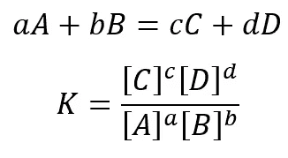*

***—质量作用定律—***

*吸附发生在地下水位，离子交换导致重金属和极性有机化学物质的迁移。离子交换过程会导致天然材料的渗透系数发生变化。例如， **Ca2+** 离子比 **Na+** 离子更强地被带负电的材料如粘土吸附，因此离子周围的水量将减少。能量吸收顺序为:**Ca2+>Mg2+>K+>Na+***

*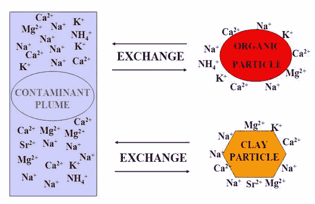*

## *水化学数据的图示(Piper 图)*

*[Piper plot:USGS-R/smwrGraphs 中的 Piper 图:绘图函数(rdrr.io)](https://rdrr.io/github/USGS-R/smwrGraphs/man/piperPlot.html)*

*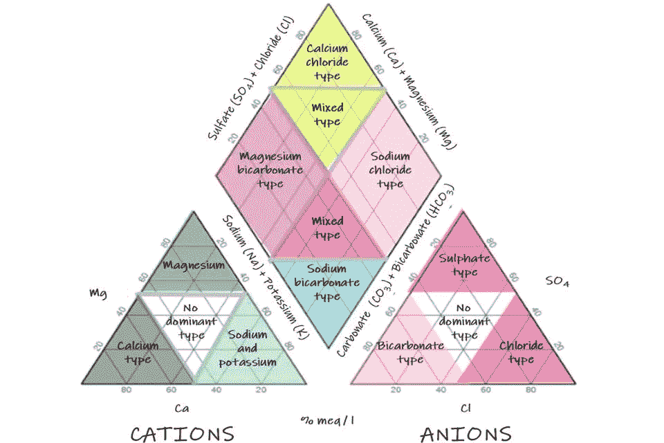*

***风笛图详情***

****Google Drive 中的一个 Piper Excel 文件:****

*[](https://docs.google.com/spreadsheets/d/1x3vt9Ls9E6iJIN786oYkr6o5-ENWNIam5ZAtpXwb_Lo/edit?usp=sharing) [## 风笛图

### 表 1 钙，镁，钠+钾，氯+其他，碳酸盐+碳酸氢盐，硫酸盐 0.2，1，0.9，0.2，0.9，1.1 0.4，2，1.1，0.9，1.9，2.1…

docs.google.com](https://docs.google.com/spreadsheets/d/1x3vt9Ls9E6iJIN786oYkr6o5-ENWNIam5ZAtpXwb_Lo/edit?usp=sharing) 

***风笛图使用微软 R 打开***

```
**# import library smwrGraphs, install the library using remotes**
library("smwrGraphs")**# read csv downloaded from the google drive excel file**
df = read.csv("piper-Diagram.csv")**# plot piper plot**
piperPlot(
    xCat = df['Ca'], yCat = df['Mg'], 
    zCat = df['Na...K'], xAn = df['Cl...other'], 
    yAn = df['Carbonate...Bicarbonate'], zAn = df['Sulfate']
)
```


**风笛图**

*氧化还原反应对铁、锰等一些微量元素在地下水中的溶解度和迁移具有控制性影响，对****NO3-****和* ***SO4 2-等氧化还原敏感物种也具有控制性影响。*** *与氧化还原反应相关的问题有:(1)地下水质量，(2)垃圾渗滤液羽流衰减，(3)场地修复。*

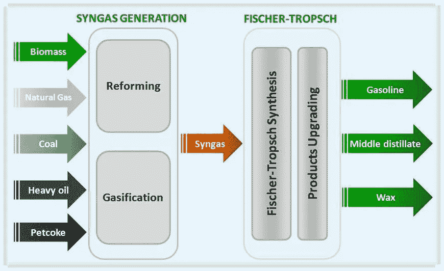

**费托法——将煤、重油转化为汽油**

***封闭系统中氧化还原过程的顺序:***

*封闭系统描述了含有溶解氧化物质和过量溶解有机碳(DOC)的地下水。一个封闭的系统对其它氧化剂或氧化物质的输入是封闭的。*

*   *有氧呼吸*
*   *脱氮*
*   *锰(四价)还原*
*   *铁(III)还原*
*   *硫酸盐还原*
*   *甲烷减少*
*   *固氮*

***开放系统中氧化还原过程的顺序:***

*在开放系统中，过量的溶解氧会与还原的物质发生反应，例如****【HS-】****和****【NH4+】****(例如:-垃圾渗滤液+地下水)。*

*   *有氧呼吸*
*   *硫化物氧化*
*   *Fe(II)氧化*
*   *硝化作用*
*   *锰(II)氧化*

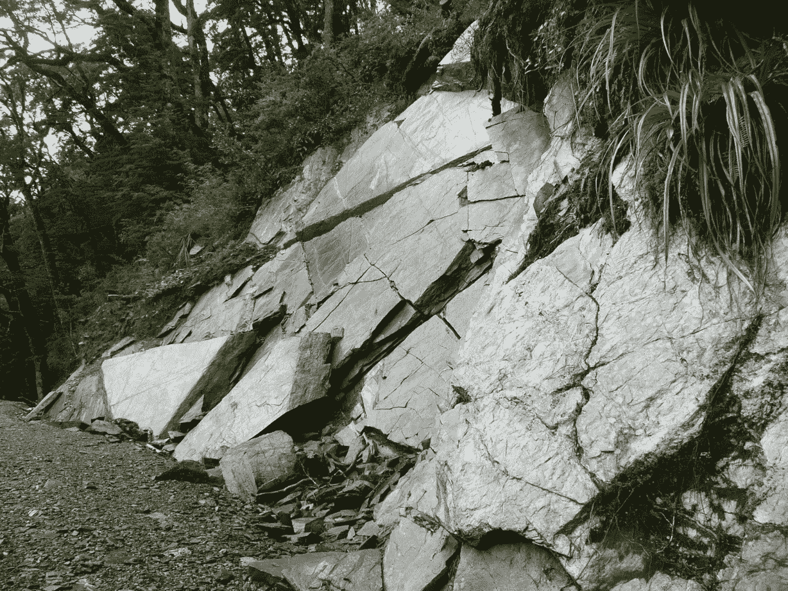

**—岩石风化—*** 

# *稳定同位素化学*

****在地下水中发现了溶解的大气惰性气体以及水的稳定同位素(16O、18O，1H、2H)的浓度，它们提供了含水层演化的信息。****

***同位素丰度**用千分之几表示， **𝛿** 通过了解 **𝛿.的比率图，给我们提供了混合物中是否存在稀有的重同位素***

*在液态即水中，重同位素与轻同位素的浓度比表示为:*

*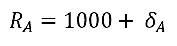*

*在蒸汽状态下，重同位素与轻同位素的浓度比表示为:*

*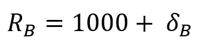*

****分馏系数表示为 A 相与 B 相之比:****

**

****分馏系数(液体变成水蒸气):****

*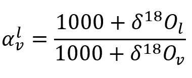*

****同位素降水与热带风暴的关系:****

*由于水蒸气穿过大陆地区向内陆移动，蒸发和冷凝的过程重复多次。地下水同位素丰度数据表明存在大气降水，并用于确定地下水水文过程的年龄。热带风暴降低了同位素丰度比，而没有热带风暴则提高了同位素丰度比。*

> *第二部分详细的水文地质学主题和公式将尽快出版*****