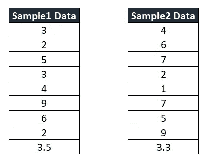
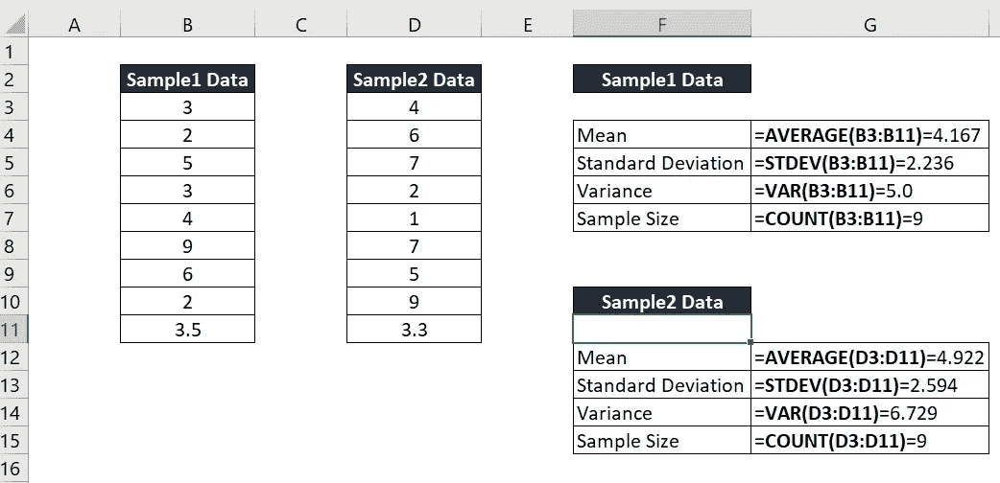

# 假设检验— 2 样本 t 检验—创建您的快速工作指南

> 原文：<https://medium.com/nerd-for-tech/hypothesis-testing-2-sample-t-test-create-your-quick-working-guide-21acef3bbc79?source=collection_archive---------11----------------------->

假设检验在许多工作领域都是非常重要的元素，包括研究和教育。许多人认为需要一个统计软件来进行假设检验——但好消息是，使用 MS Excel 公式可以非常容易地做到这一点。在这篇文章中，我将解释我们如何使用 MS Excel 进行 2 样本 t 检验。在我们继续之前，如果您还没有阅读我的文章[假设检验—一个样本 z 检验—如何使用 MS Excel 创建您的快速工作簿](/nerd-for-tech/hypothesis-testing-one-sample-z-test-how-to-create-your-own-template-using-ms-excel-6d7b1fd8ab73)，请您花 5 分钟阅读这篇文章。你也可以访问我在 https://www.facebook.com/FBTrainBrain[的脸书页面来获取这些有趣的文章。](https://www.facebook.com/FBTrainBrain)

2 样本 t 检验用于检验两个独立组的未知总体均值是否相等。

在本文中，我们将学习如何在*等样本量等方差*场景中进行 t 检验。

我们将了解以下两种测试方法:

*   **p 值方法**
*   **临界值方法**

让我们形成问题陈述并查看数据集:

**总体 1 的平均值(未知):** m1

**总体 2 的平均值(未知):** m2

**零假设(Ho) :** m1 **=** m2

**交替假设(Ha) :** m1 **不等于** m2

*基于零备假设，这是一个* ***两尾检验***

**置信度:** 0.05

现在让我们看看数据集:

样本数据集

对于上述每个样本数据，让我们首先使用简单的 excel 公式计算:**平均值、标准差、方差和样本量**，如下所示:

图片 1

**p 值法:**

首先我们要计算**t**统计值。数学上**t**统计量定义为:

**(** 样本 1 表示 **—** 样本 2 表示 **) /【平方根(**样本 1 标准差+样本 2 标准差 **) /** 样本量**)】**

使用上面的公式，让我们计算一下本例中的 **t 统计量**。*继续参考图 1*

**t 统计量**=(G4-g12)/**sqrt**(((G5 ^ 2)+(G13 ^ 2))/G7)=-**0.66183*假设-0.66183 的 t 统计量保存在单元格 g16***

由于这是一个双尾检验，因此计算 **p 值**的公式为:

TD ist(<t statistic="" value="">、<degrees of="" freedom="">、<tail>的绝对值)</tail></degrees></t>

**p 值**=**TDIST**(**ABS**(G16)，G7+G15–2，2)= **0.5174**

**TDIST** 是一个用于 t 分布的 excel 函数

**ABS** 是用于计算绝对值的 excel 函数

**基于 p 值的结论** : *由于 p 值(0.5174)大于显著性水平(0.05)，我们无法拒绝零假设*

**注**:

**对于左尾翼测试:**

*   如果 **t 统计量** > 0，则 p 值= 1—**t 统计量** ( < t 统计量>、<自由度>、<尾部>)
*   如果 **t 统计量** < 0，则 p 值= 1-(1—**t 统计量**(t 统计量>、<自由度>、<尾部>的绝对值)

**对于右尾测试:**

*   如果 **t 统计量** >为 0，那么 p 值=**t 统计量** ( < t 统计量>，<自由度>，<尾部>)
*   如果 **t 统计量** <为 0，则 p 值= 1—**TDIST**(t 统计量<的绝对值>、<自由度>、<尾部>)

**临界值方法**

我们已经知道 **t 统计量**的值是- **0.66183** ( *，这个值保存在 excel 表*的 G16 单元格中

对于临界值方法，我们首先需要计算上临界值和下临界值:

**上临界值** = **TINV** ( 2* <显著水平>，<自由度> ) = **TINV** (2*0.05，G7+G15–2)=**1.7458**

**下临界值** = - **TINV** ( 2* <显著性水平>，<自由度> ) = - **TINV** (2*0.05，G7+G15–2)=-**1.7458**

**基于临界值的结论** : *由于 t 统计量(-0.66183)在临界值区间[-1.7458，1.7458]内，我们无法拒绝零假设*

**重要提示:**

*   对于左尾试验 **t** **临界值**计算为- **TINV** ( 2* <显著性水平>，<自由度>)
*   对于右尾试验 **t** **临界值**计算为 **TINV** ( 2* <显著性水平>，<自由度>)

感谢您有兴趣阅读这篇文章。请关注这个空间，了解更多类似的便捷技术。