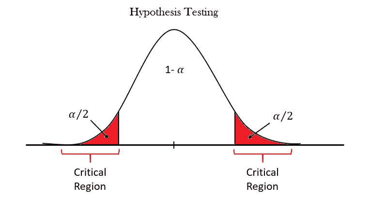
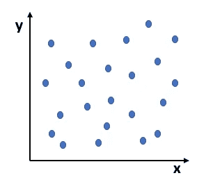
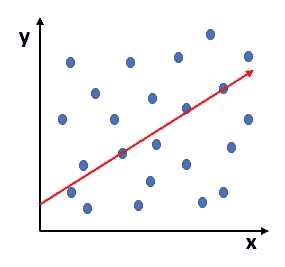
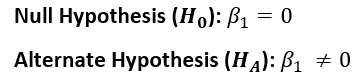
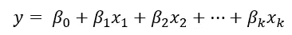
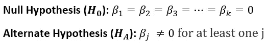
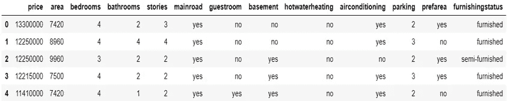
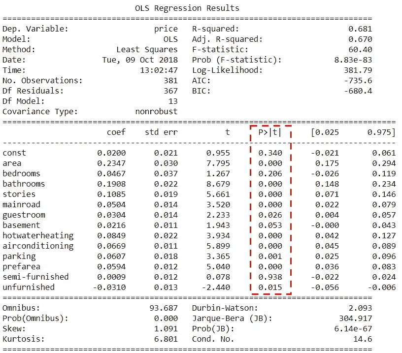

# 线性回归的假设检验

> 原文：<https://medium.com/nerd-for-tech/hypothesis-testing-on-linear-regression-c2a1799ba964?source=collection_archive---------0----------------------->



当我们建立多元线性回归模型时，我们可能会有一些潜在的预测因子/独立变量。因此，选择真正显著的、对实验有强烈影响的变量是极其重要的。为了得到最优模型，我们可以尝试所有可能的独立变量组合，看看哪个模型最合适。但这种方法耗时且不可行。因此，我们需要另一种方法来得到一个合适的模型。我们可以通过**手动特征消除**或者通过使用任何**自动方法** (RFE、正则化等)来做同样的事情。).

在手动特征消除中，我们可以:

*   建立一个具有所有特征的模型，
*   丢弃对预测帮助最小的特征(高 p 值)，
*   丢弃冗余的特征(使用相关性和 VIF)，
*   重建模型并重复。

一般建议我们遵循平衡的方法，即使用自动(粗调)+手动(微调)选择的组合，以便获得最佳模式。在这篇博客中，我们将讨论手动特征消除的第二步，即丢弃对预测帮助最小的特征(无关紧要的特征)。

首先出现的问题是:' ***我们所说的重要变量是什么意思？***’。我们先用简单的线性回归来理解一下。

当我们通过数据拟合直线时，我们得到两个参数，即截距(β₀)和斜率(β₁).


现在，β₀现在不是很重要，但β₁周围有几个方面需要检查和核实。假设我们有一个数据集，其散点图如下所示:



散点图

当我们在 Python 中对此数据集运行线性回归时，Python 将在数据上拟合一条线，如下所示:



我们可以清楚地看到，数据是随机分散的，似乎不遵循线性趋势。 ***Python 无论如何都会使用最小二乘法拟合一条穿过数据的直线。*** 我们可以看到，在这种情况下，拟合线是没有用的。因此，每次进行线性回归时，我们都需要检验拟合的直线是否显著(换句话说，检验β₁是否显著)。同样，我们将对β₁进行假设检验。

**执行假设检验的步骤:**

1.  设定假设
2.  设定决策的重要性水平和标准
3.  计算测试统计数据
4.  决定

**步骤 1:** 我们开始说β₁不重要，即 x 和 y 之间没有关系，因此斜率β₁ = 0。



**步骤 2:** 通常，我们将显著性水平设置为 10%、5%或 1%。

**第三步:**在制定零备假设后，下一步要遵循的顺序是使用 **p 值法**做出决策如下:

1.  计算分布平均值的值 **t-score** 。


其中，μ是总体均值，s 是样本标准差，除以√n 也称为标准差。

2.使用 t 表，根据给定 t 分数的累积概率计算 **p 值**

3.根据关于显著性水平给定值的 p 值做出决定。

**第四步:**做决定

如果，

p 值< **0.05** ，我们可以拒绝零假设。

p 值> **0.05** ，我们未能拒绝零假设。

如果我们不能拒绝零假设，这将意味着β₁是零(换句话说，β₁是微不足道的)，在模型中没有用。同样，如果我们拒绝零假设，这将意味着β₁不是零，拟合的线是一个重要的。

**注意:**以上步骤由 Python 自动执行。

类似地，在多元线性回归中，我们将执行与线性回归相同的步骤，除了无效假设和替代假设不同。对于多元回归模型:



# **Python 中的例子**

让我们以包含德里地区房产价格的房产数据为例。我们希望利用这些数据，根据面积、卧室、停车场等重要因素，优化房产的销售价格。

数据集的前五行如下所示:



住房数据集

在准备、清理和分析数据后，我们将使用所有变量建立一个线性回归模型(使用 ***statsmodels*** 通过数据拟合一条回归线)

```
import statsmodels.api as smy_train = housing_dataset.pop('price');X_train = housing_dataset;X_train_lm = sm.add_constant(X_train)lm = sm.OLS(y_train, X_train_lm).fit()print(lm.summary())
```

我们得到以下输出:



观察 P 值(P>|t|)，一些变量如**卧室、半装修的**并不显著(p > 0.05)。我们可以简单地去掉 p 值最高、不重要的变量。

**结论:**一般我们用两个主要参数来判断不显著变量， **p 值**和 **VIFs** (方差膨胀因子)。