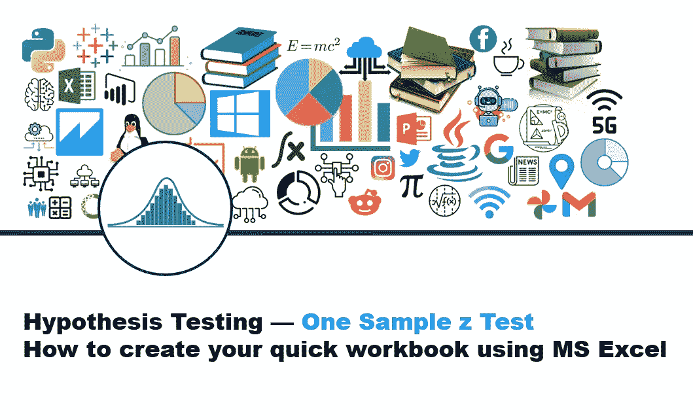
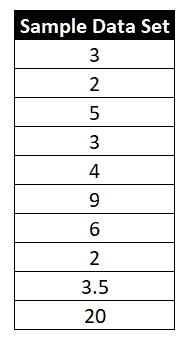
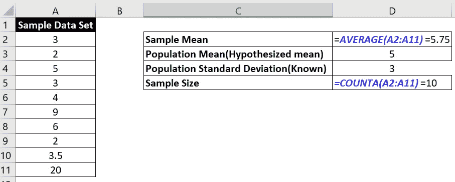

# 假设检验—一个样本 z 检验—如何使用 MS Excel 创建快速工作簿

> 原文：<https://medium.com/nerd-for-tech/hypothesis-testing-one-sample-z-test-how-to-create-your-own-template-using-ms-excel-6d7b1fd8ab73?source=collection_archive---------7----------------------->

很多时候，我们需要在日常工作中进行假设检验，但是我们可能没有专业的统计工具。没问题！MS Excel 是执行数据分析的良好媒介——我们甚至可以使用 Excel 公式在 MS Excel 中执行假设检验。

假设检验可以通过以下两种方式进行。我们将看到如何使用 excel 公式来使用这两种方法。

1.  **p 值方法**
2.  **临界值逼近**

让我们先举个例子，形成假设。

假设我们有以下数据集值:

让我们现在形成假设:

**假设假设平均值** : 5

**零假设**:总体均值= 5

**替代假设**:群体均值为< > 5

基于交替假设，这是一个**双尾检验** ( *因为交替假设说“不等于”5，这意味着该值可以大于或小于 5 )*

**假设总体标准偏差** : 3

**假设显著性水平(α)**= 5%或 0.05

**上面给出的样本数据的计算平均值** = 5.75(使用 MS Excel 的**平均值**公式计算该值)

现在我们有了继续进行所需的信息，让我们首先从 **p 值**方法开始

**p 值法:**

首先我们要计算 **z 统计**值。数学上 **z 统计量**定义为:

**[(样本均值—总体均值)] / [(总体标准差/平方根(样本大小))]**

按照以下步骤计算 z 统计值:

**z 统计**=(D2-D3)/(D4/**SQRT**(D5))=**0.7906(***)假设 z 统计值在 excel 表* **)** 的 ***单元格 D6***

*现在使用以下公式计算 **p 值**:*

***p 值**= 2 ***NORMDIST**(-D6)=**0.4292**[*这里 NORMDIST 是 excel 函数，D6 是保存 z 统计值 0.7906 的 excel 单元格* ]*

***重要提示:***

*   *excel 公式 NORMDIST(z)给出了 z 值左侧的面积，因此对于**左尾测试** p 值= **NORMDIST(z)***
*   *excel 公式 NORMDIST(z)给出 z 值左侧的面积，因此对于**右尾测试** p 值= **1- NORMDIST(z)***
*   *excel 公式 NORMDIST(z)给出 z 值左边的区域，因此对于**双尾检验** p 值= **2 * (1-NORMDIST(z))** 或 **2 * (NORMDIST(-z))***

***基于 p 值的结论** : *由于 p 值(0.4292)大于显著性水平(0.05)，我们无法拒绝零假设**

*— — — — —这包括 **p 值**方法— —*

***临界值方法***

*我们已经知道了 **z 统计值**为 **0.7906** ( *，这个值保存在 excel 表*的 D6 单元格中)*

*对于临界值方法，我们首先需要计算上临界值和下临界值:*

***上临界值**=**norms inv**(1-(<显著性水平>/2))=**norms inv**(1-(0.05/2))= 1.96*

***下临界值** = **NORMSINV** ( ( <显著性水平>/2))=**norms inv**((0.05/2))=-1.96*

**这里的****norms inv****是 excel 函数* ***显著性水平*** *(0.05)是我们一开始就已经设定好的)**

***重要提示:***

*   *对于左尾测试 **z 临界值**计算为 **NORMSINV** ( <显著性水平>)*
*   *对于右尾测试 **z 临界值**计算为 **NORMSINV** (1- <显著性水平>)*

***基于临界值的结论** : *由于 z 统计量(0.7906)在临界值区间[-1.96，1.96]内，我们无法拒绝零假设**

*感谢您有兴趣阅读这篇文章。请关注此空间，在 MS Excel 中找到更多此类方便的技术，用于其他各种类型的假设检验。*

*您也可以观看以下相同主题的视频:*