# 我买了一台 LG 32 QHD IPS (32QN600)显示器

> 原文：<https://medium.com/nerd-for-tech/i-bought-an-lg-32-qhd-ips-32qn600-display-3aa7a4e15138?source=collection_archive---------3----------------------->

随着 Covid 的出现，随着来自家庭文化的持续工作开始在软件工程行业占据一席之地，我开始注意到我的 MacBook 的 15 英寸屏幕让我有点太受限制了。有很多屏幕之间的切换，这不仅妨碍了生产力，而 WFH，但也很烦人。每天看 8 个小时的小屏幕对眼睛也不好。所以我换了一个 22 寸 1080p 的外接显示器。现在，我有了两个屏幕来分割我的工作，很多生产力问题都解决了。22 英寸的屏幕足够大，我可以将字体大小增加到一个舒适的水平，这样就不会对我的眼睛造成太大的压力。这个屏幕在我工作、游戏、网飞和几乎所有其他事情的很长一段时间里都很好用。

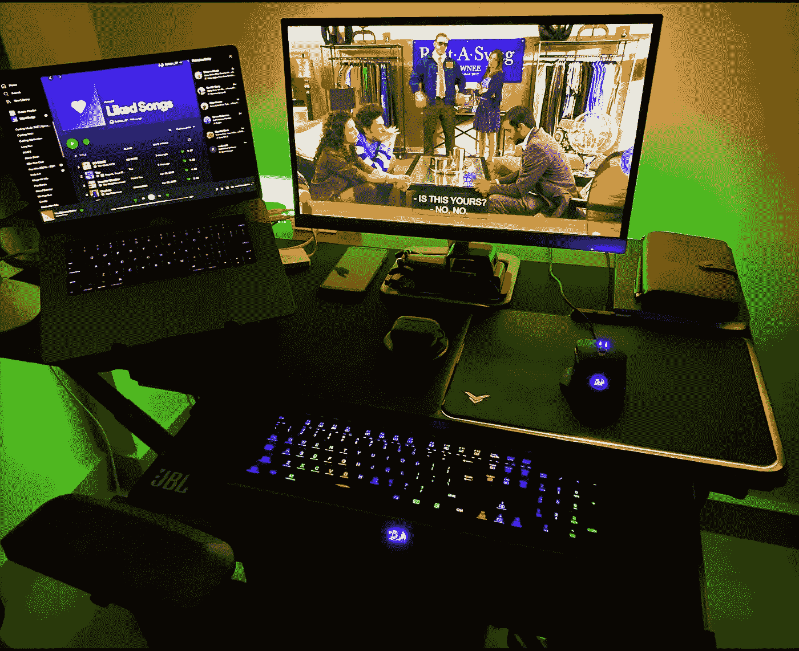

我的旧 HP 22ES 显示器从我的 MacBook Pro 15 延伸出一个屏幕

几天前，我决定升级到更大的屏幕，主要是因为 22 英寸对于电影和游戏来说太小了。我不想投资超过 25k 印度卢比(350 美元)，并根据我的预算决定 32 英寸 1440p 的屏幕应该足够好了。为什么我会这么想？基于每英寸参考像素，

> **32 英寸 1440p = 24 英寸 1080p = ~90 PPI**

我从未觉得 22 英寸屏幕的分辨率有任何问题，所以 32 英寸屏幕的 1440p 分辨率对我来说是完美的。更重要的是显示技术，我想要一个支持 HDR 的 IPS 面板。

经过大量的研究，我把清单缩小到 3 个选项——

1.  [**宏碁 EB321HQU 31.5 英寸 IPS 显示屏**](https://www.amazon.in/Acer-EB321HQU-32Inch-2560x1440-Monitor/dp/B077BSWLTL/ref=sr_1_2?dchild=1&keywords=acer+32%22+1440p&qid=1623842325&s=computers&sr=1-2)
2.  [**优派 VX 3276–2K-MHD 32 英寸 IPS 面板**](https://www.amazon.in/VIEWSONIC-VX3276-2K-MHD-32-IPS-Monitor/dp/B0787XMLZQ/ref=sr_1_3?dchild=1&keywords=viewsonic+32%22&qid=1623842490&s=computers&sr=1-3)
3.  [**LG QHD 32 寸 IPS 显示器 32QN600**](https://www.amazon.in/gp/product/B08CF59SKW/ref=ppx_yo_dt_b_asin_title_o00_s00?ie=UTF8&psc=1)

正如你从这篇博客的标题中所知道的，我选择了第三种——LG 32qn 600。这三种显示器在技术上或多或少有些相似，每种显示器都有一些其他显示器没有的功能。**LG 支持 AMD FreeSync，宏碁内置蓝光滤镜，优派支持更高的 75 Hz 帧率**。促使我选择 LG 而不是其他产品的主要原因是用户评论。尽管这三款手机的评价大多褒贬不一，但用户对 LG 的评价更为积极。

几天后，亚马逊把展示品送到了我家门口。我迫不及待地想把它放在我的桌子上，体验 32 英寸大屏幕的荣耀。

# 屏幕设置

安装屏幕非常简单，几分钟内即可完成，只需用一个卡扣将支架固定在屏幕上。**它还支持 VESA，可以安装在墙上**或 VESA 兼容支架上(如果需要)。**包装盒内有一根 HDMI 和一根标准显示器电缆，以及一根带外部电源适配器的电源线。**

在 Windows 和 MacOS 上使用该显示器几天后，我对它的看法如下。

# 设计

显示器的制造质量很好。**显示器采用无边框设计，看起来很现代**。支架呈弧形，感觉足够结实，可以承受显示器的重量。屏幕的厚度是可以接受的，它既不像一些显示器一样薄，也不太厚。

从屏幕主体到支架的所有东西都是塑料制成的，任何地方都没有金属或铝饰面。这是可以理解的，因为这是一个更注重预算的屏幕。塑料质量很好，而且感觉不便宜。

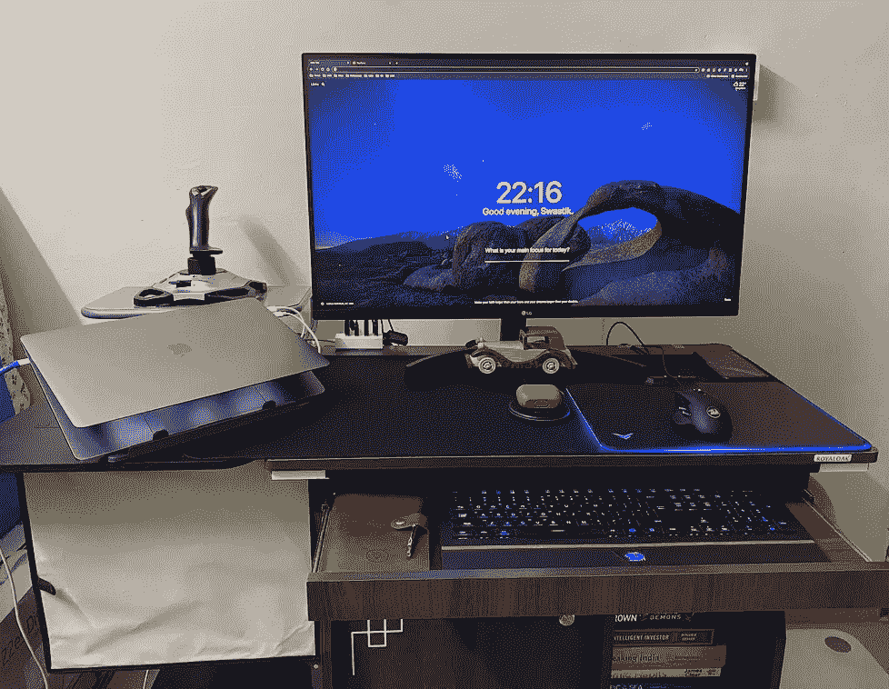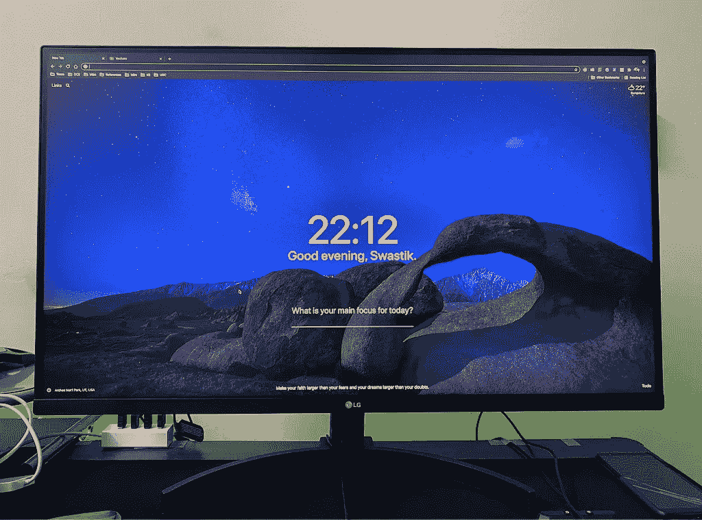

设计简单而现代

# 观看体验

默认情况下，Windows 和 MacOS 的屏幕分辨率都设置为 1440p。虽然这个分辨率可以进一步提高，但我建议不要这样做，因为它会导致锯齿边缘，因为显示器本身只能达到 1440p。

**1440 p 的显示分辨率提供了一个不错的像素密度，使屏幕保持足够清晰，适合编程、电影或游戏**。

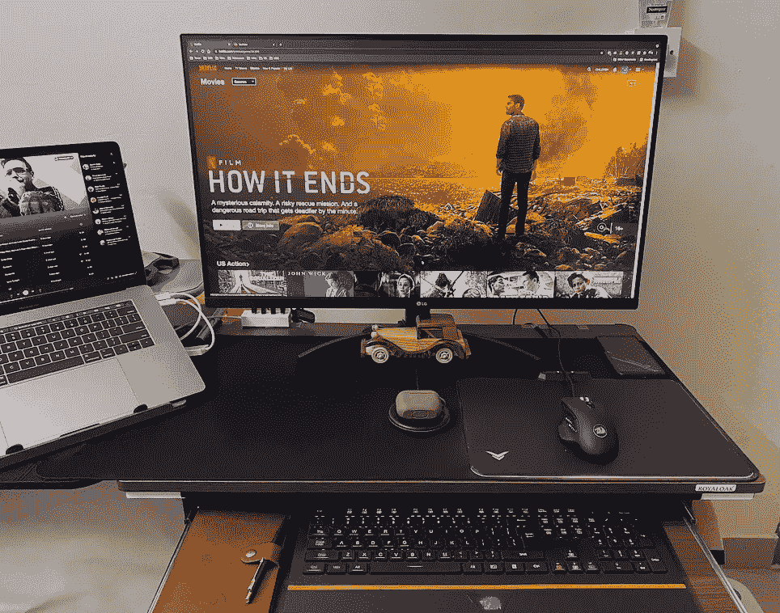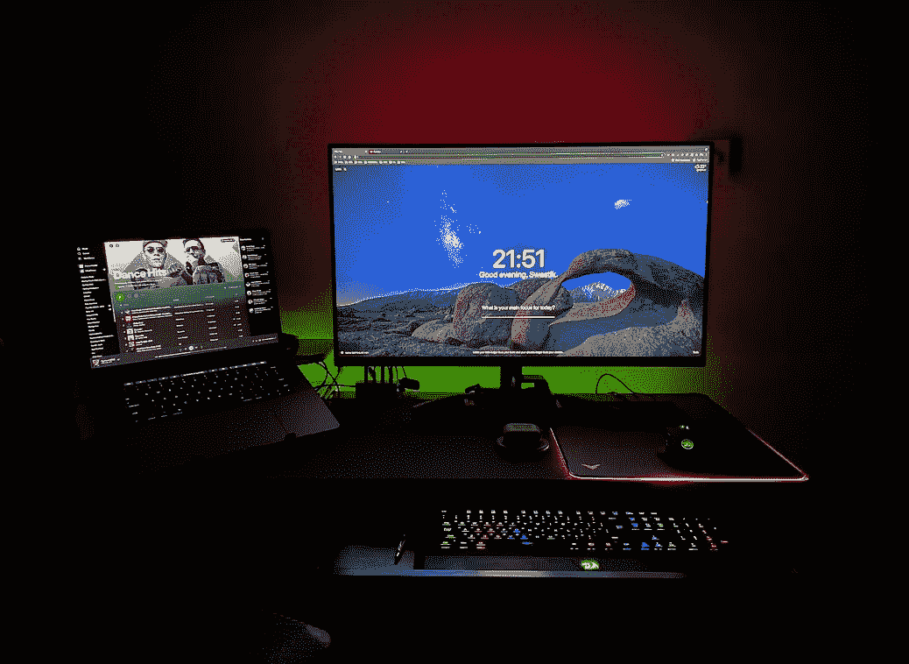

亮室与不亮室

色彩准确度出奇的好。它肯定没有我的 MacBook 准确，但对于开发者和休闲游戏来说已经足够好了。 **IPS 技术使其可以从任何角度观看，并且不会影响色彩准确度**。这在看电影时尤其有用，因为我在看电影时不会一直坐在屏幕前。该屏幕还具有抗反射涂层，有助于观看体验。

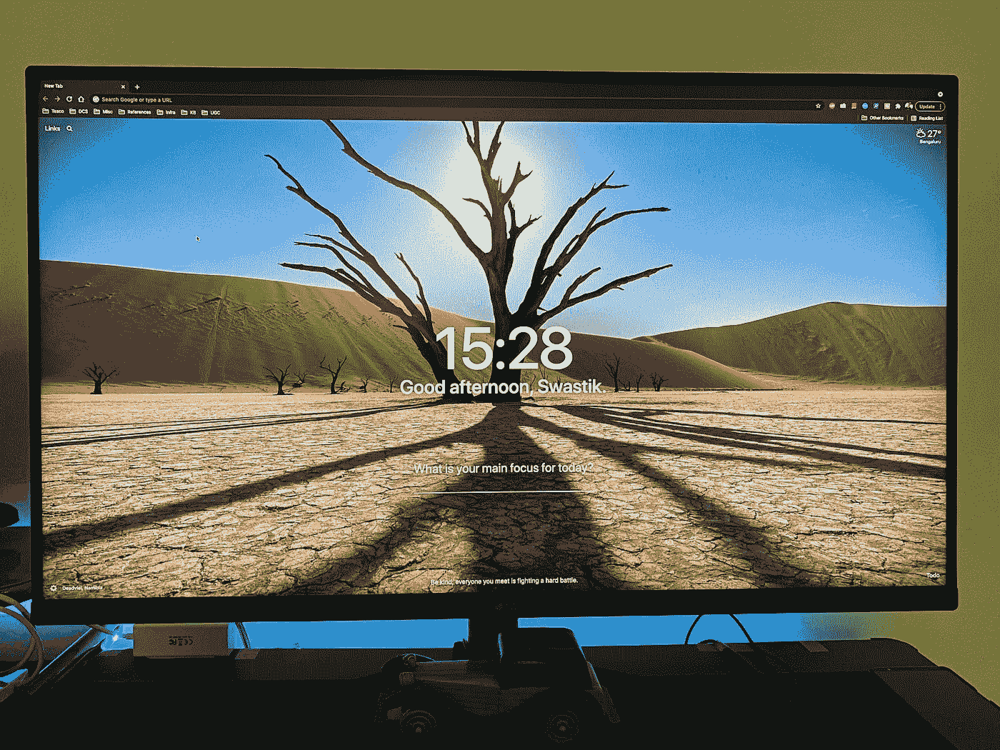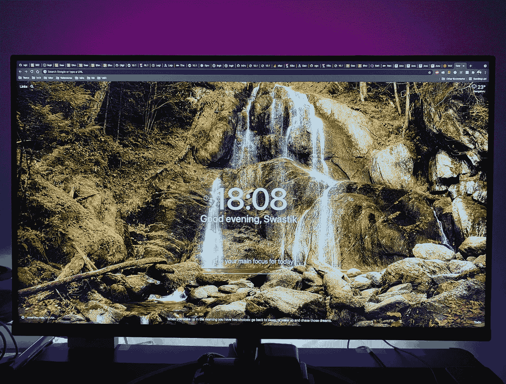

显示特写，以显示色彩的活力和准确性

值得一提的是，无论分辨率如何，32 英寸大屏幕都能让您尽情玩游戏和看电影。我在这个屏幕上对 X-Plane 11 的体验比以往任何时候都更加身临其境。我比较了这台电脑和我以前的 22 英寸电脑的屏幕，发现差别很大。

X-Plane 在 32 英寸的屏幕上感觉完全不同

# 菜单和控件

菜单中有很多选项可以控制颜色设置、FreeSync 等。奇怪的是，所有这些设置都是由一个操纵杆类型的按钮控制的，这肯定需要一段时间来适应。

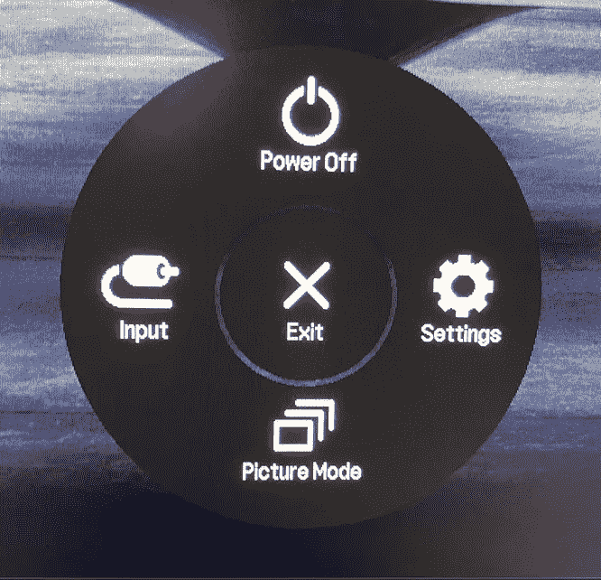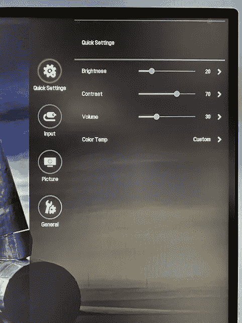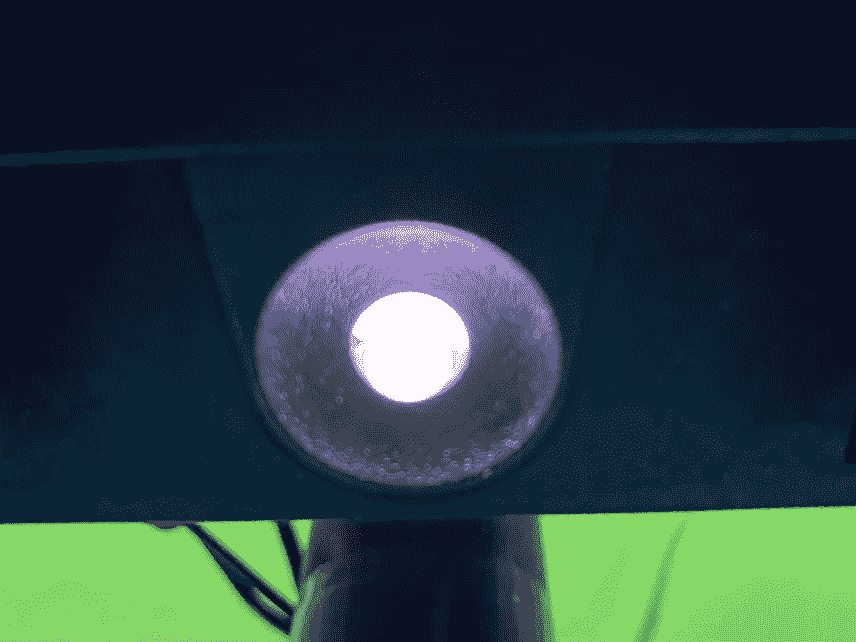

从左至右—菜单、设置和背光控制操纵杆

盒子里没有遥控器，一切都由一个操纵杆控制。**另一点需要注意的是，这个屏幕没有内置扬声器**。如果你决定将这个屏幕用作电视，你需要外置扬声器。

# 背光出血

我在阅读用户对这款显示器的评论时发现的一个主要问题是屏幕背光出血。**在全黑背景下观看时，屏幕上肯定会有一定量的背光溢出**。它在角落周围的较高亮度设置上很突出，但我非常怀疑人们会在如此高的亮度下使用这个屏幕。**我用的是 25%的浓度，在这个浓度下出血几乎不存在**。另一方面，考虑到它是在室内使用，屏幕的最大亮度是非常高的。

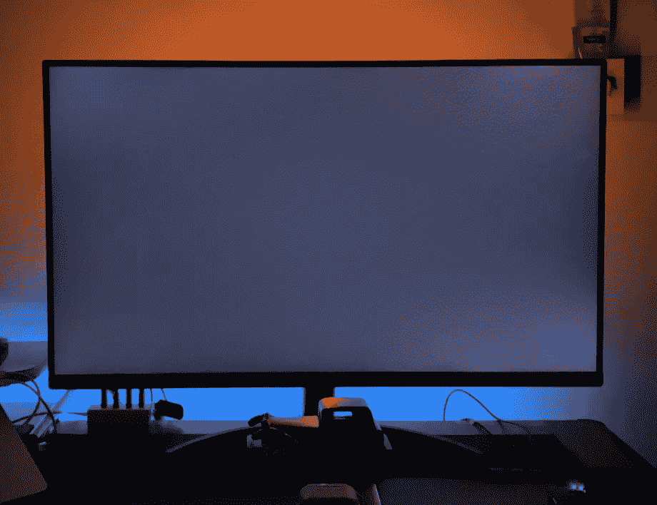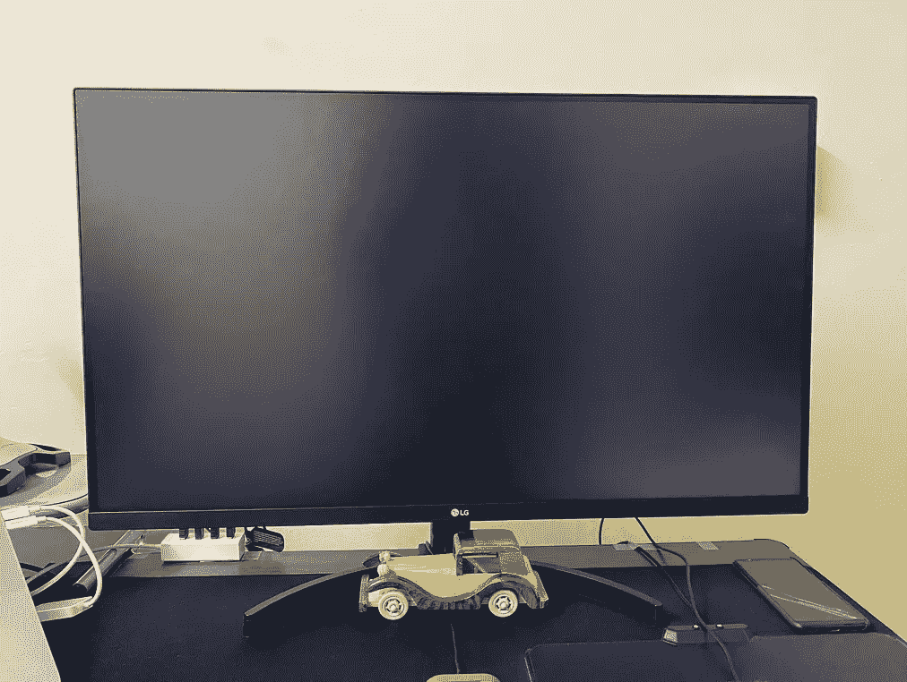

背光出血在有光和无光的房间中都是可见的。图像是在 75%背光亮度下拍摄的。

# 该不该买一个？

我明确建议在家工作的人，主要依靠笔记本电脑工作的人，安装一个扩展的屏幕，买哪个尺寸的屏幕取决于个人需要。22 英寸的屏幕很适合我的工作，我只购买了更大的 32 英寸屏幕，以获得更身临其境的游戏或电影体验。如果您在工作、游戏和看电影时都使用屏幕，我建议您升级到 32 英寸屏幕。如果您仅将显示器用于工作，尤其是软件开发，您应该坚持使用 22–27 英寸显示器，它们已经足够了。

说到显示器， [*LG QHD 32 英寸 IPS 显示器 32QN600*](https://www.amazon.in/gp/product/B08CF59SKW/ref=ppx_yo_dt_b_asin_title_o00_s00?ie=UTF8&psc=1) 是我发现的最好的显示器之一，价格在 25000 印度卢比以下。**画面质量和分辨率不错，无边框设计看起来很现代，整体而言，显示屏非常坚固**。当然有背光出血的问题，但对我来说，这是微不足道的，足以完全忽略不计。