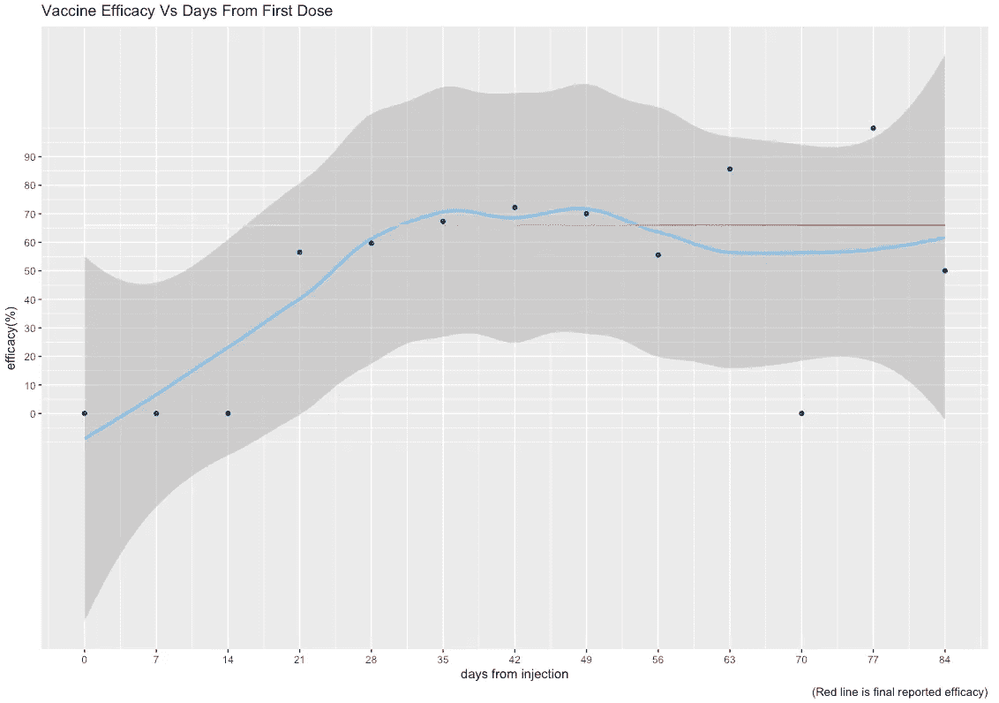
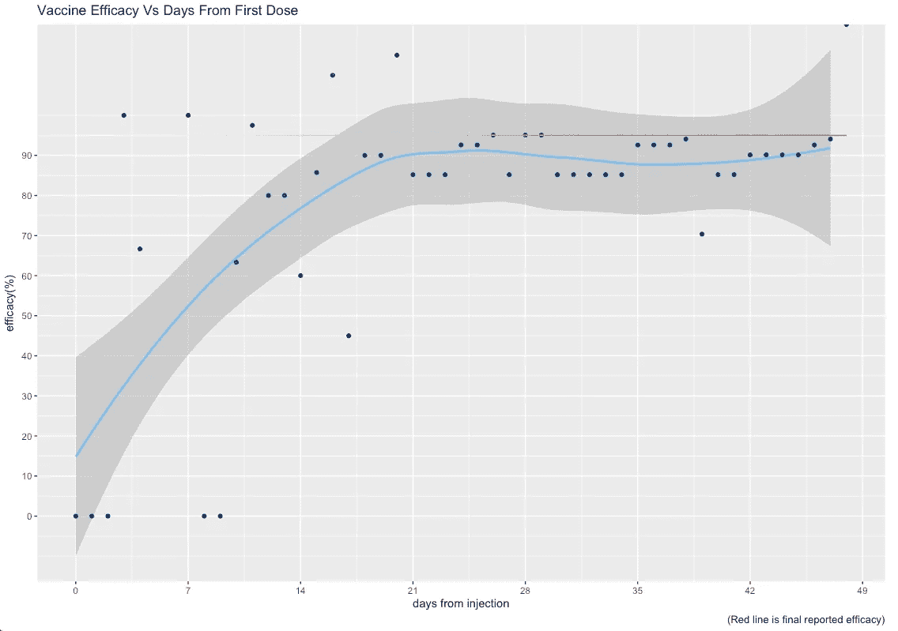
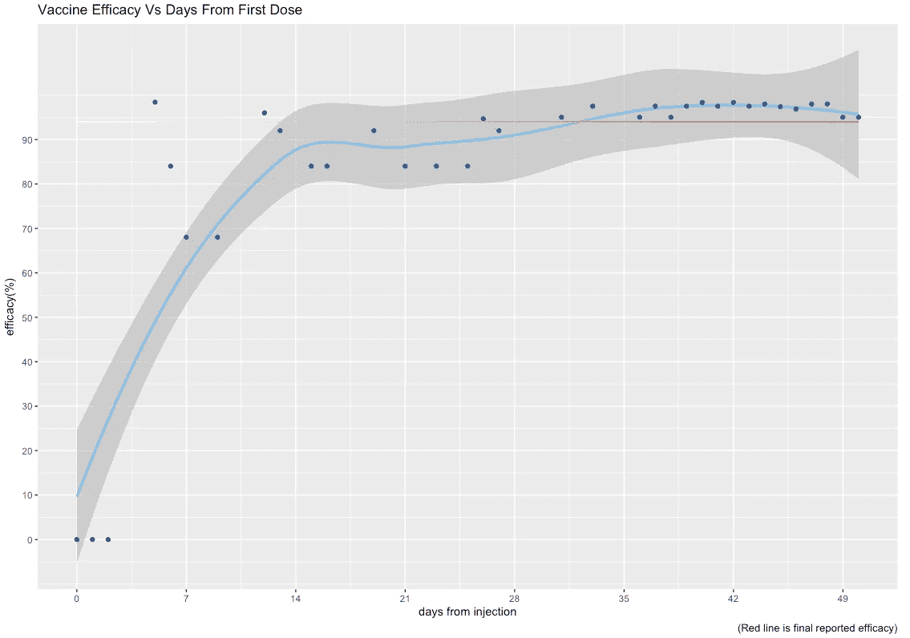
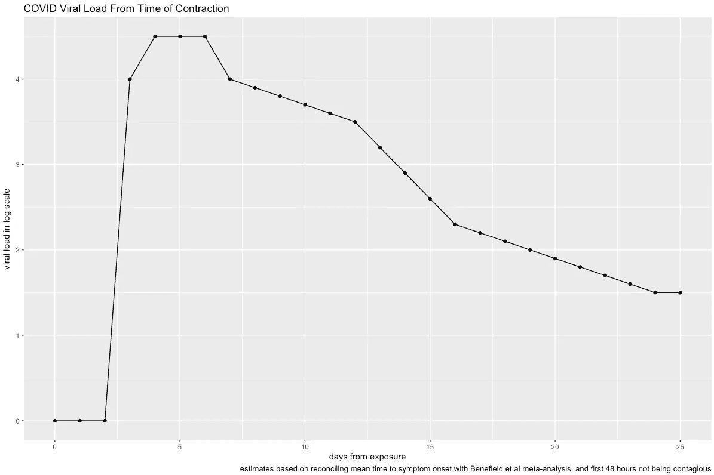
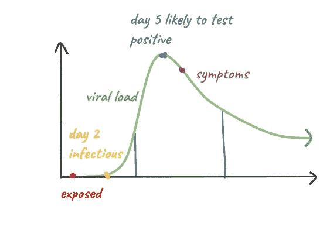
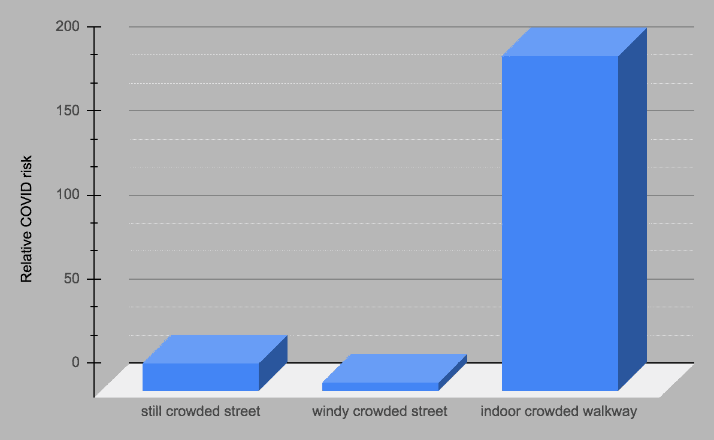
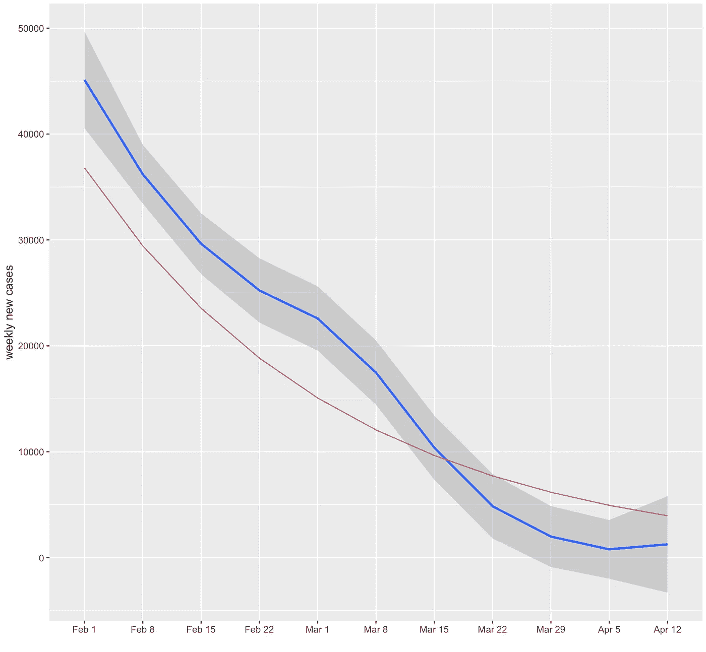
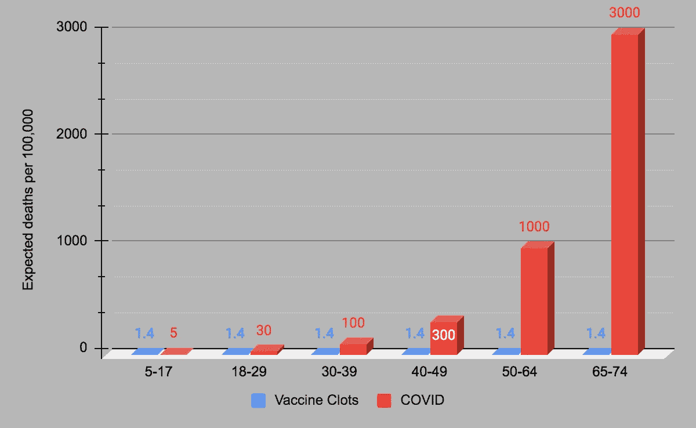
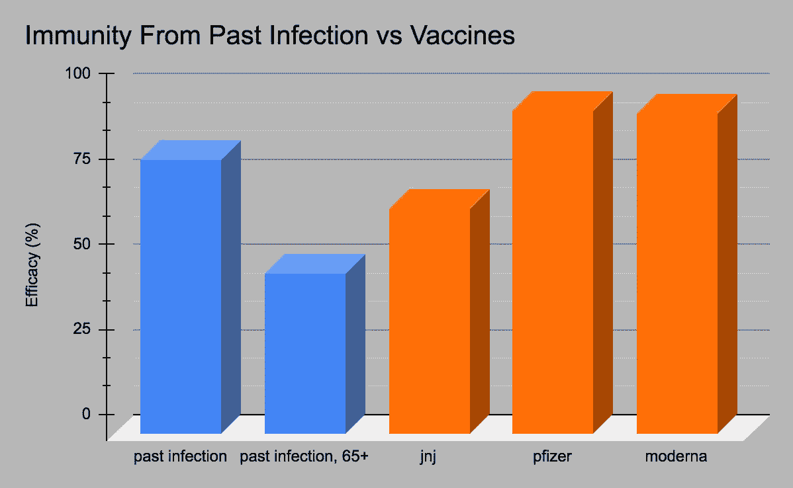

# 我刚接种了疫苗。我免疫了吗？疫苗试验的数据表明

> 原文：<https://medium.com/nerd-for-tech/i-just-got-my-vaccine-am-i-immune-yet-what-data-from-vaccine-trials-suggests-ad772d7eb71?source=collection_archive---------8----------------------->

强生疫苗注射后每天的效力

无论你在接种疫苗后的头几天是否想知道你的免疫力，如果你过去的感染给了你免疫力，或者我们是否会达到群体免疫力，我把 5 个图放在一起给这些问题简单，直观，难忘的答案。

## 我什么时候免疫？

问:我刚刚接种了疫苗。我免疫吗？

对于强生公司，以下是自给药以来报告的疫苗效力百分比(解释为从您获得 COVID 的基线风险开始的风险降低百分比)。[1]

资料来源:让桑单剂量新冠肺炎疫苗概述，Ad26。COV2.S，2021 年 2 月[2]

JnJ 疫苗在免疫力真正开始发挥作用之前需要几个星期，尽管见脚注解释为什么这可能是一个保守的估计。

对于辉瑞来说，免疫力似乎发挥得更快，大约一周后达到 50%:

来源:BNT162b2 mRNA 新冠肺炎疫苗的安全性和有效性，NEJM 2020 [3]

类似地，对于 Moderna，疫苗在大约一周后达到 50%的效力:

来源:mRNA-1273 新型冠状病毒疫苗的有效性和安全性，NEJM 2020 [4]

## 我什么时候会传染？

问:我刚刚接触到一个患有 COVID 的人。我能把它传过去吗？

首先，你应该考虑你的风险有多高。你们是在室内、近距离、交谈或锻炼，并且在一起很长时间吗？这个人感染过其他人吗？这些问题对于理解你感染的风险是最重要的。

如果你这样做了，这就是你的传染性会是什么样子。在 48 小时内，你不能传播它。病毒仍在潜伏期。在那之后，你可能会很快变得最具传染性，在暴露后 5 天左右达到顶峰。这是你最有可能出现症状的时候。从那以后，你的传染性会越来越小，直到痊愈。我用我的情节诠释了这个叙事。这在一定程度上是猜测，患者之间有很多差异。需要知道的最重要的事情是，暴露后的头两天是安全的，而症状开始前的四天是最不安全的。

我的方法是:头两天必须为零。症状通常在第 5 天左右开始。病毒载量会在那时达到峰值。一个巨大的病毒载量的荟萃分析给出了从那时起病毒载量的一个非常可靠的估计。所以我从零开始，填写第 3 天和第 5 天之间的初始峰值，然后复制荟萃分析中的病毒载量图。

这是 R 中难看的图形:

来源:[5]、[6]

我画了一张更漂亮的图:

来源:[5]、[6]

此外，在第 5 天和第 6 天左右，聚合酶链式反应测试确认您患有 COVID 的可能性超过 50%。这就是暴露的问题——你必须等待一段时间，测试才能确认你是否患有 COVID。即使在暴露 5 或 6 天后，你的阴性测试也有大约 50%的几率是假的。

## 我哪里有危险？

问:我应该在户外戴口罩吗？等等。

在室内，通风不良，不戴口罩，长时间靠近一个仍有传染性的已知传播者，或许多人。再说一遍。室内，低通风——好的，重点是在不同的情况下有很大的风险范围。

这里有一个例子，里面和外面得到 COVID 的相对风险。

资料来源:2021 年新冠肺炎室外与室内空气传播病毒的简单定量评估[7]。注意，“拥挤”是指每平方米 1 人。

这是从一个室内外气流的理论模型得出的。与室外相比，室内感染 COVID 的风险要高几个数量级，主要是因为建筑物内的空间比人们在室外呼吸时 COVID 颗粒扩散的空间小得多——有风时约为 10 倍甚至 100 倍。

## 群体免疫可能吗？

问:群体免疫可能吗？

A.在采取任何免疫或公共卫生措施之前，COVID 的基本生殖数(R0)为 2.5。为了实现群体免疫，实际繁殖数(R)需要小于 1。从数学上讲，60%的人需要对这种情况有免疫力。事实上，像戴口罩和社会距离这样的公共卫生措施可以在降低免疫力的同时降低抗药性。在疫情的整个过程中，R 似乎一直在 0.8-1.5 的范围内徘徊。[8]

到 2 月 1 日，20%的以色列人接种疫苗已有 3 周，此前感染过抗体的人增加到 10%。如果以色列的 R 约为 1，20%的额外免疫力将使其降至 0.8 左右(略高，因为疫苗不是 100%有效，但我只是在这里做出估计)。我绘制了他们的 COVID 仪表板，从那一点开始，沿着指数衰减线 R = 0.8，每周。[9]

红色:指数衰减(R = 0.8，每周)。蓝色:以色列实际 COVID 每周新病例

每个 covid 患者感染的其他人不到 1 人。没有足够多的人被感染，病毒无法跟上。因此，以色列 COVID 病例中的指数*衰减*。

## 疫苗血凝块有风险吗？

问:JnJ 会杀我吗？？？？

这将是一个很大的惊喜，即使只是惊喜。我不得不制作这个 3D 图，以显示 JnJ 血凝块的风险与 COVID 的死亡风险相比。我甚至将 COVID 风险降低了 90%,因为你可能不会得到 COVID，所以这代表了你的原始风险，要么像往常一样不接种疫苗，希望你不会得到 COVID，要么得到 JnJ。JnJ 血凝块的比率对于没有激素避孕的人来说可能是夸大的，而 COVID 死亡率对于没有潜在疾病的人来说是夸大的。这些误差的数量级相似，所以我忽略了它们。

来源:[10]

## 我已经有了 COVID。我免疫吗？

问:我已经接种了 COVID，能获得多少免疫？

与疫苗相当，除非你老了。在丹麦，科学家们跟踪了 2020 年对他们的人口进行的超过 1000 万次 COVID PCR 测试。他们把这项研究分成两组。第一组是在第一波测试中 COVID 呈阳性的人，第二组是没有呈阳性的人。然后他们在第二波测试中检查病人，看看第一组是否比第二组测试阳性的频率低。这表明过去的感染产生了一定程度的免疫力。

他们发现，有过感染史的人再次检测呈阳性的可能性降低了 80.5%。在 65 岁以上的人群中，他们再次感染的风险仅降低了 47.1%。这同样适用于 7 个多月后获得 COVID 的 3 个月。下图比较了既往感染的免疫力和疫苗获得的免疫力:

来源；评估 2020 年丹麦 400 万 PCR 检测个体对新型冠状病毒再感染的保护作用:一项人群水平的观察性研究[11]

如果我们假设感染 COVID 的人平均生活风险更高，并且在感染 COVID 后平均承担更多风险，理由是他们受到某种免疫保护，我认为这些数字会更高。

我还认为对严重感染的保护与疫苗相当(95-100%)，尽管该研究没有解决这个问题。

这项研究还参考了其他两项同类研究；卡塔尔的一项研究对 43，000 人进行了随访，发现 95%的人免受再次感染，另一项英国研究对 20，000 名医护人员进行了随访，发现再次感染的风险降低了 83%。

声明:我在收集数据时走了一些捷径。对于免疫图，我只有图表可以使用，所以我对点数的精确值的猜测可能是+/- 10%。我只是看着图，猜测点与 x 轴和 y 轴相交的位置。对于感染的时间线，该图是说明性的。因此没有正式的轴。

数据:下面是我的 GitHub 库。[12]

## 来源

[1]这条线可能低估了疫苗效力，因为它包括了在实验开始时可能患有 COVID 的人。它显示出较低的效力，因为接种疫苗的人可能只是已经有了 COVID。这可能在第一周或第二周有最大的扭曲，当那些试验参与者记录他们的阳性结果时。之后，图表很可能是正确的。

[2][https://www . CDC . gov/vaccines/acip/meetings/downloads/slides-2021-02/28-03-01/02-COVID-douoguih . pdf](https://www.cdc.gov/vaccines/acip/meetings/downloads/slides-2021-02/28-03-01/02-COVID-Douoguih.pdf)。从图表上看

[3]https://www.nejm.org/doi/10.1056/NEJMoa2034577

[4][https://www.nejm.org/doi/full/10.1056/nejmoa2035389](https://www.nejm.org/doi/full/10.1056/nejmoa2035389)

[5][https://medical . MIT . edu/新冠肺炎-updates/2020/10/expose-to-新冠肺炎-how-soon-contiguous](https://medical.mit.edu/covid-19-updates/2020/10/exposed-to-covid-19-how-soon-contagious)

[6][https://www . medrxiv . org/content/10.1101/2020 . 09 . 28 . 20202028 v1](https://www.medrxiv.org/content/10.1101/2020.09.28.20202028v1)

[7][https://www . medrxiv . org/content/10.1101/2020 . 12 . 30 . 20249058 v2 . full . pdf](https://www.medrxiv.org/content/10.1101/2020.12.30.20249058v2.full.pdf)

[https://www.gov.uk/guidance/the-r-value-and-growth-rate](https://www.gov.uk/guidance/the-r-value-and-growth-rate)。

[9][https://ourworldindata.org/covid-vaccinations](https://ourworldindata.org/covid-vaccinations)。还要注意:一周是我对 covid 增长步长的估计。r 告诉你这条线会是什么样子，增长率告诉你 x 轴上的区间会是什么。我猜想 1 周占了几天的潜伏期，接下来的一周或两周是最具传染性的日子，所以 7 似乎是一个很好的平均值。

[10][https://www . news center Maine . com/article/news/health/the-odds-of-dying-from-a-Johnson-Johnson-vaccine-related-blood-clot-vs-dying-from-新冠肺炎/97-de75d 270-1175-45af-8ce 7-12de 44 F2 D5 E4](https://www.newscentermaine.com/article/news/health/the-odds-of-dying-from-a-johnson-and-johnson-vaccine-related-blood-clot-vs-dying-from-covid-19/97-de75d270-1175-45af-8ce7-12de44f2d5e4)

[11][https://www . the lancet . com/journals/lancet/article/piis 0140-6736(21)00575-4/full text](https://www.thelancet.com/journals/lancet/article/PIIS0140-6736(21)00575-4/fulltext)

[12]我的 GitHub:[https://github.com/wmcconnell17/I-Just-Got-My-Vaccine.-Am-I-Immune-but-What-Data-from-Vaccine-Trials-Suggests-5-other-COVID-Qs-](https://github.com/wmcconnell17/I-Just-Got-My-Vaccine.-Am-I-Immune-Yet-What-Data-from-Vaccine-Trials-Suggests-5-other-COVID-Qs-)