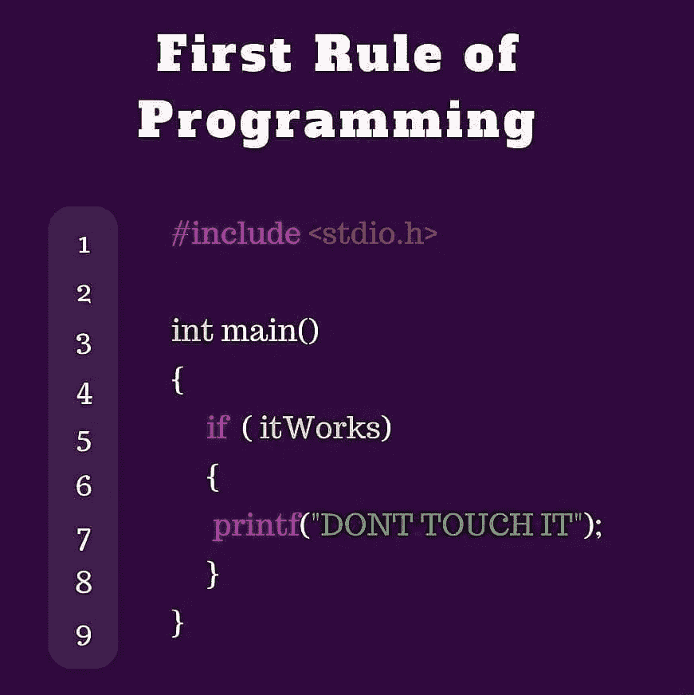
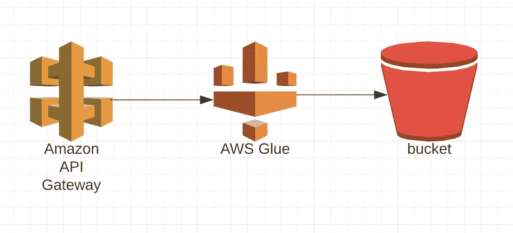
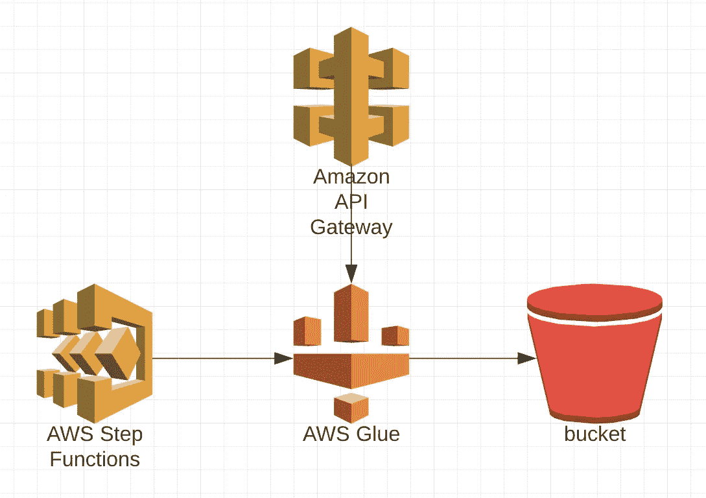
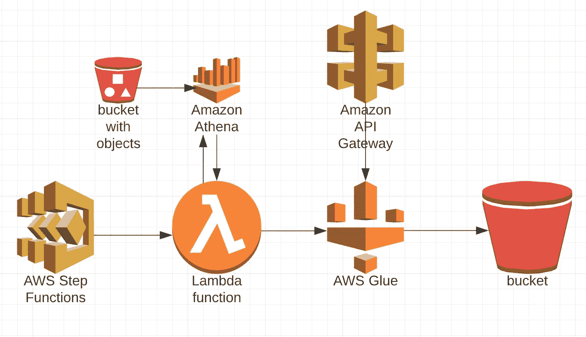
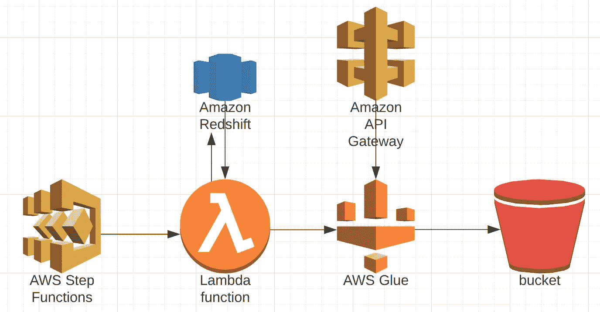

# 我是管道

> 原文：<https://medium.com/nerd-for-tech/i-m-a-pipeline-571c49ab225b?source=collection_archive---------15----------------------->

S3 的 API

没那么专业，汉！！😮

作为商业智能团队的软件开发人员，我必须编写管道来收集来自多个服务的数据，如内部产品、外部 API、数据库，现在在 AWS 中还有 API 网关、Kinesis 和事件总线流。

在这篇文章中，我将解释我构建第一条端到端管道的旅程，即从 API 收集数据，进行处理，并将其存储在 S3。

所以，我们开始吧！！

## **先说说** * **为什么*** ，因为…

口头禅！！😍

在这个管道之前，我们直接从数据库中挑选数据，然后用业务逻辑处理它，然后创建仪表板或报告。问题是我们必须与其他团队同步进行业务逻辑更新。多亏了其他团队，他们决定在他们的终端应用业务逻辑后发送过滤后的数据。我们对此感到非常兴奋，因为现在我们不必对数据进行任何过滤，但新的挑战是定期从他们提供的源中获取数据。

## 现在，我们来谈谈**如何* *

任务很简单，点击 API 并获取数据，如果需要的话格式化数据，然后存储到 s3。所以我们计划根据 AWS 的规定，为此使用胶水——

> AWS Glue 是一种无服务器的数据集成服务，可以轻松发现、准备和组合用于分析、机器学习和应用程序开发的数据。

所以流程是—

但是因为这不是基于事件的，所以我们必须安排这个管道定期运行。所以我们又增加了一个叫做 step 函数的服务。根据 AWS —

> AWS Step Functions 是一个无服务器的函数 orchestrator，它可以轻松地将 AWS Lambda 函数和多个 AWS 服务排序到业务关键型应用程序中。通过其可视化界面，您可以创建和运行一系列维护应用程序状态的检查点和事件驱动的工作流。一个步骤的输出作为下一个步骤的输入。应用程序中的每一步都按业务逻辑定义的顺序执行。

所以现在水流看起来像这样—

使用 step 函数，我们还实现了并行性，我们配置了 step 函数，使其可以同时并行触发多达 5 个粘合作业。我们安排它每天运行，并从 API 中提取数据。

## 让我们来谈谈最重要的部分——挑战。😰

1.  重新触发已经运行的作业—由于步进功能可以并行触发粘合作业，如果有人使用相同的输入触发作业 2-3 次会怎样。这将导致在相同的 S3 路径下写入文件时出现问题，并且数据也会变得混乱。

所以我们想出了一个解决方案，每当 step 函数用一种类型的输入触发一个作业时，一个文件将被写入 S3，当下一个作业被触发时，它将查询 athena，如果作业还没有运行，则触发 glue。迷茫？？？让我用流程图来解释一下。

因此，我们不得不引入一个 lambda 函数服务，它将作为驱动程序来触发粘合作业。这个 lambda 有以下一组工作-

I .检查由步骤功能触发的作业是否已经在进行中。

二。如果正在进行，则退出并给出异常—具有相同输入的作业已经在进行中。

三。如果作业没有运行，则创建一个作业运行状态条目作为 S3 文件，并为该输入触发粘合作业。

然后胶合工作将做它的工作并且重写 S3 文件标记工作为成功。我知道这是一个非常糟糕的方法，但是在那个时候很有效。😛。

这种方法的问题是，如果粘合作业由于任何原因失败，那么它也无法将作业失败状态写入 S3 文件，并且当 lambda 在其下一个触发器中检查作业状态时，lambda 认为作业已经在运行，并且它限制粘合针对该特定输入运行。因此，我们必须手动删除 s3 文件，这是一项任务，因为我们必须首先转到 athena 表，然后找到正在运行的作业 id，然后转到 S3，搜索具有该作业 id 的文件并将其删除。

后来，我们删除了所有这些额外的进程，并开始在红移表中为作业运行状态创建一个条目，我们做得很好。所以最后的流程是—

这是我建立第一条数据管道的旅程。这是一个简单的任务，但鉴于我是 AWS 的新手，对我来说这是一个过山车。😅

我将会写更多关于我工作过的所有管道。所以，敬请期待！！