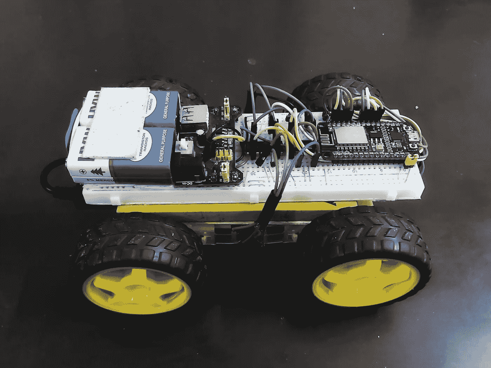
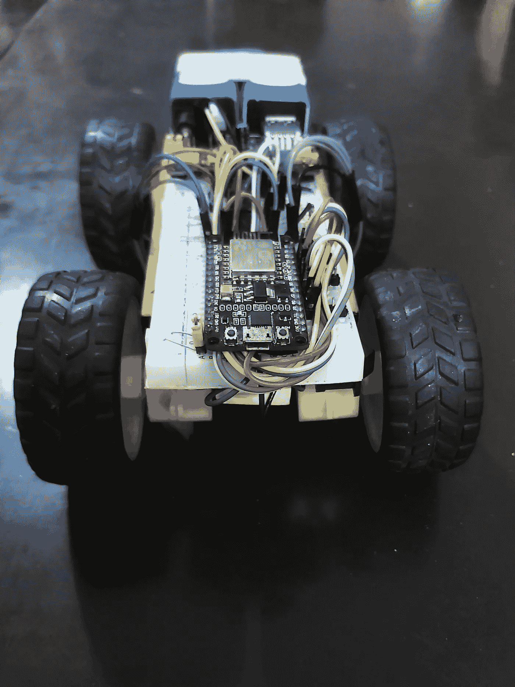
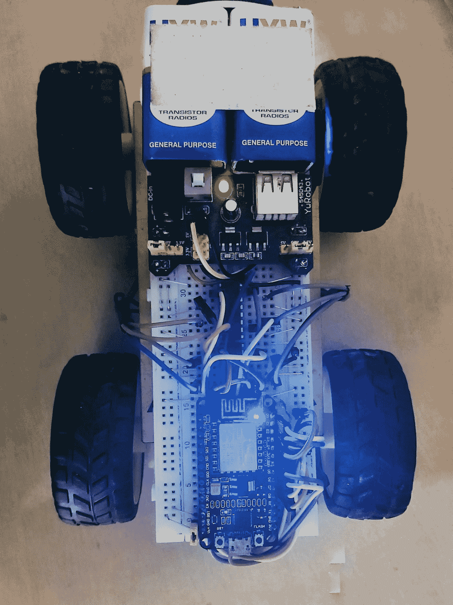
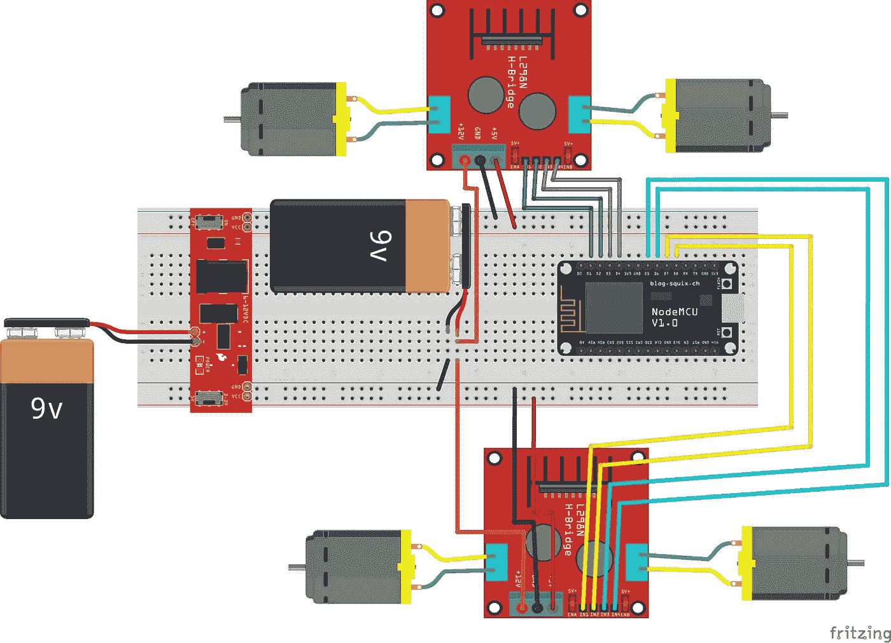
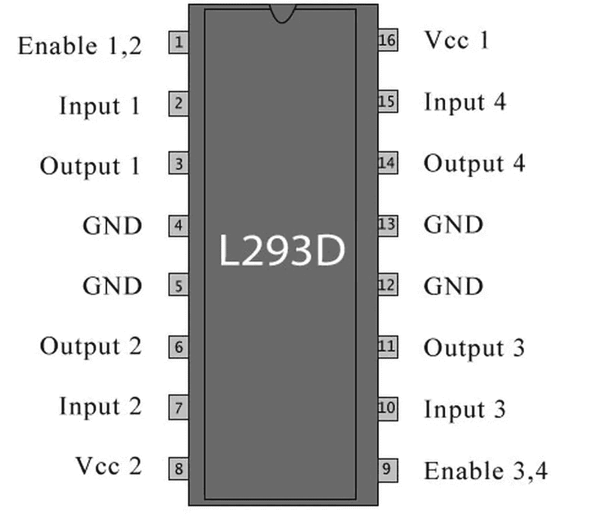
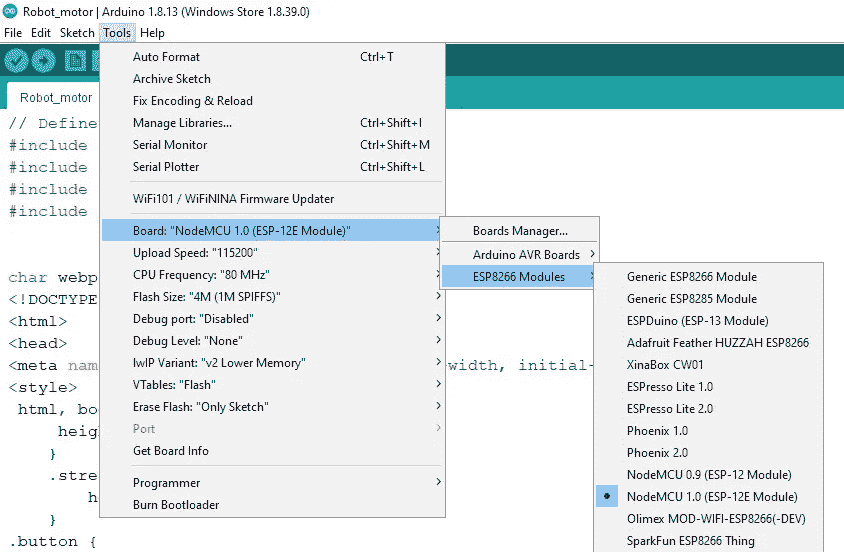

# 我做了一个电话控制的机器人汽车，不需要安装应用程序…！！！

> 原文：<https://medium.com/nerd-for-tech/i-made-a-phone-controlled-robot-car-without-the-need-to-install-the-application-7405c103c731?source=collection_archive---------0----------------------->

# 前言

> 这是我第一次尝试做这样的东西，所以请原谅我。**禁闭**教会了我们很多东西，但最重要的是如何合理利用时间。

当我想到制作这个项目时，我没有想到我会这样发布它，我不会这样做，但我总是有这种开始写博客的冲动，所以我想如果我在某个地方开始写会很好，幸运的是我在我的鼻子底下找到了内容，嗯我是说桌子…

由[路易·里德](https://unsplash.com/@_louisreed?utm_source=medium&utm_medium=referral)在 [Unsplash](https://unsplash.com?utm_source=medium&utm_medium=referral) 上拍摄

这是我不久前开始的一个项目，因为它被封锁了，我们都被隔离在家里，我最近不得不停止继续我的工作，所以我想如果开始做一些事情会很好。因为像大多数人一样，如果让我一个人呆一会儿，不做任何有成效的事情，我也会感到沮丧和恼怒…

> 正如我所说的,**禁闭**带走了我们最好的一面，也教会了我们很多东西。其中之一就是待在家里保持冷静…

## 所以，事不宜迟，让我们开始吧…

该项目是一个基于 Wi-fi 的可遥控汽车。这辆车可以通过笔记本电脑或手机控制。你不需要安装任何应用程序，最棒的是**它也可以离线工作** …

熟悉这类项目的人可能知道，如果你有现成的组件，那么做这样一个项目是相当容易的。但是你可能会问为什么要发这个帖子。

这是因为毫无疑问，你会在网上找到所有现成的组件，包括*底盘*(车身)，以及对其进行编程的代码。YouTube 上全都有，但是一个人怎么才能真正学会…？

因此，这篇文章(以及我将发表的一系列文章)让你学会如何自己构建一个，并真正理解事情是如何工作的。

下面是这个项目的证明。

> 这个构建中使用的组件是我在家里使用的(大部分)。但是因为我在做这个东西，一些(实际上是很多)组件可能在你家里找不到。如果你想尝试这个版本，那么你可以购买或者自己制作。

## 这些组件包括:

1.  一个**微控制器**(本例中为节点 MCU)
2.  四个**电机**和**车轮**
3.  两个**电机驱动 IC**(l293D 是我用过的，你也可以用 L298N)
4.  **电池**或**电源**(如果你想要可充电电源)
5.  **查西斯**(看你是想买还是想建这个了，我更喜欢你建一个，因为你可以在建的时候尽可能的狡猾，而且还能省点钱)
6.  最后也是最重要的是用于连接的**电线**。

现在，不要担心看这些集成电路的名称，或者如果你可以找到组件，你可以很容易地在亚马逊，或任何其他电子商务网站处理电子零部件。

(PS。你可以在谷歌上搜索组件的名称，它们在其他网站上通常比亚马逊便宜，但缺点是运输时间长。)

> 一个警告:明智地选择组件，因为许多顶级结果通常是昂贵的，而你可以在滚动一段时间后得到便宜的。

# 所以让我们开始建立…

## 首先你需要选择一个底盘。

在这里，我使用一个旧的**电源组**作为基础，和一个简单的**面包板**用于容纳所有的组件。这本身就确保了材料的最大利用率，因为****电路板*** *将允许我们容纳所有的电子设备*，其中****电源组*** *充当项目的电源*。**

## ****电机的放置****

**现在，我们已经将面包板连接到电源组，让我们放置电机。我们需要小心地这样做，以避免任何对齐问题。**

> ****另一个警告的话**:如果你正在使用一个你将来可能需要使用的电源组，我建议使用一种可移除的固定胶。因为这不仅有助于以后移除组件，而且有助于在电机对准错误时需要重新安装。**

**我建议使用双面胶之类的东西，就像我在这里做的那样。以便以后需要时可以将其移除。**

## **现在到了棘手的部分…**

# **电子学**

**根据您的选择选择微控制器板，我选择了**“节点 MCU”**，因为它内置了 Wifi，因此您不必为它购买另一个模块。**

> **如果你是新手，不要担心，我会在另一篇文章中详细解释微控制器。同时，我会解释适当的工作，因为它来了。**

**所以现在你已经选择了一块板，是时候开始建立联系了。**

**如果使用电机驱动模块，请按如下所示连接电线。**

****

**如果您仅使用 IC，请按如下所示连接电线。(这是我用过的，我希望你也这样做，因为裸 IC 的成本比模块低，而且你还可以了解它的工作原理。**

****

**说到 IC，这是一款电机驱动器 IC，特别是 L293D。这是一个双电机**“H 桥”** IC。**

> **现在" **H 桥**电路是一种电子电路，它切换施加到电机上的电压极性，使其改变旋转方向。"**
> 
> **换句话说，它允许你以数字方式改变电机的旋转方向，也许只需轻触一个按钮或任何你可以决定的预定义标准。**

****

**如图所示，该 IC 有 16 个引脚，每侧 8 个。每侧可以控制一个电机。使得它能够同时控制两个马达。因此，我们使用两个驱动器来控制 4 个电机。**

> **快速提示:要知道 IC 的哪一面是顶面，在 IC 上找一个小点或凹槽，那就是顶面。**

## **每个引脚的描述:**

**左侧(电机 1):**

*   **引脚 1: (EN 1)这个引脚是使能引脚，它作为一个调节器多少功率是提供给电机。我们必须在此引脚上提供 0–5V 的电压来改变速度。(其中 5 V 为最大速度，0 V 表示关闭)**
*   **引脚 2:(输入 1)这是电机 1 的输入 1。这来自微控制器。**
*   **引脚 3:(输出 1)这是电机 1 的输出 1。这将连接到电机的一个引脚。**
*   **引脚 4:(接地)这是接地引脚。它需要接地。**
*   **针脚 5:(接地)另一个接地针脚**
*   **针脚 6:(输出 2)这是马达 1 的输出 2。这将连接到电机的另一个引脚。**
*   **引脚 7:(输入 2)这是电机 1 的输入 2。这同样来自微控制器。**
*   **引脚 8: (Vcc 2 -12 V)这是电机电源，因为微控制器不能正确地给电机供电，因此我们需要给电机一个单独的电源。因此有了电池。**

**右侧:**

*   **引脚 9: (EN 2)这是启用引脚 2，它启用和/或控制电机 2 的速度，就像 EN 1 一样。(5 V 为最大速度，0 V 表示关闭)**
*   **引脚 10:(输入 3)这是电机 2 的输入 1。这又来自微控制器。**
*   **针脚 11:(输出 3)这是电机 2 的输出 1。这将连接到电机 2 的一个引脚。**
*   **针脚 12:(接地)另一个接地针脚**
*   **引脚 13:(接地)又一个接地引脚。**
*   **针脚 14:(输出 4)这是马达 2 的输出 2。这将连接到电机 2 的另一个引脚**
*   **引脚 15:(输入 4)这是电机 2 的输入 2。这又来自微控制器。**
*   **引脚 16: (Vcc 1 - 3.3 V)这是 3.3 V 引脚，是 IC 的主电源。我们也可以说它是集成电路的开关。**

> **我知道，我知道这可能看起来势不可挡，但一旦你亲自尝试，你就会找到窍门。此外，这是相当容易的。**

> **对于那些不熟悉**电压**和**地**的人，只是为了确保我们在同一页上。**电压**是电池一极和另一极电荷的**电位差**。其中**电流通过电位较高的电极流向电位较低的电极**。这里(在电子学中)V 或 Vcc 或电压引脚是电位较高的一个，而地是电位较低的一个。**

**这就把我们留给了微控制器。这是一个相当简单却复杂的装置。**

***它所做的只是根据命令或传感器收集的数据发出电信号。这些信号反过来操作执行动作的设备(致动器)。这是一个简单的定义。***

**它是一个集成电路，包含一个微处理器以及存储器和相关电路，并控制一个电子设备(如家用电器)或系统的部分或全部功能。这是来自 Merriam-Webster.com 的一个相当复杂的问题。**

**基本上为什么我们需要一个微控制器是因为我们需要通过一个软件来控制机器人，更像一个网页。因此，命令流应该是这样的。**

*   **步骤 1:用户将通过按下按钮在软件/网页上输入命令。**
*   **步骤 2:该命令将通过网络协议(这里是 WiFi)传输到微控制器，微控制器进而决定操作哪些部件(这里是电机)以及操作时间。**
*   **步骤 3:微控制器然后将信号发送到中间接口(电机驱动器)，中间接口将充当微控制器和电机的转换器。**
*   **步骤 4:电机驱动器然后将适当地给电机信号，并根据它从微控制器接收的命令控制它们。**
*   **第五步:设备(马达)将按照指令运行。**

> **这是一个小小的指挥系统。**

**现在，为了选择在我们给微控制器输入后会发生什么，我们必须首先对它进行编程。我们将使用一个叫做**“Arduino IDE”**的软件。这将帮助我们对微控制器进行编程。你需要一点 HTML 和 C 语言的编程知识(但我希望你们大多数人都熟悉它，因为现在它也在中学教授……)。**

> **这个代码模板将在另一篇文章中分享。我也会一步一步地解释。这个项目中使用的主要代码链接如下。**

# **RC_Car_Code.ino 链接:**

**[https://drive . Google . com/file/d/13 hrlpczrq _ smhvyq 7 ackl _ uz9f _ TVD ZF/view？usp=drivesdk](https://drive.google.com/file/d/13HrLpczrQ_smHVYQ7aCKL_uz9f_TVdZf/view?usp=drivesdk)**

## **最后，你需要在你的电脑上连接电路板，然后上传代码。**

**这一部分简单而重要。在你修好电子设备后，你需要从微控制器板上取下电池(只要确保它没有从其他地方获得任何电力)。**

****

**现在通过微型 USB 电缆连接电路板。现在，在**‘工具’**菜单中，选择子菜单“ESP 8266 模块”下的板卡作为节点 MCU 1.0 (ESP 12 E 模块)，如图所示。**

**然后选择端口(在最后的同一个工具菜单中)作为你的主板连接的端口。**

> ****快速提示**:现在为了确保它是正确的端口，我建议移除任何其他外围设备/附件(当然除了键盘和鼠标……)，如果它显示除了 N/A 之外的任何内容，单击“获取主板信息”。这意味着它是正确的端口。**

**一旦完成所有这些，点击编译按钮，它将检查任何或所有的错误。请确保在您继续之前删除所有错误，否则它不会上传到板上。当你的代码没有错误时，点击上传按钮。还有 Violaa..您的代码应该会在一分钟内上传。**

**现在坐好，享受玩你的玩具车。要连接到它，您可以连接到汽车生成的 WiFi 接入点(热点),也可以在两台设备都连接到公共 WiFi 接入点时手动输入汽车的 IP 地址。**

**您应该可以看到您在模板中创建的网页。你可以通过使用 CSS 和 JavaScript 让它看起来尽可能的漂亮。我已经创建了一个简单的 HTML 代码，在模板中有四个按钮。**

# **应该就是这样了。**

**虽然我会写更多的文章，但是如果你遇到任何问题，请让我知道。这样我就可以在接下来的文章中解决这些问题。**

> **最后**
> 
> **谢谢你对我的包容…**