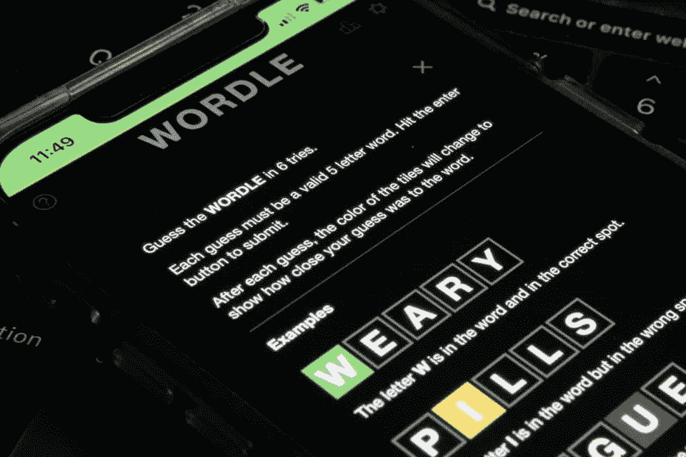
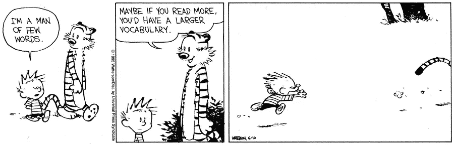
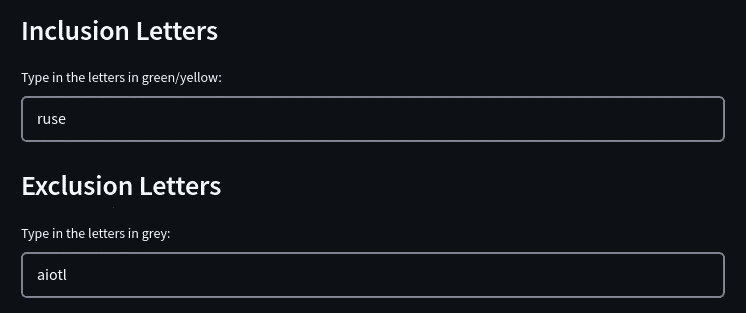
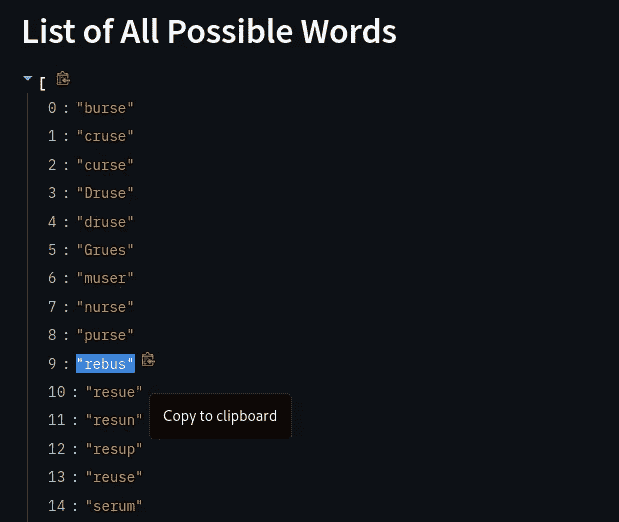
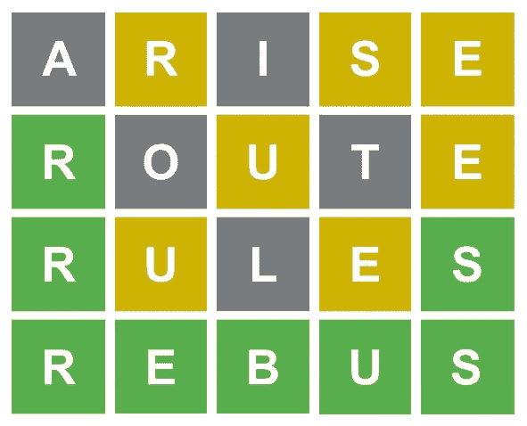

# WORDLE 助手——词汇不再是酒吧了！

> 原文：<https://medium.com/nerd-for-tech/i-made-this-app-to-help-you-get-unstuck-at-wordle-7d8d9f145dd7?source=collection_archive---------4----------------------->

## AI 过道

有限的词汇量应该是阻止你保持单词量的最后一件事。



Wordle 是一款流行游戏，在短时间内迅速走红，你可能已经尝试过了(如果没有，请点击这里的)。然而，有时仅仅因为你不知道一个英语单词可以由已经猜到的字母组成，就不能正确地猜出一个单词，这可能会令人沮丧。



📷——来自[比尔·沃特森](https://en.wikipedia.org/wiki/Bill_Watterson)的小幽默

但是当然，有限的词汇不应该阻止你跳上已经席卷全球的世界列车！

**所以，我做了🔗** [**本 Streamlit app**](https://huggingface.co/spaces/nn007/WORDLE-Assistant) **。**

# 怎么用？

这里最大的假设是你已经揭开了至少几个字母，你知道它们会/不会出现在最后的五个字母的单词中。

这款应用已经在 HuggingFace Spaces 上运行。当你在 Wordle 上猜了几次后，假设遇到了困难，你只需要在应用程序上指定的输入点输入包含字母(绿色/黄色的字母)和排除字母(灰色的字母)，然后点击 enter。

你会得到一个由五个字母组成的单词列表，其中包含你的包含字母，不包含你的排除字母。

现在，你所要做的就是在 Wordle 上找到最适合你的单词！你有它！

# 引擎盖下发生了什么？

我们利用了 NLTK 的英语语料库。

NLTK 是构建 Python 程序来处理人类语言数据的领先平台。它提供了 50 多个语料库和词汇资源的易用接口，以及一套用于分类、标记化、词干化、标记、解析和语义推理的文本处理库。

我们使用`words()`方法从语料库中获得所有有效的五个字母的英语单词。

```
from nltk.corpus import words
five_letters = [word for word in words.words() if len(word)==5]
```

只要我们提供至少一个包含/排除字母，应用程序将返回一个输出。

```
for word in five_letters: if all(c in word for c in **inclusions** and
           not any(c in word for c in **exclusions**): clue_result.append(word) st.write(clue_result) 
```

是的，逻辑只占用这么多行代码！

# 来个快速演示怎么样？

猜了三次之后，假设你现在处于这个阶段:

你不确定哪些单词以“R”开头，以“S”结尾，中间包含“E”和“U”。


只需在助手中[输入这些信息。](https://huggingface.co/spaces/nn007/WORDLE-Assistant)

**注意:**输入字母的顺序对输出没有影响。这个案子也无关紧要。



最后，从可能的单词列表中，选择一个符合你要求的单词。

在这种特殊情况下，单词需要以“R”开头，以“S”结尾(如前所述)。这将我们引向一个匹配:“追加筹码”



就是这样！

这就是你的每日一词解决方案！



**PS。**我承认，从这个应用程序生成的单词列表中找到符合你要求的单词可能有点麻烦。

那么为什么不添加更多的代码来考虑字母在所需单词中的位置呢？

我没有包括这个功能，因为有时候，你可能连一个绿色的字母都没有(一个字母在单词中的位置被确认是正确的)。这可能限制了此应用的使用。

所以现在，这个应用程序似乎包含了所有的用例！😊

快乐的文字！

[Streamlit](https://www.streamlit.io) 是一个开源的 Python 库，使用它，只需几分钟，你就可以构建和部署自己的应用。自己试试！

[](https://docs.streamlit.io/library/get-started/create-an-app) [## 创建应用程序-简化文档

### 如果您已经做到了这一步，那么很有可能您已经安装了 Streamlit 并运行了我们主要概念中的基础知识…

docs.streamlit.io](https://docs.streamlit.io/library/get-started/create-an-app) 

*你可以在我的*[*GitHub repo*](https://github.com/nazianafis/WORDLE-Assistant)*中找到这个 app 的代码。如果你有如何改进的想法，请随意提出来。通过 LinkedIn* *与我* [*联系，或者你也可以关注我的文章*](http://linkedin.com/in/nazianafis) [*这里*](https://nazianafis.medium.com/) *。*

*下次见！*(∫･‿･)ﾉ