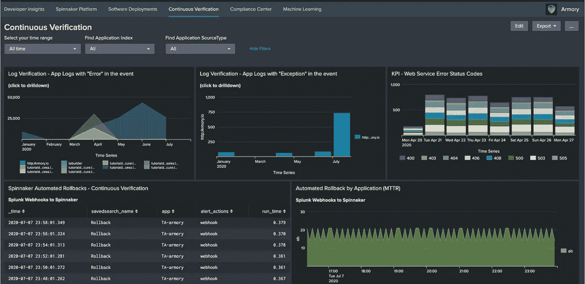

# 我从没想过简化的三角帆是可能的

> 原文：<https://medium.com/nerd-for-tech/i-never-thought-a-simplified-spinnaker-was-possible-6cef90651234?source=collection_archive---------14----------------------->


我认为这是一个公平的说法，它传达了 2021 年的软件工程师不仅工作努力，而且工作聪明。基于过去五年的经验教训，现在创建的应用和服务尽可能具有动态性，旨在满足以激光为中心的业务需求。

同样的方法也出现在 DevOps 领域，我经常提到的“* as code”允许以声明方式创建组件。这种方法利用了相同的 git 版本控制系统，功能开发人员已经为他们的源代码使用了超过 15 年。DevOps 工程师在交付持续集成(CI)管道方面也取得了巨大的进步，这些管道提供了可以交付的打包软件。

然而，直到今天，持续交付(CD)方面仍然存在挑战。挑战暴露了经常阻碍成功部署的差距。我经常直接看到的一些挑战是:

1.  没有预先检查部署的简单方法，这可能导致在一个环境中成功的部署失败，而在其他环境中不会失败。
2.  回滚到先前的部署并不是真正的回滚，而是重新部署到所提供的提交的早期版本，而不是回滚到整个应用程序或服务的先前状态。

这些差距需要被解决，以完全完成软件开发生命周期。

# 为什么 Spinnaker 很棒

[Spinnaker](https://spinnaker.io/) 是一个开源解决方案，专注于多云持续交付和部署，面向所有主要的云服务提供商(AWS、Azure、Google)。Spinnaker 专注于 CI/CD 的 CD 方面，与所有业界领先的 CI 工具一起工作。

Spinnaker 通过对计划的部署执行自动预检来弥补上述缺陷。预检阶段完成后，Spinnaker 部署一只金丝雀，然后监控金丝雀发出的遥测信号，留意金丝雀和现有舰队之间的变化。如果成功，Spinnaker 将在应用程序环境的剩余部分使用蓝/绿部署。

使用 Spinnaker，回滚可以自动化，并且实际上将整个应用程序或服务恢复到先前的状态。这与简单地将现有版本重新部署为新版本形成对比。采用真正的回滚方法会对整个应用程序生态系统产生较小的干扰影响，并减少与简单地将旧版本重新部署为新版本相关的潜在外部影响。

Spinnaker 受到了众多 IT 知名企业的信任，包括 Adobe、Airbnb、Comcast、网飞、SAP、TransUnion 和 Salesforce。

然而，Spinnaker 面临的最大挑战是，它是一个非常复杂的平台，需要很长的学习曲线。下图是 Spinnaker 的设计和架构:


# 军械库能帮上什么忙

[Armory](https://www.armory.io/) 的创建不仅是为了简化 Spinnaker 解决方案，也是为了真正扩展多云持续交付和部署平台的价值。Armory 在应用程序生命周期的 CD 方面引入的一些关键特性如下:

*   引入复杂的管道作为代码，通过允许集中式管道更进一步。
*   简化扩展选项，以轻松添加/删除元素，如:开发环境、应用程序实例、部署环境的变化和集群规模
*   使用[库伯内特军械库代理](https://docs.armory.io/docs/armory-agent/)更好地管理库伯内特
*   允许自定义策略的策略引擎

这些增强开放了 DevOps 工程师使用 Spinnaker 可以做的事情，而不需要投入大量时间在本机产品中构建类似的选项。

# 军械库如何提供价值

前一节提供了 Armory 如何帮助应用程序生命周期的 CD 方面的一些高级特性。这些特性有可感知的价值，但是最大的挑战是从“零到 Spinnaker”而不消耗 sprint 的时间。

以下是任何人如何在军械库试验评估过程的早期看到价值的一些关键方面。

## 明纳克

军械库的 [Minnaker](https://github.com/armory/minnaker) 开源项目旨在通过在大约 10 分钟内自动创建一个全功能的环境，包括军械库的最新版本，来消除 Spinnaker 的混乱！是的，零到三角帆和军械库 600 秒。事实上，使用我的 MacBook Pro，我能够毫无问题地遵循这些说明:

[https://github.com/armory/minnaker#installation](https://github.com/armory/minnaker#installation)

完成后，我可以使用以下指令访问 Spinnaker 安装:

[https://github.com/armory/minnaker#accessing-spinnaker](https://github.com/armory/minnaker#accessing-spinnaker)

对细节感兴趣的人可以访问 Spinnaker 自己提供的“入门”页面:

[https://spinnaker.io/guides/user/get-started/](https://spinnaker.io/guides/user/get-started/)

## 完全声明式设计

随着 Spinnaker 和 Armory 的运行，可以使用 Dinghy 通过[YAML](https://en.wikipedia.org/wiki/YAML)(YAML Ain not Markup Language)数据序列化语言使用声明性方法开始构建预期的设计。下面是一个用于交付“管道代码”的小型文件示例:

```
{
   "application":"helloworldapp",
   "globals":{
      "save_app_on_update":true
   },
   "spec":{
      "appmetadata":{
         "dataSources":{
            "enabled":[
               "securityGroups",
               "loadBalancers",
               "executions",
               "serverGroups"
            ],
            "disabled":[
               "canaryConfigs"
            ]
         },
         "cloudProviders":[
            "kubernetes",
            "aws"
         ],
         "customBanners":[
            {
               "backgroundColor":"var(--color-alert)",
               "enabled":true,
               "text":"Your custom banner text",
               "textColor":"var(--color-text-on-dark)"
            }
         ]
      }
   },
   "pipelines":[
      {
         "application":"helloworldapp",
         "name":"my-pipeline-name",
         "stages":[
            {
               "name":"one",
               "type":"wait",
               "waitTime":10
            }
         ]
      }
   ]
}
```

然后，YAML 设计的结果可以包含在基于 git 的存储库中，这些存储库可以在从沙盒到生产的所有实现中使用。

## 二等奖；荣誉奖；H 奖

在考虑军械库带来的价值时，还有几个我认为值得提及的项目要记住:

*   部署预检查:通过底层的 Spinnaker 实现，部署预检查减轻了对遗漏配置或依赖性的担心。
*   以开发人员为中心的支持:Armory 使得知识最丰富的团队能够拥有一个给定的服务，从端到端，利用声明式设计。
*   真正的回滚:使用 Spinnaker/Armory 设计，可以 100%回滚给定的服务，包括它的依赖项。回滚设计甚至可以通过观察监控环境来实现自动化。

## 以应用程序为中心的仪表板(附加产品)

使用 [Splunk](https://www.splunk.com/) 的客户可以创建一个以应用为中心的仪表板，提供 Armory/Spinnaker 实施的总体视图。以下是“持续验证”选项卡中可能出现的内容示例:



对 Accelerate 或 DevOps 研究和评估(DORA)指标感兴趣的人可能会认识到上例中包含的平均恢复时间(MTTR)分析，它是 Splunk 集成的一部分，而不是 Armory 产品的一部分。

# 结论

从 2021 年开始，我开始关注以下我认为适用于任何 IT 专业人士的使命宣言:

> *“将您的时间集中在提供能够扩展您知识产权价值的特性/功能上。将框架、产品和服务用于其他一切。”
> - J. Vester*

Armory 解决方案当然属于服务的范畴，它允许功能团队继续关注交付业务价值，同时简化有点复杂的连续交付(CD)解决方案。军械库提供附加价值，例如:

*   使用橡皮艇和 YAML 的声明式设计
*   Minnaker 允许在 10 分钟内快速启动
*   应用程序范围的扩展选项
*   真正的回滚功能

任何寻求针对主要云提供商的 CD 解决方案的人都应该将 Armory 纳入要评估的产品和服务的短名单中。Armory 扩展成熟的 Spinnaker 解决方案的方式将简化软件开发生命周期的交付方面，在此过程中提供额外的功能。

祝你今天过得愉快！