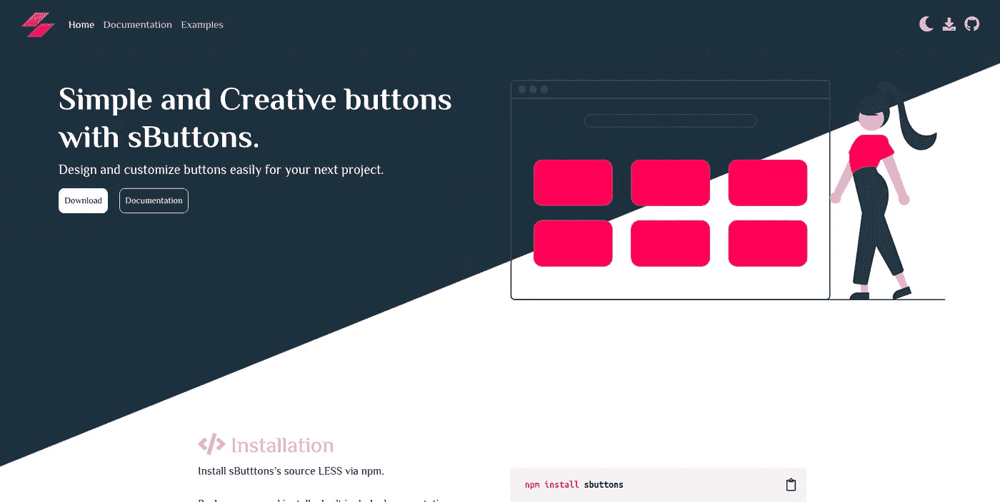
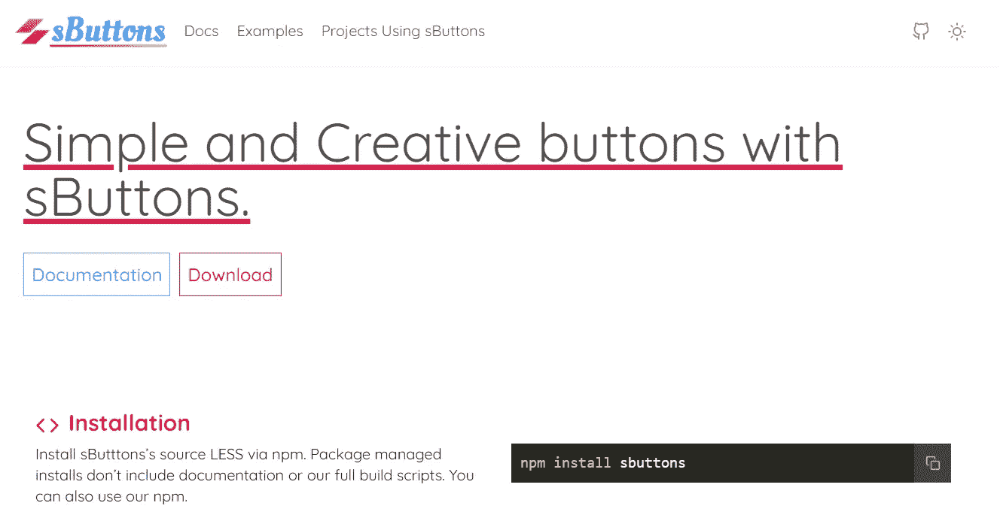

# 我用 Tailwind CSS 重新创建了一个引导网站，区别如下

> 原文：<https://medium.com/nerd-for-tech/i-recreated-a-bootstrap-website-with-tailwind-css-and-here-are-the-differences-dfb3a0253e7b?source=collection_archive---------11----------------------->


*本文原载于* [*我的个人博客*](https://blog.shahednasser.com/i-recreated-a-bootstrap-website-with-tailwindcss/) *。*

每个 web 开发者都是从 [Bootstrap](https://getbootstrap.com/) 开始的。它很容易使用，节省了创建网站的时间。Bootstrap 是每个 web 开发人员都依赖的必需品，无论是初学者还是高级人员。

不过最近一直在听很多关于[顺风 CSS](https://tailwindcss.com/) 的事情。我一直在 Twitter 上看到人们和文章谈论它，我很好奇，想尝试一下。

所以，我决定为[按钮](https://github.com/sButtons/sbuttons)重新创建网站，这是我维护的一个开源项目。最初，它只是用 HTML 和 Bootstrap 构建的。它看起来是这样的:



我选择重建它的原因实际上是因为随着它的成长，维护它的所有组件变得越来越困难，因为它只是 HTML。由于这些组件更容易重用，我决定用 React 重新创建它，并赋予它不同的新外观。

尽管第一个设计很棒，但我想尝试一些更扁平、简单、更容易导航的东西。

在用 React 和 Tailwind CSS 构建之后，这是新的网站:



一个简单得多的网站，传达“简单按钮”背后的信息。

虽然设计发生了巨大的变化，但这不是我在这里要比较的。我要比较的是我使用 Bootstrap 和 Tailwind CSS 的经验，哪个更好。

# 他们不一样

尽管 Tailwind CSS 和 Bootstrap 的目的可能相似，但是它们是不同的。Tailwind CSS 更侧重于提供易于使用的实用程序类来节省您的时间。正如他们的文档所说:“不要再添加像`sidebar-inner-wrapper`这样愚蠢的类名来设计一些东西。”它还鼓励用这些实用程序类创建可重用的组件。

Bootstrap 还提供易于使用的实用程序类，然而，从其早期版本开始，Bootstrap 就专注于通过为您提供设计好的通用 UI 元素来帮助您快速创建网站。只要复制粘贴代码，你就会在你的网站上得到一个导航栏。

# 适应变化

当我第一次开始尝试 Tailwind CSS 时，我有点纠结，因为我习惯于使用 Bootstrap 提供给我的任何现成组件，然后对它们进行相应的更改。使用 Tailwind CSS，我必须自己创建那些组件，起初我认为这会花费我更多的时间和精力。

然而，随着我不断地学习和掌握它，它变得越来越容易。我的思维直接转向了“顺风 CSS”的思维模式，构建组件变得更加容易。我不再需要依赖复制粘贴代码。实用程序类 Tailwind CSS 帮助您理解如何创建和样式化组件，并且您无需实际编写 CSS 就可以做到这一点。

我非常习惯使用 Tailwind CSS 提供的类，甚至当我在做其他项目时，我的第一反应就是使用它们。

# 响应式设计和黑暗模式变得简单

在 Tailwind CSS 的许多可用类中，您可以根据目标屏幕大小添加前缀，从而轻松地使任何规则或类遵循响应式设计。

例如，如果我想在所有屏幕上显示一个元素的宽度`50%`,但在小屏幕上显示`100%`,我可以像这样轻松地完成:

```
<span class="md:w-6/12 w-full">I'm responsive!</span>
```

没有必要再与媒体的询问作斗争了！你可以在 Tailwind CSS 提供的几乎所有实用程序类中添加前缀，比如`md:`、`sm:`等等。

在 Bootstrap 中，这是提供给一些实用程序类的，但是，我认为它不够灵活，你最终将不得不编写自己的媒体查询。

接下来是黑暗模式。黑暗模式现在是任何网站的必备功能。让你的网站黑暗模式兼容可能是一个麻烦。这也取决于你如何在你的网站中构建组件。

顺风 CSS 提供易于使用的解决方案，使您的网站黑暗模式兼容。简单地说，当设计元素时，你可以只添加前缀`dark:`来添加只在黑暗模式开启时应用的样式。

例如:

```
<div class="bg-white dark:bg-gray-700"></div>
```

添加到 div 中的类确保了默认情况下背景色应该是白色。但是，如果网站上打开了暗模式，它应该会将其颜色改为灰色。

写这篇文章的时候，Bootstrap 并没有提供任何工具类来帮助你在网站中更容易地实现黑暗模式，所以这对于 Tailwind CSS 来说是一个很大的好处，因为它也节省了你很多时间。

# 现代感

我已经使用 Bootstrap 很多年了，最近我开始注意到 Bootstrap 中组件的设计有些过时了。无论是颜色还是其他设计外观和感觉，都不像是在适应设计模式随时间的变化。

我真的很喜欢 Tailwind CSS 提供的[颜色](https://tailwindcss.com/docs/customizing-colors),以及定制它们以获得其他颜色是多么容易。Tailwind CSS 提供了一组默认使用的颜色，但是您也可以通过配置轻松地更改这些颜色。

比如做网站的时候，我发现玫瑰红比默认的红色要好。我可以轻松地将红色替换为玫瑰色，同时仍然使用 Tailwind CSS 提供的实用程序类，只需在配置中添加一行代码:

```
//tailwind.config.js 
red: colors.rose,
```

# 与 React 一起使用

有很多方法可以将 Bootstrap 与 React 一起使用。然而，它们可能有点麻烦。通常，库会创建不同的 React 组件来模拟引导组件，您必须导入它们才能在您的组件中使用它们。

使用带有 React 的 Tailwind CSS 很容易。您只需要在配置中做一些更改，然后就可以在组件中轻松地使用这些类。

这里的主要区别在于，如前所述，Bootstrap 提供了许多 UI 组件，而不仅仅是实用程序类。因此，可以理解为什么在 React 中使用它会这样。然而，在 React 中使用 Tailwind CSS 感觉要好得多，尤其是因为您一直在创建可重用的组件。

# 结论

Bootstrap 和 Tailwind CSS 都有自己的用例，这使得它们更适合项目。如果你不确定使用哪一个，评估一下你的项目的优先顺序，以及哪个选项更适合它。

*原载于 2021 年 3 月 17 日*[*【https://blog.shahednasser.com】*](https://blog.shahednasser.com/i-recreated-a-bootstrap-website-with-tailwindcss/)*。*