# 我写了一个网络应用程序，我喜欢它

> 原文：<https://medium.com/nerd-for-tech/i-wrote-a-web-app-and-i-liked-it-da7247add06b?source=collection_archive---------10----------------------->

## 但是我没有用 JavaScript 或者 CSS。以下是对这次经历的详细描述

嗯，就是这样。我退休了。对我来说，烟斗和拖鞋，或者大量的阅读，大量的骑自行车，尝试意大利语甚至钢琴的机会。

“我有事情要你做……”

我是现在的 W 夫人。我现在很紧张。这将是那些“从上到下油漆整个房子”的工作之一。好吧，准备好惊喜吧…

"你可以写一个链式家庭模拟器，就像 Bawdsey 的那样."

砰。就是这样；我完全同意。

无线电测向(又名雷达)，在其最早的化身之一。它是悬崖顶上的大天线，广播兆瓦的无线电波，希望一个微小的回声能揭示纳粹轰炸机的存在。那是波瓣，增益，极化，相位。很多好东西需要计算。

我们有一本很好的参考手册。令人惊讶的是，在 TTW 国家档案馆的宝藏中，我们可以找到“RDF 主管手册”，[空军部，1943 年 4 月，AIR10/4114]。

我在 1 月 10 日的第一份笔记中，我画了各种各样的叶片形状，以及可能可行的近似形状。同时，已经在考虑数据结构和坐标系统。根本没有想过我实际上可能如何产生一个应用程序，所有早期的想法都是关于问题域的。这是应该的，遵循逐步细化的指导方针。

第一周，没有代码，只有几页笔记。

几天后出现一个非常基本的 UI 草图。

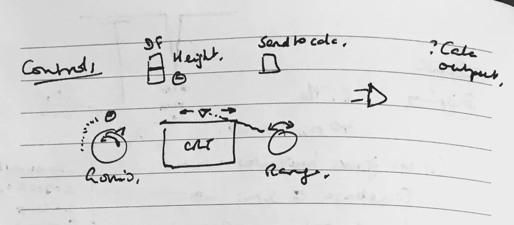

用户界面的第一张草图

这里没有发明，只是简化了 Mk 5 接收器的典型控制面板。

硬件的变化速度非常快；在任何时候，海岸周围的所有站都没有一个相同的基地。在任何时候，都可能有几个实验在进行；那些成功的方法被应用到其他地方。不仅仅是雷达技术，还有工作实践、通信协议等等。可以说，这一切都是活着“编造”出来的。

我们从手册的内容中提炼出 RDF 的核心——我们的程序实际上会做什么？有一串脉冲从 110 米高的发射塔发出，传播到 100 英里以外的海面，击中一架飞机，被吸收和再辐射(本身是一种复杂的量子现象)，其中的一部分返回到 100 英里以外的接收塔。在那里，他们遇到两个 90 度设置的接收天线。这在天线中感应出微小的电流，其强度和相位编码了飞机的距离和方位。操作员旋转控制器(“测角仪”)，该控制器混合来自交叉天线的信号，并提供输出以偏转阴极射线管上的电子束。

因为，当这些脉冲有目的地在海洋上传播时，回到 CH 站，电子束已经开始在阴极射线管(CRT)上水平画一条线。定时是这样的，返回信号(为简单起见，我们称之为回波)到达，通过接收器和测角仪，并进入 CRT 电路，屏幕上的位置与平面的范围成比例。

在任何给定的时刻，不仅会有可能来自敌方轰炸机的回声，也会有来自友军飞机、船只、建筑物、雨水的回声；任何能引起回声的东西。所有这些都被“计算”并混合成一个单一的输出。这是由热离子阀制成的专用电路进行的模拟计算。就像海浪穿过海洋，撞击沙滩一样，一些回声会结合起来，相互加强，形成更大的波浪，一些回声会结合起来，相互抵消。

我们现在加倍好奇:首先，关于操作者如何能从这种喧嚣中提取有意义的信息，允许皇家空军保卫我们的土地；第二，我们究竟如何在现代数字计算机上模拟它，合理地忠实于物理学，但在我们的实现中是实用的？

## 什么语言和框架？原生还是 Web？

迟早，我们必须开始尝试我们最初的想法。我们将如何实现这一点？用什么语言，用什么工具，来构建我们的用户界面和所有的数学逻辑。

我将在这里简单地声明，我选择使用 Elm 作为语言和框架。Elm，因为它干净(类似 Haskell)的语法和简洁的表达能力，这是一种功能优先的语言(与“以功能方式”使用语言 X 相反)。应用程序框架，因为它完美地将纯功能性与非纯功能性(JavaScript)分开。我根本不会考虑使用我见过的最流行的框架之一，我对此毫无兴趣。如果有什么突出了我的处境的简单美丽，那就是这个。我觉得很棒；我想用它；我承受任何后果；决定已经做了。

git 日志告诉我们，在 1 月 17 日，随着第二次提交，我们有了“我的第一次画线尝试”。把它描述为原始是很慷慨的。它揭示了当时我们制图能力的程度。

```
*-- This is dummy line for me to practise with floats and trig.
myLineData = List.map 
  (\x -> ( x, truncate <| ((*) 100) <| sin <| toFloat <| x * t ))
  (List.range 1 800)

stringifyPoint (x, y) = (String.fromInt x )++ 
    "," ++ 
    (String.fromInt y) ++ " "

polyLineFromCoords coords = List.foldr (++) "" 
  (List.map stringifyPoint coords)

...
    , polyline
        [ points (polyLineFromCoords m.lineData)
        , fill "none"
        , stroke "lightgreen"
        , strokeWidth "4"
        ]
        []*
```

呜-呼！我们应该能够看到随时间变化的正弦曲线，由可缩放的矢量图形呈现。

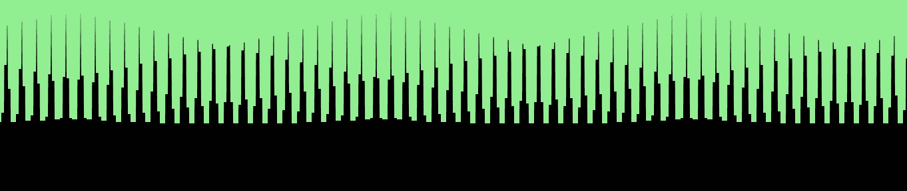

我们有图像了！

这正是我们所看到的，而且它正随着时间快速变化。这是忧虑地图上的一个标记。

受到我们早期成功的鼓舞，我们有信心开始将我们初步的领域模型转移到代码中。从哪里开始？对于数据类型，是。Elm 是一种强类型语言(带有类型推断)，拥有正确的结构将使我们保持正确的方向。

```
*type alias Target = { latitude : Float
                    , longitude : Float
                    , height : Float
                    , bearing : Float
                    , speed : Float
                    , iff : Bool }*
```

这让我们可以模拟敌人:

```
*bomber = { latitude = 2.0
         , longitude = 51.993661
         , height = 20
         , bearing = 270
         , speed = 200
         , iff = False }*
```

添加一些动作和更新我们的模型，使用模型作为我们的 SVG 行的源，并尝试我们的第一个可见“回声”,这并不需要很长时间。

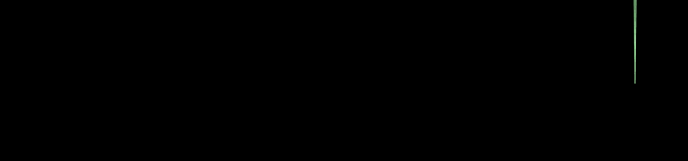

首次 CRT 跟踪尝试

它在那里。它会动。简直垃圾。为什么是垃圾？因为我认为将我们的时基建模为一系列“桶”是个好主意。

```
*bucketize : List PolarTarget -> List (Int, Int)
bucketize targets =
  let emptyLineArray = Array.repeat 1000 (toFloat 0)
      filledLineArray = List.foldl addSignal emptyLineArray targets
      asList = Array.toIndexedList filledLineArray
  in
      List.map (\(i,x)->(i,truncate x)) asList*
```

我的思考过程是因为我们知道，无论如何，我们必须结合多重回声。将它们放入桶中，这样相同的回声就可以合并起来，这似乎是一个不错的起点。视觉上，这是一场灾难，因为即使是每像素一桶，它也太“数字化”了，而且这个动作令人恶心。没想到会这样。还没有完全准备好放弃 bucketization，因为它们可能会在信号组合方面帮助我们，并且我们可能能够修复视觉问题。这只是编码的第二天。

我们在乐观中结束了这一天。通过一些简单的平滑，我们有两个来自目标的回波。桶是可见的(运动不平滑)，但它是可以忍受的。笔记包含了更多关于定相、测角仪操作和信号如何组合的讨论。笔记上写着 19 日晚了。

> **桶化**
> 产生不可避免的‘数字化’表象。…怀疑这是否可以避免，当然是用 SVG。也许通过一些更微妙(和复杂)的反别名渲染。？？WebGL

三个小时后，无桶画线。不是很好，但很有效。

```
*deriveTrace : List PolarTarget -> LineData
deriveTrace signals =
  -- Let's put the targets in a dictionary, indexed by range (probably unique!).
  -- Then we need a sorted list of edges (front and back).
  -- Sorted list will index into the dictionary, for easy access to each target.
  let allSignals = List.foldl (\p a -> Dict.insert p.r p a) Dict.empty signals
      activeSignals = Dict.empty
      theLine = [(0.0,0.0)]
      leadingEdges = List.map (\p -> (p.r, p.r, True)) signals
      trailingEdges = List.map (\p -> (p.r + 200, p.r, False )) signals
      allEdgesSorted = List.sortBy (\(a,b,c) -> a) <| leadingEdges ++ trailingEdges
      extractLineData (line, _, _) = line
  in
      ((::) (1000.0, 0.0)) <| extractLineData <| List.foldl processEdge (theLine, activeSignals, allSignals) allEdgesSorted*
```

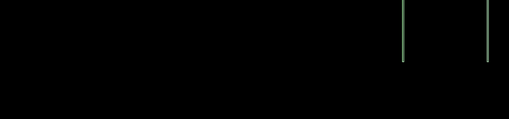

两条痕迹，没有桶，运动平稳

## 1 月 20 日—添加带相位的回声

现在是 20 号晚上，看起来我们又开始编码了。

```
*combineEchoes : Dict Float Echo -> Float
combineEchoes activeEchoes = 
  --Dict.foldl (\_ e acc -> e.amplitude + acc) 0.0 activeEchoes
--  100.0 * toFloat (Dict.size activeEchoes)  --OK!
  -- Treat amplitude and phase as vector, sum components, convert back, use amplitude.
  let asPolar = Dict.map (\_ e -> (e.amplitude, e.phase) ) activeEchoes
      asRect  = Dict.map (\_ p -> fromPolar p)  asPolar
      combinedAsRect = Dict.foldl (\_ (x, y) (xAcc, yAcc) -> (x + xAcc, y + yAcc) ) (0.0,0.0) asRect
      combinedAsPolar = toPolar combinedAsRect
  in
      100.0 * first combinedAsPolar*
```

启动它，我们看到它基本上是有效的。在两个回波在距离轴上重叠的地方，我们看到轨迹有更深的下降。这随着信号的同相和异相而波动，就像海滩上的波浪一样。令人担忧的是，已经有证据表明我的一个通病，过早优化。

"为什么要用字典，皮特？"

"因为迭代将自然地按范围排序，所以它避免了排序."

"当然，但你是在假设这个系列的独特性."

“我知道(叹气)。它*可能*没问题，因为它们是浮子，所以碰撞不太可能，所以我想我应该试试。”

我们知道，不是吗，读者，这不会有好结果。是件大事。不，但这是症状。

> 过早的优化每次都让你痛苦不堪。


通过相位相加来合并轨迹

在第二张图中，两小时后，我们看到波瓣形状对信号强度的影响。我们在飞！

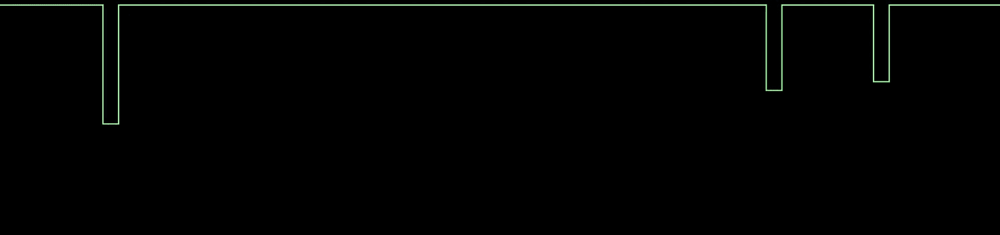

现在没有什么能阻止我们…

## 1 月 22 日— CRT 不做垂直线

跳过两天，我们看到关于避免痕迹中明显垂直线的注释。鉴于 CRT 显示器是基于偏转从左向右快速扫描的电子束，而热离子阀不是靠魔法工作的，我们不能像这样画垂直线。在现实生活中，线的倾角是“V”形的，有圆角。简单的几页笔记，一个 git 提交，上面写着“对平滑不满意”和悲伤的评论:

> 我仍然相信我缺少一些更优雅的东西。

有时候，你只是把它停好，继续前进，然后改天再来。这仍然是编码的第一个完整的星期；让我们不要惊慌。

## 1 月 23 日

我们已经添加了一个范围标尺，这很漂亮，但跟踪仍然是哼哼。

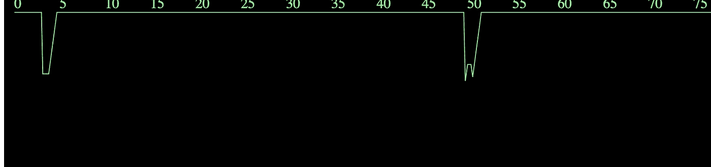

CRT 顶部的量程刻度

笔记和 git 日志都表明我们仍然对“Skyline 算法”不满意。这就是我们如何把一束回声变成一条连续的轨迹在阴极射线管上画出来的。意识到这有点像夜晚城市的天际线。当建筑的细节消失后，剩下的只是连续的轮廓。天际线算法告诉我们如何通过(基本上)从左到右对边缘进行排序，然后在我们遇到边缘时跟踪最高的建筑物来构建它。我们在上面提到了 Dict 的使用，我们看到在 24 号，我们已经切换到了列表。虽然没有特别的原因，但代码足够简单。

```
*deriveSkyline : Float -> List Echo -> List EdgeSegment
deriveSkyline maxX allEchoes =
  -- Let's put the echoes in a dictionary, indexed by range (probably unique!).
  -- Then we need a sorted list of edges (front and back).
  -- Sorted list will index into the dictionary, for easy access to each target.
  let activeEchoes = []
      leadingEdges = List.map (\e-> (e.r, e, True) ) allEchoes
      trailingEdges = List.map (\e -> (e.r + pulseWidth, e, False )) allEchoes 
      allEdges = List.sortBy (\(r,_,_) -> r) (leadingEdges ++ trailingEdges)
      -- We have one in hand so we need to flush it out
      (roofline, remainingEchoes, ((lastX, lastY))) = List.foldl processEdge ([], activeEchoes, (0.0,0.0)) allEdges
      finalY = combineEchoes remainingEchoes
  in
      ((lastX, finalY), (maxX, finalY)) :: roofline*
```

通过限制轨迹上的斜率，一个体面的视觉出现。

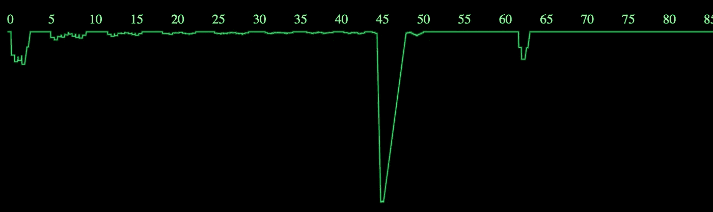

天际线算法改善了信号的组合

不久之后，我们进行了第一次大规模突袭。

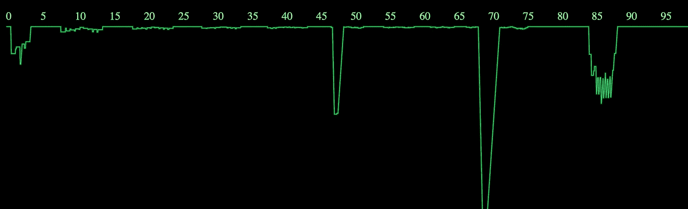

85 英里处的大型突袭

在 27 号，我们有一个逻辑测角仪，通过按 Q 和 A 键来“转动”。这影响了信号在交叉的接收偶极子处组合的方式，并允许确定 raid 的方位。(当测角仪设置与 raid 的方位对齐时，轨迹中的倾角最小。)

我们在这个月末迎来了一个大事件。随着一个用 SVG 制作的、可以用鼠标拖动的角度计的加入，UI 开始成形。

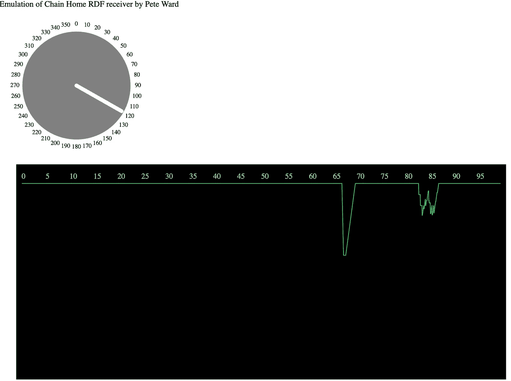

基本测角仪控制

感觉从这里应该都是下坡路了。还是路途会有坎坷？

## 2020 年 2 月—第二个月

现在我们已经有了一个 UI 的雏形，并且我们知道如何与之交互，拥有一个 raid 类型的菜单会很有用。两个原因。第一，我们可以测试不同的回声组合。第二，我们需要为最终用户提供一些选择。

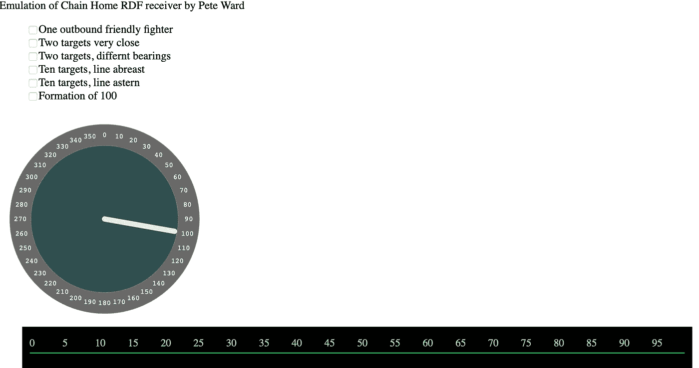

UI 的元素出现了

到目前为止，我们的“观点”仍然很简单:

```
*view : Model -> Html Msg
view m = 
  div [] 
  [ 
  --  showGonio m
  --, Html.br [] []
    Html.text "Emulation of Chain Home RDF receiver by Pete Ward"
  , targetSelector m.activeConfigurations
  , clickableGonioImageStyles m
  , crt m 
  , div [] (debugInfo m)
  ]*
```

我们现在需要考虑一个问题。随着事态的发展，我们将如何控制布局？我们会支持不同的设备格式吗？颜色怎么样？我们要手工制作 HTML 和 CSS 吗？

碰巧的是，Elm 社区对此有一个答案——Elm-ui 包。它提供了一个声明性的表单，用于定义与 Elm 应用程序架构完美契合的布局，隐藏了大部分 CSS(但在您需要时提供访问)，并创建了超快速的呈现(与虚拟 DOM 和 diffing 有关，对此我不需要担心)。

这正合我的口味。没有太多要切换的，切换也不难(反正你可以只包装 HTML 元素)，所以到了 4 号，我们现在的观点是:

```
*view : Model -> Browser.Document Msg
view model =
    { title = "VisExp"
    , body =
        [ layout [] <|
            column [ width fill, spacingXY 0 20 ]
                [ navBar
                , inputPage model
                ]
        ]
    }*
```

我们看到了这个想法 column 函数将在编译时生成 CSS 样式。我只需要把布局想象成嵌套的行和列，这对这个项目来说很好。CH 接收器很难称得上是 UI 设计的典范；它们由不同的制造商以组件的形式建造，并在现场栓接在一起。在某些情况下，前面板后面还有细绳和橡皮筋。

这现在看起来像什么？

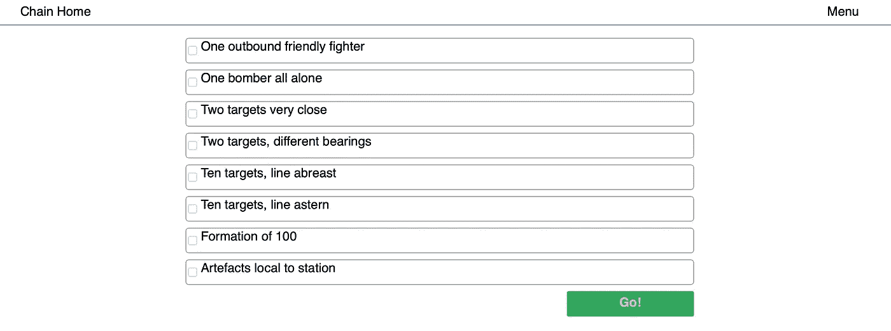

样式，不处理 CSS

## 2 月 9 日——它长大了

有了一个简单但有效的框架，UI 开始开发更有说服力的外观和操作。我们在 CRT 的顶部有一个范围滑块和一些谢妮管来显示范围和方位设置。(这些是时代错误，将被删除，但它们相当可爱。)

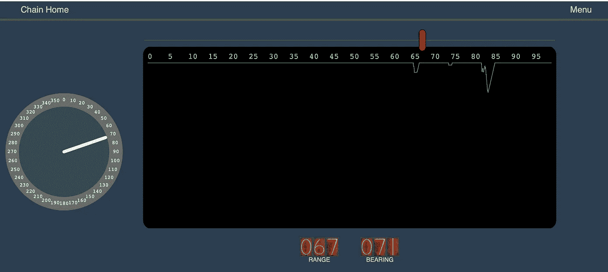

SVG 控件和 CRT，带可爱的数码管读数

注意力暂时回到领域模型，现在 UI 方法已经确定了。那个时期的训练视频强调“跳动”信号的重要性。这意味着来自相同距离目标的回波会干扰可识别的模式。它们以几秒钟的规则时间尺度“跳动”(增长和减少)。如果转动测角仪，它们都消失了，那就是两个目标在方位上靠得很近。如果跳动停止，但稳定的信号仍然存在，他们是在不同的轴承之一，你刚刚发现。

因此，对于这个模拟器来说，复制“跳动”效果是很重要的。但是是什么导致了这种情况，我们是把它嵌入到我们的数学中，还是我们作弊了。我曾希望变化的信号相位将是足够的，他们几乎是，但没有区分这两个完全不同的场景。据我所知，建模并不简单；反思的过程是一种简化。正如我们之前提到的，无线电波被目标吸收，建立了某种共振，并出现了返回信号。由于“复杂的量子物质”,这两个目标并不是独立的，即使是分开的。任何物理学家都会告诉你，能量量子不会直线传播并反弹回来。啊啊。实际上，它们采用了源(雷达站)和目的地(雷达站)之间的每一条可能的路径。**然后**他们结合。

## 2 月 16 日，介绍一个小骗局

所以…他们可以在飞机之间跳跃，离开大海，离开天空，绕过公共汽车站，穿过药店，请穿过二十个罗斯曼，然后再回家。是的，我们要作弊一下。

```
**combineEchoes** *:* **Int** *->* **List Echo** *->* **Float
combineEchoes** *time activeEchoes =
    -- Treat amplitude and phase as vector, sum components, convert back, use amplitude.
    let* **asRect** *=
            List.map
                (\e ->
                    fromPolar
                        ( e.amplitude
                        , toFloat e.sequence * 2 * pi * (toFloat <| modBy 2000 time) / 2000
                        )
                )
                activeEchoes* **combinedAsRect** *=
            List.foldl 
             (\( x, y ) ( xAcc, yAcc ) -> ( x + xAcc, y + yAcc )) 
             ( 0.0, 0.0 ) 
             asRect

        (* **mag***,* **phase** *) =
            toPolar combinedAsRect
    in
    mag*
```

`e.sequence`以特定频率的变化信号的形式给每个目标一个独特的信号。这在视觉上模仿了我们所寻求的跳动效果。几乎可以肯定的是，当时的一名操作员会指出这是错误的。可悲的是，尽管从某种意义上说我们是幸运的，但很少有人还能对此发表评论。

这里有许多增量开发，因为新的按钮被添加到 UI 中来控制 tarsnsitter 和 receiver 的不同方面。这主要是关于以不同的组合来组合发射机和接收机波瓣函数。操作员可以切换天线，启用反射器，在方位和高度模式之间切换。这些都没有给我们提供任何见解，主要是与产品负责人的持续对话(是的，又是 W 夫人，作为常驻专家)。

## 2020 年 3 月

三月，空气中弥漫着春天的气息，一些有趣的变化正在发生。老实说，细节很难回忆起来，笔记中也没有什么帮助，但有一段时间我觉得 SVG 行太临床了。我们需要注入更多的电路噪声。这受到实际镜头的影响。噪声和抖动的数量是相当大的，这使得(大部分)WAAF 操作员能够提取任何有用的信息更加令人印象深刻。

因此，我们推断，WebGL 有一些改动，因为突然在 3 月 7 日，有一个新的 CRT 模块，CRT_WebGL。它有一个顶点着色器，复制了我们的 SVG 绘制函数的功能，一个最小片段着色器，和一些分形噪声。

除了它的存在，我对 OpenGL 和它的表亲 WebGL 一无所知。它将图形渲染卸载到 GPU。为了实现这一点，可以用 c 语言编写“着色器”。有两种着色器:顶点着色器和片段着色器。两者都指三角形网格。顶点着色器替换三角形的顶点并给它们分配颜色；片段着色器定义了三角形上任意点的颜色，也正是它定义了图像中任意像素的颜色。

因此，我的第一个 WebGL 模仿了 SVG 的操作。我们想象这条线由成百上千个三角形组成。我们将顶点垂直偏移以反映信号强度，并将三角形着色以模仿 CRT 光束形状。

如果你用 Elm，写一个着色器有多难？不算太坏。你不能避免学习 GL 着色器语言(GLSL ),但是你可以非常灵活地将它嵌入 Elm。

```
**vertexShader** *:* **WebGL.Shader Vertex Uniforms** *{ vcolor :* **Vec3***, stretch :* **Float** *}* **vertexShader** *=
    {-
       Our vertex shader will have special cases 
       built in to give convincing trace patterns
       for our supported formations. We will not 
       support variable numbers of raids, as Elm
       does not support array Uniforms, so we will 
       some presets that we
       basically turn on and off, just by setting zero amplitude.
       Hence the vertex shader is long and inelegant. 
       It is what it is.
    -}
    [glsl|
        attribute vec3 position;
        attribute vec3 color;
...
            gl_Position = 
                perspective * camera * rotation * vec4(newPos, 1.0);
            vcolor = color;
            stretch = abs(stretch);
        }
  |]*
```

退一步说，也有缺点。没有可变大小的数组，所以我们必须决定可以传入多少次 raids。最糟糕是没有从 WebGL 获取编译消息的途径。所以如果你不小心写了类似`float x = 0`的东西，你得到的只是一个黑屏；因为需要`float x = 0.0`。

值得吗？是的，它是。我们可以在信号中加入噪声，SVG 肯定不会处理这种情况。结合我们其他的 UI 添加和改进，我们现在有了一个非常合适的接收器模型。

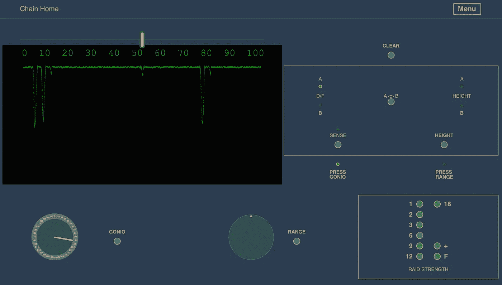

使用 WebGL 为 CRT 更新了用户界面

## 3 月 10 日—电子计算器

我们把注意力集中在接收器面板上，操作员通过操纵几个旋钮和开关，并仔细研究 CRT，试图确定来袭(或实际上是来袭)突袭的位置。这些信息是如何呈现的，以便能够传递给战斗机控制？

这个问题的答案，就像这个领域的任何事情一样，各不相同。英国战役前后，电子计算器的使用是一个典型的例子。这是一种硬连线的模拟设备，类似于类固醇上的惠斯通电桥，它从操作员输入中获取值，并将它们转换为地图位置和高度读数。

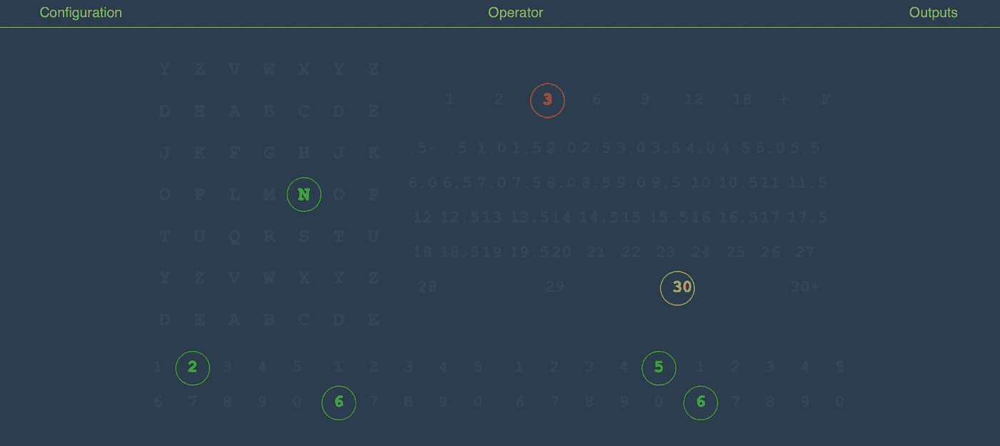

电子计算器面板

该显示指定一次突袭在方格 N，东 26，北 56，高度 30000 英尺，预计强度 3。

## 夏天——精炼，精炼，精炼

我们将快速浏览 CH 接收器的剩余故事，因为没有什么新内容要添加。嗯，有一个完整的教程模式，屏幕上的帮助，许多错误修复和角度仪在通过+180/-180 边界时不断出现的问题。我好像在纠结角度。

事实上，我们从 git 日志中看到，使教程变得强大需要我们在三月底，那时我们有一个关于页面，五个教程和三个游戏模式，计算器和一个模拟在操作室中看到的地图视图(但也显示了突袭的真实位置)。

四月将增加更多的帮助文本，然后在夏天:支持肖像模式，iPads 上的触摸支持，以及无人值守的信息亭模式。

没有什么值得注意的，直到 9 月 27 日，突然出现了一个 WebGL 的替代实现。这里的信息是，我们不会停止尝试简化和改进，只是因为我们发现了一些有用的东西，即使它足够有用。我一直在浏览其他着色器，有一些相似之处，并有一些示波器仿真。令我震惊的是，他们只用一个片段着色器；他们不会建立一个网。屏幕只是一个(x，y)坐标的数组。着色器最好被想象为一个进程，它为屏幕上的每个像素并行运行，并根据 x、y 和时间计算要显示的颜色。

对我来说，这是一个令人兴奋的时刻，整个着色器足够短，可以在这里复制:

```
**fragmentShader** *:* **WebGL.Shader** *{}* **Uniforms** *{ vFragCoord :* **Vec2** *}* **fragmentShader** *=
    [glsl|
        precision mediump float;

        varying vec2 vFragCoord;
        uniform vec3 iResolution;
        uniform float iTime;
        uniform int numRaids;
        uniform vec3 raid0;
        uniform vec3 raid1;
        uniform vec3 raid2;
        uniform vec3 raid3;
        uniform vec3 raid4;
        uniform vec3 raid5;
        uniform vec3 raid6;
        uniform vec3 raid7;
        uniform vec3 raid8;
        uniform vec3 raid9;
        uniform vec3 raid10;
        uniform vec3 raid11;
        uniform vec3 raid12;
        uniform vec3 raid13;
        uniform vec3 raid14;
        uniform vec3 raid15;

        vec3 COL1 = vec3(1.0,0.0,0.0);
        vec3 COL2 = vec3(0.0,1.0,0.0);

        float cubicPulse( float c, float w, float x ) {
            x = abs(x - c); // NOTE 0 <= x <= +w
            if (x > w) return 0.0;
            x /= w; // 0 <= x <= +1 (width is actually 2w)
            return 1.0 - x * x * (3.0 - 2.0 * x);
        }

        void mainImage( out vec4 fragColor, in vec2 fragCoord )
        {
            vec2 uv = fragCoord.xy/iResolution.xy;
            vec2 uvn = 2.0 * uv - 1.0;

            // Think of this as a single target "field"
            float f1 = -3.0;

            // A "two plane" field
            float f2 = f1 - (3.0 * sin(iTime * 3.0));

            // Think of this as a mass raid "field".
            float mrf = f1 + f2 - 6.0;
            mrf += 2.0 * sin(uv.x * 256.0 + 0.0) * sin(iTime * 8.0);
            mrf += 2.0 * sin(uv.x * 128.0 + 0.0) * sin(iTime * 6.0);
            mrf += 2.0 * sin(uv.x * 128.0 + 0.5) * sin(iTime * 5.0);
            mrf += 1.0 * sin(uv.x * 64.0 + 0.1) * sin(iTime * 4.0);
            mrf += 1.0 * sin(uv.x * 32.0 + 0.2) * sin(iTime * 3.0);
            mrf /= 2.0;

            // Add a noise field (use our existing one).
            // Lower the resolution of the x line to make 
            // the noise less noisy.
            // add time to the noise parameters so it's animated.
            // I want a component that is more 'spikey'.
            float noise = 0.0;
            noise += sin(uv.x * 256.0 + 0.0) * sin(iTime * 7.0);
            noise += sin(uv.x * 512.0 + 0.0) * sin(iTime * 5.0);
            noise += sin(uv.x * 1024.0 + 0.0) * sin(iTime * 11.0);
            noise /= 8.0;

            // Spikey looking noise.
            float lumpy = 0.0;
            lumpy += sin(uv.x * 256.0);
            lumpy = 0.0 - float(lumpy < -0.8);
            float lumpyTime = 0.0;
            lumpyTime += sin(iTime * 11.0) + sin(iTime * 19.0);
            lumpyTime = float(lumpyTime > 1.9);

            float sawtooth = 0.0;
            sawtooth = abs(0.5 - fract(uv.x * 20.0));
            float bumps = 5.0 * lumpy * lumpyTime * sawtooth;

            // Now expose a section of the field where we have raids.
            // Note pulse width sqrt(N)/100 looks ok.
            float raid1 = f1 * cubicPulse(0.15, 0.01, uv.x); 
            float raid2 = f2 * cubicPulse(0.3, 0.014142, uv.x);  
            float raid3 = mrf * cubicPulse(0.5, 0.0200, uv.x); 
            float raid4 = mrf * cubicPulse(0.7, 0.1000, uv.x); 

            float beamY = bumps + noise + raid1 + raid1 + raid2 + raid3 + raid4;

            // Fiddle with coordinate (needs some work).
            beamY = beamY/50.0 + 0.9;

            //create the beam by simple y distance that falls off quickly. (? smoothstep ?)
            float i = pow(1.0 - abs(uv.y - beamY), 20.0);
            //float i = cubicPulse(beamY, 0.04, uv.y);

            vec3 col = vec3(i) * mix(COL1,COL2,i);

            fragColor = vec4(col,1.0);
        }

        void main() {
          mainImage(gl_FragColor, vFragCoord);
        }

  |]*
```

这大约是前一个顶点着色器线计数的 40%,并且输出更加丰富。它会发光。(忽略范围刻度的位置，这很容易解决。)

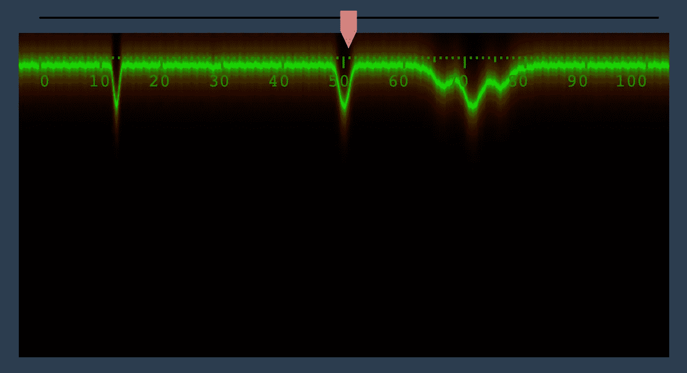

华丽的发光与新的片段着色器

最终提交记录在 10 月 6 日。这断断续续花了九个月的时间。在 Elm 开发 web 应用程序的过程中，我们学到了什么，特别是这个？

**好事**

> 强类型避免了许多错误，并且错误消息是极好的。编译真的很快，出来的代码也很快。
> elm-ui 让布局变得轻而易举。
> 从一开始就使用 git 是一个好的举措，即使我有时会搞砸。

**坏事**

> 知道如何构造代码很难，拥有一个千行主模块很容易。

**更多好东西**

> 带有 Elm 插件的 JetBrains IDEA 是一种乐趣。
> 你有 1000 线主模块也没关系。WebGL 没有你想象的那么可怕。只是有点吓人。

让我们最后看一下我们的交付成果:

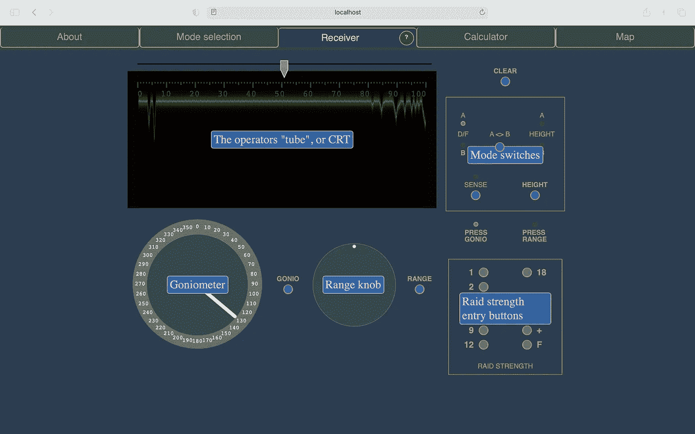

最终用户界面，显示解释性覆盖

有了这个经验，接下来会发生什么呢？