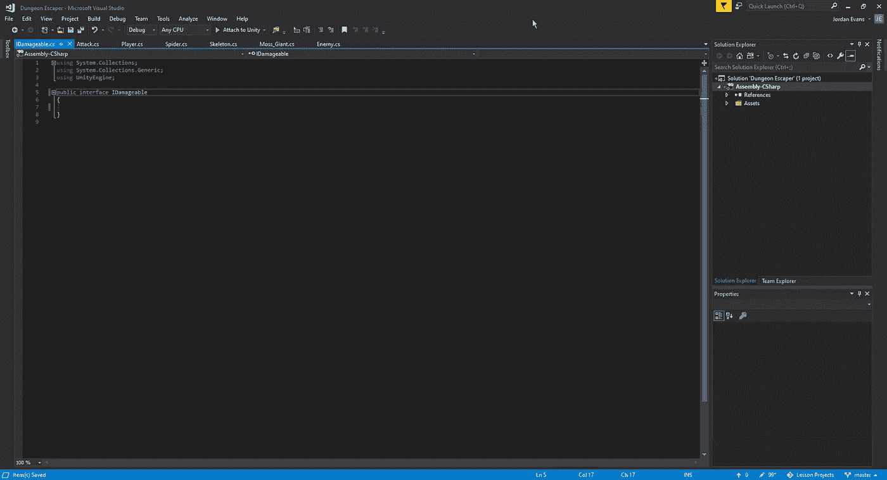
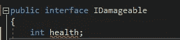
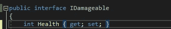
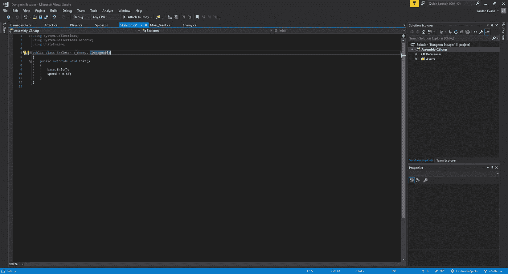
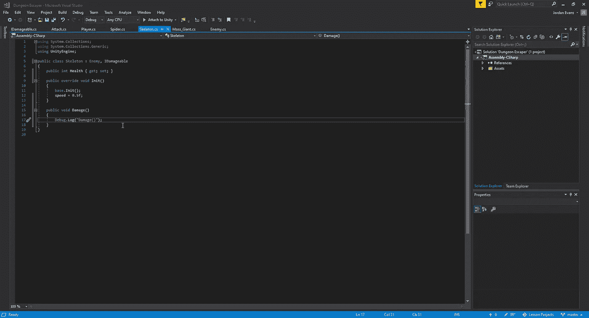
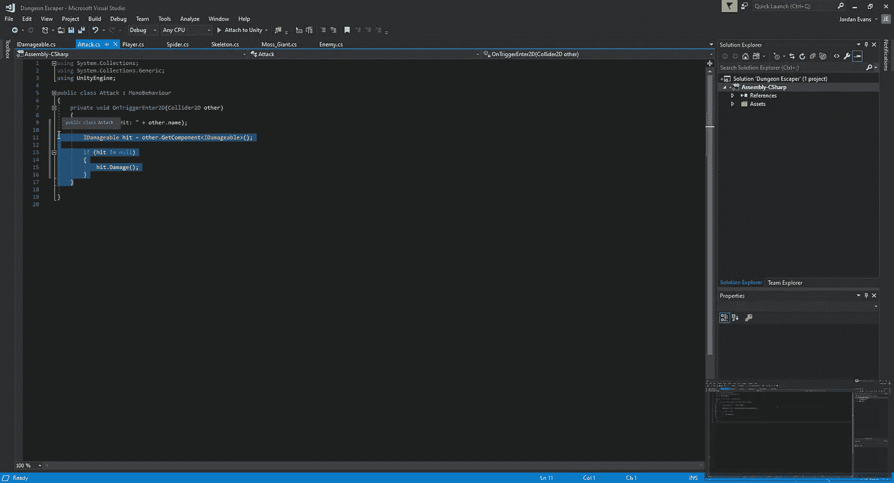
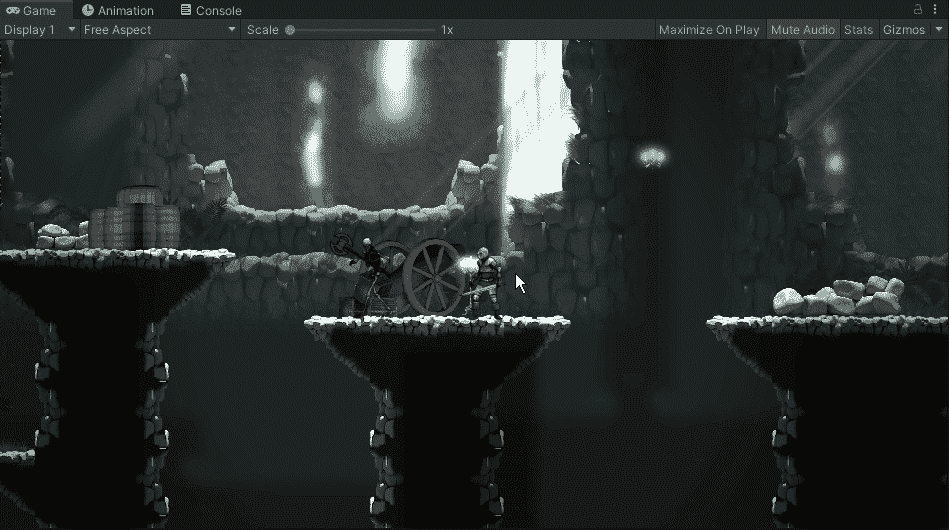

# Unity 中的仪表板界面设置

> 原文：<https://medium.com/nerd-for-tech/idamagable-interface-setup-in-unity-66218f1e711c?source=collection_archive---------6----------------------->

接下来，让我们看看如何创建一个接口来检测我们的损坏组件。就目前的情况而言，我们有了挥杆的打击箱和可以合作的敌人，但是他们没有办法让我们在适当的位置上互相交流。为了解决这个问题，我们要做的是创建一个接口脚本，用来告诉 Unity 已经受到了伤害。这种方法的好处在于，我们不仅可以用来对付敌人，还可以用来对付可摧毁的物体。
首先，我们要制作一个新的脚本，并命名为 IDamageable。我放在前面是为了让其他人知道它是一个基于接口的脚本:

正如我们在上面看到的，我们去掉了脚本中的类 MonoBehaviour 部分，用 inerface IDamageable 替换。从这里，如果我们试图创建一个 int 变量，我们将会得到一个错误:

这是因为在处理接口时，我们必须附加(get 设置；)与我们要定义的变量:

一旦我们设置了我们的界面，我们就可以进入我们的框架脚本并在那里分配它:

当我们给我们的脚本分配不同的部分时，我们只能选择一个类来提取，但是我们可以用这个脚本拥有任意多个不同的接口。然而，正如我们所看到的，当试图调用它时，脚本中有一个错误。这是因为我们需要分配我们创建的脚本的不同部分:

一旦我们分配了它，我们就可以快速进入我们的攻击脚本，允许它调用损害方法，并运行我们的调试，以确保它与骨架交互:

现在，我们已经使用新创建的界面，在我们的骨骼和剑挥杆之间进行了交互，我们将看看如何为我们的骨骼创建行为，以便在游戏中的不同精灵之间进行交互。