# I 可成像界面| Unity

> 原文：<https://medium.com/nerd-for-tech/idamageable-interface-unity-45bf961d141?source=collection_archive---------1----------------------->

## 统一指南

## 关于如何在 Unity 中实现 IDamageable 接口的快速指南

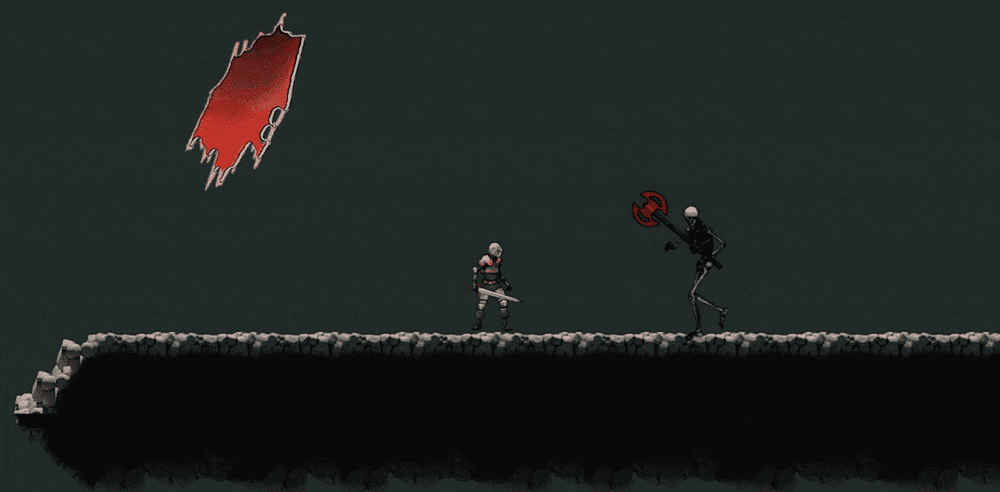

**目标**:在 2D 游戏的敌人中实现一个 IDamageable 接口，以指示他们有生命值并且是可伤害的。

在上一篇文章中，我介绍了[如何在 Unity 中使用抽象类来设计敌人。现在，为了让玩家知道敌人是易受伤害的，是时候使用界面了。](/nerd-for-tech/using-abstract-classes-to-design-enemies-unity-60c39c793a66)

# 当前的敌人

首先，让我们看看 2D 游戏中的敌人。目前，我们有一个苔藓巨人，一个蜘蛛和一个骷髅在关卡的特定区域巡逻:

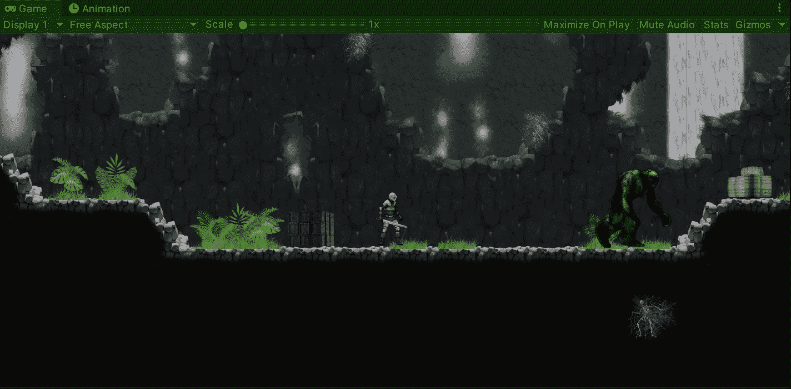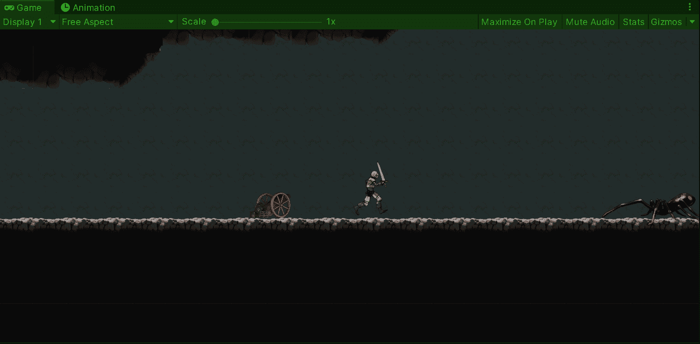

# 可成像接口

现在，为了表明某些游戏对象是可破坏的(比如我们的敌人)，让我们创建一个名为 IDamageable 的新 C#脚本:

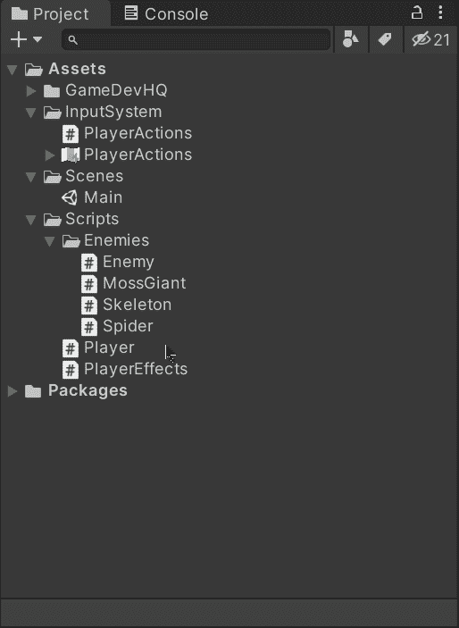

创建完成后，让我们打开脚本，将 IDamageable 类修改为 interface 类型:

> 注意:一个**id imageable****接口**将允许我们**强制**某些类实现处理损坏所需的**属性**和/或**方法**。

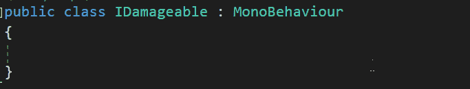

然后，让我们声明一个新的属性和一个方法来处理某些职业的伤害，比如敌人:

*   健康

这个属性将决定每个职业的健康程度。

*   损害

这种方法会照顾到类内健康的损害应用。

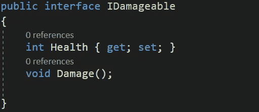

一旦我们保存了接口，让我们打开一个敌人的类，并确保通过实现**idamagable**接口来声明它是可破坏的:

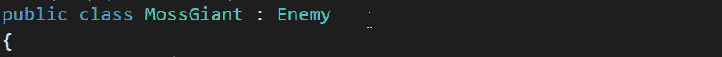

您会注意到，只要我们声明该类实现了接口，该类就会显示一个错误:

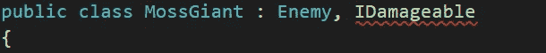

这是因为需要实现**I imageable**接口。要修复它，我们需要在类中声明各自的健康属性和损坏方法:

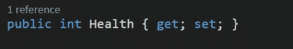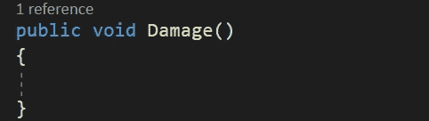

声明之后，我们会看到错误从脚本中消失了。然后，让我们对其他敌人职业做同样的事情:

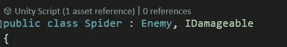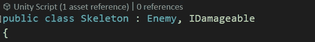

现在，我们能够宣布对我们的每一个敌人做什么。例如，我们可以在**伤害**方法中从**生命**属性中减去一个单位:

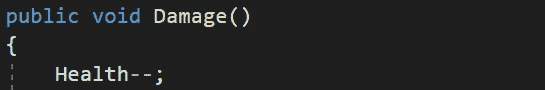

这个接口实现允许我们调用**损害**方法，而不限制我们想要在攻击中损害什么。我们可以在一个木头盒子、一个敌人甚至是一个玩家中实现这个界面。例如，要使用它，我们可以在碰撞中从碰撞器获取**I 可损坏的**组件，并调用**损坏**方法:

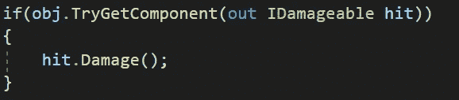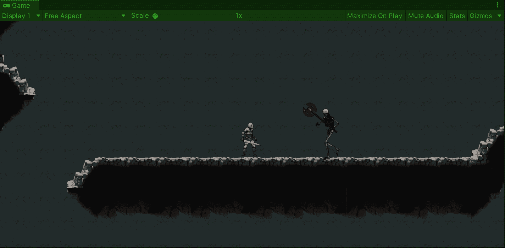

就是这样，现在我们可以用一个界面来表明我们的敌人在 Unity 中是易受攻击的！:d .我会在下一篇文章中看到你，在那里我会展示一种在 Unity 的近战中实现生命盒检测的方法。

> *如果你想更多地了解我，欢迎登陆*[***LinkedIn***](https://www.linkedin.com/in/fas444/)**或访问我的* [***网站***](http://fernandoalcasan.com/) *:D**