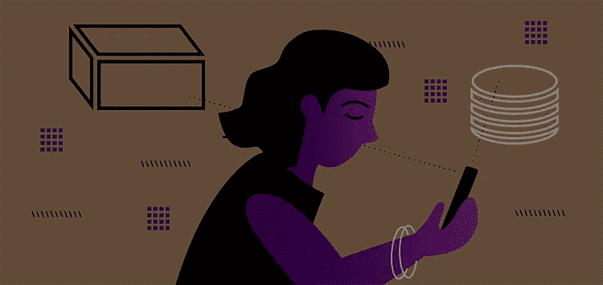

# 身份解析在你的仓库里更有价值

> 原文：<https://medium.com/nerd-for-tech/identity-resolution-is-more-valuable-when-its-on-your-warehouse-4751309441c9?source=collection_archive---------21----------------------->

身份解析使您能够结合跨数字接触点的唯一标识符来实时识别用户。有了它，您可以创建一个统一的、全渠道的客户视图。通过利用身份图(一个包含这些标识符的数据库)，您可以识别和连接与客户旅程的不同方面相关的细节，并将它们整合到一个客户档案中。

# RudderStack 在您的数据仓库上构建您的身份图。其他客户数据工具没有。

虽然许多客户数据工具提供了身份解析，但是它们在其 CDP 工具基础设施中构建和存储这些身份图。对于用户来说，构建身份图是不透明的，组成身份图的数据是未知的。不过，RudderStack 并没有任何黑盒魔法。

RudderStack 最突出的特点之一是其**仓库优先的架构**。RudderStack 将您的数据仓库视为一等公民。因此，您可以将所有跨平台数据实时发送到您的仓库。更重要的是，RudderStack 允许您在数据仓库中构建重要的数据结构——比如您的身份图。这意味着您可以利用驻留在您的仓库中的所有跨平台客户数据，使用身份图将全面的用户配置文件缝合在一起。

# 企业如何使用身份解析

在我们开始讨论对您的仓储客户数据执行身份解析的优势之前，让我们快速了解一下公司如何在传统 CDP 工具中利用身份解析，这些工具将您的身份图存储在他们的基础架构中。

# 跨设备身份拼接

虽然用户可以在特定设备上使用一个浏览器来完成所有与工作相关的活动，但他们也可以使用另一个设备或浏览器来完成个人任务。用户行为因设备、浏览器甚至一天中的时间而异。您的网站和应用程序会生成数据，您可以使用这些数据来获得有价值的详细信息，例如用户在空闲时间更可能做什么，他们在平板电脑上的搜索历史是什么样子，等等。将所有这些信息结合起来，企业就能在多台设备上全面了解消费者是谁。

通过跨平台和设备实时连接不同的唯一标识符，企业可以实现高效的定位和个性化。

# 在下游工具中实时识别用户

企业通常从多个不同的数字资产中收集事件数据，并将这些数据传输到下游工具。身份解析允许他们跨给定用户的数字属性将所有用户 id 和匿名 id(在用户登录前或未登录时分配给用户的 id)链接在一起。这个过程包括组合用户的设备 ID、离线 ID、cookie 信息等。，变成一个单一的匿名标识符，允许品牌识别独特的用户。

通过利用驻留在数据仓库中的身份图，您可以轻松地识别、聚合和统一来自各种数据仓库的客户概要文件。

# 在 CDP 内部建立和激活细分受众

身份解析使营销人员能够消除唯一用户的重复，并监控他们在所有数字接触点的整个客户旅程。它还允许他们根据用户会话和设备之间的客户产品交互以及各种实时特征，建立基于行为的群组。

您可以将这些受众用于各种下游激活用例，如分析、支出优化、定向营销、个性化消息传递、先进的客户支持以及提供独特的客户体验。

# 在数据仓库上构建身份图的其他好处

当您在数据仓库上构建身份图时，您将获得传统身份解析的所有优势，甚至更多。

# 更简单、更可扩展的跨设备身份拼接

在现代数字业务中，用于跨设备身份拼接的图可能非常大，由数千万甚至数亿个节点组成。随着您在不同的接触点收集更多的数据，这个数字会快速增长。在这样的场景中，将身份图存储在您的数据仓库上——而不是 CDP 基础设施上——很有意义。云数据仓库是无限可扩展的，数据存储是廉价的。

RudderStack 允许您在数据仓库中实现高效、无缝的身份映射。它通过将图形作为表存储在仓库中，将虚拟 ID 与所有设备 ID(用户或匿名 ID)相关联，并映射它们之间的关联来实现这一点。它为您的所有事件数据构建身份图，并在新的事件数据进入您的仓库时不断更新它。

# 用来自非事件工具的数据丰富您的身份图

除了您的客户事件数据，您的仓库还存储来自不同非事件工具的数据，如 CRM 和客户支持平台、电子邮件营销和广告工具、分析平台等。

基于您的数据仓库构建的身份图可以利用所有这些数据来整合更全面、更丰富的用户资料，为您提供更准确、更实时的客户视图。

基于您的仓库构建的丰富的身份图还允许您通过实时汇集来自各种事件和非事件工具的信息来构建更有效的用户群组。

# 创建统一的客户档案

如果您的数据仓库是您的客户的唯一真实来源，那么在这个仓库数据的基础上构建您的身份图才是有意义的。

借助 RudderStack，您可以构建一个客户身份图，实时利用您丰富的仓储数据来提供所有客户的单一、统一视图。它链接标识符，如设备 id、cookies、电子邮件地址、IP 地址等。，到一个已知的或匿名的配置文件，同时遵循所需的隐私兼容的方法。

然后，您可以利用这个丰富的身份图来实现身份解析，并获得客户的完整的 360 度视图。您还可以使用身份图来实现其他用例，如线索评分、为您的个性化用例创建自定义群组和受众细分等。

# 免费注册并开始发送数据

测试我们的事件流、ELT 和反向 ETL 管道。使用我们的 HTTP 源在不到 5 分钟的时间内发送数据，或者在您的网站或应用程序中安装我们 12 个 SDK 中的一个。[入门](https://app.rudderlabs.com/signup?type=freetrial)。

本博客最初发表于
[https://rudder stack . com/blog/identity-resolution-is-more-valued-when-its-on-your-warehouse](https://rudderstack.com/blog/identity-resolution-is-more-valuable-when-its-on-your-warehouse)