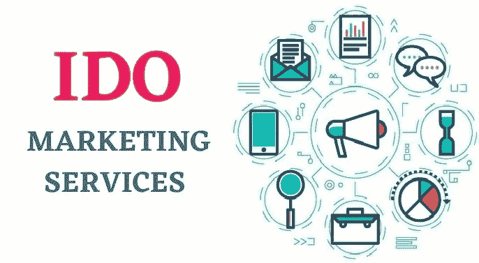

# IDO 营销服务——提高项目知名度和影响力的理想方式

> 原文：<https://medium.com/nerd-for-tech/ido-marketing-services-an-ideal-way-to-enhance-your-projects-visibility-and-reach-20c11d6207bb?source=collection_archive---------8----------------------->

筹资机制被用来将企业或初创公司的影响力扩大到下一个层次。在当今的数字时代，有许多不同的筹款方式。在各种筹资机制中，IDO，即最初的分散交易所发行，是大多数人无疑更喜欢的最新筹资策略。

这是因为它不可否认地克服了其他三种筹资战略的缺点。然而，通过有效的 IDO 营销策略，将目标受众转化为潜在投资者是完全可行的。

在这篇博客中，我们将讨论最佳的 [**IDO 营销**](https://bit.ly/3f0VcLk) 策略，来扩大你的 IDO 项目在市场上的成功。那么，我们开始吧。

## **首次分散交易发行概述**

在继续 IDO 营销服务之前，让我们对 IDO 有一些了解。与 ico 和 IEOs 相比，IDO 方法相对较新。首次分散交易所发行(IDO)是一种独特的筹资活动，使项目能够通过在分散交易所出售代币来筹集资金。众筹平台是无许可和去中心化的，它在密码领域开辟了一种全新的筹资方式。

[**分散式加密货币交易所**](https://bit.ly/3Ubbhx9) 由 IDOs 用于上市、交易和清算项目代币。该机制允许投资者直接从项目中购买代币，而不像 ICO 那样向在交易所交易的投资者提供代币。此外，它们的代币上市成本更低，代币交易速度更快，这在快速发展的加密筹款领域具有开创性。

IDOs 发起的一些成功项目有 Raven Protocol IDO、SushiSwap IDO 和通用市场准入协议 IDO。

## **I do 与其他筹款机制有何不同？**

随着越来越多的企业考虑将 IDO 用于筹资，它越来越受欢迎。一个 IDO 结合了 ICO 和 IEO 关于其他两个。

IDO 采用分散式而非集中式交换，这是唯一的区别。首次分布式发售(IDO)和首次交易所发售(IEO)本质上是一样的；我们甚至可以称伊多为 IEO 的替代品。

如今更常用的一个基于密码的术语是“IDO”在这两种方法中，组织可以直接与交易者或投资者交换代币。然而，与 IEO 不同，伊多是分散的；因此，不需要支付兑换费用。

## **是什么让 IDO 营销服务如此重要？**

IDO 营销服务是当前时代对寻求融资的 Web3 初创公司的一种需求。由于市场竞争激烈，IDO 营销的概念应运而生，这使得在潜在投资者的心目中建立您的品牌至关重要。简而言之，IDO 营销是一种广告策略，旨在帮助 IDO 期间的项目。这种类型的营销包括许多传统营销的促销策略，但也有一些明显的例外。

## **I do 营销的终极目标**

在这种情况下，IDO 营销的主要目标是说服投资者购买项目的令牌，并进行交易或作为社区成员参与。IDOs 的特定推广极大地有助于提高对您的项目启动的认识和热情，使您能够激起潜在投资者的兴趣和兴奋。因此，它们必须比仅仅吸引人更能提供信息。

## **I do 营销服务的最佳收益**

IDO marketing 为您的项目提供了多种优势，包括:

*   见证更广泛的受众接触您的项目
*   将观众转化为潜在投资者
*   获得目标受众信任的必然途径
*   帮助你见证你的 IDO 销售的一个伟大的高潮
*   这些策略被用来建立一个忠实的观众群

## **你不能忽视的 7 大 IDO 营销策略！！！**

以下是一些可以增加你的项目的知名度和资金流入的 IDO 营销策略:

**设计详细的白皮书**

推广您的 IDO 项目的第一步也是最重要的一步是创建一份包含所有清晰提及的信息的白皮书。使用本白皮书，您将有机会描述您的项目并向受众介绍其核心功能，这将提高他们对您项目的信心水平，并将积极影响投资者的代币购买决策。

**新闻稿**

新闻稿仍然是 IDO 项目的重要营销策略，因为它们一直是新的基于加密的风险投资。如果文章写得简洁明了，以一种有组织的方式关注项目的好处，更多的人可以理解和相信你的 IDO 项目。在声誉良好的网站上发布基于项目的新闻稿是非常重要的。

**社区建设&订婚**

一个关键的 IDO 营销策略是建立一个强大的社区。密码爱好者在 Discord 和 Telegram 中找到了避难所，通过以用户为中心的团体，IDO 项目可以通过各种吸引参与者的活动来推广他们的令牌。IDO 项目的其他社区建设平台可以包括 Quora、Reddit、Clubhouse 等。

**社交媒体营销**

社交媒体的巨大增长无需介绍。社交媒体平台可以作为改变游戏规则的 IDO 营销策略。IDO 项目可以维护他们的官方页面，并在 Instagram、Twitter、脸书、LinkedIn 等网站上发布信息丰富的项目相关内容。这就是为什么社交媒体营销是一种成功驱动的营销策略，以营销 IDO 项目。

**内容营销**

你知道那个事实吗？“内容”永远是营销世界中的驱动因素。为了连接更大的 Web3 社区，使用内容营销无疑是一种开创性的营销策略。IDO 项目可以通过博客、纹理、海报、字幕、音频或视频内容等获得流行。这样的内容类型，当与理想的 SEO 策略结合时，可以帮助激发社区对 IDO 项目的兴趣。必须确保内容以教育和吸引人的方式详细描述了你的 IDO 项目概念的每一个方面。

**影响者营销**

另一个有趣的补充是影响者营销。影响者营销已经成为当今市场中最常见的营销策略之一。影响者可以通过以迷因、视频或图像的形式创建内容来促进您的 IDO 项目，以吸引和互动的方式吸引观众。当选择影响者来推广你的 IDO 项目时，你必须密切关注。这样做，你的 IDO 项目就有机会接触到合适的受众。

**电子邮件营销**

电子邮件可以用作与潜在 IDO 投资者直接沟通的方法，如果你有一个社区，这很有帮助。潜在投资者可以通过接收传达项目目标和寻求解决的问题的有针对性的信息，就购买 IDO 令牌做出明智的决定。

## **关闭思路**

即使你的 IDO 项目价值数百万，也有很多机会被潜在投资者忽视。IDO 项目的营销是一个复杂而耗时的过程，需要专家的指导，以最大限度地减少您的费用，节省时间，并消除代价高昂的营销错误。

要保持领先地位，最好是与一家领先、可靠、在市场上拥有良好声誉和影响力的 IDO 营销机构携手合作。

凭借他们在根据您的业务需求提供最佳 IDO 营销策略方面的深厚知识，您可以轻松实现他们的业务目标，并提高他们的 IDO 项目在其目标受众中的影响力。