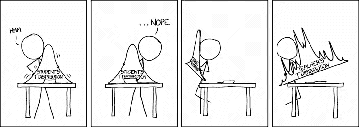
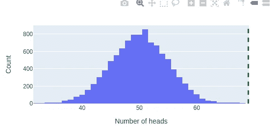
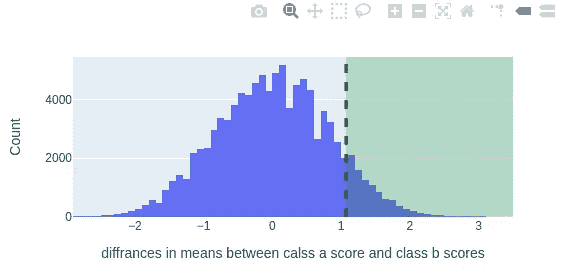

# 如果你会编码。可以做统计。

> 原文：<https://medium.com/nerd-for-tech/if-you-can-code-you-can-do-statistics-ff7ff36ff40c?source=collection_archive---------11----------------------->

## 在一窍不通的情况下做统计。

**简介:**

在这一系列的博客文章中，我将谈论一些我们可以在没有任何统计学知识的情况下用来回答统计问题的技巧。
我们将讨论一些统计学&概率问题，并通过计算(使用代码)来回答它们。并与解析解进行比较。

我们还将讨论这种方法的利弊。



xkcd.com

要充分利用这些帖子，你需要知道些什么？
对于循环，函数，真的就是这样。

注意:我将使用 python🐍。但是你可以用你喜欢的语言实现同样的逻辑，即使你喜欢的语言是 PHP💩。

这是概率，那就从一个硬币的例子开始吧。

***例如:***

> 我们在一家魔法商店前发现了一枚硬币。我们翻了 100 次，数了数正面和反面的数量。
> 我们意识到我们得到了 69 个头和 31 个尾。
> 所以问题是这样的。这是一枚公平的硬币吗？还是这里发生了什么奇怪的事情🤔？

重构问题:
为了解决这些问题，我们必须用一种我们程序员直观理解的方式来构建它们。在这种情况下，非常简单。如果硬币是公平的，如果我抛 100 次，得到 69 个正面的可能性有多大？
为了回答这个问题，我们可以这样做:

*使用公平硬币(正面为 0.5)模拟 N 次游戏(一次游戏 100 次翻转)。

*计算我们得到 69 个或更多人头的次数。

*计算有 69 个或更多人头的 N 个游戏的百分比。

```
from random import choice
coin = [1 , 0] # 1 is heads 0 is tails
N = 100000
sum_of_heads = []
for i in range(N):
    flips = [] 
    for _ in range(100):
        flips.append(choice(coin)) 
    sum_of_heads.append(sum(flips))>>> len(list(filter(lambda x:x>=69, sum_of_heads)))/N0.00087
```



绿色虚线是 69

正如我们在这里看到的，如果硬币是公平的，我们得到这个数据(69 头)的概率是 0.00087(这就是所谓的 P 值)。

**另一种解决方案:** 通常对于这些问题，我会尽可能使用 numpy 来提高执行速度🏃🏽🏃🏽。

```
import numpy as npn = 10000
flips_num = 100
sims = np.random.choice([1,0], size=n*flips_num).reshape(flips_num, n).sum(axis=0)>>> sum(sims >= 69)/n0.00087
```

这个解决方案比第一个快几个数量级。
我在这里做的是模拟所有的翻转(N*100)，然后将 1D 数组改造成形状为(100，N)的 2D 数组，并对每一行求和。

[如果您对分析解决方案感兴趣。](https://en.wikipedia.org/wiki/Checking_whether_a_coin_is_fair#:~:text=A%20fair%20coin%20is%20an,the%20same%20chance%20of%20winning)

**举例:**

> 我们有一个装有三枚硬币的盒子。硬币 1 是标准的，硬币 2 有两个头像，硬币 3 是作弊的，所以得到头像的概率是 1/3。从盒子里随机选择一枚硬币，扔向空中。
> - (a)求获得正面结果的概率。
> - (b)已知所选硬币是正面的情况下，硬币是双正面的概率是多少？同样，如果我们重新定义这个问题，如何去模拟它是很直观的。
> 如果我们将每个硬币模拟成正面概率[0.5，1，1/3]，然后我们从这些概率/硬币列表中随机选择一个概率(p)N 次，我们得到正面的概率是多少？
> 在这些时间里，我们得到 1(双头硬币)的概率是多少

> 解释随机 [np.random.choice](https://numpy.org/doc/stable/reference/random/generated/numpy.random.choice.html) p 参数。
> p 是与 a 中每个值相关的概率。
> 因此，如果我们有 a = ['tails '，' heads']和 p = [0，1]，这意味着我们将总是选择正面，如果 p=[0.1，0.9]，这意味着 10 次中有 9 次我们将选择正面。(如果你运行足够多的模拟)
> **概率总和必须为 1

同样，如果我们重新定义这个问题，如何去模拟它是很直观的。如果我们将每枚硬币模拟为正面概率[0.5，1，0.33333]，然后我们随机选择 N 次这些概率/硬币列表中的一个概率(p)，我们得到正面的概率是多少？在这些时间里，我们得到 1(双头硬币)的概率是多少

为了回答这个问题，我们可以这样做:

*   从盒子中随机选择一枚硬币(从正面概率列表中随机选择一个正面概率)大小这里是 N；
*   循环概率，用你选择的硬币掷硬币。(注意，反面概率=正面概率)；
*   如果选择了头(1)增加一个头；
*   如果是双头硬币(正面概率=1)，则增加两个正面加一个:
    -正面的概率将是正面/N
    -给定正面的概率将是两个正面/正面。

```
N = 1000000
proba_of_heads = [0.5, 1, 1/3]
heads = 0
two_headed = 0
random_coin_proba = np.random.choice(proba_of_heads, size=N)
for c in random_coin_proba:
    if np.random.choice(a=[0,1], p=(1-c, c)):
        heads += 1
        if c == 1:
            two_headed += 1

>>> f"(a) proba of heads is {heads/N}. \n (b)proba of two headed given heads is {two_headed/heads}"(a) proba of heads is 0.6106\. 
(b) proba of two headed given heads is 0.5456
```

# 群体差异。

**示例:**

> 假设你是一名教师，你教 A 和 B 两个班。在第一次测试后，你注意到 B 班的平均分高于 A 班的平均分。
> 你想知道，这是否足够重要？这种差异是偶然造成的可能性有多大？

```
a_scores = [5.5,6.8,7,9,3,7,6,1,4,5,2,8,7,9]
b_scores = [4.7,5,6,8,8,9,9,4,6.5,7,6.3,7,8]
>>> np.mean(b_scores), np.mean(a_scores)(6.8076923076923075, 5.735714285714286)
```

因此，B 类的平均值为:6.8
，A 类的平均值为:5.7

如果你在谷歌上搜索如何使用 python 来回答这个问题，你可能会得到这样的结果:

```
from statsmodels.stats.weightstats import ttest_ind
>>> ttest_ind(b_scores, a_scores, alternative='larger', usevar='unequal')[1]0.096
```

但这似乎不是一个有用的抽象层次，让我无法更好地理解这个问题。那么我们如何用代码来解决这个问题呢？

## 洗牌:

在这种情况下，重新思考这个问题将有助于我们设计解决方案。我们试图回答的真正问题是:如果两组之间没有差异，我们得到均值(b)-均值(a)=(6.807–5.735)= 1.072 的平均值差异的可能性有多大。

我们能做的很简单:

*   把所有的分数放在一个列表里；
*   洗牌，并随机分裂他们；
*   取手段之间的差异；
*   重复该过程，并计算平均值之差为 1.072 或更高时的次数。

```
from random import shuffle
a_scores = [5.5,6.8,7,9,3,7,6,1,4,5,2,8,7,9]
b_scores = [4.7,5,6,8,8,9,9,4,6.5,7,6.3,7,8]
mean_diff = np.mean(b_scores) - np.mean(a_scores)
N = 100000
means_diffs = []
for i in range(N):
    mixed = a_scores + b_scores
    shuffle(mixed)
    a , b = mixed[:len(a_scores)], mixed[len(a_scores):]
    means_diffs.append(np.mean(b) - np.mean(a))>>> np.sum(np.array(means_diffs) >= 1.072)/N0.096
```



正如你在这里看到的，结果与解析解相同，但不同的是，我们实际上知道发生了什么。希望是:D

**这些方法的好处:**

1 —灵活性(非常容易添加分支逻辑和处理大量边缘情况)；
2 —迫使你在解决问题的同时思考问题，而不是担心 t 分布表或[自由度](https://en.wikipedia.org/wiki/Degrees_of_freedom_(statistics))；3-对程序员来说很直观，因为这是我们的思维方式；4 —你做出假设和设计选择。但是，分析方法通常带有一些假设，你需要了解这些假设，并时刻牢记在心。

**这些方法的败笔。**

1 —结果不精确，但对大多数应用来说足够了；
2 —与解析解相比，计算成本较高；
3 —分支逻辑需要大量迭代，并且难以向量化(使用 numpy)；
4——并非所有的统计问题都可以直接模拟，因此有时模拟也很难想象。(我将在接下来的文章中讨论更多的例子)

这篇文章不是什么？
——我不是说这种方式比用分析法好。
——我不是说你不应该学统计学或者你不需要。

*我要说的是，许多统计问题可以通过计算来解决，如果你想变得有趣，除了简单的循环或函数之外，不需要任何东西。如果你是程序员，这是一种更自然的思考方式。

下一篇文章:A/B 测试，简单而正确的方法。