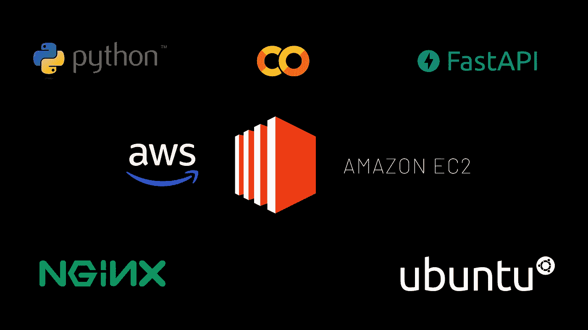
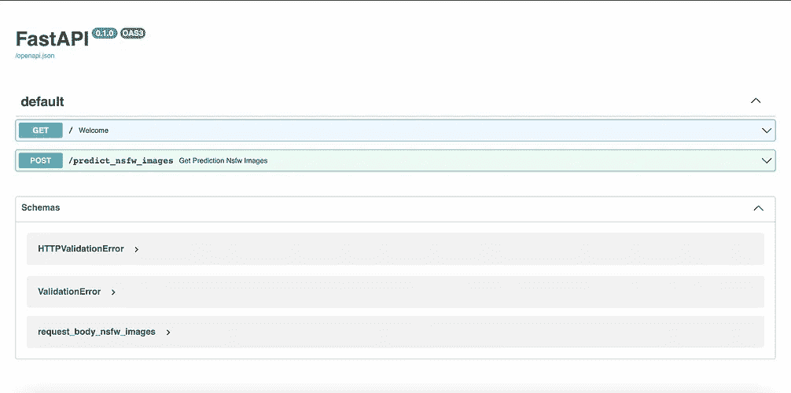
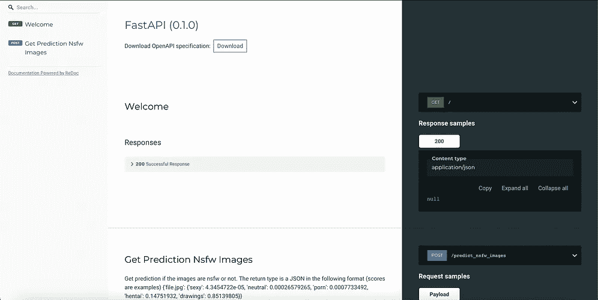
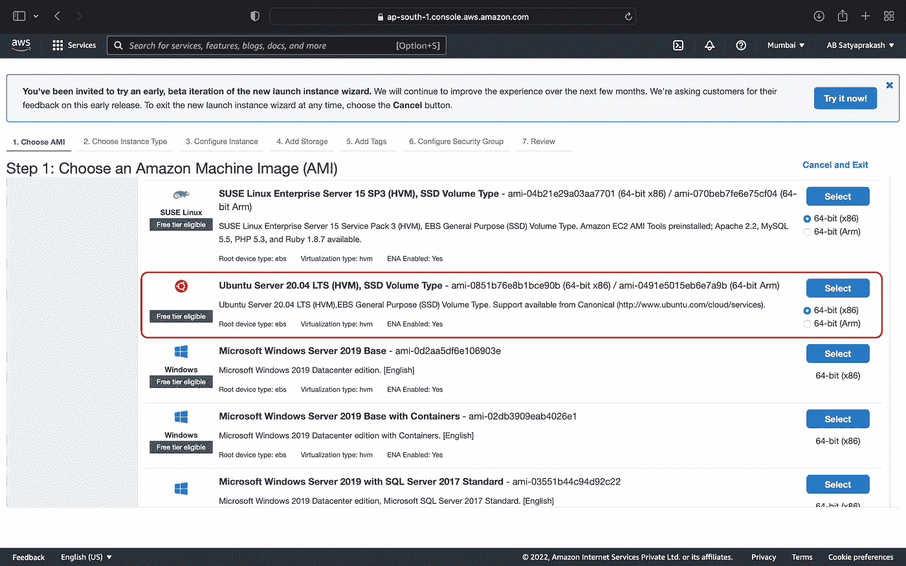

# 如果你的创业涉及社交媒体，确保这一点…

> 原文：<https://medium.com/nerd-for-tech/if-your-startup-involves-social-media-make-sure-of-this-5c415ce90c20?source=collection_archive---------5----------------------->

## 通过过滤掉 NSFW 内容来保护您平台的安全

共同的，让我们面对它！你有一个创业的好主意。你可以继续添加一些独特的功能。然后你觉得你也希望你的用户在平台上互动。到目前为止，一切顺利。你知道的下一件事是，人们开始分享**不适当的内容**与你的期望相反，因为事情没有得到充分的监控。


**工作不安全** ( **NSFW** )是[网络俚语](https://en.wikipedia.org/wiki/Internet_slang)或[简写](https://en.wikipedia.org/wiki/Shorthand)用来标记链接到观看者可能不希望在公共、正式或受控环境中看到的内容、视频或网站页面。

你不希望你的光芒四射的愿景成为另一个 NSFW 内容的中心，是吗？我没有夸大其词。每天都有成千上万的应用程序以同样的方式被滥用。看看你周围。您可能还会发现一些例子，尤其是那些用户身份保持匿名的例子(提示🙂).

在这篇博客中，我将向您展示如何使用 **NSFW 检测机器学习模型**保护您的应用程序，以及如何在 **AWS EC2** 上使用**快速 API** 部署它。

[](https://github.com/GantMan/nsfw_model) [## GitHub-gant man/nsfw _ model:NSFW 探测器的 Keras 模型

### 接受 60 多 Gigs 数据的培训，以识别:图纸-安全的工作图纸(包括动画)非常非常和…

github.com](https://github.com/GantMan/nsfw_model) 

或者，如果你打算使用基于 Javascript 的后端，你可以尝试使用 npm 包——nsfwjs——T21(由相同的模型驱动)。我把这作为一个有趣的练习留给读者。🏋🏻



我们将在这个博客中遇到并使用的技术

这些是我们今天要学习的技术。让我们看看构建、编码和部署需要采取的步骤。

# 1.下载 ML 模型

出于这个项目的目的，我们可以直接下载存储库的[发布部分](https://github.com/GantMan/nsfw_model/releases/tag/1.2.0)中提供的预训练模型。该模型目前具有 93%的精确度，并且基于 Inception V3。在你解压[mobilenet _ v2 _ 140 _ 224.1 . zip](https://github.com/GantMan/nsfw_model/releases/download/1.2.0/mobilenet_v2_140_224.1.zip)之后，你会发现一堆文件。我们感兴趣的那个叫`saved_model.h5`。把这个保存在别的地方，因为我们以后会需要它。

# 2.试试这个 Google Colab

由于模型是预先训练好的，我们可以做好准备，只用几行代码就可以开始使用它。前往 [Google Colab 笔记本](https://colab.research.google.com/drive/11_bayvzjoAj8UdC_F_HRmKmGa-Nu2eDT?usp=sharing)，尝试理解并运行代码。

在继续之前，将`saved_model.h5`上传到您的运行时。否则，您将在第三个单元格中得到一个错误(*模型路径未找到*)。简而言之，这就是准则的全部内容。

1.  我们使用 [urlretrieve](https://docs.python.org/3/library/urllib.request.html) 作为`file.jpg`下载图片。之后，我们加载模型并使用 [nsfw_detector](https://pypi.org/project/nsfw-detector/) 对`file.jpg`进行分类。后来，`file.jpg`被去掉了。
2.  然后，我们可以运行互联网上随机图像 URL 的最后一个单元格来查看结果。
3.  结果是 JSON 格式的，包含 5 个类别中每个类别的分数(%百分比)。下面给出了一个示例结果。**在我们的案例中，中性图像可以被认为是“工作安全的”。**

```
{‘sexy’: 4.3454722e-05, ‘neutral’: 0.00026579265, ‘porn’: 0.0007733492, ‘hentai’: 0.14751932, ‘drawings’: 0.85139805}
```

# 3.使用快速 API 构建 API

我们可以使用上面写的代码来制作一个快速的 API 应用程序。为此，用函数`predict_nsfw_images(url)`创建一个文件`nsfw_images.py`。同样，确保将`saved_model.h5`添加到您的文件夹中，并将其重命名为`nsfw_mobilenet2.h5`。

现在创建另一个[文件](https://github.com/Imperial-lord/linkedin-clone/blob/main/03-nsfw-detection/linkedin_fastapi/main.py)，`main.py`。定义`/`和`/predict_nsfw_images`的端点。使用 BaseModel (pydantic)定义请求体，最后使用`nsfw_images.py`中的函数进行预测。

*这个项目是我的 LinkedIn 克隆系列的一部分，所以所有代码都将在同一个存储库中。在这个系列中我们有更多的博客和视频，它们的链接可以在这个博客末尾的* ***结论*** *部分找到。*

[](https://github.com/Imperial-lord/linkedin-clone) [## GitHub-Imperial-Lord/linkedin-clone:让我们探索 LinkedIn 的所有令人惊叹的功能，并…

### 让我们一起探索 LinkedIn 的所有惊人特性，同时从…构建应用程序

github.com](https://github.com/Imperial-lord/linkedin-clone) 

FastAPI 的好处是内置的 **Swagger** 和 **Redoc** API 文档，看起来像这样。这些分别位于`/docs`和`/redoc`。然后，您可以使用**uvicon**或 **gunicorn** 在本地主机上部署它。只需打开一个终端，输入— `~$ uvicorn main:app --reload`



Swagger 和 Redoc 文档(从左到右)。对于更大的项目来说，拥有一个 API 文档变得非常有用，对于测试和简单的前端开发周期都是如此。

# 4.创建 EC2 实例

我们将在 **AWS EC2** 上部署我们的模型。亚马逊弹性计算云(Amazon EC2)是一种 web 服务，它提供可调整大小的计算能力，即亚马逊数据中心的服务器，您可以使用它来构建和托管您的软件系统。

创建 EC2 的新实例，选择 **Ubuntu Server 20.04 LTS** 作为操作系统。事情会略有不同(尤其是。文件夹和命令),如果你选择一个不同风格的 Linux 或另一个操作系统。



完成一些基本配置后，您应该准备好使用 SSH 连接实例了。使用`key.pem`来完成此操作。对我来说，这看起来像:

```
ssh -i "LinkedInClone.pem" ubuntu@ec2-xx-xxx-xxx-xx.ap-south-1.compute.amazonaws.com
```

# 5.在创建的 EC2 实例上部署 FastAPI

对于这个过程，你需要一个快速的开源 web 服务器，比如 **Nginx。**这是一个相对简单的步骤，我们有一个很棒的博客[在这里](https://lcalcagni.medium.com/deploy-your-fastapi-to-aws-ec2-using-nginx-aa8aa0d85ec7)作者是[劳拉·卡尔卡格尼](https://medium.com/u/1ce160b1fa58)🙌🏻记得添加 SSL 证书来启用 **HTTPS** 。

如果你正在学习我的教程和 GitHub，这是你需要放入`/etc/nginx/sites-enabled`的服务器块

```
server {     
        listen 80;
        listen 443 ssl;
        ssl on;
        ssl_certificate /etc/nginx/ssl/server.crt;
        ssl_certificate_key /etc/nginx/ssl/server.key;     
        server_name xx.xxx.xxx.xx;     
        location / {         
                 proxy_pass [http://127.0.0.1:8000](http://127.0.0.1:8000);    
        } 
}
```

现在你可以看到你的应用在公共 IP 上运行，并与之互动。然而，这并不是我们需要做的全部。我们需要确保 uvicorn 保持运行，即使我们没有通过 SSH 连接。此外，如果我们可以在每次 EC2 实例重启时运行一个 bash 脚本来激活服务器，这将是一个额外的收获。让我们现在做这些。

# 6.创建一个运行 Uvicorn 的服务

从您的主目录运行— `cd /etc/systemd/system`，然后运行`sudo nano linkedin_clone.service`。在打开的 nano 编辑器中，复制粘贴以下行。

保存此文件。现在从您的主目录运行这个命令。

```
sudo systemctl start nginx && cd /etc/systemd/system && sudo systemctl start linkedin_clone.service
```

# 7.处理 EC2 实例重新启动

如果由于某种原因必须重新启动实例，您必须重新运行最后一个命令。让我们自动化这项任务，太♻️为这一点，我们将需要设置一个 crontab。首先，在主目录中创建一个 bash 脚本`script.sh`。

确保使用`sudo chmod+x script.sh`允许执行权限。现在运行`crontab -e`，在文件末尾添加一行—

```
@reboot /home/ubuntu/script.sh
```

保存这个，重启你的实例，看看奇迹发生了🙂🪄

# 结论

现在，我们已经成功地构建并部署了我们的 ML 模型，它已经准备好用于任何应用程序。在下一篇博客中，我们将在 LinkedIn Clone 应用程序中使用它来调节与平台上的帖子共享的图像。

为 LinkedIn 克隆检查这个 [YouTube 播放列表](https://youtube.com/playlist?list=PLP4WN_p7hZ732ZY3E_PULipgicRRWxDd7)💼

如果您有任何问题或建议，请随时联系我。您可以在这些社交媒体平台上关注我，如 [LinkedIn](https://www.linkedin.com/in/ab-satyaprakash/) 、 [YouTube](https://www.youtube.com/channel/UCJ6D0HS8c9Il-eX5lGbAyGg) 、 [Twitter](https://twitter.com/AbSatyaprakash) 、 [Instagram](https://www.instagram.com/absatyaprakash/) 了解更多更新内容！

**一如既往！黑客快乐！😇**

[加入我的电子邮件列表，获得更多精彩的教程和编程博客](https://absatyaprakash01.medium.com/subscribe) ❤️