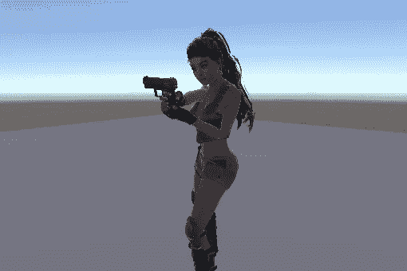
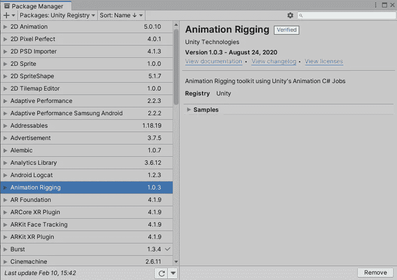
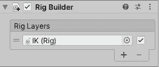
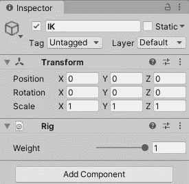
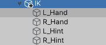
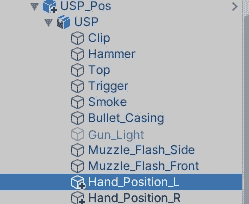
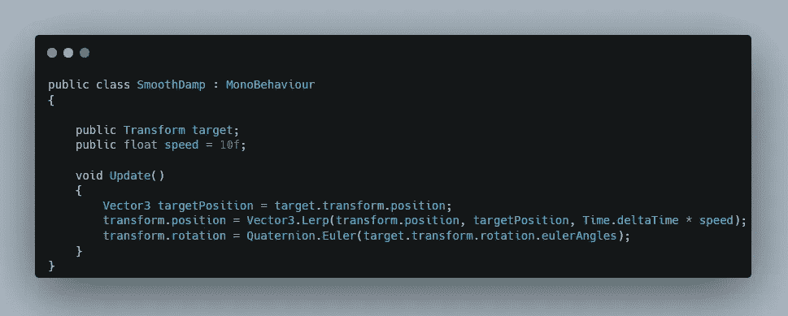
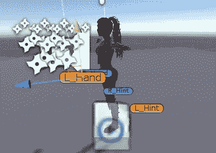
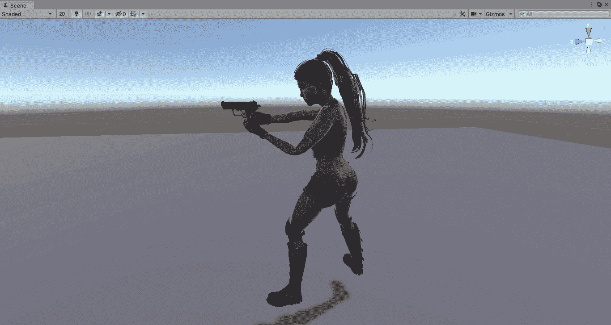

# IK 统一武器系统

> 原文：<https://medium.com/nerd-for-tech/ik-weapon-system-in-unity-e47780598dad?source=collection_archive---------4----------------------->

第三人称僵尸射手

目标:创造一个 IK 武器系统

首先从**窗口<包管理器安装动画索具。**

然后在你的玩家游戏对象中添加一个装备构建器组件，它需要成为父对象。如果它是另一个游戏对象的子对象，这将不起作用。

现在创建一个新的游戏对象 IK，并在其中添加一个装备组件。确保将这个游戏对象拖到播放器中的装备生成器，这样它就知道这是一个带有装备的游戏对象。

现在创建四个游戏对象，每个对象定义一手牌或一个提示。手指的是我们想要施加 IK 的地方，提示指的是一个极向量，它定义了在这种情况下肘部弯曲的位置和方向。

创建两个新的游戏对象来定义手的位置，这样我们就可以根据我们的枪来控制我们的手，而不是根据我们的手来控制枪。

现在创建一个新的脚本 SmoothDamp 脚本，然后它会学习，使手总是去目标位置。该脚本将被附加到手 Ik，目标将是任何一只手在 USP 内的手位置。

然后，我们添加一个双骨骼 IK 约束组件到手，以创建所需的手部运动。

我们将手放在描述要移动的目标的目标上，并定义提示对提示。

然后我们添加了三个游戏对象的装备，一直延伸到手部。

然后定位手并提示如下，手在上面表示手的运动，手在下面表示肘部的运动和旋转方向。

我们现在可以制作手的动画来重新加载，如上所述，手总是固定在 USP 上定义的手的位置，除非移动。