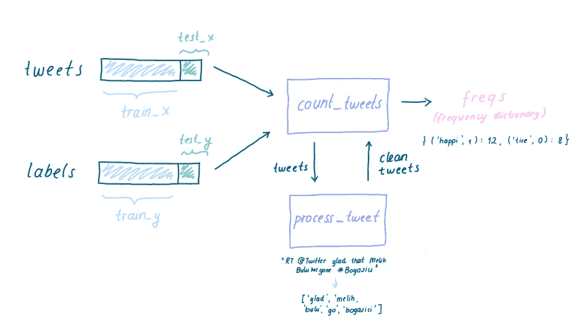
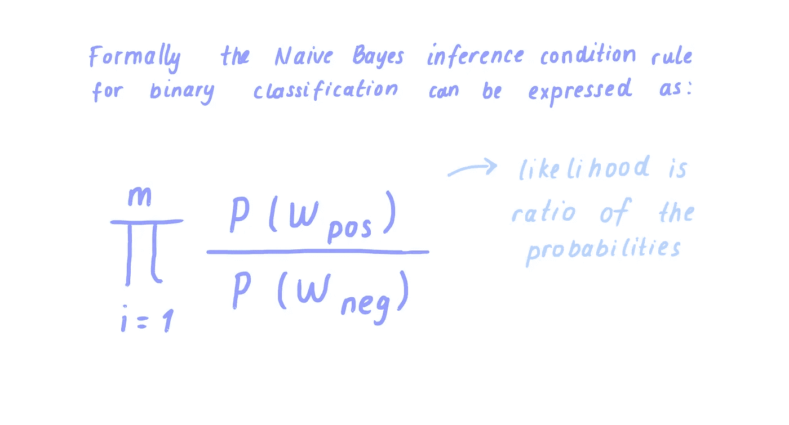
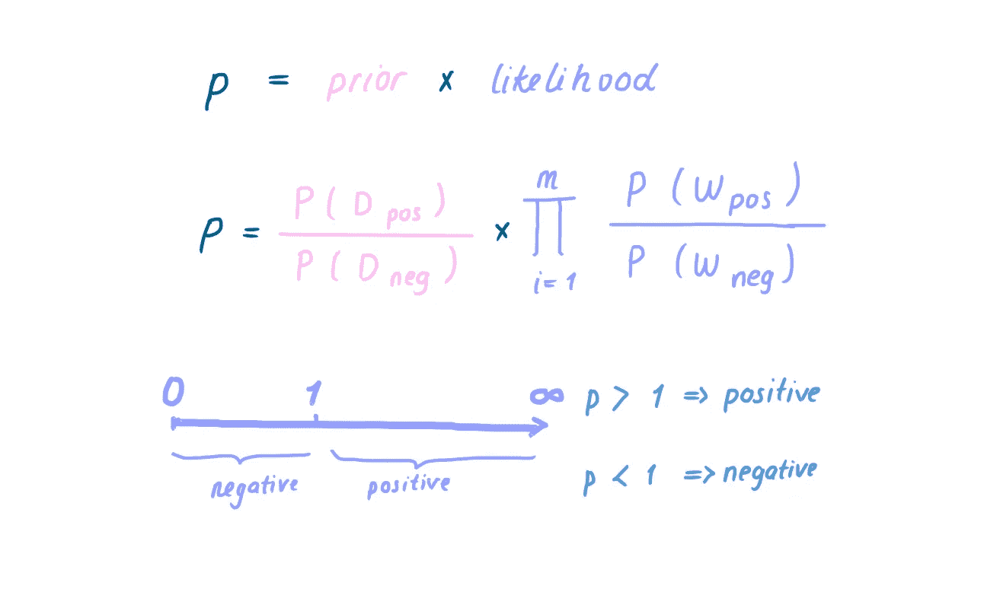
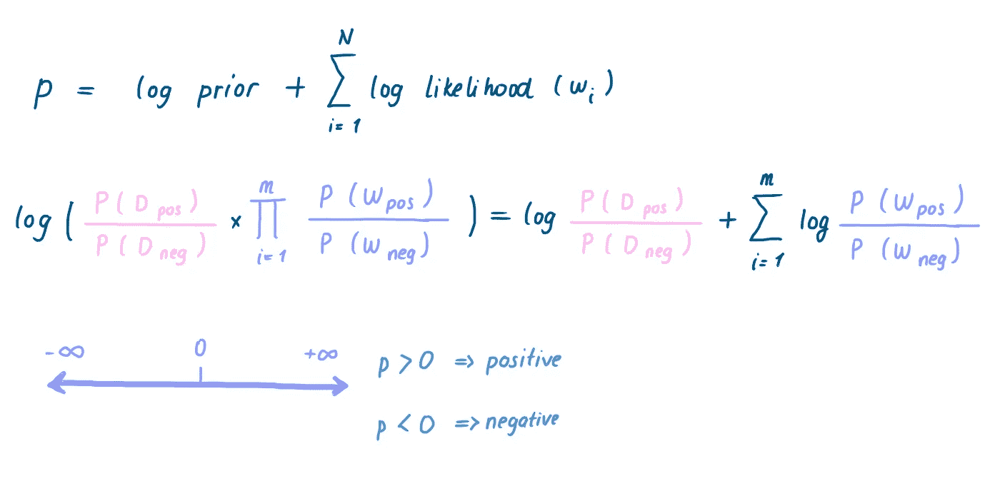
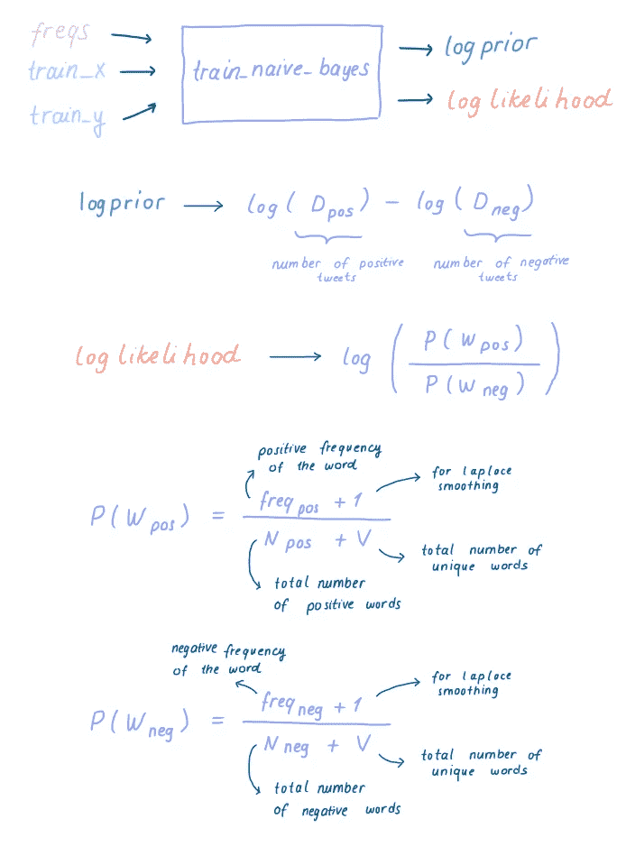
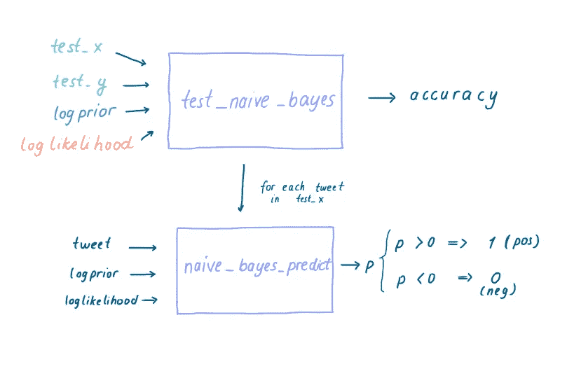

# 从零开始为情感分析图解朴素贝叶斯实现

> 原文：<https://medium.com/nerd-for-tech/illustrated-naive-bayes-implementation-from-scratch-for-sentiment-analysis-63c4bcab6053?source=collection_archive---------4----------------------->

> 为了更简单和更好的理解，我试图说明如何从头开始实现朴素贝叶斯算法。我用的是 DeepLearning.AI 提供的自然语言处理与分类和向量空间课程的笔记本，你可以从[这里](https://www.coursera.org/learn/classification-vector-spaces-in-nlp)到达课程，从[这个资源库](https://github.com/amanjeetsahu/Natural-Language-Processing-Specialization/tree/master/Natural%20Language%20Processing%20with%20Classification%20and%20Vector%20Spaces/Week%202)到达笔记本。

在这项任务中，我们将使用 NLTK 库中的 *twitter_samples* 数据集，训练一个朴素贝叶斯模型来预测一条推文是正面还是负面情绪。

我们将遵循以下 3 个步骤:

1.对数据进行预处理，建立词频词典

2.使用朴素贝叶斯训练模型

3.测试模型

# 1.对数据进行预处理，建立词频词典

**count_tweets()** 函数将 tweets 和标签的列表作为输入，使用 **process_tweet()** 函数清理所有 tweets，并返回一个字典，该字典将词干单词的元组及其标签(0，1)作为关键字，将该单词出现的次数作为值。

**process_tweet()** 是一个帮助器函数，用于预处理数据集，将文本标记为单独的单词，将单词转换为词干，将所有字母小写，并删除停用词和标点符号。

# 2.使用朴素贝叶斯训练模型

朴素贝叶斯是一种受监督的机器学习算法，它依赖于词频计数，如逻辑回归。在实现朴素贝叶斯算法之前，我们需要理解两个重要术语，它们是**对数似然性**和**对数先验。**

二元分类的朴素贝叶斯推理条件规则

**可能性**是推文中每个词的正概率与负概率之比的乘积。当可能性值高于 1 时，我们可以预测这条推文为**积极的**，这样推文中的单词共同对应积极的情绪。

**先验**是数据集中正面和负面推文数量的比率。在这种情况下，不需要考虑先验，因为数据集是平衡的，这意味着数据集包括完全相同数量的正面和负面推文。然而，当数据集不平衡时，我们需要将先验与似然相乘。

计算概率时，我们将 0 和 1 之间的许多数字相乘。为了防止*数值下溢*问题的可能性，我们将采用似然和先验的对数。对数将数字的乘积转换为加法运算，公式变为:

二元分类的朴素贝叶斯公式

如果这个公式的结果是正的，则该推文也是正的，否则如果它小于 0，则表明该推文是负的。

因此，我们可以使用 **train_naive_bayes()** 开始实现朴素贝叶斯算法，该算法采用三个参数: **freqs** ，先前构建的频率字典， **train_x** ，先前分割的数据集的%80， **train_y，**标签属于 train_x

**train_naive_bayes()** 返回数据集的 **logprior** 值和 **loglikelihood** 作为单词的字典，其 loglikelihood 作为键值对。

当计算对数似然方程中的概率时，我们使用**拉普拉斯平滑**。我们在频率值上加 1，避免得到概率为 0。 **V** 是所有数据集中唯一单词的总数，并添加到分母中以计算额外的 1。

# 3.测试模型

**test_naive_bayes()** 函数测试朴素贝叶斯模型在 **test_x** 数据集中的性能，该数据集先前被拆分为数据集的%20。对于 test_x 中的每个 tweet， **naive_bayes_predict()** 函数计算属于该 tweet 中的单词的 *p* 值、logprior 和 loglikelihood 之和，如果 p 大于 0，则将该 tweet 标记为正，否则为负。将预测标签与 **test_y.** 中的标签进行比较计算出的准确度

该模型有望达到 0.9940 的精度。